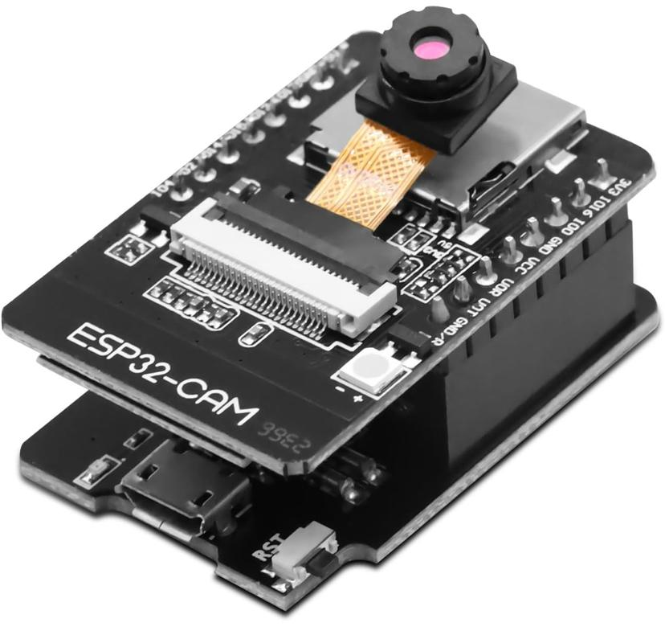
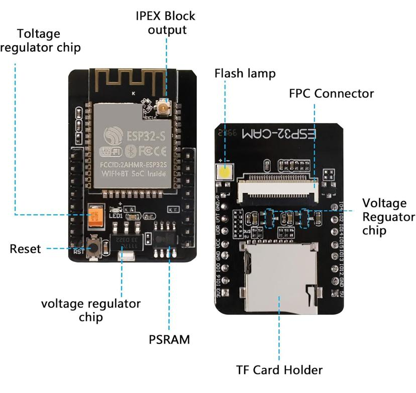
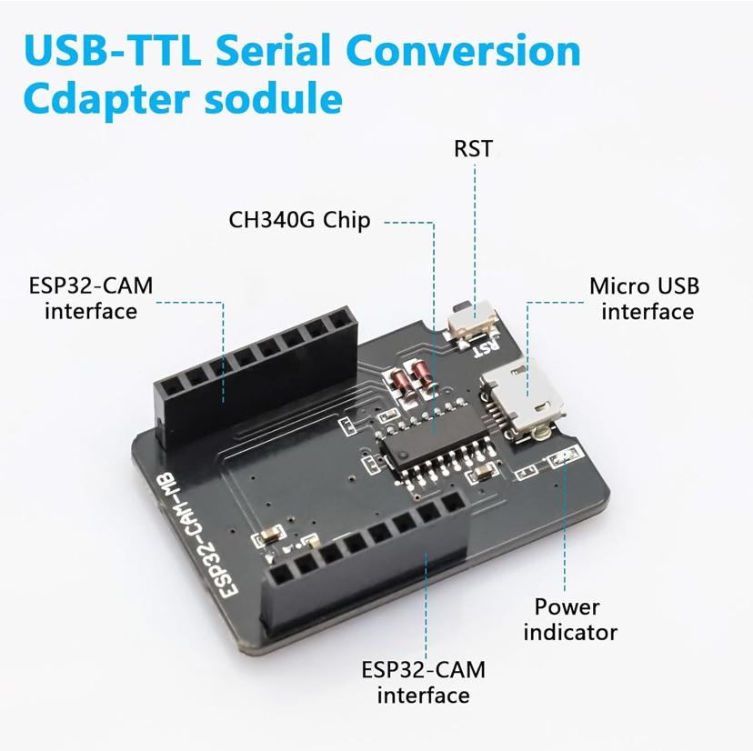
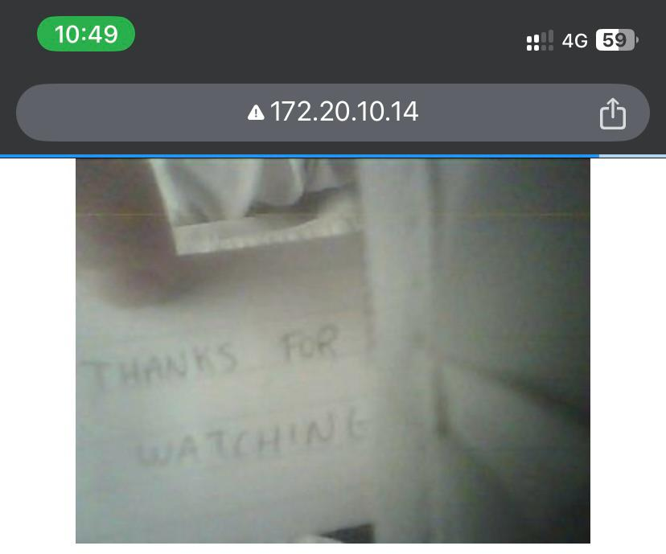

ESP32-camera module development environment
==============

# General View




# PinOut


# Helper Board for Flashing




# Starting Point

[Follow the steps in github actions](./.github/workflows/build-and-tests.yml)


# How To Build

* go into any project and type

```
idf.py build
```

# How To Flash

Use the following command

```
idf.py -p /dev/ttyUSB0 flash
```

# How to See Output

```
root:/workspace/ip_camera# idf.py -p /dev/ttyUSB0 flash monitor
````
<details><summary>Logs</summary>root:/workspace/ip_camera# idf.py -p /dev/ttyUSB0 flash monitor

Executing action: flash

Running ninja in directory /workspace/ip_camera/build

Executing "ninja flash"...

[1/5] cd /workspace/ip_camera/build/esp-idf/esptool_py && /root/.espressif/python_env/idf5....e/ip_camera/build/partition_table/partition-table.bin /workspace/ip_camera/build/simple.bin

simple.bin binary size 0xfae30 bytes. Smallest app partition is 0x100000 bytes. 0x51d0 bytes (2%) free.

Warning: The smallest app partition is nearly full (2% free space left)!

[1/1] cd /workspace/ip_camera/build/bootloader/esp-idf/esptool_py && /root/.espressif/pytho...s.py --offset 0x8000 bootloader 0x1000 /workspace/ip_camera/build/bootloader/bootloader.bin

Bootloader binary size 0x6880 bytes. 0x780 bytes (7%) free.

[2/3] cd /esp-idf/components/esptool_py && /usr/bin/cmake -D IDF_PATH=/esp-idf -D "SERIAL_T...IRECTORY=/workspace/ip_camera/build -P /esp-idf/components/esptool_py/run_serial_tool.cmake

esptool.py --chip esp32 -p /dev/ttyUSB0 -b 460800 --before=default_reset --after=hard_reset write_flash --flash_mode dio --flash_freq 40m --flash_size 2MB 0x1000 bootloader/bootloader.bin 0x10000 simple.bin 0x8000 partition_table/partition-table.bin

esptool.py v4.8.1

Serial port /dev/ttyUSB0

Connecting......

Chip is ESP32-D0WDQ6 (revision v1.1)

Features: WiFi, BT, Dual Core, 240MHz, VRef calibration in efuse, Coding Scheme None

Crystal is 40MHz

MAC: fc:b4:67:01:c1:80

Uploading stub...

Running stub...

Stub running...

Changing baud rate to 460800

Changed.

Configuring flash size...

Flash will be erased from 0x00001000 to 0x00007fff...

Flash will be erased from 0x00010000 to 0x0010afff...

Flash will be erased from 0x00008000 to 0x00008fff...

SHA digest in image updated

Compressed 26752 bytes to 16355...

Writing at 0x00001000... (100 %)

Wrote 26752 bytes (16355 compressed) at 0x00001000 in 0.5 seconds (effective 406.9 kbit/s)...

Hash of data verified.

Compressed 1027632 bytes to 607755...

Writing at 0x0010a285... (100 %)

Wrote 1027632 bytes (607755 compressed) at 0x00010000 in 13.7 seconds (effective 600.5 kbit/s)...

Hash of data verified.

Compressed 3072 bytes to 103...

Writing at 0x00008000... (100 %)

Wrote 3072 bytes (103 compressed) at 0x00008000 in 0.0 seconds (effective 1223.9 kbit/s)...

Hash of data verified.


Leaving...

Hard resetting via RTS pin...

Executing action: monitor

Running idf_monitor in directory /workspace/ip_camera

Executing "/root/.espressif/python_env/idf5.3_py3.10_env/bin/python /esp-idf/tools/idf_monitor.py -p /dev/ttyUSB0 -b 115200 --toolchain-prefix xtensa-esp32-elf- --target esp32 --revision 0 /workspace/ip_camera/build/simple.elf -m '/root/.espressif/python_env/idf5.3_py3.10_env/bin/python' '/esp-idf/tools/idf.py' '-p' '/dev/ttyUSB0'"...

--- esp-idf-monitor 1.5.0 on /dev/ttyUSB0 115200

--- Quit: Ctrl+] | Menu: Ctrl+T | Help: Ctrl+T followed by Ctrl+H

ets J]

      ��016��:22��j�C!���0x1�   �]ION_�Q�U�I���i0x1�B�A%_FAS�e1�H_Bϊ�j

confZ֥�� 0, *�]A�0xe�C�,k�E���0x00)}���:0x�b"}�rv:��0,�.���v:0�0,h�E���0x0bwpߖ��0x00��둕:DI�     ��ck dZ--- Warning: Failed to decode multiple lines in a row. Try checking the baud rate and XTAL frequency setting in menuconfig

��j

loa����fff0�&bb�n:7��SH��+��0x40�����le�����

�

 ������12 �뫁4

loX���Q008�00,���C!�+��0x��04,���N--- Warning: Failed to decode multiple lines in a row. Try checking the baud rate and XTAL frequency setting in menuconfig

�j

ent�^���0080j

I (30) boot: ESP-IDF v5.3.2 2nd stage bootloader

I (30) boot: compile time Dec 18 2024 10:43:49

I (30) boot: Multicore bootloader

I (34) boot: chip revision: v1.1

I (38) boot.esp32: SPI Speed      : 40MHz

I (43) boot.esp32: SPI Mode       : DIO

I (47) boot.esp32: SPI Flash Size : 2MB

I (52) boot: Enabling RNG early entropy source...

I (57) boot: Partition Table:

I (61) boot: ## Label            Usage          Type ST Offset   Length

I (68) boot:  0 nvs              WiFi data        01 02 00009000 00006000

I (75) boot:  1 phy_init         RF data          01 01 0000f000 00001000

I (83) boot:  2 factory          factory app      00 00 00010000 00100000

I (90) boot: End of partition table

I (95) esp_image: segment 0: paddr=00010020 vaddr=3f400020 size=2c128h (180520) map

I (165) esp_image: segment 1: paddr=0003c150 vaddr=3ffb0000 size=03ec8h ( 16072) load

I (171) esp_image: segment 2: paddr=00040020 vaddr=400d0020 size=ab290h (701072) map

I (412) esp_image: segment 3: paddr=000eb2b8 vaddr=3ffb3ec8 size=01520h (  5408) load

I (414) esp_image: segment 4: paddr=000ec7e0 vaddr=40080000 size=1e628h (124456) load

I (481) boot: Loaded app from partition at offset 0x10000

I (481) boot: Disabling RNG early entropy source...

I (494) quad_psram: This chip is ESP32-D0WD

I (496) esp_psram: Found 8MB PSRAM device

I (496) esp_psram: Speed: 40MHz

I (497) esp_psram: PSRAM initialized, cache is in low/high (2-core) mode.

W (505) esp_psram: Virtual address not enough for PSRAM, map as much as we can. 4MB is mapped

I (514) cpu_start: Multicore app

D (518) cpu_start: Pro cpu up

D (521) cpu_start: Starting app cpu, entry point is 0x40081690

--- 0x40081690: call_start_cpu1 at /esp-idf/components/esp_system/port/cpu_start.c:190


D (0) cpu_start: App cpu up

I (1430) esp_psram: SPI SRAM memory test OK

D (1437) clk: RTC_SLOW_CLK calibration value: 3478362

D (1443) cpu_start: calling init function: 0x400d2d44 on core: 0

--- 0x400d2d44: __esp_system_init_fn_init_efuse_check at /esp-idf/components/efuse/src/esp_efuse_startup.c:31


D (1443) cpu_start: calling init function: 0x400d3280 on core: 0

--- 0x400d3280: __esp_system_init_fn_init_show_cpu_freq at /esp-idf/components/esp_system/startup_funcs.c:58


I (1445) cpu_start: Pro cpu start user code

I (1450) cpu_start: cpu freq: 160000000 Hz

D (1455) cpu_start: calling init function: 0x400d2c84 on core: 0

--- 0x400d2c84: __esp_system_init_fn_init_show_app_info at /esp-idf/components/esp_app_format/esp_app_desc.c:106


I (1461) app_init: Application information:

I (1466) app_init: Project name:     simple

I (1471) app_init: App version:      d4e2d58-dirty

I (1476) app_init: Compile time:     Dec 18 2024 10:43:45

I (1482) app_init: ELF file SHA256:  92b7bb54e...

I (1488) app_init: ESP-IDF:          v5.3.2

D (1492) cpu_start: calling init function: 0x400d2d58 on core: 0

--- 0x400d2d58: __esp_system_init_fn_init_efuse_show_app_info at /esp-idf/components/efuse/src/esp_efuse_startup.c:41


I (1498) efuse_init: Min chip rev:     v0.0

I (1503) efuse_init: Max chip rev:     v3.99 

I (1508) efuse_init: Chip rev:         v1.1

D (1513) cpu_start: calling init function: 0x400d4c40 on core: 0

--- 0x400d4c40: __esp_system_init_fn_init_heap at /esp-idf/components/heap/heap_caps_init.c:25


D (1520) memory_layout: Checking 10 reserved memory ranges:

D (1525) memory_layout: Reserved memory range 0x3f800000 - 0x3fc00000

D (1531) memory_layout: Reserved memory range 0x3ff82000 - 0x3ff82000

D (1538) memory_layout: Reserved memory range 0x3ffae000 - 0x3ffae6e0

D (1545) memory_layout: Reserved memory range 0x3ffb0000 - 0x3ffbb6e8

D (1551) memory_layout: Reserved memory range 0x3ffe0000 - 0x3ffe0440

D (1558) memory_layout: Reserved memory range 0x3ffe3f20 - 0x3ffe4350

D (1564) memory_layout: Reserved memory range 0x40070000 - 0x40078000

D (1571) memory_layout: Reserved memory range 0x40078000 - 0x40080000

--- 0x40080000: _WindowOverflow4 at /esp-idf/components/xtensa/xtensa_vectors.S:2027


D (1577) memory_layout: Reserved memory range 0x40080000 - 0x4009e628

--- 0x40080000: _WindowOverflow4 at /esp-idf/components/xtensa/xtensa_vectors.S:2027


D (1584) memory_layout: Reserved memory range 0x50001fe8 - 0x50002000

D (1590) memory_layout: Building list of available memory regions:

D (1596) memory_layout: Available memory region 0x3ffae6e0 - 0x3ffb0000

D (1603) memory_layout: Available memory region 0x3ffbb6e8 - 0x3ffc0000

D (1610) memory_layout: Available memory region 0x3ffc0000 - 0x3ffc2000

D (1616) memory_layout: Available memory region 0x3ffc2000 - 0x3ffc4000

D (1623) memory_layout: Available memory region 0x3ffc4000 - 0x3ffc6000

D (1630) memory_layout: Available memory region 0x3ffc6000 - 0x3ffc8000

D (1636) memory_layout: Available memory region 0x3ffc8000 - 0x3ffca000

D (1643) memory_layout: Available memory region 0x3ffca000 - 0x3ffcc000

D (1650) memory_layout: Available memory region 0x3ffcc000 - 0x3ffce000

D (1656) memory_layout: Available memory region 0x3ffce000 - 0x3ffd0000

D (1663) memory_layout: Available memory region 0x3ffd0000 - 0x3ffd2000

D (1670) memory_layout: Available memory region 0x3ffd2000 - 0x3ffd4000

D (1677) memory_layout: Available memory region 0x3ffd4000 - 0x3ffd6000

D (1683) memory_layout: Available memory region 0x3ffd6000 - 0x3ffd8000

D (1690) memory_layout: Available memory region 0x3ffd8000 - 0x3ffda000

D (1697) memory_layout: Available memory region 0x3ffda000 - 0x3ffdc000

D (1703) memory_layout: Available memory region 0x3ffdc000 - 0x3ffde000

D (1710) memory_layout: Available memory region 0x3ffde000 - 0x3ffe0000

D (1717) memory_layout: Available memory region 0x3ffe0440 - 0x3ffe3f20

D (1723) memory_layout: Available memory region 0x3ffe4350 - 0x3ffe8000

D (1730) memory_layout: Available memory region 0x3ffe8000 - 0x3fff0000

D (1737) memory_layout: Available memory region 0x3fff0000 - 0x3fff8000

D (1743) memory_layout: Available memory region 0x3fff8000 - 0x3fffc000

D (1750) memory_layout: Available memory region 0x3fffc000 - 0x40000000

--- 0x40000000: _WindowOverflow4 in ROM


D (1757) memory_layout: Available memory region 0x4009e628 - 0x400a0000

I (1763) heap_init: Initializing. RAM available for dynamic allocation:

D (1771) heap_init: New heap initialised at 0x3ffae6e0

I (1776) heap_init: At 3FFAE6E0 len 00001920 (6 KiB): DRAM

D (1782) heap_init: New heap initialised at 0x3ffbb6e8

I (1787) heap_init: At 3FFBB6E8 len 00024918 (146 KiB): DRAM

I (1794) heap_init: At 3FFE0440 len 00003AE0 (14 KiB): D/IRAM

I (1800) heap_init: At 3FFE4350 len 0001BCB0 (111 KiB): D/IRAM

D (1807) heap_init: New heap initialised at 0x4009e628

I (1812) heap_init: At 4009E628 len 000019D8 (6 KiB): IRAM

D (1818) cpu_start: calling init function: 0x400d650c on core: 0

--- 0x400d650c: __esp_system_init_fn_esp_timer_init_nonos at /esp-idf/components/esp_timer/src/esp_timer_init.c:28


D (1824) cpu_start: calling init function: 0x400d5ee4 on core: 0

--- 0x400d5ee4: __esp_system_init_fn_init_newlib at /esp-idf/components/newlib/newlib_init.c:162


D (1830) cpu_start: calling init function: 0x400d9968 on core: 0

--- 0x400d9968: __esp_system_init_fn_init_psram at /esp-idf/components/esp_psram/esp_psram.c:94


I (1836) esp_psram: Adding pool of 4096K of PSRAM memory to heap allocator

D (1844) cpu_start: calling init function: 0x400d32c4 on core: 0

--- 0x400d32c4: __esp_system_init_fn_init_brownout at /esp-idf/components/esp_system/startup_funcs.c:67


D (1850) intr_alloc: Connected src 46 to int 1 (cpu 0)

D (1855) cpu_start: calling init function: 0x400d32d0 on core: 0

--- 0x400d32d0: __esp_system_init_fn_init_newlib_time at /esp-idf/components/esp_system/startup_funcs.c:81


D (1861) cpu_start: calling init function: 0x400d77bc on core: 0

--- 0x400d77bc: __esp_system_init_fn_init_vfs_uart at /esp-idf/components/esp_driver_uart/src/uart_vfs.c:1080


D (1867) cpu_start: calling init function: 0x400d82e8 on core: 0

--- 0x400d82e8: __esp_system_init_fn_init_vfs_console at /esp-idf/components/esp_vfs_console/vfs_console.c:222


D (1873) cpu_start: calling init function: 0x400d5f58 on core: 0

--- 0x400d5f58: __esp_system_init_fn_init_newlib_stdio at /esp-idf/components/newlib/newlib_init.c:207


D (1880) cpu_start: calling init function: 0x400d631c on core: 0

--- 0x400d631c: __esp_system_init_fn_init_pthread at /esp-idf/components/pthread/pthread.c:76


D (1885) cpu_start: calling init function: 0x400d32dc on core: 0

--- 0x400d32dc: __esp_system_init_fn_init_flash at /esp-idf/components/esp_system/startup_funcs.c:88


D (1892) spi_flash: trying chip: issi

D (1895) spi_flash: trying chip: gd

D (1899) spi_flash: trying chip: mxic

D (1903) spi_flash: trying chip: winbond

D (1907) spi_flash: trying chip: generic

I (1910) spi_flash: detected chip: generic

I (1915) spi_flash: flash io: dio

W (1919) spi_flash: Detected size(4096k) larger than the size in the binary image header(2048k). Using the size in the binary image header.

D (1932) cpu_start: calling init function: 0x400d2de4 on core: 0

--- 0x400d2de4: __esp_system_init_fn_init_efuse at /esp-idf/components/efuse/src/esp_efuse_startup.c:137


D (1939) cpu_start: calling init function: 0x40158a40

--- 0x40158a40: _GLOBAL__sub_I__ZN17__eh_globals_init7_S_initE at /builds/idf/crosstool-NG/.build/xtensa-esp-elf/src/gcc/libstdc++-v3/libsupc++/eh_globals.cc:162


D (1944) cpu_start: calling init function: 0x400f6274

--- 0x400f6274: s_set_default_wifi_log_level at /esp-idf/components/esp_wifi/src/wifi_init.c:93


D (1949) cpu_start: calling init function: 0x400f2990

--- 0x400f2990: check_i2c_driver_conflict at /esp-idf/components/driver/i2c/i2c.c:1713


W (1954) i2c: This driver is an old driver, please migrate your application code to adapt `driver/i2c_master.h`

D (1965) cpu_start: calling init function: 0x4008ecd8

--- 0x4008ecd8: enable_timer_group0_for_calibration at /esp-idf/components/esp_hw_support/port/esp32/rtc_time.c:197


D (1970) cpu_start: calling init function: 0x400d43fc

--- 0x400d43fc: esp_ipc_init at /esp-idf/components/esp_system/esp_ipc.c:113


D (1975) cpu_start: calling init function: 0x400d38c8

--- 0x400d38c8: esp_reset_reason_init at /esp-idf/components/esp_system/port/soc/esp32/reset_reason.c:60


D (1980) cpu_start: calling init function: 0x40130200 on core: 0

--- 0x40130200: __esp_system_init_fn_esp_timer_init_os at /esp-idf/components/esp_timer/src/esp_timer.c:587


D (1986) intr_alloc: Connected src 17 to int 2 (cpu 0)

D (1991) cpu_start: calling init function: 0x400d3300 on core: 0

--- 0x400d3300: __esp_system_init_fn_init_disable_rtc_wdt at /esp-idf/components/esp_system/startup_funcs.c:143


D (1998) intr_alloc: Connected src 24 to int 3 (cpu 0)

D (2003) app_start: Starting scheduler on CPU0

D (0) intr_alloc: Connected src 25 to int 1 (cpu 1)

D (0) app_start: Starting scheduler on CPU1

I (00:00:00.570) main_task: Started on CPU0

D (2036) heap_init: New heap initialised at 0x3ffe0440

D (2036) heap_init: New heap initialised at 0x3ffe4350

I (2046) esp_psram: Reserving pool of 32K of internal memory for DMA/internal allocations

D (2056) esp_psram: Allocating block of size 32768 bytes

D (2056) intr_alloc: Connected src 16 to int 5 (cpu 0)

I (00:00:00.614) main_task: Calling app_main()

I (00:00:00.619) gpio: GPIO[25]| InputEn: 1| OutputEn: 0| OpenDrain: 0| Pullup: 1| Pulldown: 0| Intr:2 

D (2076) intr_alloc: Connected src 22 to int 8 (cpu 0)

I (00:00:00.635) cam_hal: cam init ok

D (00:00:00.638) camera: Enabling XCLK output

D (00:00:00.643) ledc: Using clock source 4 (in slow mode), divisor: 0x200

D (00:00:00.650) ledc: In slow speed mode, global clk set: 4

D (00:00:00.656) ledc: LEDC_PWM CHANNEL 0|GPIO 00|Duty 0001|Time 0

D (00:00:00.662) camera: Initializing SCCB

I (00:00:00.666) sccb: pin_sda 26 pin_scl 27

I (00:00:00.671) sccb: sccb_i2c_port=1

D (2126) intr_alloc: Connected src 50 to int 9 (cpu 0)

D (00:00:00.680) camera: Resetting camera by power down line

I (00:00:00.686) gpio: GPIO[32]| InputEn: 0| OutputEn: 1| OpenDrain: 0| Pullup: 0| Pulldown: 0| Intr:0 

D (00:00:00.710) camera: Searching for camera address

I (00:00:00.720) camera: Detected camera at address=0x30

I (00:00:00.724) camera: Detected OV2640 camera

D (00:00:00.725) ov2640: OV2640 Attached

I (00:00:00.725) camera: Camera PID=0x26 VER=0x42 MIDL=0x7f MIDH=0xa2

D (00:00:00.732) camera: Doing SW reset of sensor

I (00:00:00.822) esp32 ll_cam: node_size: 2560, nodes_per_line: 1, lines_per_node: 1, dma_half_buffer_min:  2560, dma_half_buffer: 15360,lines_per_half_buffer:  6, dma_buffer_size: 30720, image_size: 153600

I (00:00:00.830) cam_hal: buffer_size: 30720, half_buffer_size: 15360, node_buffer_size: 2560, node_cnt: 12, total_cnt: 10

I (00:00:00.842) cam_hal: Allocating 153600 Byte frame buffer in PSRAM

D (2296) intr_alloc: Connected src 32 to int 12 (cpu 0)

I (00:00:00.855) cam_hal: cam config ok

D (00:00:00.859) camera: Setting frame size to 320x240

I (00:00:00.864) ov2640: Set PLL: clk_2x: 0, clk_div: 3, pclk_auto: 1, pclk_div: 8

D (00:00:00.970) esp_netif_lwip: LwIP stack has been initialized

D (00:00:00.971) esp_netif_lwip: esp-netif has been successfully initialized

D (00:00:00.973) event: running task for loop 0x3ffc8c30

D (00:00:00.978) event: created task for loop 0x3ffc8c30

D (00:00:00.984) event: created event loop 0x3ffc8c30

I (00:00:00.989) example_connect: Start example_connect.

D (00:00:00.996) nvs: nvs_open_from_partition misc 1

I (2466) wifi:wifi driver task: 3ffcbe9c, prio:23, stack:6656, core=0

D (2466) efuse: In EFUSE_BLK0__DATA2_REG is used 8 bits starting with 8 bit

D (2466) efuscam_hal: EV-EOF-OVF

e: In EFUSE_BLK0__DATA2_REG is used 8 bits starting with 0 bit

D (2476) efuse: In EFUSE_BLK0__DATA1_REG is used 8 bits starting with 24 bit

D (2476) efuse: In EFUSE_BLK0__DATA1_REG is used 8 bits starting with 16 bit

D (2486) efuse: In EFUSE_BLK0__DATA1_REG is used 8 bits starting with 8 bit

D (2496) efuse: In EFUSE_BLK0__DATA1_REG is used 8 bits starting with 0 bit

D (2506) efuse: In EFUSE_BLK0__DATA2_REG is used 8 bits starting with 16 bit

D (00:00:01.058) nvs: nvs_open_from_partition nvs.net80211 1

D (00:00:01.063) nvs: nvs_get opmode 1

D (00:00:01.067) nvs: nvs_get_str_or_blob sta.ssid

D (00:00:01.072) nvs: nvs_get sta.authmode 1

D (00:00:01.076) nvs: nvs_get_str_or_blob sta.pswd

D (00:00:01.081) nvs: nvs_get_str_or_blob sta.pmk

D (00:00:01.086) nvs: nvs_get sta.chcam_hal: EV-EOF-OVF

an 1

D (00:00:01.092) nvs: nvs_get auto.conn 1

D (00:00:01.096) nvs: nvs_get bssid.set 1

D (00:00:01.100) nvs: nvs_get_str_or_blob sta.bssid

D (00:00:01.105) nvs: nvs_get sta.lis_intval 2

D (00:00:01.109) nvs: nvs_get sta.phym 1

D (00:00:01.113) nvs: nvs_get sta.phybw 1

D (00:00:01.117) nvs: nvs_get_str_or_blob sta.apsw

D (00:00:01.122) nvs: nvs_get_str_or_blob sta.apinfo

D (00:00:01.127) nvs: nvs_get sta.scan_method 1

D (00:00:01.132) nvs: nvs_get sta.sort_method 1

D (00:00:01.136) nvs: nvs_get sta.minrssi 1

D (00:00:01.141) nvs: nvs_get sta.minauth 1

D (00:00:01.145) nvs: nvs_get sta.pmf_e 1

D (00:00:01.149) nvs: nvs_get sta.pmf_r 1

D (00:00:01.153) nvs: nvs_get sta.btm_e 1

D (00:00:01.157) nvs: nvs_get sta.rrm_e 1

D (00:00:01.161) nvs: nvs_get sta.mbo_e 1

D (00:00:01.165) nvs: nvs_get_str_or_blobcam_hal: EV-EOF-OVF

 ap.ssid

D (00:00:01.172) nvs: nvs_get_str_or_blob ap.passwd

D (00:00:01.177) nvs: nvs_get_str_or_blob ap.pmk

D (00:00:01.181) nvs: nvs_get ap.chan 1

D (00:00:01.185) nvs: nvs_get ap.authmode 1

D (00:00:01.190) nvs: nvs_get ap.hidden 1

D (00:00:01.194) nvs: nvs_get ap.max.conn 1

D (00:00:01.198) nvs: nvs_get bcn.interval 2

D (00:00:01.202) nvs: nvs_get ap.phym 1

D (00:00:01.206) nvs: nvs_get ap.phybw 1

D (00:00:01.210) nvs: nvs_get ap.sndchan 1

D (00:00:01.215) nvs: nvs_get ap.pmf_e 1

D (00:00:01.218) nvs: nvs_get ap.pmf_r 1

D (00:00:01.222) nvs: nvs_get ap.p_cipher 1

D (00:00:01.227) nvs: nvs_get lorate 1

D (00:00:01.230) nvs: nvs_get_str_or_blob country

D (00:00:01.235) nvs: nvs_get ap.ftm_r 1

D (00:00:01.239) nvs: nvs_get sta.ft 1

D (00:00:01.243) nvs: nvs_get sta.owe 1

D (00:00:01.247) nvs:cam_hal: EV-EOF-OVF

 nvs_get sta.trans_d 1

D (00:00:01.253) nvs: nvs_get sta.sae_h2e 1

D (00:00:01.257) nvs: nvs_get sta.sae_pk_mode 1

D (00:00:01.262) nvs: nvs_get sta.bss_retry 1

D (00:00:01.266) nvs: nvs_get_str_or_blob sta.owe_data

D (00:00:01.271) nvs: nvs_get sta.he_dcm 1

D (00:00:01.276) nvs: nvs_get sta.he_dcm_c_tx 1

D (00:00:01.280) nvs: nvs_get sta.he_dcm_c_rx 1

D (00:00:01.285) nvs: nvs_get sta.he_mcs9_d 1

D (00:00:01.289) nvs: nvs_get sta.he_su_b_d 1

D (00:00:01.294) nvs: nvs_get sta.he_su_b_f_d 1

D (00:00:01.298) nvs: nvs_get sta.he_mu_b_f_d 1

D (00:00:01.303) nvs: nvs_get sta.he_cqi_f_d 1

D (00:00:01.307) nvs: nvs_get_str_or_blob sta.sae_h2e_id

D (00:00:01.313) nvs: nvs_get ap.sae_h2e 1

D (00:00:01.317) nvs: nvs_get_str_or_blob ap.pmk_info

D (00:00:01.322) nvs: nvs_get nan.phym 1

D (00:00:01.326) nvs: nvs_get scam_hal: EV-EOF-OVF

ta.pwr_reset 1

D (00:00:01.332) nvs: nvs_get band 1

D (00:00:01.336) nvs: nvs_set ap.sndchan 1 1

I (2796) wifi:wifi firmware version: b0fd6006b

I (2796) wifi:wifi certification version: v7.0

I (2796) wifi:config NVS flash: enabled

I (2806) wifi:config nano formating: disabled

I (2806) wifi:Init data frame dynamic rx buffer num: 32

I (2816) wifi:Init static rx mgmt buffer num: 5

I (2816) wifi:Init management short buffer num: 32

I (2826) wifi:Init static tx buffer num: 16

I (2826) wifi:Init tx cache buffer num: 32

I (2826) wifi:Init static rx buffer size: 1600

I (2836) wifi:Init static rx buffer num: 10

I (2836) wifi:Init dynamic rx buffer num: 32

D (2846) wifi:Reset scan defaults in ms : min,max,passive,chan_dwell :(0,120,360,30)

I (00:00:01.398) wifi_init: rx ba win: 6

I (00:00:01.402) wifi_init: accept mbox: 6

I (00:00:01.407) wifi_init: tcpip mbox: 32

I (00:00:01.411) wifi_init: udp mbox: 6

I (00:00:01.416) wifi_init: tcp mbox: 6

I (00:00:01.420) wifi_init: tcp tx win: 5760

I (00:00:01.425) wifi_init: tcp rx win: 5760

I (00:00:01.430) wifi_init: tcp mss: 1440

I (00:00:01.436) wifi_init: WiFi IRAM OP enabled

I (00:00:01.441) wifi_init: WiFi RX IRAM OP enabled

D (00:00:01.446) esp_netif_lwip: check: remote, if=0x3ffbd670 fn=0x400f3728

--- 0x400f3728: esp_netif_new_api at /esp-idf/components/esp_netif/lwip/esp_netif_lwip.c:711


D (00:00:01.453) esp_netif_objects: esp_netif_add_to_list_unsafe netif added successfully (total netifs: 1)

D (00:00:01.464) esp_netif_lwip: call api in lwip: ret=0x0, give sem

I (00:00:01.473) phy_init: phy_version 4840,02e0d70,Sep  2 cam_hal: EV-EOF-OVF

cam_hal: EV-VSYNC-OVF

2024,19:39:07

D (00:00:01.480) phy_init: loading PHY init data from application binary

D (00:00:01.487) nvs: nvs_open_from_partition phy 0

D (00:00:01.492) nvs: nvs_get cal_version 4

D (00:00:01.497) nvs: nvs_get_str_or_blob cal_mac

D (2956) efuse: In EFUSE_BLK0__DATA2_REG is used 8 bits starting with 8 bit

D (2956) efuse: In EFUSE_BLK0__DATA2_REG is used 8 bits starting with 0 bit

D (2966) efuse: In EFUSE_BLK0__DATA1_REG is used 8 bits starting with 24 bit

D (2976) efuse: In EFUSE_BLK0__DATA1_REG is used 8 bits starting with 16 bit

D (2976) efuse: In EFUSE_BLK0__DATA1_REG is used 8 bits starting with 8 bit

D (2986) efuse: In EFUSE_BLK0__DATA1_REG is used 8 bits starting with 0 bit

D (2996) efuse: In EFUSE_BLK0__DATA2_REG is used 8 bits starting with 16 bit

D (00:00:01.550) nvs: nvs_get_str_or_blob cal_data

D (00:00:01.561) nvs: nvs_close 3

D (3016) efuse: In EFUSE_BLK0__DATA2_REG is used 8 bits starting with 8 bit

D (3016) efuse: In EFUSE_BLK0__DAcam_hal: EV-EOF-OVF

TA2_REG is used 8 bits starting with 0 bit

D (3026) efuse: In EFUSE_BLK0__DATA1_REG is used 8 bits starting with 24 bit

D (3036) efuse: In EFUSE_BLK0__DATA1_REG is used 8 bits starting with 16 bit

D (3036) efuse: In EFUSE_BLK0__DATA1_REG is used 8 bits starting with 8 bit

D (3046) efuse: In EFUSE_BLK0__DATA1_REG is used 8 bits starting with 0 bit

D (3056) efuse: In EFUSE_BLK0__DATA2_REG is used 8 bits starting with 16 bit

cam_hal: EV-EOF-OVF

W (00:00:01.673) phy_init: saving new calibration data because of checksum failure, mode(0)

D (00:00:01.675) nvs: nvs_open_from_partition phy 1

D (00:00:01.678) nvs: nvs_set_blob cal_data 1904

D (3146) efuse: In EFUSE_BLK0__DATA2_REG is used 8 bits starting with 8 bit

D (3146) efuse: In EFUSE_BLK0__DATA2_REG is used 8 bits starting with 0 bit

D (3156) efuse: In EFUSE_BLK0__DATA1_REG is used 8 bits starting with 24 bit

D (3156) efuse: In EFUSE_BLK0__DATA1_REG is used 8 bits starting with 16 bit

D (3166) efuse: In EFUSE_BLK0__DATA1_REG is used 8 bits starting with 8 bit

D (3176) efuse: In EFUSE_BLK0__DATA1_REG is used 8 bits starcam_hal: EV-EOF-OVF

ting with 0 bit

D (3186) efuse: In EFUSE_BLK0__DATA2_REG is used 8 bits starting with 16 bit

D (00:00:01.739) nvs: nvs_set_blob cal_mac 6

D (00:00:01.744) nvs: nvs_set cal_version 4 4840

D (00:00:01.749) nvs: nvs_close 4

D (3206) wifi:filter: set rx policy=0

I (3206) wifi:mode : sta (fc:b4:67:01:c1:80)

I (3206) wifi:enable tsf

D (3216) wifi:filter: set rx policy=1

D (3216) wifi:connect status 0 -> 0

D (00:00:01.769) event: no handlers have been registered for event WIFI_EVENT:43 posted to loop 0x3ffc8c30

D (00:00:01.778) event: running post WIFI_EVENT:2 with handler 0x400f659c and context 0x3ffe3bd8 on loop 0x3ffc8c30

--- 0x400f659c: wifi_default_action_sta_start at /esp-idf/components/esp_wifi/src/wifi_default.c:72


D (00:00:01.788) wifi_init_default: wifi_start esp-netif:0x3ffe3a00 event-id2

D (00:00:01.796) wifi_init_default: WIFI mac address: fc b4 67 1 c1 80

D (00:00:01.804) esp_netif_lwip: check: remote, if=0x3ffe3a00 fn=0x400f2dbc

--- 0x400f2dbc: esp_netif_set_mac_api at /esp-idf/components/esp_netif/lwip/esp_netif_lwip.c:1014


D (00:00:01.809) esp_netif_lwip: call api in lwip: ret=0x0, give sem

D (00:00:01.816) esp_netif_handlers: esp_netif action has started with netif0x3ffe3a00 from event_id=2

D (00:00:01.825) esp_netif_lwip: check: remote, if=0x3ffe3a00 fn=0x400f3960

--- 0x400f3960: esp_netif_start_api at /esp-idf/components/esp_netif/lwip/esp_netif_lwip.c:1089


D (00:00:01.832) esp_netif_lwip: esp_netif_start_api 0x3ffe3a00

D (00:00:01.838) esp_netif_lwip: esp_netif_get_hostname esp_netif:0x3ffe3a00

D (00:00:01.846) esp_netif_lwip: call api in lwip: ret=0x0, give sem

I (00:00:01.853) example_connect: Connecting to dodo_phone...

D (3316) wifi:clear blacklist

W (3316) wifi:Passwordcam_hal: EV-EOF-OVF

 length matches WPA2 standards, authmode threshold changes from OPEN to WPA2

D (3326) wifi:Start wifi connect

D (3326) wifi:connect status 0 -> 0

D (3326) wifi:connect chan=0

D (3336) wifi:first chan=1

D (3336) wifi:connect status 0 -> 1

D (3336) wifi:filter: set rx policy=3

D (3336) wifi:clear scan ap list

D (3346) wifi:starcam_hal: EV-EOF-OVF

t scan: type=0x50f, priority=2, cb=0x401117a4, arg=0x0, ss_state=0x1, time=140246, index=0

--- 0x401117a4: cnx_start_handoff_cb at ??:?


D (3356) wifi:perform scan: ss_state=0x9, chan<1,0>, dur<0,120>

I (00:00:01.910) example_connect: Waiting for IP(s)

D (3486) wifi:scan end: arg=0x3ffb7ef8, status=0, ss_state=0x3

D (3486) wifi:perform scan: ss_state=0x9, chan<2,0>, dur<0,120>

cam_hal: EV-EOF-OVF

cam_hal: EV-VSYNC-OVF

D (3606) wifi:scan end: arg=0x3ffb7ef8, status=0, ss_state=0x3

D (3606) wifi:perform scan: ss_state=0x9, chan<3,0>, dur<0,120>

cam_hal: EV-EOF-OVF

D (3736) wifi:scan end: arg=0x3ffb7ef8, status=0, ss_state=0x3

D (3736) wifi:perform scan: ss_state=0x9, chan<4,0>, dur<0,120>

D (3856) wifi:scan end: arg=0x3ffb7ef8, status=0, ss_state=0x3

D (3856) wifi:perform scan: ss_state=0x9, chan<5,0>, dur<0,120>

D (3976) wifi:scan end: arg=0x3ffb7ef8, status=0, ss_state=0x3

D (3976) wifi:perform scan: ss_state=0x9, chan<6,0>, dur<0,120>

D (4006) wifi:rsn valid: gcipher=3 ucipher=3 akm=9 mac=32:53:d1:1a:7c:fc

D (4006) wifi:profile match: ss_state=0x7

D (4106) wifi:scan end: arg=0x3ffb7ef8, status=0, ss_state=0x7

D (4106) wifi:perform scan: ss_state=0xd, chan<7,0>, dur<0,120>

D (4226) wifi:scan end: arg=0x3ffb7ef8, status=0, ss_state=0x7

D (4226) wifi:perform scan: ss_state=0xd, chan<8,0>, dur<0,120>

D (4346) wifi:scan end: arg=0x3ffb7ef8, status=0, ss_state=0x7

D (4346) wifi:perform scan: ss_state=0xd, chan<9,0>, dur<0,120>

D (4466) wifi:scan end: arg=0x3ffb7ef8, status=0, ss_state=0x7

D (4466) wifi:perform scan: ss_state=0xd, chan<10,0>, dur<0,120>

D (4586) wifi:scan end: arg=0x3ffb7ef8, status=0, ss_state=0x7

D (4596) wifi:perform scan: ss_state=0xd, chan<11,0>, dur<0,120>

D (4716) wifi:scan end: arg=0x3ffb7ef8, status=0, ss_state=0x7

D (4716) wifi:perform scan: ss_state=0xd, chan<12,0>, dur<360,360>

D (5076) wifi:scan end: arg=0x3ffb7ef8, status=0, ss_state=0x7

D (5076) wifi:perform scan: ss_state=0xd, chan<13,0>, dur<360,360>

D (5436) wifi:scan end: arg=0x3ffb7ef8, status=0, ss_state=0x7

D (5436) wifi:perform scan: ss_state=0xd, chan<14,0>, dur<360,360>

D (5796) wifi:scan end: arg=0x3ffb7ef8, status=0, ss_state=0x7

D (5796) wifi:filter: set rx policy=4

D (5796) wifi:first chan=1

D (5796) wifi:handoff_cb: status=0

D (5806) wifi:ap found, mac=32:53:d1:1a:7c:fc

D (5806) wifi:going for connection with bssid=32:53:d1:1a:7c:fc

D (5816) wifi:new_bss=0x3ffb9720, cur_bss=0x0, new_chan=<6,0>, cur_chan=1

D (5816) wifi:filter: set rx policy=5

I (5826) wifi:new:<6,0>, old:<1,0>, ap:<255,255>, sta:<6,0>, prof:1, snd_ch_cfg:0x0

D (5826) wifi:connect_op: status=0, auth=9, cipher=3 

D (5836) wifi:auth mode is not none

D (5836) wifi:connect_bss: auth=1, reconnect=0

I (5846) wifi:state: init -> auth (0xb0)

D (6386) wifi:start 4s AUTH timer

D (6386) wifi:clear scan ap list

D (00:00:04.936) event: no handlers have been registered for event WIFI_EVENT:43 posted to loop 0x3ffc8c30

D (6456) wifi:recv auth: seq=1, status=126, algo=3

D (6896) wifi:recv auth: seq=2, status=0, algo=3

I (6906) wifi:state: auth -> assoc (0x0)

D (6946) wifi:recv assoc: type=0x10

I (6946) wifi:Association refused temporarily time 196, comeback time 296 (TUs)

I (7256) wifi:state: assoc -> auth (0xb0)

D (7866) wifi:recv auth: seq=1, status=126, algo=3

D (8306) wifi:recv auth: seq=2, status=0, algo=3

I (8316) wifi:state: auth -> assoc (0x0)

D (8376) wifi:recv assoc: type=0x10

D (8376) wifi:filter: set rx policy=6

I (8376) wifi:state: assoc -> run (0x10)

D (8386) wifi:start 10s connect timer for 4 way handshake

D (18386) wifi:handshake timeout t=e7a472

I (18386) wifi:state: run -> init (0xcc00)

D (18386) wifi:stop beacon and connect timers

D (18386) wifi:connect status 1 -> 2

D (18386) wifi:send deauth for 4 way handshake timeout(204)

D (18396) wifi:add bssid 32:53:d1:1a:7c:fc to blacklist, cnt=0

D (18396) wifi:sta leave

D (18406) wifi:stop CSA timer

D (18406) wifi:connect status 2 -> 0

D (18406) wifi:remove 32:53:d1:1a:7c:fc from rc list

I (18416) wifi:new:<6,0>, old:<6,0>, ap:<255,255>, sta:<6,0>, prof:1, snd_ch_cfg:0x0

D (18416) wifi:filter: set rx policy=8

D (18426) wifi:Send disconnect event, reason=204, AP number=0

D (00:00:16.978) event: running post WIFI_EVENT:5 with handler 0x400f65b4 and context 0x3ffe3c68 on loop 0x3ffc8c30

--- 0x400f65b4: wifi_default_action_sta_disconnected at /esp-idf/components/esp_wifi/src/wifi_default.c:105


D (00:00:16.988) esp_netif_handlers: esp_netif action disconnected with netif0x3ffe3a00 from event_id=5

D (00:00:16.997) esp_netif_lwip: check: remote, if=0x3ffe3a00 fn=0x400f3c4c

--- 0x400f3c4c: esp_netif_down_api at /esp-idf/components/esp_netif/lwip/esp_netif_lwip.c:1695


D (00:00:17.004) esp_netif_lwip: esp_netif_down_api esp_netif:0x3ffe3a00

D (00:00:17.011) esp_netif_lwip: esp_netif_start_ip_lost_timer esp_netif:0x3ffe3a00

D (00:00:17.019) esp_netif_lwip: if0x3ffe3a00 start ip lost tmr: interval=120

D (00:00:17.026) esp_netif_lwip: check: local, if=0x3ffe3a00 fn=0x400f4040

--- 0x400f4040: esp_netif_update_default_netif_lwip at /esp-idf/components/esp_netif/lwip/esp_netif_lwip.c:312


D (00:00:17.033) esp_netif_lwip: esp_netif_update_default_netif_lwip 0x3ffe3a00

D (00:00:17.040) esp_netif_lwip: call api in lwip: ret=0x0, give sem

D (00:00:17.047) event: running post WIFI_EVENT:5 with handler 0x400ea570 and context 0x3ffe3ed0 on loop 0x3ffc8c30

--- 0x400ea570: example_handler_on_wifi_disconnect at /esp-idf/examples/common_components/protocol_examples_common/wifi_connect.c:33


I (00:00:17.057) example_connect: Wi-Fi disconnected 204, trying to reconnect...

D (18516) wifi:Start wifi connect

D (18516) wifi:connect status 0 -> 0

D (18526) wifi:connect chan=0

D (18526) wifi:first chan=6

D (18526) wifi:connect status 0 -> 1

D (18536) wifi:filter: set rx policy=3

D (18536) wifi:clear scan ap list

D (18536) wifi:start scan: type=0x50f, priority=2, cb=0x401117a4, arg=0x0, ss_state=0x1, time=15349240, index=0

--- 0x401117a4: cnx_start_handoff_cb at ??:?


D (18546) wifi:perform scan: ss_state=0x9, chan<6,0>, dur<0,120>

D (18566) wifi:rsn valid: gcipher=3 ucipher=3 akm=9 mac=32:53:d1:1a:7c:fc

D (18566) wifi:find the 32:53:d1:1a:7c:fc in blacklist.


D (18676) wifi:scan end: arg=0x3ffb7ef8, status=0, ss_state=0x3

D (18676) wifi:perform scan: ss_state=0x9, chan<1,0>, dur<0,120>

D (18796) wifi:scan end: arg=0x3ffb7ef8, status=0, ss_state=0x3

D (18796) wifi:perform scan: ss_state=0x9, chan<2,0>, dur<0,120>

D (18916) wifi:scan end: arg=0x3ffb7ef8, status=0, ss_state=0x3

D (18916) wifi:perform scan: ss_state=0x9, chan<3,0>, dur<0,120>

D (19046) wifi:scan end: arg=0x3ffb7ef8, status=0, ss_state=0x3

D (19046) wifi:perform scan: ss_state=0x9, chan<4,0>, dur<0,120>

D (19166) wifi:scan end: arg=0x3ffb7ef8, status=0, ss_state=0x3

D (19166) wifi:perform scan: ss_state=0x9, chan<5,0>, dur<0,120>

D (19286) wifi:scan end: arg=0x3ffb7ef8, status=0, ss_state=0x3

D (19286) wifi:perform scan: ss_state=0x9, chan<7,0>, dur<0,120>

D (19406) wifi:scan end: arg=0x3ffb7ef8, status=0, ss_state=0x3

D (19406) wifi:perform scan: ss_state=0x9, chan<8,0>, dur<0,120>

D (19526) wifi:scan end: arg=0x3ffb7ef8, status=0, ss_state=0x3

D (19536) wifi:perform scan: ss_state=0x9, chan<9,0>, dur<0,120>

D (19656) wifi:scan end: arg=0x3ffb7ef8, status=0, ss_state=0x3

D (19656) wifi:perform scan: ss_state=0x9, chan<10,0>, dur<0,120>

D (19776) wifi:scan end: arg=0x3ffb7ef8, status=0, ss_state=0x3

D (19776) wifi:perform scan: ss_state=0x9, chan<11,0>, dur<0,120>

D (19896) wifi:scan end: arg=0x3ffb7ef8, status=0, ss_state=0x3

D (19896) wifi:perform scan: ss_state=0x9, chan<12,0>, dur<360,360>

D (20256) wifi:scan end: arg=0x3ffb7ef8, status=0, ss_state=0x3

D (20256) wifi:perform scan: ss_state=0x9, chan<13,0>, dur<360,360>

D (20616) wifi:scan end: arg=0x3ffb7ef8, status=0, ss_state=0x3

D (20626) wifi:perform scan: ss_state=0x9, chan<14,0>, dur<360,360>

D (20986) wifi:scan end: arg=0x3ffb7ef8, status=0, ss_state=0x3

D (20986) wifi:filter: set rx policy=4

D (20986) wifi:first chan=1

D (20986) wifi:handoff_cb: status=0

D (20986) wifi:clear blacklist

D (20986) wifi:clear rc list

D (20996) wifi:clear blacklist

D (20996) wifi:Send disconnect event, reason=205

D (20996) wifi:connect status 1 -> 3

D (21006) wifi:disable connect timer

D (21006) wifi:clear scan ap list

D (00:00:19.558) event: running post WIFI_EVENT:5 with handler 0x400f65b4 and context 0x3ffe3c68 on loop 0x3ffc8c30

--- 0x400f65b4: wifi_default_action_sta_disconnected at /esp-idf/components/esp_wifi/src/wifi_default.c:105


D (00:00:19.568) esp_netif_handlers: esp_netif action disconnected with netif0x3ffe3a00 from event_id=5

D (00:00:19.577) esp_netif_lwip: check: remote, if=0x3ffe3a00 fn=0x400f3c4c

--- 0x400f3c4c: esp_netif_down_api at /esp-idf/components/esp_netif/lwip/esp_netif_lwip.c:1695


D (00:00:19.585) esp_netif_lwip: esp_netif_down_api esp_netif:0x3ffe3a00

D (00:00:19.591) esp_netif_lwip: esp_netif_start_ip_lost_timer esp_netif:0x3ffe3a00

D (00:00:19.599) esp_netif_lwip: if0x3ffe3a00 start ip lost tmr: already started

D (00:00:19.606) esp_netif_lwip: check: local, if=0x3ffe3a00 fn=0x400f4040

--- 0x400f4040: esp_netif_update_default_netif_lwip at /esp-idf/components/esp_netif/lwip/esp_netif_lwip.c:312


D (00:00:19.613) esp_netif_lwip: esp_netif_update_default_netif_lwip 0x3ffe3a00

D (00:00:19.621) esp_netif_lwip: call api in lwip: ret=0x0, give sem

D (00:00:19.627) event: running post WIFI_EVENT:5 with handler 0x400ea570 and context 0x3ffe3ed0 on loop 0x3ffc8c30

--- 0x400ea570: example_handler_on_wifi_disconnect at /esp-idf/examples/common_components/protocol_examples_common/wifi_connect.c:33


I (00:00:19.638) example_connect: Wi-Fi disconnected 205, trying to reconnect...

D (21096) wifi:Start wifi connect

D (21096) wifi:connect status 3 -> 0

D (21106) wifi:connect chan=0

D (21106) wifi:first chan=6

D (21106) wifi:connect status 0 -> 1

D (21116) wifi:filter: set rx policy=3

D (21116) wifi:clear scan ap list

D (21116) wifi:start scan: type=0x50f, priority=2, cb=0x401117a4, arg=0x0, ss_state=0x1, time=17929978, index=0

--- 0x401117a4: cnx_start_handoff_cb at ??:?


D (21126) wifi:perform scan: ss_state=0x9, chan<6,0>, dur<0,120>

D (21146) wifi:rsn valid: gcipher=3 ucipher=3 akm=9 mac=32:53:d1:1a:7c:fc

D (21146) wifi:profile match: ss_state=0x7

D (21256) wifi:scan end: arg=0x3ffb7ef8, status=0, ss_state=0x7

D (21256) wifi:perform scan: ss_state=0xd, chan<1,0>, dur<0,120>

D (21376) wifi:scan end: arg=0x3ffb7ef8, status=0, ss_state=0x7

D (21376) wifi:perform scan: ss_state=0xd, chan<2,0>, dur<0,120>

D (21496) wifi:scan end: arg=0x3ffb7ef8, status=0, ss_state=0x7

D (21496) wifi:perform scan: ss_state=0xd, chan<3,0>, dur<0,120>

D (21626) wifi:scan end: arg=0x3ffb7ef8, status=0, ss_state=0x7

D (21626) wifi:perform scan: ss_state=0xd, chan<4,0>, dur<0,120>

D (21746) wifi:scan end: arg=0x3ffb7ef8, status=0, ss_state=0x7

D (21746) wifi:perform scan: ss_state=0xd, chan<5,0>, dur<0,120>

D (21866) wifi:scan end: arg=0x3ffb7ef8, status=0, ss_state=0x7

D (21866) wifi:perform scan: ss_state=0xd, chan<7,0>, dur<0,120>

D (21986) wifi:scan end: arg=0x3ffb7ef8, status=0, ss_state=0x7

D (21986) wifi:perform scan: ss_state=0xd, chan<8,0>, dur<0,120>

D (22106) wifi:scan end: arg=0x3ffb7ef8, status=0, ss_state=0x7

D (22116) wifi:perform scan: ss_state=0xd, chan<9,0>, dur<0,120>

D (22236) wifi:scan end: arg=0x3ffb7ef8, status=0, ss_state=0x7

D (22236) wifi:perform scan: ss_state=0xd, chan<10,0>, dur<0,120>

D (22356) wifi:scan end: arg=0x3ffb7ef8, status=0, ss_state=0x7

D (22356) wifi:perform scan: ss_state=0xd, chan<11,0>, dur<0,120>

D (22476) wifi:scan end: arg=0x3ffb7ef8, status=0, ss_state=0x7

D (22476) wifi:perform scan: ss_state=0xd, chan<12,0>, dur<360,360>

D (22836) wifi:scan end: arg=0x3ffb7ef8, status=0, ss_state=0x7

D (22836) wifi:perform scan: ss_state=0xd, chan<13,0>, dur<360,360>

D (23206) wifi:scan end: arg=0x3ffb7ef8, status=0, ss_state=0x7

D (23206) wifi:perform scan: ss_state=0xd, chan<14,0>, dur<360,360>

D (23566) wifi:scan end: arg=0x3ffb7ef8, status=0, ss_state=0x7

D (23566) wifi:filter: set rx policy=4

D (23566) wifi:first chan=1

D (23566) wifi:handoff_cb: status=0

D (23566) wifi:ap found, mac=32:53:d1:1a:7c:fc

D (23576) wifi:going for connection with bssid=32:53:d1:1a:7c:fc

D (23576) wifi:new_bss=0x3ffb9720, cur_bss=0x0, new_chan=<6,0>, cur_chan=6

D (23586) wifi:filter: set rx policy=5

I (23586) wifi:new:<6,0>, old:<6,0>, ap:<255,255>, sta:<6,0>, prof:1, snd_ch_cfg:0x0

D (23596) wifi:connect_op: status=0, auth=9, cipher=3 

D (23596) wifi:auth mode is not none

D (23606) wifi:connect_bss: auth=1, reconnect=0

I (23606) wifi:state: init -> auth (0xb0)

D (24146) wifi:start 4s AUTH timer

D (24146) wifi:clear scan ap list

D (24226) wifi:recv auth: seq=1, status=126, algo=3

D (24666) wifi:recv auth: seq=2, status=0, algo=3

I (24676) wifi:state: auth -> assoc (0x0)

D (24706) wifi:recv assoc: type=0x10

D (24706) wifi:filter: set rx policy=6

I (24706) wifi:state: assoc -> run (0x10)

D (24706) wifi:start 10s connect timer for 4 way handshake

D (34706) wifi:handshake timeout t=1e0f249

I (34706) wifi:state: run -> init (0xcc00)

D (34706) wifi:stop beacon and connect timers

D (34706) wifi:connect status 1 -> 2

D (34716) wifi:send deauth for 4 way handshake timeout(204)

D (34716) wifi:add bssid 32:53:d1:1a:7c:fc to blacklist, cnt=0

D (34726) wifi:sta leave

D (34726) wifi:stop CSA timer

D (34726) wifi:connect status 2 -> 0

D (34736) wifi:remove 32:53:d1:1a:7c:fc from rc list

I (34736) wifi:new:<6,0>, old:<6,0>, ap:<255,255>, sta:<6,0>, prof:1, snd_ch_cfg:0x0

D (34746) wifi:filter: set rx policy=8

D (34746) wifi:Send disconnect event, reason=204, AP number=0

D (00:00:33.302) event: running post WIFI_EVENT:5 with handler 0x400f65b4 and context 0x3ffe3c68 on loop 0x3ffc8c30

--- 0x400f65b4: wifi_default_action_sta_disconnected at /esp-idf/components/esp_wifi/src/wifi_default.c:105


D (00:00:33.312) esp_netif_handlers: esp_netif action disconnected with netif0x3ffe3a00 from event_id=5

D (00:00:33.321) esp_netif_lwip: check: remote, if=0x3ffe3a00 fn=0x400f3c4c

--- 0x400f3c4c: esp_netif_down_api at /esp-idf/components/esp_netif/lwip/esp_netif_lwip.c:1695


D (00:00:33.328) esp_netif_lwip: esp_netif_down_api esp_netif:0x3ffe3a00

D (00:00:33.335) esp_netif_lwip: esp_netif_start_ip_lost_timer esp_netif:0x3ffe3a00

D (00:00:33.343) esp_netif_lwip: if0x3ffe3a00 start ip lost tmr: already started

D (00:00:33.350) esp_netif_lwip: check: local, if=0x3ffe3a00 fn=0x400f4040

--- 0x400f4040: esp_netif_update_default_netif_lwip at /esp-idf/components/esp_netif/lwip/esp_netif_lwip.c:312


D (00:00:33.357) esp_netif_lwip: esp_netif_update_default_netif_lwip 0x3ffe3a00

D (00:00:33.364) esp_netif_lwip: call api in lwip: ret=0x0, give sem

D (00:00:33.371) event: running post WIFI_EVENT:5 with handler 0x400ea570 and context 0x3ffe3ed0 on loop 0x3ffc8c30

--- 0x400ea570: example_handler_on_wifi_disconnect at /esp-idf/examples/common_components/protocol_examples_common/wifi_connect.c:33


I (00:00:33.381) example_connect: Wi-Fi disconnected 204, trying to reconnect...

D (34846) wifi:Start wifi connect

D (34846) wifi:connect status 0 -> 0

D (34846) wifi:connect chan=0

D (34846) wifi:first chan=6

D (34856) wifi:connect status 0 -> 1

D (34856) wifi:filter: set rx policy=3

D (34856) wifi:clear scan ap list

D (34866) wifi:start scan: type=0x50f, priority=2, cb=0x401117a4, arg=0x0, ss_state=0x1, time=31687915, index=0

--- 0x401117a4: cnx_start_handoff_cb at ??:?


D (34876) wifi:perform scan: ss_state=0x9, chan<6,0>, dur<0,120>

D (34906) wifi:rsn valid: gcipher=3 ucipher=3 akm=9 mac=32:53:d1:1a:7c:fc

D (34906) wifi:find the 32:53:d1:1a:7c:fc in blacklist.


D (34996) wifi:scan end: arg=0x3ffb7ef8, status=0, ss_state=0x3

D (34996) wifi:perform scan: ss_state=0x9, chan<1,0>, dur<0,120>

D (35126) wifi:scan end: arg=0x3ffb7ef8, status=0, ss_state=0x3

D (35126) wifi:perform scan: ss_state=0x9, chan<2,0>, dur<0,120>

D (35246) wifi:scan end: arg=0x3ffb7ef8, status=0, ss_state=0x3

D (35246) wifi:perform scan: ss_state=0x9, chan<3,0>, dur<0,120>

D (35366) wifi:scan end: arg=0x3ffb7ef8, status=0, ss_state=0x3

D (35366) wifi:perform scan: ss_state=0x9, chan<4,0>, dur<0,120>

D (35486) wifi:scan end: arg=0x3ffb7ef8, status=0, ss_state=0x3

D (35486) wifi:perform scan: ss_state=0x9, chan<5,0>, dur<0,120>

D (35606) wifi:scan end: arg=0x3ffb7ef8, status=0, ss_state=0x3

D (35606) wifi:perform scan: ss_state=0x9, chan<7,0>, dur<0,120>

D (35736) wifi:scan end: arg=0x3ffb7ef8, status=0, ss_state=0x3

D (35736) wifi:perform scan: ss_state=0x9, chan<8,0>, dur<0,120>

D (35856) wifi:scan end: arg=0x3ffb7ef8, status=0, ss_state=0x3

D (35856) wifi:perform scan: ss_state=0x9, chan<9,0>, dur<0,120>

D (35976) wifi:scan end: arg=0x3ffb7ef8, status=0, ss_state=0x3

D (35976) wifi:perform scan: ss_state=0x9, chan<10,0>, dur<0,120>

D (36096) wifi:scan end: arg=0x3ffb7ef8, status=0, ss_state=0x3

D (36096) wifi:perform scan: ss_state=0x9, chan<11,0>, dur<0,120>

D (36216) wifi:scan end: arg=0x3ffb7ef8, status=0, ss_state=0x3

D (36226) wifi:perform scan: ss_state=0x9, chan<12,0>, dur<360,360>

D (36586) wifi:scan end: arg=0x3ffb7ef8, status=0, ss_state=0x3

D (36586) wifi:perform scan: ss_state=0x9, chan<13,0>, dur<360,360>

D (36946) wifi:scan end: arg=0x3ffb7ef8, status=0, ss_state=0x3

D (36946) wifi:perform scan: ss_state=0x9, chan<14,0>, dur<360,360>

D (37306) wifi:scan end: arg=0x3ffb7ef8, status=0, ss_state=0x3

D (37306) wifi:filter: set rx policy=4

D (37306) wifi:first chan=1

D (37306) wifi:handoff_cb: status=0

D (37306) wifi:clear blacklist

D (37316) wifi:clear rc list

D (37316) wifi:clear blacklist

D (37316) wifi:Send disconnect event, reason=205

D (37326) wifi:connect status 1 -> 3

D (37326) wifi:disable connect timer

D (37326) wifi:clear scan ap list

D (00:00:35.882) event: running post WIFI_EVENT:5 with handler 0x400f65b4 and context 0x3ffe3c68 on loop 0x3ffc8c30

--- 0x400f65b4: wifi_default_action_sta_disconnected at /esp-idf/components/esp_wifi/src/wifi_default.c:105


D (00:00:35.892) esp_netif_handlers: esp_netif action disconnected with netif0x3ffe3a00 from event_id=5

D (00:00:35.901) esp_netif_lwip: check: remote, if=0x3ffe3a00 fn=0x400f3c4c

--- 0x400f3c4c: esp_netif_down_api at /esp-idf/components/esp_netif/lwip/esp_netif_lwip.c:1695


D (00:00:35.908) esp_netif_lwip: esp_netif_down_api esp_netif:0x3ffe3a00

D (00:00:35.915) esp_netif_lwip: esp_netif_start_ip_lost_timer esp_netif:0x3ffe3a00

D (00:00:35.923) esp_netif_lwip: if0x3ffe3a00 start ip lost tmr: already started

D (00:00:35.930) esp_netif_lwip: check: local, if=0x3ffe3a00 fn=0x400f4040

--- 0x400f4040: esp_netif_update_default_netif_lwip at /esp-idf/components/esp_netif/lwip/esp_netif_lwip.c:312


D (00:00:35.937) esp_netif_lwip: esp_netif_update_default_netif_lwip 0x3ffe3a00

D (00:00:35.944) esp_netif_lwip: call api in lwip: ret=0x0, give sem

D (00:00:35.951) event: running post WIFI_EVENT:5 with handler 0x400ea570 and context 0x3ffe3ed0 on loop 0x3ffc8c30

--- 0x400ea570: example_handler_on_wifi_disconnect at /esp-idf/examples/common_components/protocol_examples_common/wifi_connect.c:33


I (00:00:35.961) example_connect: Wi-Fi disconnected 205, trying to reconnect...

D (37426) wifi:Start wifi connect

D (37426) wifi:connect status 3 -> 0

D (37426) wifi:connect chan=0

D (37426) wifi:first chan=6

D (37436) wifi:connect status 0 -> 1

D (37436) wifi:filter: set rx policy=3

D (37436) wifi:clear scan ap list

D (37446) wifi:start scan: type=0x50f, priority=2, cb=0x401117a4, arg=0x0, ss_state=0x1, time=34268176, index=0

--- 0x401117a4: cnx_start_handoff_cb at ??:?


D (37456) wifi:perform scan: ss_state=0x9, chan<6,0>, dur<0,120>

D (37476) wifi:rsn valid: gcipher=3 ucipher=3 akm=9 mac=32:53:d1:1a:7c:fc

D (37486) wifi:profile match: ss_state=0x7

D (37576) wifi:scan end: arg=0x3ffb7ef8, status=0, ss_state=0x7

D (37576) wifi:perform scan: ss_state=0xd, chan<1,0>, dur<0,120>

D (37706) wifi:scan end: arg=0x3ffb7ef8, status=0, ss_state=0x7

D (37706) wifi:perform scan: ss_state=0xd, chan<2,0>, dur<0,120>

D (37826) wifi:scan end: arg=0x3ffb7ef8, status=0, ss_state=0x7

D (37826) wifi:perform scan: ss_state=0xd, chan<3,0>, dur<0,120>

D (37946) wifi:scan end: arg=0x3ffb7ef8, status=0, ss_state=0x7

D (37946) wifi:perform scan: ss_state=0xd, chan<4,0>, dur<0,120>

D (38066) wifi:scan end: arg=0x3ffb7ef8, status=0, ss_state=0x7

D (38066) wifi:perform scan: ss_state=0xd, chan<5,0>, dur<0,120>

D (38186) wifi:scan end: arg=0x3ffb7ef8, status=0, ss_state=0x7

D (38186) wifi:perform scan: ss_state=0xd, chan<7,0>, dur<0,120>

D (38316) wifi:scan end: arg=0x3ffb7ef8, status=0, ss_state=0x7

D (38316) wifi:perform scan: ss_state=0xd, chan<8,0>, dur<0,120>

D (38436) wifi:scan end: arg=0x3ffb7ef8, status=0, ss_state=0x7

D (38436) wifi:perform scan: ss_state=0xd, chan<9,0>, dur<0,120>

D (38556) wifi:scan end: arg=0x3ffb7ef8, status=0, ss_state=0x7

D (38556) wifi:perform scan: ss_state=0xd, chan<10,0>, dur<0,120>

D (38676) wifi:scan end: arg=0x3ffb7ef8, status=0, ss_state=0x7

D (38676) wifi:perform scan: ss_state=0xd, chan<11,0>, dur<0,120>

D (38806) wifi:scan end: arg=0x3ffb7ef8, status=0, ss_state=0x7

D (38806) wifi:perform scan: ss_state=0xd, chan<12,0>, dur<360,360>

D (39166) wifi:scan end: arg=0x3ffb7ef8, status=0, ss_state=0x7

D (39166) wifi:perform scan: ss_state=0xd, chan<13,0>, dur<360,360>

D (39526) wifi:scan end: arg=0x3ffb7ef8, status=0, ss_state=0x7

D (39526) wifi:perform scan: ss_state=0xd, chan<14,0>, dur<360,360>

D (39886) wifi:scan end: arg=0x3ffb7ef8, status=0, ss_state=0x7

D (39886) wifi:filter: set rx policy=4

D (39886) wifi:first chan=1

D (39886) wifi:handoff_cb: status=0

D (39886) wifi:ap found, mac=32:53:d1:1a:7c:fc

D (39896) wifi:going for connection with bssid=32:53:d1:1a:7c:fc

D (39896) wifi:new_bss=0x3ffb9720, cur_bss=0x0, new_chan=<6,0>, cur_chan=6

D (39906) wifi:filter: set rx policy=5

I (39906) wifi:new:<6,0>, old:<6,0>, ap:<255,255>, sta:<6,0>, prof:1, snd_ch_cfg:0x0

D (39916) wifi:connect_op: status=0, auth=9, cipher=3 

D (39926) wifi:auth mode is not none

D (39926) wifi:connect_bss: auth=1, reconnect=0

I (39926) wifi:state: init -> auth (0xb0)

D (40476) wifi:start 4s AUTH timer

D (40476) wifi:clear scan ap list

D (40546) wifi:recv auth: seq=1, status=126, algo=3

D (40976) wifi:recv auth: seq=2, status=0, algo=3

I (40986) wifi:state: auth -> assoc (0x0)

D (41066) wifi:recv assoc: type=0x10

D (41066) wifi:filter: set rx policy=6

I (41066) wifi:state: assoc -> run (0x10)

D (41066) wifi:start 10s connect timer for 4 way handshake

I (41156) wifi:connected with dodo_phone, aid = 1, channel 6, BW20, bssid = 32:53:d1:1a:7c:fc

I (41156) wifi:security: WPA3-SAE, phy: bgn, rssi: -54

D (41166) wifi:remove all except 32:53:d1:1a:7c:fc from rc list

D (41166) wifi:clear blacklist

D (41176) wifi:filter: set rx policy=7

I (41176) wifi:pm start, type: 1


I (41176) wifi:dp: 1, bi: 102400, li: 3, scale listen interval from 307200 us to 307200 us

D (41186) wifi:Send sta connected event

D (41186) wifi:connect status 1 -> 5

D (41196) wifi:obss scan is disabled

D (41196) wifi:start obss scan: obss scan is stopped

D (00:00:39.749) event: running post WIFI_EVENT:4 with handler 0x400f65cc and context 0x3ffe3c38 on loop 0x3ffc8c30

--- 0x400f65cc: wifi_default_action_sta_connected at /esp-idf/components/esp_wifi/src/wifi_default.c:86


D (00:00:39.760) esp_netif_handlers: esp_netif action connected with netif0x3ffe3a00 from event_id=4

D (00:00:39.769) esp_netif_lwip: check: remote, if=0x3ffe3a00 fn=0x400f3be0

--- 0x400f3be0: esp_netif_up_api at /esp-idf/components/esp_netif/lwip/esp_netif_lwip.c:1666


D (00:00:39.776) esp_netif_lwip: esp_netif_up_api esp_netif:0x3ffe3a00

D (00:00:39.782) esp_netif_lwip: call api in lwip: ret=0x0, give sem

D (00:00:39.789) esp_netif_lwip: check: remote, if=0x3ffe3a00 fn=0x400f32b0

--- 0x400f32b0: esp_netif_dhcpc_start_api at /esp-idf/components/esp_netif/lwip/esp_netif_lwip.c:1458


D (00:00:39.796) esp_netif_lwip: esp_netif_dhcpc_start_api esp_netif:0x3ffe3a00

D (00:00:39.803) esp_netif_lwip: esp_netif_start_ip_lost_timer esp_netif:0x3ffe3a00

D (00:00:39.811) esp_netif_lwip: if0x3ffe3a00 start ip lost tmr: already started

D (00:00:39.818) esp_netif_lwip: starting dhcp client

D (41276) wifi:D (00:00:39.825) esp_netif_lwip: call api in lwip: ret=0x0, give sem

eb is dhcp or dns sport = 68, dport = 67

D (00:00:39.835) event: running post WIFI_EVENT:4 with handler 0x400ea1bc and context 0x3ffe3f10 on loop 0x3ffc8c30

--- 0x400ea1bc: example_handler_on_wifi_connect at /esp-idf/examples/common_components/protocol_examples_common/wifi_connect.c:64


D (00:00:39.845) esp_netif_lwip: check: remote, if=0x3ffe3a00 fn=0x400f3434

--- 0x400f3434: esp_netif_create_ip6_linklocal_api at /esp-idf/components/esp_netif/lwip/esp_netif_lwip.c:2129


D (00:00:39.853) esp_netif_lwip: call api in lwip: ret=0x0, give sem

I (41316) wifi:AP's beacon interval = 102400 us, DTIM period = 1

D (41406) wifi:eb is dhcp or dns sport = 68, dport = 67

D (00:00:40.822) esp_netif_lwip: esp_netif_internal_dhcpc_cb lwip-netif:0x3ffe3a68

D (00:00:40.823) esp_netif_lwip: check: local, if=0x3ffe3a00 fn=0x400f4040

--- 0x400f4040: esp_netif_update_default_netif_lwip at /esp-idf/components/esp_netif/lwip/esp_netif_lwip.c:312


D (00:00:40.826) esp_netif_lwip: esp_netif_update_default_netif_lwip 0x3ffe3a00

D (00:00:40.834) esp_netif_lwip: if0x3ffe3a00 ip changed=1

D (00:00:40.839) event: running post IP_EVENT:0 with handler 0x400f63a8 and context 0x3ffe3d0c on loop 0x3ffc8c30

--- 0x400f63a8: wifi_default_action_sta_got_ip at /esp-idf/components/esp_wifi/src/wifi_default.c:128


I (42296) wifi:<ba-add>idx:0 (ifx:0, 32:53:d1:1a:7c:fc), tid:0, ssn:2, winSize:64

D (00:00:40.850) wifi_init_default: Got IP wifi default handler entered

D (00:00:40.864) esp_netif_handlers: esp_netif action got_ip with netif0x3ffe3a00 from event_id=0

I (00:00:40.872) esp_netif_handlers: example_netif_sta ip: 172.20.10.14, mask: 255.255.255.240, gw: 172.20.10.1

D (00:00:40.883) event: running post IP_EVENT:0 with handler 0x400ea114 and context 0x3ffe3ef0 on loop 0x3ffc8c30

--- 0x400ea114: example_handler_on_sta_got_ip at /esp-idf/examples/common_components/protocol_examples_common/wifi_connect.c:72


I (00:00:40.894) example_connect: Got IPv4 event: Interface "example_netif_sta" address: 172.20.10.14

D (00:00:40.971) esp_netif_lwip: esp_netif_internal_nd6_cb lwip-netif:0x3ffe3a68

D (00:00:40.972) esp_netif_lwip: check: local, if=0x3ffe3a00 fn=0x400f4040

--- 0x400f4040: esp_netif_update_default_netif_lwip at /esp-idf/components/esp_netif/lwip/esp_netif_lwip.c:312


D (00:00:40.975) esp_netif_lwip: esp_netif_update_default_netif_lwip 0x3ffe3a00

D (00:00:40.983) event: running post IP_EVENT:3 with handler 0x400e9f3c and context 0x3ffe72e4 on loop 0x3ffc8c30

--- 0x400e9f3c: example_handler_on_sta_got_ipv6 at /esp-idf/examples/common_components/protocol_examples_common/wifi_connect.c:89


I (00:00:40.993) example_connect: Got IPv6 event: Interface "example_netif_sta" address: fe80:0000:0000:0000:feb4:67ff:fe01:c180, type: ESP_IP6_ADDR_IS_LINK_LOCAL

D (00:00:41.008) esp_netif_lwip: check: remote, if=0x400e9d5c fn=0x40170fb4

--- 0x400e9d5c: print_all_ips_tcpip at /esp-idf/examples/common_components/protocol_examples_common/connect.c:57

0x40170fb4: tcpip_exec_api at /esp-idf/components/esp_netif/lwip/esp_netif_lwip.c:701


I (00:00:41.015) example_common: Connected to example_netif_sta

D (00:00:41.022) esp_netif_lwip: esp_netif_get_ip_info esp_netif:0x3ffe3a00

I (00:00:41.029) example_common: - IPv4 address: 172.20.10.14,

I (00:00:41.035) example_common: - IPv6 address: fe80:0000:0000:0000:feb4:67ff:fe01:c180, type: ESP_IP6_ADDR_IS_LINK_LOCAL

D (00:00:41.047) esp_netif_lwip: call api in lwip: ret=0x0, give sem

I (00:00:41.054) camera_http_server: Starting server on port: '80'

D (00:00:41.063) httpd: httpd_thread: web server started

D (00:00:41.066) httpd: httpd_server: doing select maxfd+1 = 56

D (00:00:41.074) event: no handlers have been registered for event ESP_HTTP_SERVER_EVENT:1 posted to loop 0x3ffc8c30

I (00:00:41.082) camera_http_server: Registering URI handlers

D (00:00:41.089) httpd_uri: httpd_register_uri_handler: [0] installed /jpegstream

I (45866) wifi:<ba-add>idx:1 (ifx:0, 32:53:d1:1a:7c:fc), tid:1, ssn:0, winSize:64

D (00:00:44.442) httpd: httpd_server: processing listen socket 54

D (00:00:44.443) httpd: httpd_accept_conn: newfd = 57

D (00:00:44.444) httpd_sess: httpd_sess_new: fd = 57

D (00:00:44.448) httpd_sess: httpd_sess_new: active sockets: 1

D (00:00:44.453) httpd: httpd_accept_conn: complete

D (00:00:44.459) event: no handlers have been registered for event ESP_HTTP_SERVER_EVENT:2 posted to loop 0x3ffc8c30

D (00:00:44.459) httpd: httpd_server: doing select maxfd+1 = 58

D (00:00:44.476) httpd: httpd_process_session: processing socket 57

D (00:00:44.481) httpd_sess: httpd_sess_process: httpd_req_new

D (00:00:44.487) httpd_txrx: httpd_recv_with_opt: requested length = 128

D (00:00:44.495) httpd_txrx: httpd_recv_with_opt: received length = 128

D (00:00:44.501) httpd_parse: read_block: received HTTP request block size = 128

D (00:00:44.508) httpd_parse: cb_url: message begin

D (00:00:44.513) httpd_parse: cb_url: processing url = /any

D (00:00:44.519) httpd_parse: verify_url: received URI = /any

D (00:00:44.525) httpd_parse: cb_header_field: headers begin

D (00:00:44.530) httpd_txrx: httpd_unrecv: length = 109

D (00:00:44.536) httpd_parse: pause_parsing: paused

D (00:00:44.540) httpd_parse: cb_header_field: processing field = Host

D (00:00:44.547) httpd_txrx: httpd_recv_with_opt: requested length = 128

D (00:00:44.554) httpd_txrx: httpd_recv_with_opt: pending length = 109

D (00:00:44.560) httpd_parse: read_block: received HTTP request block size = 109

D (00:00:44.568) httpd_parse: continue_parsing: skip pre-parsed data of size = 5

D (00:00:44.575) httpd_parse: continue_parsing: un-paused

D (00:00:44.581) httpd_parse: cb_header_value: processing value = 172.20.10.14

D (00:00:44.588) httpd_parse: cb_header_field: processing field = Upgrade-Insecure-Requests

D (00:00:44.597) httpd_parse: cb_header_value: processing value = 1

D (00:00:44.603) httpd_parse: cb_header_field: processing field = Accept

D (00:00:44.610) httpd_parse: cb_header_value: processing value = text/html,application/xhtml+xml,application/xml;q=0

D (00:00:44.620) httpd_parse: parse_block: parsed block size = 109

D (00:00:44.627) httpd_txrx: httpd_recv_with_opt: requested length = 128

D (00:00:44.634) httpd_txrx: httpd_recv_with_opt: received length = 128

D (00:00:44.640) httpd_parse: read_block: received HTTP request block size = 128

D (00:00:44.648) httpd_parse: cb_header_value: processing value = .9,*/*;q=0.8

D (00:00:44.655) httpd_parse: cb_header_field: processing field = User-Agent

D (00:00:44.662) httpd_parse: cb_header_value: processing value = Mozilla/5.0 (iPhone; CPU iPhone OS 18_1_1 like Mac OS X) AppleWebKit/605.1.15 (KHTML, like Gecko) CriO

D (00:00:44.677) httpd_parse: parse_block: parsed block size = 237

D (00:00:44.683) httpd_txrx: httpd_recv_with_opt: requested length = 128

D (00:00:44.690) httpd_txrx: httpd_recv_with_opt: received length = 128

D (00:00:44.697) httpd_parse: read_block: received HTTP request block size = 128

D (00:00:44.704) httpd_parse: cb_header_value: processing value = S/131.0.6778.103 Mobile/15E148 Safari/604.1

D (00:00:44.714) httpd_parse: cb_header_field: processing field = Accept-Language

D (00:00:44.722) httpd_parse: cb_header_value: processing value = en-GB,en;q=0.9

D (00:00:44.729) httpd_parse: cb_header_field: processing field = Accept-Encoding

D (00:00:44.737) httpd_parse: cb_header_value: processing value = gzip, deflate

D (00:00:44.744) httpd_parse: cb_header_field: processing field = Connection

D (00:00:44.751) httpd_parse: cb_header_value: processing value = keep-a

D (00:00:44.758) httpd_parse: parse_block: parsed block size = 365

D (00:00:44.764) httpd_txrx: httpd_recv_with_opt: requested length = 128

D (00:00:44.771) httpd_txrx: httpd_recv_with_opt: received length = 8

D (00:00:44.778) httpd_parse: read_block: received HTTP request block size = 8

D (00:00:44.785) httpd_parse: cb_header_value: processing value = live

D (00:00:44.792) httpd_parse: cb_headers_complete: bytes read     = 395

D (00:00:44.798) httpd_parse: cb_headers_complete: content length = 0

D (00:00:44.805) event: no handlers have been registered for event ESP_HTTP_SERVER_EVENT:3 posted to loop 0x3ffc8c30

D (00:00:44.805) httpd_parse: pause_parsing: paused

D (00:00:44.820) httpd_parse: cb_no_body: message complete

D (00:00:44.826) httpd_parse: httpd_parse_req: parsing complete

D (00:00:44.832) httpd_uri: httpd_uri: request for /any with type 1

D (00:00:44.838) httpd_uri: httpd_find_uri_handler: [0] = /jpegstream

W (00:00:44.845) httpd_uri: httpd_uri: URI '/any' not found

W (00:00:44.851) httpd_txrx: httpd_resp_send_err: 404 Not Found - Nothing matches the given URI

D (00:00:44.862) httpd_txrx: httpd_send_all: sent = 69

D (00:00:44.866) httpd_txrx: httpd_send_all: sent = 2

D (00:00:44.871) event: no handlers have been registered for event ESP_HTTP_SERVER_EVENT:4 posted to loop 0x3ffc8c30

D (00:00:44.872) httpd_txrx: httpd_send_all: sent = 29

D (00:00:44.887) event: no handlers have been registered for event ESP_HTTP_SERVER_EVENT:6 posted to loop 0x3ffc8c30

D (00:00:44.887) httpd_sess: httpd_sess_delete: fd = 57

D (00:00:44.897) event: no handlers have been registered for event ESP_HTTP_SERVER_EVENT:0 posted to loop 0x3ffc8c30

D (00:00:44.904) httpd_sess: httpd_sess_delete: active sockets: 0

D (00:00:44.913) event: no handlers have been registered for event ESP_HTTP_SERVER_EVENT:7 posted to loop 0x3ffc8c30

D (00:00:44.919) httpd: httpd_server: doing select maxfd+1 = 56

D (00:00:50.774) httpd: httpd_server: processing listen socket 54

D (00:00:50.776) httpd: httpd_accept_conn: newfd = 57

D (00:00:50.777) httpd_sess: httpd_sess_new: fd = 57

D (00:00:50.780) httpd_sess: httpd_sess_new: active sockets: 1

D (00:00:50.786) httpd: httpd_accept_conn: complete

D (00:00:50.791) event: no handlers have been registered for event ESP_HTTP_SERVER_EVENT:2 posted to loop 0x3ffc8c30

D (00:00:50.799) httpd: httpd_server: doing select maxfd+1 = 58

D (00:00:50.809) httpd: httpd_process_session: processing socket 57

D (00:00:50.814) httpd_sess: httpd_sess_process: httpd_req_new

D (00:00:50.820) httpd_txrx: httpd_recv_with_opt: requested length = 128

D (00:00:50.827) httpd_txrx: httpd_recv_with_opt: received length = 128

D (00:00:50.834) httpd_parse: read_block: received HTTP request block size = 128

D (00:00:50.841) httpd_parse: cb_url: message begin

D (00:00:50.846) httpd_parse: cb_url: processing url = /any

D (00:00:50.852) httpd_parse: verify_url: received URI = /any

D (00:00:50.857) httpd_parse: cb_header_field: headers begin

D (00:00:50.863) httpd_txrx: httpd_unrecv: length = 109

D (00:00:50.868) httpd_parse: pause_parsing: paused

D (00:00:50.873) httpd_parse: cb_header_field: processing field = Host

D (00:00:50.880) httpd_txrx: httpd_recv_with_opt: requested length = 128

D (00:00:50.887) httpd_txrx: httpd_recv_with_opt: pending length = 109

D (00:00:50.893) httpd_parse: read_block: received HTTP request block size = 109

D (00:00:50.901) httpd_parse: continue_parsing: skip pre-parsed data of size = 5

D (00:00:50.908) httpd_parse: continue_parsing: un-paused

D (00:00:50.914) httpd_parse: cb_header_value: processing value = 172.20.10.14

D (00:00:50.921) httpd_parse: cb_header_field: processing field = Upgrade-Insecure-Requests

D (00:00:50.929) httpd_parse: cb_header_value: processing value = 1

D (00:00:50.936) httpd_parse: cb_header_field: processing field = Accept

D (00:00:50.943) httpd_parse: cb_header_value: processing value = text/html,application/xhtml+xml,application/xml;q=0

D (00:00:50.953) httpd_parse: parse_block: parsed block size = 109

D (00:00:50.959) httpd_txrx: httpd_recv_with_opt: requested length = 128

D (00:00:50.967) httpd_txrx: httpd_recv_with_opt: received length = 128

D (00:00:50.973) httpd_parse: read_block: received HTTP request block size = 128

D (00:00:50.980) httpd_parse: cb_header_value: processing value = .9,*/*;q=0.8

D (00:00:50.988) httpd_parse: cb_header_field: processing field = User-Agent

D (00:00:50.995) httpd_parse: cb_header_value: processing value = Mozilla/5.0 (iPhone; CPU iPhone OS 18_1_1 like Mac OS X) AppleWebKit/605.1.15 (KHTML, like Gecko) CriO

D (00:00:51.010) httpd_parse: parse_block: parsed block size = 237

D (00:00:51.016) httpd_txrx: httpd_recv_with_opt: requested length = 128

D (00:00:51.023) httpd_txrx: httpd_recv_with_opt: received length = 128

D (00:00:51.030) httpd_parse: read_block: received HTTP request block size = 128

D (00:00:51.037) httpd_parse: cb_header_value: processing value = S/131.0.6778.103 Mobile/15E148 Safari/604.1

D (00:00:51.047) httpd_parse: cb_header_field: processing field = Accept-Language

D (00:00:51.055) httpd_parse: cb_header_value: processing value = en-GB,en;q=0.9

D (00:00:51.062) httpd_parse: cb_header_field: processing field = Accept-Encoding

D (00:00:51.070) httpd_parse: cb_header_value: processing value = gzip, deflate

D (00:00:51.077) httpd_parse: cb_header_field: processing field = Connection

D (00:00:51.084) httpd_parse: cb_header_value: processing value = keep-a

D (00:00:51.091) httpd_parse: parse_block: parsed block size = 365

D (00:00:51.097) httpd_txrx: httpd_recv_with_opt: requested length = 128

D (00:00:51.104) httpd_txrx: httpd_recv_with_opt: received length = 8

D (00:00:51.110) httpd_parse: read_block: received HTTP request block size = 8

D (00:00:51.118) httpd_parse: cb_header_value: processing value = live

D (00:00:51.124) httpd_parse: cb_headers_complete: bytes read     = 395

D (00:00:51.131) httpd_parse: cb_headers_complete: content length = 0

D (00:00:51.138) event: no handlers have been registered for event ESP_HTTP_SERVER_EVENT:3 posted to loop 0x3ffc8c30

D (00:00:51.138) httpd_parse: pause_parsing: paused

D (00:00:51.153) httpd_parse: cb_no_body: message complete

D (00:00:51.159) httpd_parse: httpd_parse_req: parsing complete

D (00:00:51.165) httpd_uri: httpd_uri: request for /any with type 1

D (00:00:51.171) httpd_uri: httpd_find_uri_handler: [0] = /jpegstream

W (00:00:51.177) httpd_uri: httpd_uri: URI '/any' not found

W (00:00:51.184) httpd_txrx: httpd_resp_send_err: 404 Not Found - Nothing matches the given URI

D (00:00:51.195) httpd_txrx: httpd_send_all: sent = 69

D (00:00:51.199) httpd_txrx: httpd_send_all: sent = 2

D (00:00:51.204) event: no handlers have been registered for event ESP_HTTP_SERVER_EVENT:4 posted to loop 0x3ffc8c30

D (00:00:51.205) httpd_txrx: httpd_send_all: sent = 29

D (00:00:51.219) event: no handlers have been registered for event ESP_HTTP_SERVER_EVENT:6 posted to loop 0x3ffc8c30

D (00:00:51.220) httpd_sess: httpd_sess_delete: fd = 57

D (00:00:51.230) event: no handlers have been registered for event ESP_HTTP_SERVER_EVENT:0 posted to loop 0x3ffc8c30

D (00:00:51.237) httpd_sess: httpd_sess_delete: active sockets: 0

D (00:00:51.246) event: no handlers have been registered for event ESP_HTTP_SERVER_EVENT:7 posted to loop 0x3ffc8c30

D (00:00:51.252) httpd: httpd_server: doing select maxfd+1 = 56

D (00:01:54.785) httpd: httpd_server: processing listen socket 54

D (00:01:54.786) httpd: httpd_accept_conn: newfd = 57

D (00:01:54.787) httpd_sess: httpd_sess_new: fd = 57

D (00:01:54.791) httpd_sess: httpd_sess_new: active sockets: 1

D (00:01:54.797) httpd: httpd_accept_conn: complete

D (00:01:54.802) event: no handlers have been registered for event ESP_HTTP_SERVER_EVENT:2 posted to loop 0x3ffc8c30

D (00:01:54.809) httpd: httpd_server: doing select maxfd+1 = 58

D (00:01:54.820) httpd: httpd_process_session: processing socket 57

D (00:01:54.824) httpd_sess: httpd_sess_process: httpd_req_new

D (00:01:54.830) httpd_txrx: httpd_recv_with_opt: requested length = 128

D (00:01:54.838) httpd_txrx: httpd_recv_with_opt: received length = 128

D (00:01:54.844) httpd_parse: read_block: received HTTP request block size = 128

D (00:01:54.852) httpd_parse: cb_url: message begin

D (00:01:54.856) httpd_parse: cb_url: processing url = /jpegstream

D (00:01:54.863) httpd_parse: verify_url: received URI = /jpegstream

D (00:01:54.869) httpd_parse: cb_header_field: headers begin

D (00:01:54.875) httpd_txrx: httpd_unrecv: length = 102

D (00:01:54.880) httpd_parse: pause_parsing: paused

D (00:01:54.885) httpd_parse: cb_header_field: processing field = Host

D (00:01:54.892) httpd_txrx: httpd_recv_with_opt: requested length = 128

D (00:01:54.898) httpd_txrx: httpd_recv_with_opt: pending length = 102

D (00:01:54.905) httpd_parse: read_block: received HTTP request block size = 102

D (00:01:54.912) httpd_parse: continue_parsing: skip pre-parsed data of size = 5

D (00:01:54.920) httpd_parse: continue_parsing: un-paused

D (00:01:54.925) httpd_parse: cb_header_value: processing value = 172.20.10.14

D (00:01:54.933) httpd_parse: cb_header_field: processing field = Upgrade-Insecure-Requests

D (00:01:54.941) httpd_parse: cb_header_value: processing value = 1

D (00:01:54.947) httpd_parse: cb_header_field: processing field = Accept

D (00:01:54.954) httpd_parse: cb_header_value: processing value = text/html,application/xhtml+xml,application/

D (00:01:54.964) httpd_parse: parse_block: parsed block size = 102

D (00:01:54.970) httpd_txrx: httpd_recv_with_opt: requested length = 128

D (00:01:54.978) httpd_txrx: httpd_recv_with_opt: received length = 128

D (00:01:54.984) httpd_parse: read_block: received HTTP request block size = 128

D (00:01:54.991) httpd_parse: cb_header_value: processing value = xml;q=0.9,*/*;q=0.8

D (00:01:54.999) httpd_parse: cb_header_field: processing field = User-Agent

D (00:01:55.006) httpd_parse: cb_header_value: processing value = Mozilla/5.0 (iPhone; CPU iPhone OS 18_1_1 like Mac OS X) AppleWebKit/605.1.15 (KHTML, like Geck

D (00:01:55.021) httpd_parse: parse_block: parsed block size = 230

D (00:01:55.027) httpd_txrx: httpd_recv_with_opt: requested length = 128

D (00:01:55.034) httpd_txrx: httpd_recv_with_opt: received length = 128

D (00:01:55.041) httpd_parse: read_block: received HTTP request block size = 128

D (00:01:55.048) httpd_parse: cb_header_value: processing value = o) CriOS/131.0.6778.103 Mobile/15E148 Safari/604.1

D (00:01:55.059) httpd_parse: cb_header_field: processing field = Accept-Language

D (00:01:55.066) httpd_parse: cb_header_value: processing value = en-GB,en;q=0.9

D (00:01:55.074) httpd_parse: cb_header_field: processing field = Accept-Encoding

D (00:01:55.081) httpd_parse: cb_header_value: processing value = gzip, deflate

D (00:01:55.089) httpd_parse: cb_header_field: processing field = Connection

D (00:01:55.096) httpd_parse: parse_block: parsed block size = 358

D (00:01:55.102) httpd_txrx: httpd_recv_with_opt: requested length = 128

D (00:01:55.109) httpd_txrx: httpd_recv_with_opt: received length = 15

D (00:01:55.115) httpd_parse: read_block: received HTTP request block size = 15

D (00:01:55.123) httpd_parse: cb_header_value: processing value = keep-alive

D (00:01:55.130) httpd_parse: cb_headers_complete: bytes read     = 401

D (00:01:55.136) httpd_parse: cb_headers_complete: content length = 0

D (00:01:55.143) event: no handlers have been registered for event ESP_HTTP_SERVER_EVENT:3 posted to loop 0x3ffc8c30

D (00:01:55.143) httpd_parse: pause_parsing: paused

D (00:01:55.159) httpd_parse: cb_no_body: message complete

D (00:01:55.164) httpd_parse: httpd_parse_req: parsing complete

D (00:01:55.170) httpd_uri: httpd_uri: request for /jpegstream with type 1

D (00:01:55.177) httpd_uri: httpd_find_uri_handler: [0] = /jpegstream

D (00:01:55.379) httpd_txrx: httpd_send_all: sent = 126

D (00:01:55.381) httpd_txrx: httpd_send_all: sent = 2

D (00:01:55.382) httpd_txrx: httpd_send_all: sent = 4

D (00:01:55.385) httpd_txrx: httpd_send_all: sent = 36

D (00:01:55.390) httpd_txrx: httpd_send_all: sent = 2

D (00:01:55.396) event: no handlers have been registered for event ESP_HTTP_SERVER_EVENT:6 posted to loop 0x3ffc8c30

D (00:01:55.396) httpd_txrx: httpd_send_all: sent = 4

D (00:01:55.411) httpd_txrx: httpd_send_all: sent = 51

D (00:01:55.416) httpd_txrx: httpd_send_all: sent = 2

D (00:01:55.422) event: no handlers have been registered for event ESP_HTTP_SERVER_EVENT:6 posted to loop 0x3ffc8c30

D (00:01:55.423) httpd_txrx: httpd_send_all: sent = 6

D (00:01:55.587) httpd_txrx: httpd_send_all: sent = 13662

D (00:01:55.589) httpd_txrx: httpd_send_all: sent = 2

D (00:01:55.590) event: no handlers have been registered for event ESP_HTTP_SERVER_EVENT:6 posted to loop 0x3ffc8c30

I (00:01:55.590) camera_http_server: MJPG: 13KB 406ms (2.5fps)

D (00:01:55.940) httpd_txrx: httpd_send_all: sent = 4

D (00:01:55.942) httpd_txrx: httpd_send_all: sent = 36

D (00:01:55.943) httpd_txrx: httpd_send_all: sent = 2

D (00:01:55.946) httpd_txrx: httpd_send_all: sent = 4

D (00:01:55.947) event: no handlers have been registered for event ESP_HTTP_SERVER_EVENT:6 posted to loop 0x3ffc8c30

D (00:01:55.951) httpd_txrx: httpd_send_all: sent = 51

D (00:01:55.967) httpd_txrx: httpd_send_all: sent = 2

D (00:01:55.972) event: no handlers have been registered for event ESP_HTTP_SERVER_EVENT:6 posted to loop 0x3ffc8c30

D (00:01:55.972) httpd_txrx: httpd_send_all: sent = 6

D (00:01:56.154) httpd_txrx: httpd_send_all: sent = 10706

D (00:01:56.156) httpd_txrx: httpd_send_all: sent = 2

D (00:01:56.157) event: no handlers have been registered for event ESP_HTTP_SERVER_EVENT:6 posted to loop 0x3ffc8c30

I (00:01:56.159) camera_http_server: MJPG: 10KB 569ms (1.8fps)

D (00:01:56.500) httpd_txrx: httpd_send_all: sent = 4

D (00:01:56.501) httpd_txrx: httpd_send_all: sent = 36

D (00:01:56.502) httpd_txrx: httpd_send_all: sent = 2

D (00:01:56.506) event: no handlers have been registered for event ESP_HTTP_SERVER_EVENT:6 posted to loop 0x3ffc8c30

D (00:01:56.506) httpd_txrx: httpd_send_all: sent = 4

D (00:01:56.521) httpd_txrx: httpd_send_all: sent = 51

D (00:01:56.526) httpd_txrx: httpd_send_all: sent = 2

D (00:01:56.531) event: no handlers have been registered for event ESP_HTTP_SERVER_EVENT:6 posted to loop 0x3ffc8c30

D (00:01:56.532) httpd_txrx: httpd_send_all: sent = 6

D (00:01:57.078) httpd_txrx: httpd_send_all: sent = 10774

D (00:01:57.079) httpd_txrx: httpd_send_all: sent = 2

D (00:01:57.080) event: no handlers have been registered for event ESP_HTTP_SERVER_EVENT:6 posted to loop 0x3ffc8c30

I (00:01:57.089) camera_http_server: MJPG: 10KB 929ms (1.1fps)

D (00:01:57.383) httpd_txrx: httpd_send_all: sent = 4

D (00:01:57.384) httpd_txrx: httpd_send_all: sent = 36

D (00:01:57.385) httpd_txrx: httpd_send_all: sent = 2

D (00:01:57.389) httpd_txrx: httpd_send_all: sent = 4

D (00:01:57.389) event: no handlers have been registered for event ESP_HTTP_SERVER_EVENT:6 posted to loop 0x3ffc8c30

D (00:01:57.394) httpd_txrx: httpd_send_all: sent = 51

D (00:01:57.409) httpd_txrx: httpd_send_all: sent = 2

D (00:01:57.415) event: no handlers have been registered for event ESP_HTTP_SERVER_EVENT:6 posted to loop 0x3ffc8c30

D (00:01:57.415) httpd_txrx: httpd_send_all: sent = 6

D (00:01:57.461) httpd_txrx: httpd_send_all: sent = 10967

D (00:01:57.463) httpd_txrx: httpd_send_all: sent = 2

D (00:01:57.463) event: no handlers have been registered for event ESP_HTTP_SERVER_EVENT:6 posted to loop 0x3ffc8c30

I (00:01:57.469) camera_http_server: MJPG: 10KB 380ms (2.6fps)

D (00:01:57.781) httpd_txrx: httpd_send_all: sent = 4

D (00:01:57.781) httpd_txrx: httpd_send_all: sent = 36

D (00:01:57.782) httpd_txrx: httpd_send_all: sent = 2

D (00:01:57.786) event: no handlers have been registered for event ESP_HTTP_SERVER_EVENT:6 posted to loop 0x3ffc8c30

D (00:01:57.786) httpd_txrx: httpd_send_all: sent = 4

D (00:01:57.801) httpd_txrx: httpd_send_all: sent = 51

D (00:01:57.807) httpd_txrx: httpd_send_all: sent = 2

D (00:01:57.812) event: no handlers have been registered for event ESP_HTTP_SERVER_EVENT:6 posted to loop 0x3ffc8c30

D (00:01:57.812) httpd_txrx: httpd_send_all: sent = 6

D (00:01:59.909) httpd_txrx: httpd_send_all: sent = 10695

D (00:01:59.911) httpd_txrx: httpd_send_all: sent = 2

D (00:01:59.912) event: no handlers have been registered for event ESP_HTTP_SERVER_EVENT:6 posted to loop 0x3ffc8c30

I (00:01:59.919) camera_http_server: MJPG: 10KB 2450ms (0.4fps)

cam_hal: EV-VSYNC-OVF

D (00:02:00.421) httpd_txrx: httpd_send_all: sent = 4

D (00:02:00.423) httpd_txrx: httpd_send_all: sent = 36

D (00:02:00.423) httpd_txrx: httpd_send_all: sent = 2

D (00:02:00.427) event: no handlers have been registered for event ESP_HTTP_SERVER_EVENT:6 posted to loop 0x3ffc8c30

D (00:02:00.427) httpd_txrx: httpd_send_all: sent = 4

D (00:02:00.442) httpd_txrx: httpd_send_all: sent = 51

D (00:02:00.447) httpd_txrx: httpd_send_all: sent = 2

D (00:02:00.453) event: no handlers have been registered for event ESP_HTTP_SERVER_EVENT:6 posted to loop 0x3ffc8c30

D (00:02:00.453) httpd_txrx: httpd_send_all: sent = 6

D (00:02:00.516) httpd_txrx: httpd_send_all: sent = 10479

D (00:02:00.518) httpd_txrx: httpd_send_all: sent = 2

D (00:02:00.518) event: no handlers have been registered for event ESP_HTTP_SERVER_EVENT:6 posted to loop 0x3ffc8c30

I (00:02:00.519) camera_http_server: MJPG: 10KB 599ms (1.7fps)

D (00:02:00.820) httpd_txrx: httpd_send_all: sent = 4

D (00:02:00.821) httpd_txrx: httpd_send_all: sent = 36

D (00:02:00.822) httpd_txrx: httpd_send_all: sent = 2

D (00:02:00.826) event: no handlers have been registered for event ESP_HTTP_SERVER_EVENT:6 posted to loop 0x3ffc8c30

D (00:02:00.826) httpd_txrx: httpd_send_all: sent = 4

D (00:02:00.841) httpd_txrx: httpd_send_all: sent = 51

D (00:02:00.846) httpd_txrx: httpd_send_all: sent = 2

D (00:02:00.851) event: no handlers have been registered for event ESP_HTTP_SERVER_EVENT:6 posted to loop 0x3ffc8c30

D (00:02:00.852) httpd_txrx: httpd_send_all: sent = 6

D (00:02:02.431) httpd_txrx: httpd_send_all: sent = 10115

D (00:02:02.432) httpd_txrx: httpd_send_all: sent = 2

D (00:02:02.433) event: no handlers have been registered for event ESP_HTTP_SERVER_EVENT:6 posted to loop 0x3ffc8c30

I (00:02:02.439) camera_http_server: MJPG: 9KB 1919ms (0.5fps)

D (00:02:02.738) httpd_txrx: httpd_send_all: sent = 4

D (00:02:02.739) httpd_txrx: httpd_send_all: sent = 36

D (00:02:02.740) httpd_txrx: httpd_send_all: sent = 2

D (00:02:02.744) event: no handlers have been registered for event ESP_HTTP_SERVER_EVENT:6 posted to loop 0x3ffc8c30

D (00:02:02.744) httpd_txrx: httpd_send_all: sent = 4

D (00:02:02.759) httpd_txrx: httpd_send_all: sent = 51

D (00:02:02.764) httpd_txrx: httpd_send_all: sent = 2

D (00:02:02.769) event: no handlers have been registered for event ESP_HTTP_SERVER_EVENT:6 posted to loop 0x3ffc8c30

D (00:02:02.769) httpd_txrx: httpd_send_all: sent = 6

D (00:02:03.566) httpd_txrx: httpd_send_all: sent = 10435

D (00:02:03.568) httpd_txrx: httpd_send_all: sent = 2

D (00:02:03.568) event: no handlers have been registered for event ESP_HTTP_SERVER_EVENT:6 posted to loop 0x3ffc8c30

I (00:02:03.569) camera_http_server: MJPG: 10KB 1130ms (0.9fps)

D (00:02:03.855) httpd_txrx: httpd_send_all: sent = 4

D (00:02:03.856) httpd_txrx: httpd_send_all: sent = 36

D (00:02:03.856) httpd_txrx: httpd_send_all: sent = 2

D (00:02:03.860) event: no handlers have been registered for event ESP_HTTP_SERVER_EVENT:6 posted to loop 0x3ffc8c30

D (00:02:03.860) httpd_txrx: httpd_send_all: sent = 4

D (00:02:03.876) httpd_txrx: httpd_send_all: sent = 50

D (00:02:03.881) httpd_txrx: httpd_send_all: sent = 2

D (00:02:03.886) event: no handlers have been registered for event ESP_HTTP_SERVER_EVENT:6 posted to loop 0x3ffc8c30

D (00:02:03.889) httpd_txrx: httpd_send_all: sent = 6

D (00:02:05.042) httpd_txrx: httpd_send_all: sent = 9176

D (00:02:05.043) httpd_txrx: httpd_send_all: sent = 2

D (00:02:05.044) event: no handlers have been registered for event ESP_HTTP_SERVER_EVENT:6 posted to loop 0x3ffc8c30

I (00:02:05.049) camera_http_server: MJPG: 8KB 1480ms (0.7fps)

D (00:02:05.383) httpd_txrx: httpd_send_all: sent = 4

D (00:02:05.384) httpd_txrx: httpd_send_all: sent = 36

D (00:02:05.385) httpd_txrx: httpd_send_all: sent = 2

D (00:02:05.389) event: no handlers have been registered for event ESP_HTTP_SERVER_EVENT:6 posted to loop 0x3ffc8c30

D (00:02:05.389) httpd_txrx: httpd_send_all: sent = 4

D (00:02:05.404) httpd_txrx: httpd_send_all: sent = 50

D (00:02:05.409) httpd_txrx: httpd_send_all: sent = 2

D (00:02:05.414) event: no handlers have been registered for event ESP_HTTP_SERVER_EVENT:6 posted to loop 0x3ffc8c30

D (00:02:05.415) httpd_txrx: httpd_send_all: sent = 6

D (00:02:05.575) httpd_txrx: httpd_send_all: sent = 9203

D (00:02:05.577) httpd_txrx: httpd_send_all: sent = 2

D (00:02:05.578) event: no handlers have been registered for event ESP_HTTP_SERVER_EVENT:6 posted to loop 0x3ffc8c30

I (00:02:05.579) camera_http_server: MJPG: 8KB 530ms (1.9fps)

D (00:02:05.855) httpd_txrx: httpd_send_all: sent = 4

D (00:02:05.856) httpd_txrx: httpd_send_all: sent = 36

D (00:02:05.856) httpd_txrx: httpd_send_all: sent = 2

D (00:02:05.860) event: no handlers have been registered for event ESP_HTTP_SERVER_EVENT:6 posted to loop 0x3ffc8c30

D (00:02:05.860) httpd_txrx: httpd_send_all: sent = 4

D (00:02:05.876) httpd_txrx: httpd_send_all: sent = 50

D (00:02:05.881) httpd_txrx: httpd_send_all: sent = 2

D (00:02:05.888) event: no handlers have been registered for event ESP_HTTP_SERVER_EVENT:6 posted to loop 0x3ffc8c30

D (00:02:05.888) httpd_txrx: httpd_send_all: sent = 6

D (00:02:05.969) httpd_txrx: httpd_send_all: sent = 8529

D (00:02:05.971) httpd_txrx: httpd_send_all: sent = 2

D (00:02:05.972) event: no handlers have been registered for event ESP_HTTP_SERVER_EVENT:6 posted to loop 0x3ffc8c30

I (00:02:05.979) camera_http_server: MJPG: 8KB 400ms (2.5fps)

D (00:02:06.254) httpd_txrx: httpd_send_all: sent = 4

D (00:02:06.255) httpd_txrx: httpd_send_all: sent = 36

D (00:02:06.255) httpd_txrx: httpd_send_all: sent = 2

D (00:02:06.260) event: no handlers have been registered for event ESP_HTTP_SERVER_EVENT:6 posted to loop 0x3ffc8c30

D (00:02:06.260) httpd_txrx: httpd_send_all: sent = 4

D (00:02:06.275) httpd_txrx: httpd_send_all: sent = 50

D (00:02:06.280) httpd_txrx: httpd_send_all: sent = 2

D (00:02:06.285) event: no handlers have been registered for event ESP_HTTP_SERVER_EVENT:6 posted to loop 0x3ffc8c30

D (00:02:06.285) httpd_txrx: httpd_send_all: sent = 6

D (00:02:06.797) httpd_txrx: httpd_send_all: sent = 7036

D (00:02:06.799) httpd_txrx: httpd_send_all: sent = 2

D (00:02:06.799) event: no handlers have been registered for event ESP_HTTP_SERVER_EVENT:6 posted to loop 0x3ffc8c30

I (00:02:06.808) camera_http_server: MJPG: 6KB 829ms (1.2fps)

D (00:02:07.134) httpd_txrx: httpd_send_all: sent = 4

D (00:02:07.134) httpd_txrx: httpd_send_all: sent = 36

D (00:02:07.135) httpd_txrx: httpd_send_all: sent = 2

D (00:02:07.139) event: no handlers have been registered for event ESP_HTTP_SERVER_EVENT:6 posted to loop 0x3ffc8c30

D (00:02:07.139) httpd_txrx: httpd_send_all: sent = 4

D (00:02:07.154) httpd_txrx: httpd_send_all: sent = 50

D (00:02:07.160) httpd_txrx: httpd_send_all: sent = 2

D (00:02:07.165) event: no handlers have been registered for event ESP_HTTP_SERVER_EVENT:6 posted to loop 0x3ffc8c30

D (00:02:07.165) httpd_txrx: httpd_send_all: sent = 6

D (00:02:07.473) httpd_txrx: httpd_send_all: sent = 7028

D (00:02:07.475) httpd_txrx: httpd_send_all: sent = 2

D (00:02:07.476) event: no handlers have been registered for event ESP_HTTP_SERVER_EVENT:6 posted to loop 0x3ffc8c30

I (00:02:07.479) camera_http_server: MJPG: 6KB 670ms (1.5fps)

D (00:02:07.770) httpd_txrx: httpd_send_all: sent = 4

D (00:02:07.772) httpd_txrx: httpd_send_all: sent = 36

D (00:02:07.772) httpd_txrx: httpd_send_all: sent = 2

D (00:02:07.776) event: no handlers have been registered for event ESP_HTTP_SERVER_EVENT:6 posted to loop 0x3ffc8c30

D (00:02:07.776) httpd_txrx: httpd_send_all: sent = 4

D (00:02:07.791) httpd_txrx: httpd_send_all: sent = 50

D (00:02:07.796) httpd_txrx: httpd_send_all: sent = 2

D (00:02:07.802) event: no handlers have been registered for event ESP_HTTP_SERVER_EVENT:6 posted to loop 0x3ffc8c30

D (00:02:07.802) httpd_txrx: httpd_send_all: sent = 6

D (00:02:07.865) httpd_txrx: httpd_send_all: sent = 6654

D (00:02:07.866) httpd_txrx: httpd_send_all: sent = 2

D (00:02:07.867) event: no handlers have been registered for event ESP_HTTP_SERVER_EVENT:6 posted to loop 0x3ffc8c30

I (00:02:07.869) camera_http_server: MJPG: 6KB 389ms (2.6fps)

D (00:02:08.180) httpd_txrx: httpd_send_all: sent = 4

D (00:02:08.180) httpd_txrx: httpd_send_all: sent = 36

D (00:02:08.181) httpd_txrx: httpd_send_all: sent = 2

D (00:02:08.185) event: no handlers have been registered for event ESP_HTTP_SERVER_EVENT:6 posted to loop 0x3ffc8c30

D (00:02:08.185) httpd_txrx: httpd_send_all: sent = 4

D (00:02:08.200) httpd_txrx: httpd_send_all: sent = 50

D (00:02:08.206) httpd_txrx: httpd_send_all: sent = 2

D (00:02:08.211) event: no handlers have been registered for event ESP_HTTP_SERVER_EVENT:6 posted to loop 0x3ffc8c30

D (00:02:08.211) httpd_txrx: httpd_send_all: sent = 6

D (00:02:08.309) httpd_txrx: httpd_send_all: sent = 6893

D (00:02:08.311) httpd_txrx: httpd_send_all: sent = 2

D (00:02:08.312) event: no handlers have been registered for event ESP_HTTP_SERVER_EVENT:6 posted to loop 0x3ffc8c30

I (00:02:08.319) camera_http_server: MJPG: 6KB 450ms (2.2fps)

D (00:02:08.650) httpd_txrx: httpd_send_all: sent = 4

D (00:02:08.652) httpd_txrx: httpd_send_all: sent = 36

D (00:02:08.653) httpd_txrx: httpd_send_all: sent = 2

D (00:02:08.656) event: no handlers have been registered for event ESP_HTTP_SERVER_EVENT:6 posted to loop 0x3ffc8c30

D (00:02:08.659) httpd_txrx: httpd_send_all: sent = 4

D (00:02:08.671) httpd_txrx: httpd_send_all: sent = 50

D (00:02:08.677) httpd_txrx: httpd_send_all: sent = 2

D (00:02:08.682) event: no handlers have been registered for event ESP_HTTP_SERVER_EVENT:6 posted to loop 0x3ffc8c30

D (00:02:08.682) httpd_txrx: httpd_send_all: sent = 6

D (00:02:09.569) httpd_txrx: httpd_send_all: sent = 6919

D (00:02:09.571) httpd_txrx: httpd_send_all: sent = 2

D (00:02:09.572) event: no handlers have been registered for event ESP_HTTP_SERVER_EVENT:6 posted to loop 0x3ffc8c30

I (00:02:09.579) camera_http_server: MJPG: 6KB 1259ms (0.8fps)

D (00:02:09.849) httpd_txrx: httpd_send_all: sent = 4

D (00:02:09.850) httpd_txrx: httpd_send_all: sent = 36

D (00:02:09.851) httpd_txrx: httpd_send_all: sent = 2

D (00:02:09.855) event: no handlers have been registered for event ESP_HTTP_SERVER_EVENT:6 posted to loop 0x3ffc8c30

D (00:02:09.855) httpd_txrx: httpd_send_all: sent = 4

D (00:02:09.871) httpd_txrx: httpd_send_all: sent = 50

D (00:02:09.875) httpd_txrx: httpd_send_all: sent = 2

D (00:02:09.881) event: no handlers have been registered for event ESP_HTTP_SERVER_EVENT:6 posted to loop 0x3ffc8c30

D (00:02:09.881) httpd_txrx: httpd_send_all: sent = 6

D (00:02:10.163) httpd_txrx: httpd_send_all: sent = 6557

D (00:02:10.165) httpd_txrx: httpd_send_all: sent = 2

D (00:02:10.166) event: no handlers have been registered for event ESP_HTTP_SERVER_EVENT:6 posted to loop 0x3ffc8c30

I (00:02:10.169) camera_http_server: MJPG: 6KB 589ms (1.7fps)

cam_hal: EV-EOF-OVF

cam_hal: EV-VSYNC-OVF

D (00:02:10.730) httpd_txrx: httpd_send_all: sent = 4

D (00:02:10.732) httpd_txrx: httpd_send_all: sent = 36

D (00:02:10.733) httpd_txrx: httpd_send_all: sent = 2

D (00:02:10.736) event: no handlers have been registered for event ESP_HTTP_SERVER_EVENT:6 posted to loop 0x3ffc8c30

D (00:02:10.736) httpd_txrx: httpd_send_all: sent = 4

D (00:02:10.752) httpd_txrx: httpd_send_all: sent = 50

D (00:02:10.757) httpd_txrx: httpd_send_all: sent = 2

D (00:02:10.762) event: no handlers have been registered for event ESP_HTTP_SERVER_EVENT:6 posted to loop 0x3ffc8c30

D (00:02:10.762) httpd_txrx: httpd_send_all: sent = 6

D (00:02:10.796) httpd_txrx: httpd_send_all: sent = 6525

D (00:02:10.797) httpd_txrx: httpd_send_all: sent = 2

D (00:02:10.798) event: no handlers have been registered for event ESP_HTTP_SERVER_EVENT:6 posted to loop 0x3ffc8c30

I (00:02:10.799) camera_http_server: MJPG: 6KB 630ms (1.6fps)

D (00:02:11.133) httpd_txrx: httpd_send_all: sent = 4

D (00:02:11.134) httpd_txrx: httpd_send_all: sent = 36

D (00:02:11.135) httpd_txrx: httpd_send_all: sent = 2

D (00:02:11.138) event: no handlers have been registered for event ESP_HTTP_SERVER_EVENT:6 posted to loop 0x3ffc8c30

D (00:02:11.140) httpd_txrx: httpd_send_all: sent = 4

D (00:02:11.154) httpd_txrx: httpd_send_all: sent = 50

D (00:02:11.159) httpd_txrx: httpd_send_all: sent = 2

D (00:02:11.164) event: no handlers have been registered for event ESP_HTTP_SERVER_EVENT:6 posted to loop 0x3ffc8c30

D (00:02:11.165) httpd_txrx: httpd_send_all: sent = 6

D (00:02:11.311) httpd_txrx: httpd_send_all: sent = 7235

D (00:02:11.313) httpd_txrx: httpd_send_all: sent = 2

D (00:02:11.313) event: no handlers have been registered for event ESP_HTTP_SERVER_EVENT:6 posted to loop 0x3ffc8c30

I (00:02:11.319) camera_http_server: MJPG: 7KB 520ms (1.9fps)

D (00:02:11.619) httpd_txrx: httpd_send_all: sent = 4

D (00:02:11.622) httpd_txrx: httpd_send_all: sent = 36

D (00:02:11.623) httpd_txrx: httpd_send_all: sent = 2

D (00:02:11.625) event: no handlers have been registered for event ESP_HTTP_SERVER_EVENT:6 posted to loop 0x3ffc8c30

D (00:02:11.625) httpd_txrx: httpd_send_all: sent = 4

D (00:02:11.641) httpd_txrx: httpd_send_all: sent = 50

D (00:02:11.646) httpd_txrx: httpd_send_all: sent = 2

D (00:02:11.651) event: no handlers have been registered for event ESP_HTTP_SERVER_EVENT:6 posted to loop 0x3ffc8c30

D (00:02:11.651) httpd_txrx: httpd_send_all: sent = 6

D (00:02:11.707) httpd_txrx: httpd_send_all: sent = 6870

D (00:02:11.709) httpd_txrx: httpd_send_all: sent = 2

D (00:02:11.710) event: no handlers have been registered for event ESP_HTTP_SERVER_EVENT:6 posted to loop 0x3ffc8c30

I (00:02:11.718) camera_http_server: MJPG: 6KB 398ms (2.5fps)

D (00:02:12.008) httpd_txrx: httpd_send_all: sent = 4

D (00:02:12.009) httpd_txrx: httpd_send_all: sent = 36

D (00:02:12.010) httpd_txrx: httpd_send_all: sent = 2

D (00:02:12.014) event: no handlers have been registered for event ESP_HTTP_SERVER_EVENT:6 posted to loop 0x3ffc8c30

D (00:02:12.014) httpd_txrx: httpd_send_all: sent = 4

D (00:02:12.029) httpd_txrx: httpd_send_all: sent = 50

D (00:02:12.034) httpd_txrx: httpd_send_all: sent = 2

D (00:02:12.039) event: no handlers have been registered for event ESP_HTTP_SERVER_EVENT:6 posted to loop 0x3ffc8c30

D (00:02:12.040) httpd_txrx: httpd_send_all: sent = 6

D (00:02:12.695) httpd_txrx: httpd_send_all: sent = 7447

D (00:02:12.696) httpd_txrx: httpd_send_all: sent = 2

D (00:02:12.697) event: no handlers have been registered for event ESP_HTTP_SERVER_EVENT:6 posted to loop 0x3ffc8c30

I (00:02:12.697) camera_http_server: MJPG: 7KB 978ms (1.0fps)

cam_hal: EV-VSYNC-OVF

D (00:02:13.128) httpd_txrx: httpd_send_all: sent = 4

D (00:02:13.129) httpd_txrx: httpd_send_all: sent = 36

D (00:02:13.129) httpd_txrx: httpd_send_all: sent = 2

D (00:02:13.133) event: no handlers have been registered for event ESP_HTTP_SERVER_EVENT:6 posted to loop 0x3ffc8c30

D (00:02:13.133) httpd_txrx: httpd_send_all: sent = 4

D (00:02:13.149) httpd_txrx: httpd_send_all: sent = 50

D (00:02:13.154) httpd_txrx: httpd_send_all: sent = 2

D (00:02:13.159) event: no handlers have been registered for event ESP_HTTP_SERVER_EVENT:6 posted to loop 0x3ffc8c30

D (00:02:13.159) httpd_txrx: httpd_send_all: sent = 6

D (00:02:13.200) httpd_txrx: httpd_send_all: sent = 6537

D (00:02:13.201) httpd_txrx: httpd_send_all: sent = 2

D (00:02:13.202) event: no handlers have been registered for event ESP_HTTP_SERVER_EVENT:6 posted to loop 0x3ffc8c30

I (00:02:13.209) camera_http_server: MJPG: 6KB 512ms (2.0fps)

D (00:02:13.526) httpd_txrx: httpd_send_all: sent = 4

D (00:02:13.528) httpd_txrx: httpd_send_all: sent = 36

D (00:02:13.528) httpd_txrx: httpd_send_all: sent = 2

D (00:02:13.532) event: no handlers have been registered for event ESP_HTTP_SERVER_EVENT:6 posted to loop 0x3ffc8c30

D (00:02:13.532) httpd_txrx: httpd_send_all: sent = 4

D (00:02:13.547) httpd_txrx: httpd_send_all: sent = 50

D (00:02:13.552) httpd_txrx: httpd_send_all: sent = 2

D (00:02:13.557) event: no handlers have been registered for event ESP_HTTP_SERVER_EVENT:6 posted to loop 0x3ffc8c30

D (00:02:13.558) httpd_txrx: httpd_send_all: sent = 6

D (00:02:13.575) httpd_txrx: httpd_send_all: sent = 5341

D (00:02:13.579) httpd_txrx: httpd_send_all: sent = 2

D (00:02:13.584) event: no handlers have been registered for event ESP_HTTP_SERVER_EVENT:6 posted to loop 0x3ffc8c30

I (00:02:13.584) camera_http_server: MJPG: 5KB 374ms (2.7fps)

D (00:02:13.931) httpd_txrx: httpd_send_all: sent = 4

D (00:02:13.932) httpd_txrx: httpd_send_all: sent = 36

D (00:02:13.933) httpd_txrx: httpd_send_all: sent = 2

D (00:02:13.936) event: no handlers have been registered for event ESP_HTTP_SERVER_EVENT:6 posted to loop 0x3ffc8c30

D (00:02:13.940) httpd_txrx: httpd_send_all: sent = 4

D (00:02:13.952) httpd_txrx: httpd_send_all: sent = 50

D (00:02:13.957) httpd_txrx: httpd_send_all: sent = 2

D (00:02:13.962) event: no handlers have been registered for event ESP_HTTP_SERVER_EVENT:6 posted to loop 0x3ffc8c30

D (00:02:13.963) httpd_txrx: httpd_send_all: sent = 6

D (00:02:14.074) httpd_txrx: httpd_send_all: sent = 6959

D (00:02:14.075) httpd_txrx: httpd_send_all: sent = 2

D (00:02:14.076) event: no handlers have been registered for event ESP_HTTP_SERVER_EVENT:6 posted to loop 0x3ffc8c30

I (00:02:14.079) camera_http_server: MJPG: 6KB 495ms (2.0fps)

D (00:02:14.408) httpd_txrx: httpd_send_all: sent = 4

D (00:02:14.409) httpd_txrx: httpd_send_all: sent = 36

D (00:02:14.410) httpd_txrx: httpd_send_all: sent = 2

D (00:02:14.413) event: no handlers have been registered for event ESP_HTTP_SERVER_EVENT:6 posted to loop 0x3ffc8c30

D (00:02:14.419) httpd_txrx: httpd_send_all: sent = 4

D (00:02:14.429) httpd_txrx: httpd_send_all: sent = 50

D (00:02:14.434) httpd_txrx: httpd_send_all: sent = 2

D (00:02:14.439) event: no handlers have been registered for event ESP_HTTP_SERVER_EVENT:6 posted to loop 0x3ffc8c30

D (00:02:14.440) httpd_txrx: httpd_send_all: sent = 6

D (00:02:14.491) httpd_txrx: httpd_send_all: sent = 6315

D (00:02:14.493) httpd_txrx: httpd_send_all: sent = 2

D (00:02:14.494) event: no handlers have been registered for event ESP_HTTP_SERVER_EVENT:6 posted to loop 0x3ffc8c30

I (00:02:14.499) camera_http_server: MJPG: 6KB 420ms (2.4fps)

D (00:02:14.816) httpd_txrx: httpd_send_all: sent = 4

D (00:02:14.817) httpd_txrx: httpd_send_all: sent = 36

D (00:02:14.818) httpd_txrx: httpd_send_all: sent = 2

D (00:02:14.822) event: no handlers have been registered for event ESP_HTTP_SERVER_EVENT:6 posted to loop 0x3ffc8c30

D (00:02:14.830) httpd_txrx: httpd_send_all: sent = 4

D (00:02:14.837) httpd_txrx: httpd_send_all: sent = 50

D (00:02:14.843) httpd_txrx: httpd_send_all: sent = 2

D (00:02:14.848) event: no handlers have been registered for event ESP_HTTP_SERVER_EVENT:6 posted to loop 0x3ffc8c30

D (00:02:14.848) httpd_txrx: httpd_send_all: sent = 6

D (00:02:15.071) httpd_txrx: httpd_send_all: sent = 6372

D (00:02:15.072) httpd_txrx: httpd_send_all: sent = 2

D (00:02:15.073) event: no handlers have been registered for event ESP_HTTP_SERVER_EVENT:6 posted to loop 0x3ffc8c30

I (00:02:15.079) camera_http_server: MJPG: 6KB 580ms (1.7fps)

D (00:02:15.379) httpd_txrx: httpd_send_all: sent = 4

D (00:02:15.381) httpd_txrx: httpd_send_all: sent = 36

D (00:02:15.382) httpd_txrx: httpd_send_all: sent = 2

D (00:02:15.385) event: no handlers have been registered for event ESP_HTTP_SERVER_EVENT:6 posted to loop 0x3ffc8c30

D (00:02:15.385) httpd_txrx: httpd_send_all: sent = 4

D (00:02:15.401) httpd_txrx: httpd_send_all: sent = 50

D (00:02:15.406) httpd_txrx: httpd_send_all: sent = 2

D (00:02:15.411) event: no handlers have been registered for event ESP_HTTP_SERVER_EVENT:6 posted to loop 0x3ffc8c30

D (00:02:15.411) httpd_txrx: httpd_send_all: sent = 6

D (00:02:16.225) httpd_txrx: httpd_send_all: sent = 7521

D (00:02:16.227) httpd_txrx: httpd_send_all: sent = 2

D (00:02:16.228) event: no handlers have been registered for event ESP_HTTP_SERVER_EVENT:6 posted to loop 0x3ffc8c30

I (00:02:16.229) camera_http_server: MJPG: 7KB 1150ms (0.9fps)

D (00:02:16.567) httpd_txrx: httpd_send_all: sent = 4

D (00:02:16.567) httpd_txrx: httpd_send_all: sent = 36

D (00:02:16.568) httpd_txrx: httpd_send_all: sent = 2

D (00:02:16.572) event: no handlers have been registered for event ESP_HTTP_SERVER_EVENT:6 posted to loop 0x3ffc8c30

D (00:02:16.572) httpd_txrx: httpd_send_all: sent = 4

D (00:02:16.587) httpd_txrx: httpd_send_all: sent = 50

D (00:02:16.593) httpd_txrx: httpd_send_all: sent = 2

D (00:02:16.598) event: no handlers have been registered for event ESP_HTTP_SERVER_EVENT:6 posted to loop 0x3ffc8c30

D (00:02:16.598) httpd_txrx: httpd_send_all: sent = 6

D (00:02:17.010) esp_netif_lwip: esp_netif_ip_lost_timer esp_netif:0x3ffe3a00

D (00:02:17.011) esp_netif_lwip: if0x3ffe3a00 ip lost tmr: no need raise ip lost event

D (00:02:17.411) httpd_txrx: httpd_send_all: sent = 7530

D (00:02:17.412) httpd_txrx: httpd_send_all: sent = 2

D (00:02:17.413) event: no handlers have been registered for event ESP_HTTP_SERVER_EVENT:6 posted to loop 0x3ffc8c30

I (00:02:17.419) camera_http_server: MJPG: 7KB 1190ms (0.8fps)

D (00:02:17.689) httpd_txrx: httpd_send_all: sent = 4

D (00:02:17.690) httpd_txrx: httpd_send_all: sent = 36

D (00:02:17.690) httpd_txrx: httpd_send_all: sent = 2

D (00:02:17.694) event: no handlers have been registered for event ESP_HTTP_SERVER_EVENT:6 posted to loop 0x3ffc8c30

D (00:02:17.694) httpd_txrx: httpd_send_all: sent = 4

D (00:02:17.710) httpd_txrx: httpd_send_all: sent = 50

D (00:02:17.715) httpd_txrx: httpd_send_all: sent = 2

D (00:02:17.720) event: no handlers have been registered for event ESP_HTTP_SERVER_EVENT:6 posted to loop 0x3ffc8c30

D (00:02:17.720) httpd_txrx: httpd_send_all: sent = 6

D (00:02:18.602) httpd_txrx: httpd_send_all: sent = 6764

D (00:02:18.604) httpd_txrx: httpd_send_all: sent = 2

D (00:02:18.604) event: no handlers have been registered for event ESP_HTTP_SERVER_EVENT:6 posted to loop 0x3ffc8c30

I (00:02:18.609) camera_http_server: MJPG: 6KB 1190ms (0.8fps)

cam_hal: EV-EOF-OVF

cam_hal: EV-VSYNC-OVF

D (00:02:19.125) httpd_txrx: httpd_send_all: sent = 4

D (00:02:19.126) httpd_txrx: httpd_send_all: sent = 36

D (00:02:19.126) httpd_txrx: httpd_send_all: sent = 2

D (00:02:19.130) event: no handlers have been registered for event ESP_HTTP_SERVER_EVENT:6 posted to loop 0x3ffc8c30

D (00:02:19.130) httpd_txrx: httpd_send_all: sent = 4

D (00:02:19.146) httpd_txrx: httpd_send_all: sent = 50

D (00:02:19.151) httpd_txrx: httpd_send_all: sent = 2

D (00:02:19.156) event: no handlers have been registered for event ESP_HTTP_SERVER_EVENT:6 posted to loop 0x3ffc8c30

D (00:02:19.159) httpd_txrx: httpd_send_all: sent = 6

D (00:02:19.316) httpd_txrx: httpd_send_all: sent = 6316

D (00:02:19.318) httpd_txrx: httpd_send_all: sent = 2

D (00:02:19.318) event: no handlers have been registered for event ESP_HTTP_SERVER_EVENT:6 posted to loop 0x3ffc8c30

I (00:02:19.319) camera_http_server: MJPG: 6KB 710ms (1.4fps)

D (00:02:19.614) httpd_txrx: httpd_send_all: sent = 4

D (00:02:19.616) httpd_txrx: httpd_send_all: sent = 36

D (00:02:19.616) httpd_txrx: httpd_send_all: sent = 2

D (00:02:19.620) event: no handlers have been registered for event ESP_HTTP_SERVER_EVENT:6 posted to loop 0x3ffc8c30

D (00:02:19.630) httpd_txrx: httpd_send_all: sent = 4

D (00:02:19.635) httpd_txrx: httpd_send_all: sent = 50

D (00:02:19.641) httpd_txrx: httpd_send_all: sent = 2

D (00:02:19.646) event: no handlers have been registered for event ESP_HTTP_SERVER_EVENT:6 posted to loop 0x3ffc8c30

D (00:02:19.646) httpd_txrx: httpd_send_all: sent = 6

D (00:02:19.927) httpd_txrx: httpd_send_all: sent = 6843

D (00:02:19.929) httpd_txrx: httpd_send_all: sent = 2

D (00:02:19.929) event: no handlers have been registered for event ESP_HTTP_SERVER_EVENT:6 posted to loop 0x3ffc8c30

I (00:02:19.938) camera_http_server: MJPG: 6KB 619ms (1.6fps)

cam_hal: EV-EOF-OVF

D (00:02:20.327) httpd_txrx: httpd_send_all: sent = 4

D (00:02:20.328) httpd_txrx: httpd_send_all: sent = 36

D (00:02:20.329) httpd_txrx: httpd_send_all: sent = 2

D (00:02:20.333) event: no handlers have been registered for event ESP_HTTP_SERVER_EVENT:6 posted to loop 0x3ffc8c30

D (00:02:20.333) httpd_txrx: httpd_send_all: sent = 4

D (00:02:20.348) httpd_txrx: httpd_send_all: sent = 50

D (00:02:20.353) httpd_txrx: httpd_send_all: sent = 2

D (00:02:20.358) event: no handlers have been registered for event ESP_HTTP_SERVER_EVENT:6 posted to loop 0x3ffc8c30

D (00:02:20.358) httpd_txrx: httpd_send_all: sent = 6

D (00:02:20.621) httpd_txrx: httpd_send_all: sent = 7314

D (00:02:20.622) httpd_txrx: httpd_send_all: sent = 2

D (00:02:20.623) event: no handlers have been registered for event ESP_HTTP_SERVER_EVENT:6 posted to loop 0x3ffc8c30

I (00:02:20.629) camera_http_server: MJPG: 7KB 690ms (1.4fps)

D (00:02:20.973) httpd_txrx: httpd_send_all: sent = 4

D (00:02:20.974) httpd_txrx: httpd_send_all: sent = 36

D (00:02:20.975) httpd_txrx: httpd_send_all: sent = 2

D (00:02:20.978) event: no handlers have been registered for event ESP_HTTP_SERVER_EVENT:6 posted to loop 0x3ffc8c30

D (00:02:20.980) httpd_txrx: httpd_send_all: sent = 4

D (00:02:20.995) httpd_txrx: httpd_send_all: sent = 50

D (00:02:20.999) httpd_txrx: httpd_send_all: sent = 2

D (00:02:21.004) event: no handlers have been registered for event ESP_HTTP_SERVER_EVENT:6 posted to loop 0x3ffc8c30

D (00:02:21.005) httpd_txrx: httpd_send_all: sent = 6

D (00:02:21.079) httpd_txrx: httpd_send_all: sent = 7218

D (00:02:21.080) httpd_txrx: httpd_send_all: sent = 2

D (00:02:21.081) event: no handlers have been registered for event ESP_HTTP_SERVER_EVENT:6 posted to loop 0x3ffc8c30

I (00:02:21.081) camera_http_server: MJPG: 7KB 451ms (2.2fps)

D (00:02:21.370) httpd_txrx: httpd_send_all: sent = 4

D (00:02:21.372) httpd_txrx: httpd_send_all: sent = 36

D (00:02:21.373) httpd_txrx: httpd_send_all: sent = 2

D (00:02:21.376) event: no handlers have been registered for event ESP_HTTP_SERVER_EVENT:6 posted to loop 0x3ffc8c30

D (00:02:21.376) httpd_txrx: httpd_send_all: sent = 4

D (00:02:21.392) httpd_txrx: httpd_send_all: sent = 50

D (00:02:21.397) httpd_txrx: httpd_send_all: sent = 2

D (00:02:21.402) event: no handlers have been registered for event ESP_HTTP_SERVER_EVENT:6 posted to loop 0x3ffc8c30

D (00:02:21.402) httpd_txrx: httpd_send_all: sent = 6

D (00:02:21.518) httpd_txrx: httpd_send_all: sent = 7439

D (00:02:21.519) httpd_txrx: httpd_send_all: sent = 2

D (00:02:21.519) event: no handlers have been registered for event ESP_HTTP_SERVER_EVENT:6 posted to loop 0x3ffc8c30

I (00:02:21.519) camera_http_server: MJPG: 7KB 438ms (2.3fps)

cam_hal: EV-EOF-OVF

D (00:02:21.924) httpd_txrx: httpd_send_all: sent = 4

D (00:02:21.926) httpd_txrx: httpd_send_all: sent = 36

D (00:02:21.926) httpd_txrx: httpd_send_all: sent = 2

D (00:02:21.930) event: no handlers have been registered for event ESP_HTTP_SERVER_EVENT:6 posted to loop 0x3ffc8c30

D (00:02:21.930) httpd_txrx: httpd_send_all: sent = 4

D (00:02:21.945) httpd_txrx: httpd_send_all: sent = 50

D (00:02:21.951) httpd_txrx: httpd_send_all: sent = 2

D (00:02:21.956) httpd_txrx: httpd_send_all: sent = 6

D (00:02:21.956) event: no handlers have been registered for event ESP_HTTP_SERVER_EVENT:6 posted to loop 0x3ffc8c30

D (00:02:22.516) httpd_txrx: httpd_send_all: sent = 6512

D (00:02:22.518) httpd_txrx: httpd_send_all: sent = 2

D (00:02:22.518) event: no handlers have been registered for event ESP_HTTP_SERVER_EVENT:6 posted to loop 0x3ffc8c30

I (00:02:22.519) camera_http_server: MJPG: 6KB 999ms (1.0fps)

D (00:02:22.815) httpd_txrx: httpd_send_all: sent = 4

D (00:02:22.816) httpd_txrx: httpd_send_all: sent = 36

D (00:02:22.817) httpd_txrx: httpd_send_all: sent = 2

D (00:02:22.820) event: no handlers have been registered for event ESP_HTTP_SERVER_EVENT:6 posted to loop 0x3ffc8c30

D (00:02:22.830) httpd_txrx: httpd_send_all: sent = 4

D (00:02:22.837) httpd_txrx: httpd_send_all: sent = 50

D (00:02:22.841) httpd_txrx: httpd_send_all: sent = 2

D (00:02:22.847) event: no handlers have been registered for event ESP_HTTP_SERVER_EVENT:6 posted to loop 0x3ffc8c30

D (00:02:22.847) httpd_txrx: httpd_send_all: sent = 6

D (00:02:22.963) httpd_txrx: httpd_send_all: sent = 6546

D (00:02:22.966) httpd_txrx: httpd_send_all: sent = 2

D (00:02:22.966) event: no handlers have been registered for event ESP_HTTP_SERVER_EVENT:6 posted to loop 0x3ffc8c30

I (00:02:22.969) camera_http_server: MJPG: 6KB 449ms (2.2fps)

D (00:02:23.299) httpd_txrx: httpd_send_all: sent = 4

D (00:02:23.301) httpd_txrx: httpd_send_all: sent = 36

D (00:02:23.301) httpd_txrx: httpd_send_all: sent = 2

D (00:02:23.304) event: no handlers have been registered for event ESP_HTTP_SERVER_EVENT:6 posted to loop 0x3ffc8c30

D (00:02:23.310) httpd_txrx: httpd_send_all: sent = 4

D (00:02:23.321) httpd_txrx: httpd_send_all: sent = 50

D (00:02:23.326) httpd_txrx: httpd_send_all: sent = 2

D (00:02:23.331) event: no handlers have been registered for event ESP_HTTP_SERVER_EVENT:6 posted to loop 0x3ffc8c30

D (00:02:23.331) httpd_txrx: httpd_send_all: sent = 6

D (00:02:23.363) httpd_txrx: httpd_send_all: sent = 7014

D (00:02:23.365) httpd_txrx: httpd_send_all: sent = 2

D (00:02:23.365) event: no handlers have been registered for event ESP_HTTP_SERVER_EVENT:6 posted to loop 0x3ffc8c30

I (00:02:23.369) camera_http_server: MJPG: 6KB 400ms (2.5fps)

cam_hal: EV-EOF-OVF

cam_hal: EV-VSYNC-OVF

D (00:02:23.846) httpd_txrx: httpd_send_all: sent = 4

D (00:02:23.848) httpd_txrx: httpd_send_all: sent = 36

D (00:02:23.849) httpd_txrx: httpd_send_all: sent = 2

D (00:02:23.852) event: no handlers have been registered for event ESP_HTTP_SERVER_EVENT:6 posted to loop 0x3ffc8c30

D (00:02:23.852) httpd_txrx: httpd_send_all: sent = 4

D (00:02:23.867) httpd_txrx: httpd_send_all: sent = 50

D (00:02:23.873) httpd_txrx: httpd_send_all: sent = 2

D (00:02:23.877) event: no handlers have been registered for event ESP_HTTP_SERVER_EVENT:6 posted to loop 0x3ffc8c30

D (00:02:23.878) httpd_txrx: httpd_send_all: sent = 6

D (00:02:23.984) httpd_txrx: httpd_send_all: sent = 6647

D (00:02:23.986) httpd_txrx: httpd_send_all: sent = 2

D (00:02:23.987) event: no handlers have been registered for event ESP_HTTP_SERVER_EVENT:6 posted to loop 0x3ffc8c30

I (00:02:23.989) camera_http_server: MJPG: 6KB 620ms (1.6fps)

D (00:02:24.324) httpd_txrx: httpd_send_all: sent = 4

D (00:02:24.326) httpd_txrx: httpd_send_all: sent = 36

D (00:02:24.327) httpd_txrx: httpd_send_all: sent = 2

D (00:02:24.330) event: no handlers have been registered for event ESP_HTTP_SERVER_EVENT:6 posted to loop 0x3ffc8c30

D (00:02:24.330) httpd_txrx: httpd_send_all: sent = 4

D (00:02:24.346) httpd_txrx: httpd_send_all: sent = 50

D (00:02:24.351) httpd_txrx: httpd_send_all: sent = 2

D (00:02:24.356) event: no handlers have been registered for event ESP_HTTP_SERVER_EVENT:6 posted to loop 0x3ffc8c30

D (00:02:24.356) httpd_txrx: httpd_send_all: sent = 6

D (00:02:24.437) httpd_txrx: httpd_send_all: sent = 7389

D (00:02:24.438) httpd_txrx: httpd_send_all: sent = 2

D (00:02:24.439) event: no handlers have been registered for event ESP_HTTP_SERVER_EVENT:6 posted to loop 0x3ffc8c30

I (00:02:24.439) camera_http_server: MJPG: 7KB 450ms (2.2fps)

D (00:02:24.738) httpd_txrx: httpd_send_all: sent = 4

D (00:02:24.739) httpd_txrx: httpd_send_all: sent = 36

D (00:02:24.740) httpd_txrx: httpd_send_all: sent = 2

D (00:02:24.743) event: no handlers have been registered for event ESP_HTTP_SERVER_EVENT:6 posted to loop 0x3ffc8c30

D (00:02:24.750) httpd_txrx: httpd_send_all: sent = 4

D (00:02:24.759) httpd_txrx: httpd_send_all: sent = 50

D (00:02:24.764) httpd_txrx: httpd_send_all: sent = 2

D (00:02:24.769) event: no handlers have been registered for event ESP_HTTP_SERVER_EVENT:6 posted to loop 0x3ffc8c30

D (00:02:24.770) httpd_txrx: httpd_send_all: sent = 6

D (00:02:25.100) httpd_txrx: httpd_send_all: sent = 7857

D (00:02:25.101) httpd_txrx: httpd_send_all: sent = 2

I (00:02:25.101) camera_http_server: MJPG: 7KB 662ms (1.5fps)

D (00:02:25.101) event: no handlers have been registered for event ESP_HTTP_SERVER_EVENT:6 posted to loop 0x3ffc8c30

D (00:02:25.449) httpd_txrx: httpd_send_all: sent = 4

D (00:02:25.450) httpd_txrx: httpd_send_all: sent = 36

D (00:02:25.452) httpd_txrx: httpd_send_all: sent = 2

D (00:02:25.454) event: no handlers have been registered for event ESP_HTTP_SERVER_EVENT:6 posted to loop 0x3ffc8c30

D (00:02:25.459) httpd_txrx: httpd_send_all: sent = 4

D (00:02:25.470) httpd_txrx: httpd_send_all: sent = 50

D (00:02:25.476) httpd_txrx: httpd_send_all: sent = 2

D (00:02:25.480) event: no handlers have been registered for event ESP_HTTP_SERVER_EVENT:6 posted to loop 0x3ffc8c30

D (00:02:25.486) httpd_txrx: httpd_send_all: sent = 6

D (00:02:25.810) httpd_txrx: httpd_send_all: sent = 7791

D (00:02:25.812) httpd_txrx: httpd_send_all: sent = 2

D (00:02:25.812) event: no handlers have been registered for event ESP_HTTP_SERVER_EVENT:6 posted to loop 0x3ffc8c30

I (00:02:25.819) camera_http_server: MJPG: 7KB 717ms (1.4fps)

D (00:02:26.179) httpd_txrx: httpd_send_all: sent = 4

D (00:02:26.180) httpd_txrx: httpd_send_all: sent = 36

D (00:02:26.181) httpd_txrx: httpd_send_all: sent = 2

D (00:02:26.184) event: no handlers have been registered for event ESP_HTTP_SERVER_EVENT:6 posted to loop 0x3ffc8c30

D (00:02:26.190) httpd_txrx: httpd_send_all: sent = 4

D (00:02:26.200) httpd_txrx: httpd_send_all: sent = 50

D (00:02:26.205) httpd_txrx: httpd_send_all: sent = 2

D (00:02:26.211) event: no handlers have been registered for event ESP_HTTP_SERVER_EVENT:6 posted to loop 0x3ffc8c30

D (00:02:26.211) httpd_txrx: httpd_send_all: sent = 6

D (00:02:26.537) httpd_txrx: httpd_send_all: sent = 8280

D (00:02:26.538) httpd_txrx: httpd_send_all: sent = 2

D (00:02:26.539) event: no handlers have been registered for event ESP_HTTP_SERVER_EVENT:6 posted to loop 0x3ffc8c30

I (00:02:26.548) camera_http_server: MJPG: 8KB 728ms (1.4fps)

D (00:02:26.892) httpd_txrx: httpd_send_all: sent = 4

D (00:02:26.894) httpd_txrx: httpd_send_all: sent = 36

D (00:02:26.894) httpd_txrx: httpd_send_all: sent = 2

D (00:02:26.898) event: no handlers have been registered for event ESP_HTTP_SERVER_EVENT:6 posted to loop 0x3ffc8c30

D (00:02:26.900) httpd_txrx: httpd_send_all: sent = 4

D (00:02:26.913) httpd_txrx: httpd_send_all: sent = 50

D (00:02:26.919) httpd_txrx: httpd_send_all: sent = 2

D (00:02:26.924) event: no handlers have been registered for event ESP_HTTP_SERVER_EVENT:6 posted to loop 0x3ffc8c30

D (00:02:26.924) httpd_txrx: httpd_send_all: sent = 6

D (00:02:27.324) httpd_txrx: httpd_send_all: sent = 8036

D (00:02:27.325) httpd_txrx: httpd_send_all: sent = 2

D (00:02:27.326) event: no handlers have been registered for event ESP_HTTP_SERVER_EVENT:6 posted to loop 0x3ffc8c30

I (00:02:27.326) camera_http_server: MJPG: 7KB 777ms (1.3fps)

D (00:02:27.605) httpd_txrx: httpd_send_all: sent = 4

D (00:02:27.607) httpd_txrx: httpd_send_all: sent = 36

D (00:02:27.607) httpd_txrx: httpd_send_all: sent = 2

D (00:02:27.611) event: no handlers have been registered for event ESP_HTTP_SERVER_EVENT:6 posted to loop 0x3ffc8c30

D (00:02:27.611) httpd_txrx: httpd_send_all: sent = 4

D (00:02:27.627) httpd_txrx: httpd_send_all: sent = 50

D (00:02:27.631) httpd_txrx: httpd_send_all: sent = 2

D (00:02:27.636) event: no handlers have been registered for event ESP_HTTP_SERVER_EVENT:6 posted to loop 0x3ffc8c30

D (00:02:27.639) httpd_txrx: httpd_send_all: sent = 6

D (00:02:27.740) httpd_txrx: httpd_send_all: sent = 8141

D (00:02:27.742) httpd_txrx: httpd_send_all: sent = 2

D (00:02:27.742) event: no handlers have been registered for event ESP_HTTP_SERVER_EVENT:6 posted to loop 0x3ffc8c30

I (00:02:27.749) camera_http_server: MJPG: 7KB 423ms (2.4fps)

D (00:02:28.083) httpd_txrx: httpd_send_all: sent = 4

D (00:02:28.084) httpd_txrx: httpd_send_all: sent = 36

D (00:02:28.085) httpd_txrx: httpd_send_all: sent = 2

D (00:02:28.089) event: no handlers have been registered for event ESP_HTTP_SERVER_EVENT:6 posted to loop 0x3ffc8c30

D (00:02:28.089) httpd_txrx: httpd_send_all: sent = 4

D (00:02:28.104) httpd_txrx: httpd_send_all: sent = 50

D (00:02:28.109) httpd_txrx: httpd_send_all: sent = 2

D (00:02:28.115) event: no handlers have been registered for event ESP_HTTP_SERVER_EVENT:6 posted to loop 0x3ffc8c30

D (00:02:28.115) httpd_txrx: httpd_send_all: sent = 6

D (00:02:28.173) httpd_txrx: httpd_send_all: sent = 8074

D (00:02:28.175) httpd_txrx: httpd_send_all: sent = 2

D (00:02:28.176) event: no handlers have been registered for event ESP_HTTP_SERVER_EVENT:6 posted to loop 0x3ffc8c30

I (00:02:28.179) camera_http_server: MJPG: 7KB 430ms (2.3fps)

D (00:02:28.495) httpd_txrx: httpd_send_all: sent = 4

D (00:02:28.496) httpd_txrx: httpd_send_all: sent = 36

D (00:02:28.497) httpd_txrx: httpd_send_all: sent = 2

D (00:02:28.500) event: no handlers have been registered for event ESP_HTTP_SERVER_EVENT:6 posted to loop 0x3ffc8c30

D (00:02:28.510) httpd_txrx: httpd_send_all: sent = 4

D (00:02:28.516) httpd_txrx: httpd_send_all: sent = 50

D (00:02:28.521) httpd_txrx: httpd_send_all: sent = 2

D (00:02:28.526) event: no handlers have been registered for event ESP_HTTP_SERVER_EVENT:6 posted to loop 0x3ffc8c30

D (00:02:28.527) httpd_txrx: httpd_send_all: sent = 6

D (00:02:28.618) httpd_txrx: httpd_send_all: sent = 8442

D (00:02:28.620) httpd_txrx: httpd_send_all: sent = 2

D (00:02:28.621) event: no handlers have been registered for event ESP_HTTP_SERVER_EVENT:6 posted to loop 0x3ffc8c30

I (00:02:28.629) camera_http_server: MJPG: 8KB 449ms (2.2fps)

D (00:02:28.969) httpd_txrx: httpd_send_all: sent = 4

D (00:02:28.971) httpd_txrx: httpd_send_all: sent = 36

D (00:02:28.972) httpd_txrx: httpd_send_all: sent = 2

D (00:02:28.975) event: no handlers have been registered for event ESP_HTTP_SERVER_EVENT:6 posted to loop 0x3ffc8c30

D (00:02:28.975) httpd_txrx: httpd_send_all: sent = 4

D (00:02:28.991) httpd_txrx: httpd_send_all: sent = 50

D (00:02:28.996) httpd_txrx: httpd_send_all: sent = 2

D (00:02:29.001) event: no handlers have been registered for event ESP_HTTP_SERVER_EVENT:6 posted to loop 0x3ffc8c30

D (00:02:29.001) httpd_txrx: httpd_send_all: sent = 6

D (00:02:29.073) httpd_txrx: httpd_send_all: sent = 8295

D (00:02:29.074) httpd_txrx: httpd_send_all: sent = 2

D (00:02:29.075) event: no handlers have been registered for event ESP_HTTP_SERVER_EVENT:6 posted to loop 0x3ffc8c30

I (00:02:29.079) camera_http_server: MJPG: 8KB 450ms (2.2fps)

D (00:02:29.376) httpd_txrx: httpd_send_all: sent = 4

D (00:02:29.377) httpd_txrx: httpd_send_all: sent = 36

D (00:02:29.378) httpd_txrx: httpd_send_all: sent = 2

D (00:02:29.381) event: no handlers have been registered for event ESP_HTTP_SERVER_EVENT:6 posted to loop 0x3ffc8c30

D (00:02:29.390) httpd_txrx: httpd_send_all: sent = 4

D (00:02:29.397) httpd_txrx: httpd_send_all: sent = 50

D (00:02:29.402) httpd_txrx: httpd_send_all: sent = 2

D (00:02:29.407) event: no handlers have been registered for event ESP_HTTP_SERVER_EVENT:6 posted to loop 0x3ffc8c30

D (00:02:29.408) httpd_txrx: httpd_send_all: sent = 6

D (00:02:29.501) httpd_txrx: httpd_send_all: sent = 8001

D (00:02:29.502) httpd_txrx: httpd_send_all: sent = 2

D (00:02:29.502) event: no handlers have been registered for event ESP_HTTP_SERVER_EVENT:6 posted to loop 0x3ffc8c30

I (00:02:29.502) camera_http_server: MJPG: 7KB 423ms (2.4fps)

D (00:02:29.844) httpd_txrx: httpd_send_all: sent = 4

D (00:02:29.845) httpd_txrx: httpd_send_all: sent = 36

D (00:02:29.846) httpd_txrx: httpd_send_all: sent = 2

D (00:02:29.849) event: no handlers have been registered for event ESP_HTTP_SERVER_EVENT:6 posted to loop 0x3ffc8c30

D (00:02:29.849) httpd_txrx: httpd_send_all: sent = 4

D (00:02:29.865) httpd_txrx: httpd_send_all: sent = 50

D (00:02:29.870) httpd_txrx: httpd_send_all: sent = 2

D (00:02:29.875) event: no handlers have been registered for event ESP_HTTP_SERVER_EVENT:6 posted to loop 0x3ffc8c30

D (00:02:29.875) httpd_txrx: httpd_send_all: sent = 6

D (00:02:30.140) httpd_txrx: httpd_send_all: sent = 8039

D (00:02:30.142) httpd_txrx: httpd_send_all: sent = 2

I (00:02:30.142) camera_http_server: MJPG: 7KB 639ms (1.6fps)

D (00:02:30.142) event: no handlers have been registered for event ESP_HTTP_SERVER_EVENT:6 posted to loop 0x3ffc8c30

D (00:02:30.483) httpd_txrx: httpd_send_all: sent = 4

D (00:02:30.484) httpd_txrx: httpd_send_all: sent = 36

D (00:02:30.485) httpd_txrx: httpd_send_all: sent = 2

D (00:02:30.489) event: no handlers have been registered for event ESP_HTTP_SERVER_EVENT:6 posted to loop 0x3ffc8c30

D (00:02:30.489) httpd_txrx: httpd_send_all: sent = 4

D (00:02:30.504) httpd_txrx: httpd_send_all: sent = 50

D (00:02:30.509) httpd_txrx: httpd_send_all: sent = 2

D (00:02:30.514) event: no handlers have been registered for event ESP_HTTP_SERVER_EVENT:6 posted to loop 0x3ffc8c30

D (00:02:30.515) httpd_txrx: httpd_send_all: sent = 6

D (00:02:30.738) httpd_txrx: httpd_send_all: sent = 8069

D (00:02:30.739) httpd_txrx: httpd_send_all: sent = 2

D (00:02:30.740) event: no handlers have been registered for event ESP_HTTP_SERVER_EVENT:6 posted to loop 0x3ffc8c30

I (00:02:30.740) camera_http_server: MJPG: 7KB 597ms (1.7fps)

D (00:02:31.044) httpd_txrx: httpd_send_all: sent = 4

D (00:02:31.045) httpd_txrx: httpd_send_all: sent = 36

D (00:02:31.046) httpd_txrx: httpd_send_all: sent = 2

D (00:02:31.050) event: no handlers have been registered for event ESP_HTTP_SERVER_EVENT:6 posted to loop 0x3ffc8c30

D (00:02:31.050) httpd_txrx: httpd_send_all: sent = 4

D (00:02:31.065) httpd_txrx: httpd_send_all: sent = 50

D (00:02:31.071) httpd_txrx: httpd_send_all: sent = 2

D (00:02:31.075) event: no handlers have been registered for event ESP_HTTP_SERVER_EVENT:6 posted to loop 0x3ffc8c30

D (00:02:31.076) httpd_txrx: httpd_send_all: sent = 6

D (00:02:32.662) httpd_txrx: httpd_send_all: sent = 8112

D (00:02:32.663) httpd_txrx: httpd_send_all: sent = 2

D (00:02:32.664) event: no handlers have been registered for event ESP_HTTP_SERVER_EVENT:6 posted to loop 0x3ffc8c30

I (00:02:32.669) camera_http_server: MJPG: 7KB 1929ms (0.5fps)

D (00:02:32.964) httpd_txrx: httpd_send_all: sent = 4

D (00:02:32.965) httpd_txrx: httpd_send_all: sent = 36

D (00:02:32.966) httpd_txrx: httpd_send_all: sent = 2

D (00:02:32.969) event: no handlers have been registered for event ESP_HTTP_SERVER_EVENT:6 posted to loop 0x3ffc8c30

D (00:02:32.980) httpd_txrx: httpd_send_all: sent = 4

D (00:02:32.985) httpd_txrx: httpd_send_all: sent = 50

D (00:02:32.991) httpd_txrx: httpd_send_all: sent = 2

D (00:02:32.995) event: no handlers have been registered for event ESP_HTTP_SERVER_EVENT:6 posted to loop 0x3ffc8c30

D (00:02:32.999) httpd_txrx: httpd_send_all: sent = 6

D (00:02:33.849) httpd_txrx: httpd_send_all: sent = 8113

D (00:02:33.850) httpd_txrx: httpd_send_all: sent = 2

D (00:02:33.851) event: no handlers have been registered for event ESP_HTTP_SERVER_EVENT:6 posted to loop 0x3ffc8c30

I (00:02:33.853) camera_http_server: MJPG: 7KB 1184ms (0.8fps)

D (00:02:34.169) httpd_txrx: httpd_send_all: sent = 4

D (00:02:34.171) httpd_txrx: httpd_send_all: sent = 36

D (00:02:34.171) httpd_txrx: httpd_send_all: sent = 2

D (00:02:34.175) event: no handlers have been registered for event ESP_HTTP_SERVER_EVENT:6 posted to loop 0x3ffc8c30

D (00:02:34.175) httpd_txrx: httpd_send_all: sent = 4

D (00:02:34.190) httpd_txrx: httpd_send_all: sent = 50

D (00:02:34.195) httpd_txrx: httpd_send_all: sent = 2

D (00:02:34.201) event: no handlers have been registered for event ESP_HTTP_SERVER_EVENT:6 posted to loop 0x3ffc8c30

D (00:02:34.202) httpd_txrx: httpd_send_all: sent = 6

D (00:02:34.371) httpd_txrx: httpd_send_all: sent = 8200

D (00:02:34.373) httpd_txrx: httpd_send_all: sent = 2

D (00:02:34.374) event: no handlers have been registered for event ESP_HTTP_SERVER_EVENT:6 posted to loop 0x3ffc8c30

I (00:02:34.379) camera_http_server: MJPG: 8KB 525ms (1.9fps)

D (00:02:34.724) httpd_txrx: httpd_send_all: sent = 4

D (00:02:34.725) httpd_txrx: httpd_send_all: sent = 36

D (00:02:34.726) httpd_txrx: httpd_send_all: sent = 2

D (00:02:34.730) event: no handlers have been registered for event ESP_HTTP_SERVER_EVENT:6 posted to loop 0x3ffc8c30

D (00:02:34.730) httpd_txrx: httpd_send_all: sent = 4

D (00:02:34.745) httpd_txrx: httpd_send_all: sent = 50

D (00:02:34.750) httpd_txrx: httpd_send_all: sent = 2

D (00:02:34.756) httpd_txrx: httpd_send_all: sent = 6

D (00:02:34.757) event: no handlers have been registered for event ESP_HTTP_SERVER_EVENT:6 posted to loop 0x3ffc8c30

D (00:02:34.987) httpd_txrx: httpd_send_all: sent = 8172

D (00:02:34.988) httpd_txrx: httpd_send_all: sent = 2

D (00:02:34.989) event: no handlers have been registered for event ESP_HTTP_SERVER_EVENT:6 posted to loop 0x3ffc8c30

I (00:02:34.998) camera_http_server: MJPG: 7KB 619ms (1.6fps)

D (00:02:35.289) httpd_txrx: httpd_send_all: sent = 4

D (00:02:35.290) httpd_txrx: httpd_send_all: sent = 36

D (00:02:35.291) httpd_txrx: httpd_send_all: sent = 2

D (00:02:35.294) event: no handlers have been registered for event ESP_HTTP_SERVER_EVENT:6 posted to loop 0x3ffc8c30

D (00:02:35.300) httpd_txrx: httpd_send_all: sent = 4

D (00:02:35.310) httpd_txrx: httpd_send_all: sent = 50

D (00:02:35.315) httpd_txrx: httpd_send_all: sent = 2

D (00:02:35.320) event: no handlers have been registered for event ESP_HTTP_SERVER_EVENT:6 posted to loop 0x3ffc8c30

D (00:02:35.320) httpd_txrx: httpd_send_all: sent = 6

D (00:02:35.360) httpd_txrx: httpd_send_all: sent = 8248

D (00:02:35.362) httpd_txrx: httpd_send_all: sent = 2

D (00:02:35.362) event: no handlers have been registered for event ESP_HTTP_SERVER_EVENT:6 posted to loop 0x3ffc8c30

I (00:02:35.369) camera_http_server: MJPG: 8KB 370ms (2.7fps)

D (00:02:35.687) httpd_txrx: httpd_send_all: sent = 4

D (00:02:35.688) httpd_txrx: httpd_send_all: sent = 36

D (00:02:35.689) httpd_txrx: httpd_send_all: sent = 2

D (00:02:35.693) event: no handlers have been registered for event ESP_HTTP_SERVER_EVENT:6 posted to loop 0x3ffc8c30

D (00:02:35.693) httpd_txrx: httpd_send_all: sent = 4

D (00:02:35.708) httpd_txrx: httpd_send_all: sent = 50

D (00:02:35.713) httpd_txrx: httpd_send_all: sent = 2

D (00:02:35.718) event: no handlers have been registered for event ESP_HTTP_SERVER_EVENT:6 posted to loop 0x3ffc8c30

D (00:02:35.719) httpd_txrx: httpd_send_all: sent = 6

D (00:02:35.916) httpd_txrx: httpd_send_all: sent = 8067

D (00:02:35.917) httpd_txrx: httpd_send_all: sent = 2

D (00:02:35.918) event: no handlers have been registered for event ESP_HTTP_SERVER_EVENT:6 posted to loop 0x3ffc8c30

I (00:02:35.919) camera_http_server: MJPG: 7KB 550ms (1.8fps)

D (00:02:36.254) httpd_txrx: httpd_send_all: sent = 4

D (00:02:36.256) httpd_txrx: httpd_send_all: sent = 36

D (00:02:36.256) httpd_txrx: httpd_send_all: sent = 2

D (00:02:36.260) event: no handlers have been registered for event ESP_HTTP_SERVER_EVENT:6 posted to loop 0x3ffc8c30

D (00:02:36.268) httpd_txrx: httpd_send_all: sent = 4

D (00:02:36.275) httpd_txrx: httpd_send_all: sent = 50

D (00:02:36.281) httpd_txrx: httpd_send_all: sent = 2

D (00:02:36.286) event: no handlers have been registered for event ESP_HTTP_SERVER_EVENT:6 posted to loop 0x3ffc8c30

D (00:02:36.286) httpd_txrx: httpd_send_all: sent = 6

D (00:02:36.502) httpd_txrx: httpd_send_all: sent = 7914

D (00:02:36.503) httpd_txrx: httpd_send_all: sent = 2

D (00:02:36.504) event: no handlers have been registered for event ESP_HTTP_SERVER_EVENT:6 posted to loop 0x3ffc8c30

I (00:02:36.509) camera_http_server: MJPG: 7KB 590ms (1.7fps)

D (00:02:36.806) httpd_txrx: httpd_send_all: sent = 4

D (00:02:36.809) httpd_txrx: httpd_send_all: sent = 36

D (00:02:36.810) httpd_txrx: httpd_send_all: sent = 2

D (00:02:36.811) event: no handlers have been registered for event ESP_HTTP_SERVER_EVENT:6 posted to loop 0x3ffc8c30

D (00:02:36.820) httpd_txrx: httpd_send_all: sent = 4

D (00:02:36.827) httpd_txrx: httpd_send_all: sent = 50

D (00:02:36.832) httpd_txrx: httpd_send_all: sent = 2

D (00:02:36.837) event: no handlers have been registered for event ESP_HTTP_SERVER_EVENT:6 posted to loop 0x3ffc8c30

D (00:02:36.838) httpd_txrx: httpd_send_all: sent = 6

D (00:02:37.945) httpd_txrx: httpd_send_all: sent = 7813

D (00:02:37.947) httpd_txrx: httpd_send_all: sent = 2

D (00:02:37.947) event: no handlers have been registered for event ESP_HTTP_SERVER_EVENT:6 posted to loop 0x3ffc8c30

I (00:02:37.949) camera_http_server: MJPG: 7KB 1440ms (0.7fps)

D (00:02:38.240) httpd_txrx: httpd_send_all: sent = 4

D (00:02:38.242) httpd_txrx: httpd_send_all: sent = 36

D (00:02:38.243) httpd_txrx: httpd_send_all: sent = 2

D (00:02:38.246) event: no handlers have been registered for event ESP_HTTP_SERVER_EVENT:6 posted to loop 0x3ffc8c30

D (00:02:38.249) httpd_txrx: httpd_send_all: sent = 4

D (00:02:38.262) httpd_txrx: httpd_send_all: sent = 50

D (00:02:38.267) httpd_txrx: httpd_send_all: sent = 2

D (00:02:38.272) event: no handlers have been registered for event ESP_HTTP_SERVER_EVENT:6 posted to loop 0x3ffc8c30

D (00:02:38.272) httpd_txrx: httpd_send_all: sent = 6

D (00:02:38.640) httpd_txrx: httpd_send_all: sent = 8501

D (00:02:38.642) httpd_txrx: httpd_send_all: sent = 2

D (00:02:38.643) event: no handlers have been registered for event ESP_HTTP_SERVER_EVENT:6 posted to loop 0x3ffc8c30

I (00:02:38.649) camera_http_server: MJPG: 8KB 700ms (1.4fps)

D (00:02:38.959) httpd_txrx: httpd_send_all: sent = 4

D (00:02:38.960) httpd_txrx: httpd_send_all: sent = 36

D (00:02:38.962) httpd_txrx: httpd_send_all: sent = 2

D (00:02:38.964) event: no handlers have been registered for event ESP_HTTP_SERVER_EVENT:6 posted to loop 0x3ffc8c30

D (00:02:38.969) httpd_txrx: httpd_send_all: sent = 4

D (00:02:38.980) httpd_txrx: httpd_send_all: sent = 50

D (00:02:38.985) httpd_txrx: httpd_send_all: sent = 2

D (00:02:38.990) event: no handlers have been registered for event ESP_HTTP_SERVER_EVENT:6 posted to loop 0x3ffc8c30

D (00:02:38.999) httpd_txrx: httpd_send_all: sent = 6

D (00:02:39.083) httpd_txrx: httpd_send_all: sent = 8409

D (00:02:39.085) httpd_txrx: httpd_send_all: sent = 2

D (00:02:39.085) event: no handlers have been registered for event ESP_HTTP_SERVER_EVENT:6 posted to loop 0x3ffc8c30

I (00:02:39.089) camera_http_server: MJPG: 8KB 439ms (2.3fps)

D (00:02:39.364) httpd_txrx: httpd_send_all: sent = 4

D (00:02:39.365) httpd_txrx: httpd_send_all: sent = 36

D (00:02:39.365) httpd_txrx: httpd_send_all: sent = 2

D (00:02:39.369) event: no handlers have been registered for event ESP_HTTP_SERVER_EVENT:6 posted to loop 0x3ffc8c30

D (00:02:39.369) httpd_txrx: httpd_send_all: sent = 4

D (00:02:39.384) httpd_txrx: httpd_send_all: sent = 50

D (00:02:39.390) httpd_txrx: httpd_send_all: sent = 2

D (00:02:39.395) event: no handlers have been registered for event ESP_HTTP_SERVER_EVENT:6 posted to loop 0x3ffc8c30

D (00:02:39.395) httpd_txrx: httpd_send_all: sent = 6

D (00:02:39.914) httpd_txrx: httpd_send_all: sent = 8449

D (00:02:39.916) httpd_txrx: httpd_send_all: sent = 2

D (00:02:39.916) event: no handlers have been registered for event ESP_HTTP_SERVER_EVENT:6 posted to loop 0x3ffc8c30

I (00:02:39.919) camera_http_server: MJPG: 8KB 829ms (1.2fps)

D (00:02:40.239) httpd_txrx: httpd_send_all: sent = 4

D (00:02:40.240) httpd_txrx: httpd_send_all: sent = 36

D (00:02:40.242) httpd_txrx: httpd_send_all: sent = 2

D (00:02:40.244) event: no handlers have been registered for event ESP_HTTP_SERVER_EVENT:6 posted to loop 0x3ffc8c30

D (00:02:40.249) httpd_txrx: httpd_send_all: sent = 4

D (00:02:40.259) httpd_txrx: httpd_send_all: sent = 50

D (00:02:40.265) httpd_txrx: httpd_send_all: sent = 2

D (00:02:40.270) event: no handlers have been registered for event ESP_HTTP_SERVER_EVENT:6 posted to loop 0x3ffc8c30

D (00:02:40.270) httpd_txrx: httpd_send_all: sent = 6

D (00:02:40.884) httpd_txrx: httpd_send_all: sent = 8605

D (00:02:40.885) httpd_txrx: httpd_send_all: sent = 2

D (00:02:40.886) event: no handlers have been registered for event ESP_HTTP_SERVER_EVENT:6 posted to loop 0x3ffc8c30

I (00:02:40.889) camera_http_server: MJPG: 8KB 970ms (1.0fps)

cam_hal: EV-EOF-OVF

D (00:02:41.280) httpd_txrx: httpd_send_all: sent = 4

D (00:02:41.282) httpd_txrx: httpd_send_all: sent = 36

D (00:02:41.284) httpd_txrx: httpd_send_all: sent = 2

D (00:02:41.286) event: no handlers have been registered for event ESP_HTTP_SERVER_EVENT:6 posted to loop 0x3ffc8c30

D (00:02:41.289) httpd_txrx: httpd_send_all: sent = 4

D (00:02:41.301) httpd_txrx: httpd_send_all: sent = 50

D (00:02:41.306) httpd_txrx: httpd_send_all: sent = 2

D (00:02:41.312) event: no handlers have been registered for event ESP_HTTP_SERVER_EVENT:6 posted to loop 0x3ffc8c30

D (00:02:41.312) httpd_txrx: httpd_send_all: sent = 6

D (00:02:42.380) httpd_txrx: httpd_send_all: sent = 8444

D (00:02:42.381) httpd_txrx: httpd_send_all: sent = 2

D (00:02:42.382) event: no handlers have been registered for event ESP_HTTP_SERVER_EVENT:6 posted to loop 0x3ffc8c30

I (00:02:42.389) camera_http_server: MJPG: 8KB 1500ms (0.7fps)

cam_hal: EV-VSYNC-OVF

D (00:02:42.878) httpd_txrx: httpd_send_all: sent = 4

D (00:02:42.879) httpd_txrx: httpd_send_all: sent = 36

D (00:02:42.880) httpd_txrx: httpd_send_all: sent = 2

D (00:02:42.884) event: no handlers have been registered for event ESP_HTTP_SERVER_EVENT:6 posted to loop 0x3ffc8c30

D (00:02:42.884) httpd_txrx: httpd_send_all: sent = 4

D (00:02:42.899) httpd_txrx: httpd_send_all: sent = 50

D (00:02:42.904) httpd_txrx: httpd_send_all: sent = 2

D (00:02:42.909) event: no handlers have been registered for event ESP_HTTP_SERVER_EVENT:6 posted to loop 0x3ffc8c30

D (00:02:42.910) httpd_txrx: httpd_send_all: sent = 6

D (00:02:43.163) httpd_txrx: httpd_send_all: sent = 7902

D (00:02:43.164) httpd_txrx: httpd_send_all: sent = 2

D (00:02:43.165) event: no handlers have been registered for event ESP_HTTP_SERVER_EVENT:6 posted to loop 0x3ffc8c30

I (00:02:43.169) camera_http_server: MJPG: 7KB 780ms (1.3fps)

D (00:02:43.445) httpd_txrx: httpd_send_all: sent = 4

D (00:02:43.446) httpd_txrx: httpd_send_all: sent = 36

D (00:02:43.447) httpd_txrx: httpd_send_all: sent = 2

D (00:02:43.450) event: no handlers have been registered for event ESP_HTTP_SERVER_EVENT:6 posted to loop 0x3ffc8c30

D (00:02:43.460) httpd_txrx: httpd_send_all: sent = 4

D (00:02:43.466) httpd_txrx: httpd_send_all: sent = 50

D (00:02:43.471) httpd_txrx: httpd_send_all: sent = 2

D (00:02:43.477) event: no handlers have been registered for event ESP_HTTP_SERVER_EVENT:6 posted to loop 0x3ffc8c30

D (00:02:43.477) httpd_txrx: httpd_send_all: sent = 6

D (00:02:43.800) httpd_txrx: httpd_send_all: sent = 8081

D (00:02:43.802) httpd_txrx: httpd_send_all: sent = 2

D (00:02:43.802) event: no handlers have been registered for event ESP_HTTP_SERVER_EVENT:6 posted to loop 0x3ffc8c30

I (00:02:43.809) camera_http_server: MJPG: 7KB 639ms (1.6fps)

D (00:02:44.083) httpd_txrx: httpd_send_all: sent = 4

D (00:02:44.084) httpd_txrx: httpd_send_all: sent = 36

D (00:02:44.085) httpd_txrx: httpd_send_all: sent = 2

D (00:02:44.089) event: no handlers have been registered for event ESP_HTTP_SERVER_EVENT:6 posted to loop 0x3ffc8c30

D (00:02:44.090) httpd_txrx: httpd_send_all: sent = 4

D (00:02:44.104) httpd_txrx: httpd_send_all: sent = 50

D (00:02:44.109) httpd_txrx: httpd_send_all: sent = 2

D (00:02:44.114) event: no handlers have been registered for event ESP_HTTP_SERVER_EVENT:6 posted to loop 0x3ffc8c30

D (00:02:44.115) httpd_txrx: httpd_send_all: sent = 6

D (00:02:45.311) httpd_txrx: httpd_send_all: sent = 8402

D (00:02:45.313) httpd_txrx: httpd_send_all: sent = 2

D (00:02:45.314) event: no handlers have been registered for event ESP_HTTP_SERVER_EVENT:6 posted to loop 0x3ffc8c30

I (00:02:45.319) camera_http_server: MJPG: 8KB 1510ms (0.7fps)

cam_hal: EV-VSYNC-OVF

cam_hal: EV-VSYNC-OVF

cam_hal: EV-EOF-OVF

cam_hal: EV-EOF-OVF

cam_hal: EV-VSYNC-OVF

cam_hal: EV-EOF-OVF

D (00:02:46.239) httpd_txrx: httpd_send_all: sent = 4

D (00:02:46.241) httpd_txrx: httpd_send_all: sent = 36

D (00:02:46.241) httpd_txrx: httpd_send_all: sent = 2

D (00:02:46.245) event: no handlers have been registered for event ESP_HTTP_SERVER_EVENT:6 posted to loop 0x3ffc8c30

D (00:02:46.245) httpd_txrx: httpd_send_all: sent = 4

D (00:02:46.260) httpd_txrx: httpd_send_all: sent = 50

D (00:02:46.265) httpd_txrx: httpd_send_all: sent = 2

D (00:02:46.270) event: no handlers have been registered for event ESP_HTTP_SERVER_EVENT:6 posted to loop 0x3ffc8c30

D (00:02:46.271) httpd_txrx: httpd_send_all: sent = 6

D (00:02:46.558) httpd_txrx: httpd_send_all: sent = 8174

D (00:02:46.560) httpd_txrx: httpd_send_all: sent = 2

D (00:02:46.561) event: no handlers have been registered for event ESP_HTTP_SERVER_EVENT:6 posted to loop 0x3ffc8c30

I (00:02:46.569) camera_http_server: MJPG: 7KB 1250ms (0.8fps)

D (00:02:46.888) httpd_txrx: httpd_send_all: sent = 4

D (00:02:46.890) httpd_txrx: httpd_send_all: sent = 36

D (00:02:46.891) httpd_txrx: httpd_send_all: sent = 2

D (00:02:46.894) event: no handlers have been registered for event ESP_HTTP_SERVER_EVENT:6 posted to loop 0x3ffc8c30

D (00:02:46.900) httpd_txrx: httpd_send_all: sent = 4

D (00:02:46.910) httpd_txrx: httpd_send_all: sent = 50

D (00:02:46.915) httpd_txrx: httpd_send_all: sent = 2

D (00:02:46.920) event: no handlers have been registered for event ESP_HTTP_SERVER_EVENT:6 posted to loop 0x3ffc8c30

D (00:02:46.920) httpd_txrx: httpd_send_all: sent = 6

D (00:02:47.093) httpd_txrx: httpd_send_all: sent = 8240

D (00:02:47.094) httpd_txrx: httpd_send_all: sent = 2

D (00:02:47.095) event: no handlers have been registered for event ESP_HTTP_SERVER_EVENT:6 posted to loop 0x3ffc8c30

I (00:02:47.095) camera_http_server: MJPG: 8KB 525ms (1.9fps)

D (00:02:47.438) httpd_txrx: httpd_send_all: sent = 4

D (00:02:47.440) httpd_txrx: httpd_send_all: sent = 36

D (00:02:47.440) httpd_txrx: httpd_send_all: sent = 2

D (00:02:47.444) event: no handlers have been registered for event ESP_HTTP_SERVER_EVENT:6 posted to loop 0x3ffc8c30

D (00:02:47.444) httpd_txrx: httpd_send_all: sent = 4

D (00:02:47.461) httpd_txrx: httpd_send_all: sent = 50

D (00:02:47.465) httpd_txrx: httpd_send_all: sent = 2

D (00:02:47.470) event: no handlers have been registered for event ESP_HTTP_SERVER_EVENT:6 posted to loop 0x3ffc8c30

D (00:02:47.470) httpd_txrx: httpd_send_all: sent = 6

D (00:02:47.500) httpd_txrx: httpd_send_all: sent = 8143

D (00:02:47.501) httpd_txrx: httpd_send_all: sent = 2

D (00:02:47.502) event: no handlers have been registered for event ESP_HTTP_SERVER_EVENT:6 posted to loop 0x3ffc8c30

I (00:02:47.502) camera_http_server: MJPG: 7KB 407ms (2.5fps)

D (00:02:47.843) httpd_txrx: httpd_send_all: sent = 4

D (00:02:47.844) httpd_txrx: httpd_send_all: sent = 36

D (00:02:47.844) httpd_txrx: httpd_send_all: sent = 2

D (00:02:47.848) event: no handlers have been registered for event ESP_HTTP_SERVER_EVENT:6 posted to loop 0x3ffc8c30

D (00:02:47.850) httpd_txrx: httpd_send_all: sent = 4

D (00:02:47.864) httpd_txrx: httpd_send_all: sent = 50

D (00:02:47.869) httpd_txrx: httpd_send_all: sent = 2

D (00:02:47.874) event: no handlers have been registered for event ESP_HTTP_SERVER_EVENT:6 posted to loop 0x3ffc8c30

D (00:02:47.874) httpd_txrx: httpd_send_all: sent = 6

D (00:02:48.156) httpd_txrx: httpd_send_all: sent = 8106

D (00:02:48.158) httpd_txrx: httpd_send_all: sent = 2

D (00:02:48.158) event: no handlers have been registered for event ESP_HTTP_SERVER_EVENT:6 posted to loop 0x3ffc8c30

I (00:02:48.159) camera_http_server: MJPG: 7KB 656ms (1.5fps)

D (00:02:48.484) httpd_txrx: httpd_send_all: sent = 4

D (00:02:48.485) httpd_txrx: httpd_send_all: sent = 36

D (00:02:48.486) httpd_txrx: httpd_send_all: sent = 2

D (00:02:48.490) event: no handlers have been registered for event ESP_HTTP_SERVER_EVENT:6 posted to loop 0x3ffc8c30

D (00:02:48.490) httpd_txrx: httpd_send_all: sent = 4

D (00:02:48.505) httpd_txrx: httpd_send_all: sent = 50

D (00:02:48.510) httpd_txrx: httpd_send_all: sent = 2

D (00:02:48.515) event: no handlers have been registered for event ESP_HTTP_SERVER_EVENT:6 posted to loop 0x3ffc8c30

D (00:02:48.516) httpd_txrx: httpd_send_all: sent = 6

D (00:02:49.240) httpd_txrx: httpd_send_all: sent = 8100

D (00:02:49.241) httpd_txrx: httpd_send_all: sent = 2

D (00:02:49.242) event: no handlers have been registered for event ESP_HTTP_SERVER_EVENT:6 posted to loop 0x3ffc8c30

I (00:02:49.249) camera_http_server: MJPG: 7KB 1089ms (0.9fps)

D (00:02:49.594) httpd_txrx: httpd_send_all: sent = 4

D (00:02:49.595) httpd_txrx: httpd_send_all: sent = 36

D (00:02:49.595) httpd_txrx: httpd_send_all: sent = 2

D (00:02:49.600) event: no handlers have been registered for event ESP_HTTP_SERVER_EVENT:6 posted to loop 0x3ffc8c30

D (00:02:49.600) httpd_txrx: httpd_send_all: sent = 4

D (00:02:49.615) httpd_txrx: httpd_send_all: sent = 50

D (00:02:49.621) httpd_txrx: httpd_send_all: sent = 2

D (00:02:49.625) event: no handlers have been registered for event ESP_HTTP_SERVER_EVENT:6 posted to loop 0x3ffc8c30

D (00:02:49.625) httpd_txrx: httpd_send_all: sent = 6

D (00:02:50.921) httpd_txrx: httpd_send_all: sent = 8153

D (00:02:50.923) httpd_txrx: httpd_send_all: sent = 2

D (00:02:50.924) event: no handlers have been registered for event ESP_HTTP_SERVER_EVENT:6 posted to loop 0x3ffc8c30

I (00:02:50.929) camera_http_server: MJPG: 7KB 1680ms (0.6fps)

D (00:02:51.277) httpd_txrx: httpd_send_all: sent = 4

D (00:02:51.279) httpd_txrx: httpd_send_all: sent = 36

D (00:02:51.281) httpd_txrx: httpd_send_all: sent = 2

D (00:02:51.282) event: no handlers have been registered for event ESP_HTTP_SERVER_EVENT:6 posted to loop 0x3ffc8c30

D (00:02:51.289) httpd_txrx: httpd_send_all: sent = 4

D (00:02:51.298) httpd_txrx: httpd_send_all: sent = 50

D (00:02:51.303) httpd_txrx: httpd_send_all: sent = 2

D (00:02:51.308) event: no handlers have been registered for event ESP_HTTP_SERVER_EVENT:6 posted to loop 0x3ffc8c30

D (00:02:51.309) httpd_txrx: httpd_send_all: sent = 6

D (00:02:51.655) httpd_txrx: httpd_send_all: sent = 8242

D (00:02:51.656) httpd_txrx: httpd_send_all: sent = 2

D (00:02:51.657) event: no handlers have been registered for event ESP_HTTP_SERVER_EVENT:6 posted to loop 0x3ffc8c30

I (00:02:51.659) camera_http_server: MJPG: 8KB 730ms (1.4fps)

cam_hal: EV-EOF-OVF

D (00:02:52.074) httpd_txrx: httpd_send_all: sent = 4

D (00:02:52.076) httpd_txrx: httpd_send_all: sent = 36

D (00:02:52.076) httpd_txrx: httpd_send_all: sent = 2

D (00:02:52.080) event: no handlers have been registered for event ESP_HTTP_SERVER_EVENT:6 posted to loop 0x3ffc8c30

D (00:02:52.080) httpd_txrx: httpd_send_all: sent = 4

D (00:02:52.096) httpd_txrx: httpd_send_all: sent = 50

D (00:02:52.101) httpd_txrx: httpd_send_all: sent = 2

D (00:02:52.106) event: no handlers have been registered for event ESP_HTTP_SERVER_EVENT:6 posted to loop 0x3ffc8c30

D (00:02:52.106) httpd_txrx: httpd_send_all: sent = 6

D (00:02:52.198) httpd_txrx: httpd_send_all: sent = 8016

D (00:02:52.200) httpd_txrx: httpd_send_all: sent = 2

D (00:02:52.201) event: no handlers have been registered for event ESP_HTTP_SERVER_EVENT:6 posted to loop 0x3ffc8c30

I (00:02:52.209) camera_http_server: MJPG: 7KB 550ms (1.8fps)

D (00:02:52.554) httpd_txrx: httpd_send_all: sent = 4

D (00:02:52.555) httpd_txrx: httpd_send_all: sent = 36

D (00:02:52.555) httpd_txrx: httpd_send_all: sent = 2

D (00:02:52.559) event: no handlers have been registered for event ESP_HTTP_SERVER_EVENT:6 posted to loop 0x3ffc8c30

D (00:02:52.559) httpd_txrx: httpd_send_all: sent = 4

D (00:02:52.575) httpd_txrx: httpd_send_all: sent = 50

D (00:02:52.580) httpd_txrx: httpd_send_all: sent = 2

D (00:02:52.585) event: no handlers have been registered for event ESP_HTTP_SERVER_EVENT:6 posted to loop 0x3ffc8c30

D (00:02:52.585) httpd_txrx: httpd_send_all: sent = 6

I (174746) wifi:[ADDBA]RX DELBA, reason:1, delete tid:0, initiator:0(recipient)

E (174746) wifi:CCMP replay detected: A1=fc:b4:67:01:c1:80 A2=32:53:d1:1a:7c:fc PN=555, RSC=555 seq=42960

D (00:02:53.880) httpd_txrx: httpd_send_all: sent = 7869

D (00:02:53.881) httpd_txrx: httpd_send_all: sent = 2

I (00:02:53.882) camera_http_server: MJPG: 7KB 1672ms (0.6fps)

D (00:02:53.883) event: no handlers have been registered for event ESP_HTTP_SERVER_EVENT:6 posted to loop 0x3ffc8c30

D (00:02:54.155) httpd_txrx: httpd_send_all: sent = 4

D (00:02:54.156) httpd_txrx: httpd_send_all: sent = 36

D (00:02:54.157) httpd_txrx: httpd_send_all: sent = 2

D (00:02:54.161) event: no handlers have been registered for event ESP_HTTP_SERVER_EVENT:6 posted to loop 0x3ffc8c30

D (00:02:54.161) httpd_txrx: httpd_send_all: sent = 4

D (00:02:54.176) httpd_txrx: httpd_send_all: sent = 50

D (00:02:54.181) httpd_txrx: httpd_send_all: sent = 2

D (00:02:54.186) event: no handlers have been registered for event ESP_HTTP_SERVER_EVENT:6 posted to loop 0x3ffc8c30

D (00:02:54.187) httpd_txrx: httpd_send_all: sent = 6

D (00:02:54.478) httpd_txrx: httpd_send_all: sent = 8378

D (00:02:54.480) httpd_txrx: httpd_send_all: sent = 2

D (00:02:54.481) event: no handlers have been registered for event ESP_HTTP_SERVER_EVENT:6 posted to loop 0x3ffc8c30

I (00:02:54.489) camera_http_server: MJPG: 8KB 607ms (1.6fps)

D (00:02:54.793) httpd_txrx: httpd_send_all: sent = 4

D (00:02:54.794) httpd_txrx: httpd_send_all: sent = 36

D (00:02:54.795) httpd_txrx: httpd_send_all: sent = 2

D (00:02:54.799) event: no handlers have been registered for event ESP_HTTP_SERVER_EVENT:6 posted to loop 0x3ffc8c30

D (00:02:54.799) httpd_txrx: httpd_send_all: sent = 4

D (00:02:54.814) httpd_txrx: httpd_send_all: sent = 50

D (00:02:54.819) httpd_txrx: httpd_send_all: sent = 2

D (00:02:54.824) event: no handlers have been registered for event ESP_HTTP_SERVER_EVENT:6 posted to loop 0x3ffc8c30

D (00:02:54.825) httpd_txrx: httpd_send_all: sent = 6

D (00:02:55.785) httpd_txrx: httpd_send_all: sent = 8246

D (00:02:55.788) httpd_txrx: httpd_send_all: sent = 2

D (00:02:55.788) event: no handlers have been registered for event ESP_HTTP_SERVER_EVENT:6 posted to loop 0x3ffc8c30

I (00:02:55.789) camera_http_server: MJPG: 8KB 1300ms (0.8fps)

D (00:02:56.077) httpd_txrx: httpd_send_all: sent = 4

D (00:02:56.078) httpd_txrx: httpd_send_all: sent = 36

D (00:02:56.079) httpd_txrx: httpd_send_all: sent = 2

D (00:02:56.083) event: no handlers have been registered for event ESP_HTTP_SERVER_EVENT:6 posted to loop 0x3ffc8c30

D (00:02:56.083) httpd_txrx: httpd_send_all: sent = 4

D (00:02:56.098) httpd_txrx: httpd_send_all: sent = 50

D (00:02:56.103) httpd_txrx: httpd_send_all: sent = 2

D (00:02:56.108) event: no handlers have been registered for event ESP_HTTP_SERVER_EVENT:6 posted to loop 0x3ffc8c30

D (00:02:56.109) httpd_txrx: httpd_send_all: sent = 6

D (00:02:56.191) httpd_txrx: httpd_send_all: sent = 8209

D (00:02:56.193) httpd_txrx: httpd_send_all: sent = 2

D (00:02:56.194) event: no handlers have been registered for event ESP_HTTP_SERVER_EVENT:6 posted to loop 0x3ffc8c30

I (00:02:56.199) camera_http_server: MJPG: 8KB 410ms (2.4fps)

D (00:02:56.481) httpd_txrx: httpd_send_all: sent = 4

D (00:02:56.483) httpd_txrx: httpd_send_all: sent = 36

D (00:02:56.483) httpd_txrx: httpd_send_all: sent = 2

D (00:02:56.487) event: no handlers have been registered for event ESP_HTTP_SERVER_EVENT:6 posted to loop 0x3ffc8c30

D (00:02:56.487) httpd_txrx: httpd_send_all: sent = 4

D (00:02:56.502) httpd_txrx: httpd_send_all: sent = 50

D (00:02:56.507) httpd_txrx: httpd_send_all: sent = 2

D (00:02:56.512) event: no handlers have been registered for event ESP_HTTP_SERVER_EVENT:6 posted to loop 0x3ffc8c30

D (00:02:56.513) httpd_txrx: httpd_send_all: sent = 6

D (00:02:56.665) httpd_txrx: httpd_send_all: sent = 8417

D (00:02:56.667) httpd_txrx: httpd_send_all: sent = 2

I (00:02:56.667) camera_http_server: MJPG: 8KB 468ms (2.1fps)

D (00:02:56.669) event: no handlers have been registered for event ESP_HTTP_SERVER_EVENT:6 posted to loop 0x3ffc8c30

D (00:02:56.954) httpd_txrx: httpd_send_all: sent = 4

D (00:02:56.956) httpd_txrx: httpd_send_all: sent = 36

D (00:02:56.956) httpd_txrx: httpd_send_all: sent = 2

D (00:02:56.960) event: no handlers have been registered for event ESP_HTTP_SERVER_EVENT:6 posted to loop 0x3ffc8c30

D (00:02:56.960) httpd_txrx: httpd_send_all: sent = 4

D (00:02:56.976) httpd_txrx: httpd_send_all: sent = 50

D (00:02:56.980) httpd_txrx: httpd_send_all: sent = 2

D (00:02:56.985) event: no handlers have been registered for event ESP_HTTP_SERVER_EVENT:6 posted to loop 0x3ffc8c30

D (00:02:56.989) httpd_txrx: httpd_send_all: sent = 6

D (00:02:57.059) httpd_txrx: httpd_send_all: sent = 8308

D (00:02:57.060) httpd_txrx: httpd_send_all: sent = 2

D (00:02:57.061) event: no handlers have been registered for event ESP_HTTP_SERVER_EVENT:6 posted to loop 0x3ffc8c30

I (00:02:57.061) camera_http_server: MJPG: 8KB 393ms (2.5fps)

D (00:02:57.354) httpd_txrx: httpd_send_all: sent = 4

D (00:02:57.355) httpd_txrx: httpd_send_all: sent = 36

D (00:02:57.356) httpd_txrx: httpd_send_all: sent = 2

D (00:02:57.360) event: no handlers have been registered for event ESP_HTTP_SERVER_EVENT:6 posted to loop 0x3ffc8c30

D (00:02:57.360) httpd_txrx: httpd_send_all: sent = 4

D (00:02:57.375) httpd_txrx: httpd_send_all: sent = 50

D (00:02:57.380) httpd_txrx: httpd_send_all: sent = 2

D (00:02:57.386) httpd_txrx: httpd_send_all: sent = 6

D (00:02:57.386) event: no handlers have been registered for event ESP_HTTP_SERVER_EVENT:6 posted to loop 0x3ffc8c30

D (00:02:57.425) httpd_txrx: httpd_send_all: sent = 8313

D (00:02:57.426) httpd_txrx: httpd_send_all: sent = 2

D (00:02:57.427) event: no handlers have been registered for event ESP_HTTP_SERVER_EVENT:6 posted to loop 0x3ffc8c30

I (00:02:57.427) camera_http_server: MJPG: 8KB 365ms (2.7fps)

D (00:02:57.755) httpd_txrx: httpd_send_all: sent = 4

D (00:02:57.756) httpd_txrx: httpd_send_all: sent = 36

D (00:02:57.757) httpd_txrx: httpd_send_all: sent = 2

D (00:02:57.761) event: no handlers have been registered for event ESP_HTTP_SERVER_EVENT:6 posted to loop 0x3ffc8c30

D (00:02:57.761) httpd_txrx: httpd_send_all: sent = 4

D (00:02:57.776) httpd_txrx: httpd_send_all: sent = 50

D (00:02:57.781) httpd_txrx: httpd_send_all: sent = 2

D (00:02:57.786) event: no handlers have been registered for event ESP_HTTP_SERVER_EVENT:6 posted to loop 0x3ffc8c30

D (00:02:57.786) httpd_txrx: httpd_send_all: sent = 6

D (00:02:58.426) httpd_txrx: httpd_send_all: sent = 8165

D (00:02:58.428) httpd_txrx: httpd_send_all: sent = 2

D (00:02:58.429) event: no handlers have been registered for event ESP_HTTP_SERVER_EVENT:6 posted to loop 0x3ffc8c30

I (00:02:58.429) camera_http_server: MJPG: 7KB 1002ms (1.0fps)

cam_hal: EV-EOF-OVF

D (00:02:58.803) httpd_txrx: httpd_send_all: sent = 4

D (00:02:58.805) httpd_txrx: httpd_send_all: sent = 36

D (00:02:58.806) httpd_txrx: httpd_send_all: sent = 2

D (00:02:58.809) event: no handlers have been registered for event ESP_HTTP_SERVER_EVENT:6 posted to loop 0x3ffc8c30

D (00:02:58.810) httpd_txrx: httpd_send_all: sent = 4

D (00:02:58.825) httpd_txrx: httpd_send_all: sent = 50

D (00:02:58.830) httpd_txrx: httpd_send_all: sent = 2

D (00:02:58.835) event: no handlers have been registered for event ESP_HTTP_SERVER_EVENT:6 posted to loop 0x3ffc8c30

D (00:02:58.839) httpd_txrx: httpd_send_all: sent = 6

D (00:02:58.896) httpd_txrx: httpd_send_all: sent = 8255

D (00:02:58.898) httpd_txrx: httpd_send_all: sent = 2

D (00:02:58.899) event: no handlers have been registered for event ESP_HTTP_SERVER_EVENT:6 posted to loop 0x3ffc8c30

I (00:02:58.899) camera_http_server: MJPG: 8KB 469ms (2.1fps)

D (00:02:59.195) httpd_txrx: httpd_send_all: sent = 4

D (00:02:59.196) httpd_txrx: httpd_send_all: sent = 36

D (00:02:59.197) httpd_txrx: httpd_send_all: sent = 2

D (00:02:59.201) event: no handlers have been registered for event ESP_HTTP_SERVER_EVENT:6 posted to loop 0x3ffc8c30

D (00:02:59.201) httpd_txrx: httpd_send_all: sent = 4

D (00:02:59.216) httpd_txrx: httpd_send_all: sent = 50

D (00:02:59.221) httpd_txrx: httpd_send_all: sent = 2

D (00:02:59.226) event: no handlers have been registered for event ESP_HTTP_SERVER_EVENT:6 posted to loop 0x3ffc8c30

D (00:02:59.227) httpd_txrx: httpd_send_all: sent = 6

D (00:03:00.422) httpd_txrx: httpd_send_all: sent = 8197

D (00:03:00.424) httpd_txrx: httpd_send_all: sent = 2

D (00:03:00.424) event: no handlers have been registered for event ESP_HTTP_SERVER_EVENT:6 posted to loop 0x3ffc8c30

I (00:03:00.429) camera_http_server: MJPG: 8KB 1529ms (0.7fps)

D (00:03:00.713) httpd_txrx: httpd_send_all: sent = 4

D (00:03:00.715) httpd_txrx: httpd_send_all: sent = 36

D (00:03:00.716) httpd_txrx: httpd_send_all: sent = 2

D (00:03:00.719) event: no handlers have been registered for event ESP_HTTP_SERVER_EVENT:6 posted to loop 0x3ffc8c30

D (00:03:00.719) httpd_txrx: httpd_send_all: sent = 4

D (00:03:00.736) httpd_txrx: httpd_send_all: sent = 50

D (00:03:00.740) httpd_txrx: httpd_send_all: sent = 2

D (00:03:00.745) event: no handlers have been registered for event ESP_HTTP_SERVER_EVENT:6 posted to loop 0x3ffc8c30

D (00:03:00.749) httpd_txrx: httpd_send_all: sent = 6

D (00:03:00.782) httpd_txrx: httpd_send_all: sent = 8185

D (00:03:00.783) httpd_txrx: httpd_send_all: sent = 2

D (00:03:00.785) event: no handlers have been registered for event ESP_HTTP_SERVER_EVENT:6 posted to loop 0x3ffc8c30

I (00:03:00.789) camera_http_server: MJPG: 7KB 360ms (2.8fps)

cam_hal: EV-EOF-OVF

cam_hal: EV-EOF-OVF

D (00:03:01.272) httpd_txrx: httpd_send_all: sent = 4

D (00:03:01.273) httpd_txrx: httpd_send_all: sent = 36

D (00:03:01.274) httpd_txrx: httpd_send_all: sent = 2

D (00:03:01.278) event: no handlers have been registered for event ESP_HTTP_SERVER_EVENT:6 posted to loop 0x3ffc8c30

D (00:03:01.278) httpd_txrx: httpd_send_all: sent = 4

D (00:03:01.293) httpd_txrx: httpd_send_all: sent = 50

D (00:03:01.298) httpd_txrx: httpd_send_all: sent = 2

D (00:03:01.303) event: no handlers have been registered for event ESP_HTTP_SERVER_EVENT:6 posted to loop 0x3ffc8c30

D (00:03:01.304) httpd_txrx: httpd_send_all: sent = 6

D (00:03:01.346) httpd_txrx: httpd_send_all: sent = 8019

D (00:03:01.348) httpd_txrx: httpd_send_all: sent = 2

D (00:03:01.348) event: no handlers have been registered for event ESP_HTTP_SERVER_EVENT:6 posted to loop 0x3ffc8c30

I (00:03:01.348) camera_http_server: MJPG: 7KB 559ms (1.8fps)

D (00:03:01.671) httpd_txrx: httpd_send_all: sent = 4

D (00:03:01.672) httpd_txrx: httpd_send_all: sent = 36

D (00:03:01.672) httpd_txrx: httpd_send_all: sent = 2

D (00:03:01.676) httpd_txrx: httpd_send_all: sent = 4

D (00:03:01.676) event: no handlers have been registered for event ESP_HTTP_SERVER_EVENT:6 posted to loop 0x3ffc8c30

D (00:03:01.681) httpd_txrx: httpd_send_all: sent = 50

D (00:03:01.697) httpd_txrx: httpd_send_all: sent = 2

D (00:03:01.702) event: no handlers have been registered for event ESP_HTTP_SERVER_EVENT:6 posted to loop 0x3ffc8c30

D (00:03:01.702) httpd_txrx: httpd_send_all: sent = 6

D (00:03:02.284) httpd_txrx: httpd_send_all: sent = 8051

D (00:03:02.285) httpd_txrx: httpd_send_all: sent = 2

D (00:03:02.286) event: no handlers have been registered for event ESP_HTTP_SERVER_EVENT:6 posted to loop 0x3ffc8c30

I (00:03:02.289) camera_http_server: MJPG: 7KB 940ms (1.1fps)

cam_hal: EV-EOF-OVF

D (00:03:02.710) httpd_txrx: httpd_send_all: sent = 4

D (00:03:02.712) httpd_txrx: httpd_send_all: sent = 36

D (00:03:02.712) httpd_txrx: httpd_send_all: sent = 2

D (00:03:02.716) event: no handlers have been registered for event ESP_HTTP_SERVER_EVENT:6 posted to loop 0x3ffc8c30

D (00:03:02.716) httpd_txrx: httpd_send_all: sent = 4

D (00:03:02.731) httpd_txrx: httpd_send_all: sent = 50

D (00:03:02.737) httpd_txrx: httpd_send_all: sent = 2

D (00:03:02.742) event: no handlers have been registered for event ESP_HTTP_SERVER_EVENT:6 posted to loop 0x3ffc8c30

D (00:03:02.742) httpd_txrx: httpd_send_all: sent = 6

D (00:03:03.792) httpd_txrx: httpd_send_all: sent = 8045

D (00:03:03.793) httpd_txrx: httpd_send_all: sent = 2

D (00:03:03.794) event: no handlers have been registered for event ESP_HTTP_SERVER_EVENT:6 posted to loop 0x3ffc8c30

I (00:03:03.799) camera_http_server: MJPG: 7KB 1509ms (0.7fps)

D (00:03:04.076) httpd_txrx: httpd_send_all: sent = 4

D (00:03:04.077) httpd_txrx: httpd_send_all: sent = 36

D (00:03:04.077) httpd_txrx: httpd_send_all: sent = 2

D (00:03:04.081) event: no handlers have been registered for event ESP_HTTP_SERVER_EVENT:6 posted to loop 0x3ffc8c30

D (00:03:04.090) httpd_txrx: httpd_send_all: sent = 4

D (00:03:04.097) httpd_txrx: httpd_send_all: sent = 50

D (00:03:04.102) httpd_txrx: httpd_send_all: sent = 2

D (00:03:04.107) event: no handlers have been registered for event ESP_HTTP_SERVER_EVENT:6 posted to loop 0x3ffc8c30

D (00:03:04.107) httpd_txrx: httpd_send_all: sent = 6

D (00:03:04.362) httpd_txrx: httpd_send_all: sent = 7919

D (00:03:04.363) httpd_txrx: httpd_send_all: sent = 2

D (00:03:04.364) event: no handlers have been registered for event ESP_HTTP_SERVER_EVENT:6 posted to loop 0x3ffc8c30

I (00:03:04.369) camera_http_server: MJPG: 7KB 570ms (1.8fps)

D (00:03:04.710) httpd_txrx: httpd_send_all: sent = 4

D (00:03:04.710) httpd_txrx: httpd_send_all: sent = 36

D (00:03:04.711) httpd_txrx: httpd_send_all: sent = 2

D (00:03:04.715) event: no handlers have been registered for event ESP_HTTP_SERVER_EVENT:6 posted to loop 0x3ffc8c30

D (00:03:04.715) httpd_txrx: httpd_send_all: sent = 4

D (00:03:04.730) httpd_txrx: httpd_send_all: sent = 50

D (00:03:04.736) httpd_txrx: httpd_send_all: sent = 2

D (00:03:04.741) event: no handlers have been registered for event ESP_HTTP_SERVER_EVENT:6 posted to loop 0x3ffc8c30

D (00:03:04.741) httpd_txrx: httpd_send_all: sent = 6

D (00:03:04.946) httpd_txrx: httpd_send_all: sent = 8126

D (00:03:04.947) httpd_txrx: httpd_send_all: sent = 2

D (00:03:04.948) event: no handlers have been registered for event ESP_HTTP_SERVER_EVENT:6 posted to loop 0x3ffc8c30

I (00:03:04.949) camera_http_server: MJPG: 7KB 579ms (1.7fps)

D (00:03:05.277) httpd_txrx: httpd_send_all: sent = 4

D (00:03:05.279) httpd_txrx: httpd_send_all: sent = 36

D (00:03:05.279) httpd_txrx: httpd_send_all: sent = 2

D (00:03:05.283) event: no handlers have been registered for event ESP_HTTP_SERVER_EVENT:6 posted to loop 0x3ffc8c30

D (00:03:05.290) httpd_txrx: httpd_send_all: sent = 4

D (00:03:05.299) httpd_txrx: httpd_send_all: sent = 50

D (00:03:05.304) httpd_txrx: httpd_send_all: sent = 2

D (00:03:05.309) event: no handlers have been registered for event ESP_HTTP_SERVER_EVENT:6 posted to loop 0x3ffc8c30

D (00:03:05.309) httpd_txrx: httpd_send_all: sent = 6

D (00:03:05.352) httpd_txrx: httpd_send_all: sent = 7959

D (00:03:05.353) httpd_txrx: httpd_send_all: sent = 2

D (00:03:05.354) event: no handlers have been registered for event ESP_HTTP_SERVER_EVENT:6 posted to loop 0x3ffc8c30

I (00:03:05.359) camera_http_server: MJPG: 7KB 410ms (2.4fps)

D (00:03:05.672) httpd_txrx: httpd_send_all: sent = 4

D (00:03:05.673) httpd_txrx: httpd_send_all: sent = 36

D (00:03:05.675) httpd_txrx: httpd_send_all: sent = 2

D (00:03:05.677) event: no handlers have been registered for event ESP_HTTP_SERVER_EVENT:6 posted to loop 0x3ffc8c30

D (00:03:05.679) httpd_txrx: httpd_send_all: sent = 4

D (00:03:05.693) httpd_txrx: httpd_send_all: sent = 50

D (00:03:05.698) httpd_txrx: httpd_send_all: sent = 2

D (00:03:05.704) event: no handlers have been registered for event ESP_HTTP_SERVER_EVENT:6 posted to loop 0x3ffc8c30

D (00:03:05.704) httpd_txrx: httpd_send_all: sent = 6

D (00:03:06.127) httpd_txrx: httpd_send_all: sent = 8213

D (00:03:06.129) httpd_txrx: httpd_send_all: sent = 2

D (00:03:06.129) event: no handlers have been registered for event ESP_HTTP_SERVER_EVENT:6 posted to loop 0x3ffc8c30

I (00:03:06.138) camera_http_server: MJPG: 8KB 779ms (1.3fps)

D (00:03:06.471) httpd_txrx: httpd_send_all: sent = 4

D (00:03:06.471) httpd_txrx: httpd_send_all: sent = 36

D (00:03:06.472) httpd_txrx: httpd_send_all: sent = 2

D (00:03:06.476) event: no handlers have been registered for event ESP_HTTP_SERVER_EVENT:6 posted to loop 0x3ffc8c30

D (00:03:06.476) httpd_txrx: httpd_send_all: sent = 4

D (00:03:06.491) httpd_txrx: httpd_send_all: sent = 50

D (00:03:06.497) httpd_txrx: httpd_send_all: sent = 2

D (00:03:06.502) event: no handlers have been registered for event ESP_HTTP_SERVER_EVENT:6 posted to loop 0x3ffc8c30

D (00:03:06.502) httpd_txrx: httpd_send_all: sent = 6

D (00:03:06.568) httpd_txrx: httpd_send_all: sent = 8029

D (00:03:06.570) httpd_txrx: httpd_send_all: sent = 2

D (00:03:06.571) event: no handlers have been registered for event ESP_HTTP_SERVER_EVENT:6 posted to loop 0x3ffc8c30

I (00:03:06.579) camera_http_server: MJPG: 7KB 440ms (2.3fps)

D (00:03:06.871) httpd_txrx: httpd_send_all: sent = 4

D (00:03:06.872) httpd_txrx: httpd_send_all: sent = 36

D (00:03:06.873) httpd_txrx: httpd_send_all: sent = 2

D (00:03:06.877) event: no handlers have been registered for event ESP_HTTP_SERVER_EVENT:6 posted to loop 0x3ffc8c30

D (00:03:06.877) httpd_txrx: httpd_send_all: sent = 4

D (00:03:06.892) httpd_txrx: httpd_send_all: sent = 50

D (00:03:06.897) httpd_txrx: httpd_send_all: sent = 2

D (00:03:06.902) event: no handlers have been registered for event ESP_HTTP_SERVER_EVENT:6 posted to loop 0x3ffc8c30

D (00:03:06.902) httpd_txrx: httpd_send_all: sent = 6

D (00:03:06.961) httpd_txrx: httpd_send_all: sent = 8087

D (00:03:06.962) httpd_txrx: httpd_send_all: sent = 2

D (00:03:06.963) event: no handlers have been registered for event ESP_HTTP_SERVER_EVENT:6 posted to loop 0x3ffc8c30

I (00:03:06.965) camera_http_server: MJPG: 7KB 385ms (2.6fps)

D (00:03:07.272) httpd_txrx: httpd_send_all: sent = 4

D (00:03:07.273) httpd_txrx: httpd_send_all: sent = 36

D (00:03:07.274) httpd_txrx: httpd_send_all: sent = 2

D (00:03:07.278) event: no handlers have been registered for event ESP_HTTP_SERVER_EVENT:6 posted to loop 0x3ffc8c30

D (00:03:07.280) httpd_txrx: httpd_send_all: sent = 4

D (00:03:07.293) httpd_txrx: httpd_send_all: sent = 50

D (00:03:07.298) httpd_txrx: httpd_send_all: sent = 2

D (00:03:07.304) event: no handlers have been registered for event ESP_HTTP_SERVER_EVENT:6 posted to loop 0x3ffc8c30

D (00:03:07.304) httpd_txrx: httpd_send_all: sent = 6

D (00:03:07.681) httpd_txrx: httpd_send_all: sent = 7995

D (00:03:07.682) httpd_txrx: httpd_send_all: sent = 2

D (00:03:07.683) event: no handlers have been registered for event ESP_HTTP_SERVER_EVENT:6 posted to loop 0x3ffc8c30

I (00:03:07.689) camera_http_server: MJPG: 7KB 724ms (1.4fps)

D (00:03:07.996) httpd_txrx: httpd_send_all: sent = 4

D (00:03:07.997) httpd_txrx: httpd_send_all: sent = 36

D (00:03:07.997) httpd_txrx: httpd_send_all: sent = 2

D (00:03:08.001) event: no handlers have been registered for event ESP_HTTP_SERVER_EVENT:6 posted to loop 0x3ffc8c30

D (00:03:08.010) httpd_txrx: httpd_send_all: sent = 4

D (00:03:08.017) httpd_txrx: httpd_send_all: sent = 50

D (00:03:08.022) httpd_txrx: httpd_send_all: sent = 2

D (00:03:08.027) event: no handlers have been registered for event ESP_HTTP_SERVER_EVENT:6 posted to loop 0x3ffc8c30

D (00:03:08.029) httpd_txrx: httpd_send_all: sent = 6

D (00:03:08.589) httpd_txrx: httpd_send_all: sent = 8112

D (00:03:08.591) httpd_txrx: httpd_send_all: sent = 2

D (00:03:08.592) event: no handlers have been registered for event ESP_HTTP_SERVER_EVENT:6 posted to loop 0x3ffc8c30

I (00:03:08.599) camera_http_server: MJPG: 7KB 910ms (1.1fps)

D (00:03:08.883) httpd_txrx: httpd_send_all: sent = 4

D (00:03:08.884) httpd_txrx: httpd_send_all: sent = 36

D (00:03:08.884) httpd_txrx: httpd_send_all: sent = 2

D (00:03:08.888) event: no handlers have been registered for event ESP_HTTP_SERVER_EVENT:6 posted to loop 0x3ffc8c30

D (00:03:08.888) httpd_txrx: httpd_send_all: sent = 4

D (00:03:08.904) httpd_txrx: httpd_send_all: sent = 50

D (00:03:08.909) httpd_txrx: httpd_send_all: sent = 2

D (00:03:08.914) httpd_txrx: httpd_send_all: sent = 6

D (00:03:08.914) event: no handlers have been registered for event ESP_HTTP_SERVER_EVENT:6 posted to loop 0x3ffc8c30

D (00:03:09.255) httpd_txrx: httpd_send_all: sent = 8156

D (00:03:09.257) httpd_txrx: httpd_send_all: sent = 2

D (00:03:09.258) event: no handlers have been registered for event ESP_HTTP_SERVER_EVENT:6 posted to loop 0x3ffc8c30

I (00:03:09.259) camera_http_server: MJPG: 7KB 660ms (1.5fps)

D (00:03:09.587) httpd_txrx: httpd_send_all: sent = 4

D (00:03:09.587) httpd_txrx: httpd_send_all: sent = 36

D (00:03:09.588) httpd_txrx: httpd_send_all: sent = 2

D (00:03:09.592) event: no handlers have been registered for event ESP_HTTP_SERVER_EVENT:6 posted to loop 0x3ffc8c30

D (00:03:09.592) httpd_txrx: httpd_send_all: sent = 4

D (00:03:09.607) httpd_txrx: httpd_send_all: sent = 50

D (00:03:09.613) httpd_txrx: httpd_send_all: sent = 2

D (00:03:09.618) event: no handlers have been registered for event ESP_HTTP_SERVER_EVENT:6 posted to loop 0x3ffc8c30

D (00:03:09.620) httpd_txrx: httpd_send_all: sent = 6

D (00:03:09.667) httpd_txrx: httpd_send_all: sent = 8000

D (00:03:09.669) httpd_txrx: httpd_send_all: sent = 2

D (00:03:09.670) event: no handlers have been registered for event ESP_HTTP_SERVER_EVENT:6 posted to loop 0x3ffc8c30

I (00:03:09.678) camera_http_server: MJPG: 7KB 418ms (2.4fps)

D (00:03:09.994) httpd_txrx: httpd_send_all: sent = 4

D (00:03:09.995) httpd_txrx: httpd_send_all: sent = 36

D (00:03:09.996) httpd_txrx: httpd_send_all: sent = 2

D (00:03:10.000) event: no handlers have been registered for event ESP_HTTP_SERVER_EVENT:6 posted to loop 0x3ffc8c30

D (00:03:10.000) httpd_txrx: httpd_send_all: sent = 4

D (00:03:10.015) httpd_txrx: httpd_send_all: sent = 50

D (00:03:10.020) httpd_txrx: httpd_send_all: sent = 2

D (00:03:10.025) event: no handlers have been registered for event ESP_HTTP_SERVER_EVENT:6 posted to loop 0x3ffc8c30

D (00:03:10.026) httpd_txrx: httpd_send_all: sent = 6

D (00:03:10.805) httpd_txrx: httpd_send_all: sent = 7873

D (00:03:10.807) httpd_txrx: httpd_send_all: sent = 2

D (00:03:10.807) event: no handlers have been registered for event ESP_HTTP_SERVER_EVENT:6 posted to loop 0x3ffc8c30

I (00:03:10.809) camera_http_server: MJPG: 7KB 1131ms (0.9fps)

D (00:03:11.111) httpd_txrx: httpd_send_all: sent = 4

D (00:03:11.113) httpd_txrx: httpd_send_all: sent = 36

D (00:03:11.114) httpd_txrx: httpd_send_all: sent = 2

D (00:03:11.117) event: no handlers have been registered for event ESP_HTTP_SERVER_EVENT:6 posted to loop 0x3ffc8c30

D (00:03:11.120) httpd_txrx: httpd_send_all: sent = 4

D (00:03:11.133) httpd_txrx: httpd_send_all: sent = 50

D (00:03:11.138) httpd_txrx: httpd_send_all: sent = 2

D (00:03:11.143) event: no handlers have been registered for event ESP_HTTP_SERVER_EVENT:6 posted to loop 0x3ffc8c30

D (00:03:11.143) httpd_txrx: httpd_send_all: sent = 6

D (00:03:11.686) httpd_txrx: httpd_send_all: sent = 7226

D (00:03:11.688) httpd_txrx: httpd_send_all: sent = 2

D (00:03:11.688) event: no handlers have been registered for event ESP_HTTP_SERVER_EVENT:6 posted to loop 0x3ffc8c30

I (00:03:11.689) camera_http_server: MJPG: 7KB 880ms (1.1fps)

D (00:03:11.987) httpd_txrx: httpd_send_all: sent = 4

D (00:03:11.988) httpd_txrx: httpd_send_all: sent = 36

D (00:03:11.989) httpd_txrx: httpd_send_all: sent = 2

D (00:03:11.993) event: no handlers have been registered for event ESP_HTTP_SERVER_EVENT:6 posted to loop 0x3ffc8c30

D (00:03:11.993) httpd_txrx: httpd_send_all: sent = 4

D (00:03:12.008) httpd_txrx: httpd_send_all: sent = 50

D (00:03:12.013) httpd_txrx: httpd_send_all: sent = 2

D (00:03:12.018) event: no handlers have been registered for event ESP_HTTP_SERVER_EVENT:6 posted to loop 0x3ffc8c30

D (00:03:12.019) httpd_txrx: httpd_send_all: sent = 6

D (00:03:13.788) httpd_txrx: httpd_send_all: sent = 7371

D (00:03:13.790) httpd_txrx: httpd_send_all: sent = 2

D (00:03:13.790) event: no handlers have been registered for event ESP_HTTP_SERVER_EVENT:6 posted to loop 0x3ffc8c30

I (00:03:13.790) camera_http_server: MJPG: 7KB 2101ms (0.5fps)

D (00:03:14.068) httpd_txrx: httpd_send_all: sent = 4

D (00:03:14.069) httpd_txrx: httpd_send_all: sent = 36

D (00:03:14.070) httpd_txrx: httpd_send_all: sent = 2

D (00:03:14.074) event: no handlers have been registered for event ESP_HTTP_SERVER_EVENT:6 posted to loop 0x3ffc8c30

D (00:03:14.074) httpd_txrx: httpd_send_all: sent = 4

D (00:03:14.089) httpd_txrx: httpd_send_all: sent = 50

D (00:03:14.094) httpd_txrx: httpd_send_all: sent = 2

D (00:03:14.100) event: no handlers have been registered for event ESP_HTTP_SERVER_EVENT:6 posted to loop 0x3ffc8c30

D (00:03:14.100) httpd_txrx: httpd_send_all: sent = 6

D (00:03:14.380) httpd_txrx: httpd_send_all: sent = 7235

D (00:03:14.382) httpd_txrx: httpd_send_all: sent = 2

D (00:03:14.382) event: no handlers have been registered for event ESP_HTTP_SERVER_EVENT:6 posted to loop 0x3ffc8c30

I (00:03:14.389) camera_http_server: MJPG: 7KB 598ms (1.7fps)

D (00:03:14.708) httpd_txrx: httpd_send_all: sent = 4

D (00:03:14.709) httpd_txrx: httpd_send_all: sent = 36

D (00:03:14.710) httpd_txrx: httpd_send_all: sent = 2

D (00:03:14.714) event: no handlers have been registered for event ESP_HTTP_SERVER_EVENT:6 posted to loop 0x3ffc8c30

D (00:03:14.720) httpd_txrx: httpd_send_all: sent = 4

D (00:03:14.729) httpd_txrx: httpd_send_all: sent = 50

D (00:03:14.735) httpd_txrx: httpd_send_all: sent = 2

D (00:03:14.740) event: no handlers have been registered for event ESP_HTTP_SERVER_EVENT:6 posted to loop 0x3ffc8c30

D (00:03:14.740) httpd_txrx: httpd_send_all: sent = 6

D (00:03:15.194) httpd_txrx: httpd_send_all: sent = 7085

D (00:03:15.196) httpd_txrx: httpd_send_all: sent = 2

D (00:03:15.197) event: no handlers have been registered for event ESP_HTTP_SERVER_EVENT:6 posted to loop 0x3ffc8c30

I (00:03:15.199) camera_http_server: MJPG: 6KB 809ms (1.2fps)

cam_hal: EV-EOF-OVF

D (00:03:15.591) httpd_txrx: httpd_send_all: sent = 4

D (00:03:15.592) httpd_txrx: httpd_send_all: sent = 36

D (00:03:15.593) httpd_txrx: httpd_send_all: sent = 2

D (00:03:15.597) httpd_txrx: httpd_send_all: sent = 4

D (00:03:15.597) event: no handlers have been registered for event ESP_HTTP_SERVER_EVENT:6 posted to loop 0x3ffc8c30

D (00:03:15.602) httpd_txrx: httpd_send_all: sent = 50

D (00:03:15.617) httpd_txrx: httpd_send_all: sent = 2

D (00:03:15.622) event: no handlers have been registered for event ESP_HTTP_SERVER_EVENT:6 posted to loop 0x3ffc8c30

D (00:03:15.623) httpd_txrx: httpd_send_all: sent = 6

D (00:03:15.858) httpd_txrx: httpd_send_all: sent = 7291

D (00:03:15.860) httpd_txrx: httpd_send_all: sent = 2

D (00:03:15.860) event: no handlers have been registered for event ESP_HTTP_SERVER_EVENT:6 posted to loop 0x3ffc8c30

I (00:03:15.869) camera_http_server: MJPG: 7KB 670ms (1.5fps)

D (00:03:16.146) httpd_txrx: httpd_send_all: sent = 4

D (00:03:16.147) httpd_txrx: httpd_send_all: sent = 36

D (00:03:16.147) httpd_txrx: httpd_send_all: sent = 2

D (00:03:16.151) event: no handlers have been registered for event ESP_HTTP_SERVER_EVENT:6 posted to loop 0x3ffc8c30

D (00:03:16.151) httpd_txrx: httpd_send_all: sent = 4

D (00:03:16.167) httpd_txrx: httpd_send_all: sent = 50

D (00:03:16.172) httpd_txrx: httpd_send_all: sent = 2

D (00:03:16.177) event: no handlers have been registered for event ESP_HTTP_SERVER_EVENT:6 posted to loop 0x3ffc8c30

D (00:03:16.177) httpd_txrx: httpd_send_all: sent = 6

D (00:03:16.215) httpd_txrx: httpd_send_all: sent = 7489

D (00:03:16.217) httpd_txrx: httpd_send_all: sent = 2

D (00:03:16.218) event: no handlers have been registered for event ESP_HTTP_SERVER_EVENT:6 posted to loop 0x3ffc8c30

I (00:03:16.219) camera_http_server: MJPG: 7KB 349ms (2.9fps)

D (00:03:16.549) httpd_txrx: httpd_send_all: sent = 4

D (00:03:16.549) httpd_txrx: httpd_send_all: sent = 36

D (00:03:16.550) httpd_txrx: httpd_send_all: sent = 2

D (00:03:16.554) event: no handlers have been registered for event ESP_HTTP_SERVER_EVENT:6 posted to loop 0x3ffc8c30

D (00:03:16.554) httpd_txrx: httpd_send_all: sent = 4

D (00:03:16.569) httpd_txrx: httpd_send_all: sent = 50

D (00:03:16.574) httpd_txrx: httpd_send_all: sent = 2

D (00:03:16.580) event: no handlers have been registered for event ESP_HTTP_SERVER_EVENT:6 posted to loop 0x3ffc8c30

D (00:03:16.580) httpd_txrx: httpd_send_all: sent = 6

D (00:03:16.684) httpd_txrx: httpd_send_all: sent = 6484

D (00:03:16.685) httpd_txrx: httpd_send_all: sent = 2

D (00:03:16.686) event: no handlers have been registered for event ESP_HTTP_SERVER_EVENT:6 posted to loop 0x3ffc8c30

I (00:03:16.689) camera_http_server: MJPG: 6KB 470ms (2.1fps)

D (00:03:17.024) httpd_txrx: httpd_send_all: sent = 4

D (00:03:17.025) httpd_txrx: httpd_send_all: sent = 36

D (00:03:17.026) httpd_txrx: httpd_send_all: sent = 2

D (00:03:17.030) event: no handlers have been registered for event ESP_HTTP_SERVER_EVENT:6 posted to loop 0x3ffc8c30

D (00:03:17.030) httpd_txrx: httpd_send_all: sent = 4

D (00:03:17.045) httpd_txrx: httpd_send_all: sent = 50

D (00:03:17.050) httpd_txrx: httpd_send_all: sent = 2

D (00:03:17.055) httpd_txrx: httpd_send_all: sent = 6

D (00:03:17.056) event: no handlers have been registered for event ESP_HTTP_SERVER_EVENT:6 posted to loop 0x3ffc8c30

D (00:03:18.202) httpd_txrx: httpd_send_all: sent = 6948

D (00:03:18.203) httpd_txrx: httpd_send_all: sent = 2

D (00:03:18.204) event: no handlers have been registered for event ESP_HTTP_SERVER_EVENT:6 posted to loop 0x3ffc8c30

I (00:03:18.204) camera_http_server: MJPG: 6KB 1514ms (0.7fps)

D (00:03:18.544) httpd_txrx: httpd_send_all: sent = 4

D (00:03:18.545) httpd_txrx: httpd_send_all: sent = 36

D (00:03:18.545) httpd_txrx: httpd_send_all: sent = 2

D (00:03:18.549) event: no handlers have been registered for event ESP_HTTP_SERVER_EVENT:6 posted to loop 0x3ffc8c30

D (00:03:18.549) httpd_txrx: httpd_send_all: sent = 4

D (00:03:18.565) httpd_txrx: httpd_send_all: sent = 50

D (00:03:18.570) httpd_txrx: httpd_send_all: sent = 2

D (00:03:18.575) event: no handlers have been registered for event ESP_HTTP_SERVER_EVENT:6 posted to loop 0x3ffc8c30

D (00:03:18.575) httpd_txrx: httpd_send_all: sent = 6

D (00:03:18.937) httpd_txrx: httpd_send_all: sent = 7306

D (00:03:18.938) httpd_txrx: httpd_send_all: sent = 2

I (00:03:18.939) camera_http_server: MJPG: 7KB 735ms (1.4fps)

D (00:03:18.939) event: no handlers have been registered for event ESP_HTTP_SERVER_EVENT:6 posted to loop 0x3ffc8c30

D (00:03:19.264) httpd_txrx: httpd_send_all: sent = 4

D (00:03:19.266) httpd_txrx: httpd_send_all: sent = 36

D (00:03:19.267) httpd_txrx: httpd_send_all: sent = 2

D (00:03:19.270) event: no handlers have been registered for event ESP_HTTP_SERVER_EVENT:6 posted to loop 0x3ffc8c30

D (00:03:19.270) httpd_txrx: httpd_send_all: sent = 4

D (00:03:19.287) httpd_txrx: httpd_send_all: sent = 50

D (00:03:19.291) httpd_txrx: httpd_send_all: sent = 2

D (00:03:19.296) event: no handlers have been registered for event ESP_HTTP_SERVER_EVENT:6 posted to loop 0x3ffc8c30

D (00:03:19.296) httpd_txrx: httpd_send_all: sent = 6

D (00:03:19.412) httpd_txrx: httpd_send_all: sent = 6983

D (00:03:19.414) httpd_txrx: httpd_send_all: sent = 2

D (00:03:19.415) event: no handlers have been registered for event ESP_HTTP_SERVER_EVENT:6 posted to loop 0x3ffc8c30

I (00:03:19.415) camera_http_server: MJPG: 6KB 475ms (2.1fps)

D (00:03:19.742) httpd_txrx: httpd_send_all: sent = 4

D (00:03:19.743) httpd_txrx: httpd_send_all: sent = 36

D (00:03:19.743) httpd_txrx: httpd_send_all: sent = 2

D (00:03:19.747) event: no handlers have been registered for event ESP_HTTP_SERVER_EVENT:6 posted to loop 0x3ffc8c30

D (00:03:19.747) httpd_txrx: httpd_send_all: sent = 4

D (00:03:19.763) httpd_txrx: httpd_send_all: sent = 50

D (00:03:19.768) httpd_txrx: httpd_send_all: sent = 2

D (00:03:19.773) event: no handlers have been registered for event ESP_HTTP_SERVER_EVENT:6 posted to loop 0x3ffc8c30

D (00:03:19.773) httpd_txrx: httpd_send_all: sent = 6

D (00:03:20.209) httpd_txrx: httpd_send_all: sent = 6820

D (00:03:20.211) httpd_txrx: httpd_send_all: sent = 2

D (00:03:20.212) event: no handlers have been registered for event ESP_HTTP_SERVER_EVENT:6 posted to loop 0x3ffc8c30

I (00:03:20.219) camera_http_server: MJPG: 6KB 804ms (1.2fps)

D (00:03:20.543) httpd_txrx: httpd_send_all: sent = 4

D (00:03:20.545) httpd_txrx: httpd_send_all: sent = 36

D (00:03:20.546) httpd_txrx: httpd_send_all: sent = 2

D (00:03:20.549) event: no handlers have been registered for event ESP_HTTP_SERVER_EVENT:6 posted to loop 0x3ffc8c30

D (00:03:20.549) httpd_txrx: httpd_send_all: sent = 4

D (00:03:20.565) httpd_txrx: httpd_send_all: sent = 50

D (00:03:20.570) httpd_txrx: httpd_send_all: sent = 2

D (00:03:20.575) event: no handlers have been registered for event ESP_HTTP_SERVER_EVENT:6 posted to loop 0x3ffc8c30

D (00:03:20.575) httpd_txrx: httpd_send_all: sent = 6

D (00:03:20.622) httpd_txrx: httpd_send_all: sent = 7667

D (00:03:20.623) httpd_txrx: httpd_send_all: sent = 2

D (00:03:20.624) event: no handlers have been registered for event ESP_HTTP_SERVER_EVENT:6 posted to loop 0x3ffc8c30

I (00:03:20.624) camera_http_server: MJPG: 7KB 404ms (2.5fps)

D (00:03:20.951) httpd_txrx: httpd_send_all: sent = 4

D (00:03:20.952) httpd_txrx: httpd_send_all: sent = 36

D (00:03:20.953) httpd_txrx: httpd_send_all: sent = 2

D (00:03:20.957) event: no handlers have been registered for event ESP_HTTP_SERVER_EVENT:6 posted to loop 0x3ffc8c30

D (00:03:20.957) httpd_txrx: httpd_send_all: sent = 4

D (00:03:20.972) httpd_txrx: httpd_send_all: sent = 50

D (00:03:20.977) httpd_txrx: httpd_send_all: sent = 2

D (00:03:20.982) event: no handlers have been registered for event ESP_HTTP_SERVER_EVENT:6 posted to loop 0x3ffc8c30

D (00:03:20.983) httpd_txrx: httpd_send_all: sent = 6

D (00:03:21.647) httpd_txrx: httpd_send_all: sent = 7143

D (00:03:21.649) httpd_txrx: httpd_send_all: sent = 2

D (00:03:21.650) event: no handlers have been registered for event ESP_HTTP_SERVER_EVENT:6 posted to loop 0x3ffc8c30

I (00:03:21.659) camera_http_server: MJPG: 6KB 1034ms (1.0fps)

cam_hal: EV-EOF-OVF

D (00:03:22.060) httpd_txrx: httpd_send_all: sent = 4

D (00:03:22.062) httpd_txrx: httpd_send_all: sent = 36

D (00:03:22.063) httpd_txrx: httpd_send_all: sent = 2

D (00:03:22.066) event: no handlers have been registered for event ESP_HTTP_SERVER_EVENT:6 posted to loop 0x3ffc8c30

D (00:03:22.066) httpd_txrx: httpd_send_all: sent = 4

D (00:03:22.082) httpd_txrx: httpd_send_all: sent = 50

D (00:03:22.087) httpd_txrx: httpd_send_all: sent = 2

D (00:03:22.092) event: no handlers have been registered for event ESP_HTTP_SERVER_EVENT:6 posted to loop 0x3ffc8c30

D (00:03:22.092) httpd_txrx: httpd_send_all: sent = 6

D (00:03:22.342) httpd_txrx: httpd_send_all: sent = 7179

D (00:03:22.343) httpd_txrx: httpd_send_all: sent = 2

D (00:03:22.344) event: no handlers have been registered for event ESP_HTTP_SERVER_EVENT:6 posted to loop 0x3ffc8c30

I (00:03:22.349) camera_http_server: MJPG: 7KB 690ms (1.4fps)

D (00:03:22.632) httpd_txrx: httpd_send_all: sent = 4

D (00:03:22.633) httpd_txrx: httpd_send_all: sent = 36

D (00:03:22.634) httpd_txrx: httpd_send_all: sent = 2

D (00:03:22.637) event: no handlers have been registered for event ESP_HTTP_SERVER_EVENT:6 posted to loop 0x3ffc8c30

D (00:03:22.640) httpd_txrx: httpd_send_all: sent = 4

D (00:03:22.653) httpd_txrx: httpd_send_all: sent = 50

D (00:03:22.658) httpd_txrx: httpd_send_all: sent = 2

D (00:03:22.663) event: no handlers have been registered for event ESP_HTTP_SERVER_EVENT:6 posted to loop 0x3ffc8c30

D (00:03:22.663) httpd_txrx: httpd_send_all: sent = 6

D (00:03:22.746) httpd_txrx: httpd_send_all: sent = 7105

D (00:03:22.747) httpd_txrx: httpd_send_all: sent = 2

D (00:03:22.748) event: no handlers have been registered for event ESP_HTTP_SERVER_EVENT:6 posted to loop 0x3ffc8c30

I (00:03:22.749) camera_http_server: MJPG: 6KB 399ms (2.5fps)

D (00:03:23.024) httpd_txrx: httpd_send_all: sent = 4

D (00:03:23.025) httpd_txrx: httpd_send_all: sent = 36

D (00:03:23.026) httpd_txrx: httpd_send_all: sent = 2

D (00:03:23.030) event: no handlers have been registered for event ESP_HTTP_SERVER_EVENT:6 posted to loop 0x3ffc8c30

D (00:03:23.030) httpd_txrx: httpd_send_all: sent = 4

D (00:03:23.045) httpd_txrx: httpd_send_all: sent = 50

D (00:03:23.050) httpd_txrx: httpd_send_all: sent = 2

D (00:03:23.055) event: no handlers have been registered for event ESP_HTTP_SERVER_EVENT:6 posted to loop 0x3ffc8c30

D (00:03:23.056) httpd_txrx: httpd_send_all: sent = 6

D (00:03:24.799) httpd_txrx: httpd_send_all: sent = 7386

D (00:03:24.800) httpd_txrx: httpd_send_all: sent = 2

D (00:03:24.801) event: no handlers have been registered for event ESP_HTTP_SERVER_EVENT:6 posted to loop 0x3ffc8c30

I (00:03:24.809) camera_http_server: MJPG: 7KB 2060ms (0.5fps)

D (00:03:25.108) httpd_txrx: httpd_send_all: sent = 4

D (00:03:25.109) httpd_txrx: httpd_send_all: sent = 36

D (00:03:25.109) httpd_txrx: httpd_send_all: sent = 2

D (00:03:25.113) event: no handlers have been registered for event ESP_HTTP_SERVER_EVENT:6 posted to loop 0x3ffc8c30

D (00:03:25.113) httpd_txrx: httpd_send_all: sent = 4

D (00:03:25.129) httpd_txrx: httpd_send_all: sent = 50

D (00:03:25.134) httpd_txrx: httpd_send_all: sent = 2

D (00:03:25.139) event: no handlers have been registered for event ESP_HTTP_SERVER_EVENT:6 posted to loop 0x3ffc8c30

D (00:03:25.139) httpd_txrx: httpd_send_all: sent = 6

D (00:03:25.244) httpd_txrx: httpd_send_all: sent = 7254

D (00:03:25.246) httpd_txrx: httpd_send_all: sent = 2

D (00:03:25.246) event: no handlers have been registered for event ESP_HTTP_SERVER_EVENT:6 posted to loop 0x3ffc8c30

I (00:03:25.249) camera_http_server: MJPG: 7KB 439ms (2.3fps)

D (00:03:25.585) httpd_txrx: httpd_send_all: sent = 4

D (00:03:25.587) httpd_txrx: httpd_send_all: sent = 36

D (00:03:25.588) httpd_txrx: httpd_send_all: sent = 2

D (00:03:25.591) event: no handlers have been registered for event ESP_HTTP_SERVER_EVENT:6 posted to loop 0x3ffc8c30

D (00:03:25.591) httpd_txrx: httpd_send_all: sent = 4

D (00:03:25.607) httpd_txrx: httpd_send_all: sent = 50

D (00:03:25.612) httpd_txrx: httpd_send_all: sent = 2

D (00:03:25.617) event: no handlers have been registered for event ESP_HTTP_SERVER_EVENT:6 posted to loop 0x3ffc8c30

D (00:03:25.617) httpd_txrx: httpd_send_all: sent = 6

D (00:03:25.839) httpd_txrx: httpd_send_all: sent = 7192

D (00:03:25.840) httpd_txrx: httpd_send_all: sent = 2

D (00:03:25.841) event: no handlers have been registered for event ESP_HTTP_SERVER_EVENT:6 posted to loop 0x3ffc8c30

I (00:03:25.844) camera_http_server: MJPG: 7KB 594ms (1.7fps)

D (00:03:26.149) httpd_txrx: httpd_send_all: sent = 4

D (00:03:26.150) httpd_txrx: httpd_send_all: sent = 36

D (00:03:26.151) httpd_txrx: httpd_send_all: sent = 2

D (00:03:26.154) event: no handlers have been registered for event ESP_HTTP_SERVER_EVENT:6 posted to loop 0x3ffc8c30

D (00:03:26.160) httpd_txrx: httpd_send_all: sent = 4

D (00:03:26.170) httpd_txrx: httpd_send_all: sent = 50

D (00:03:26.175) httpd_txrx: httpd_send_all: sent = 2

D (00:03:26.181) event: no handlers have been registered for event ESP_HTTP_SERVER_EVENT:6 posted to loop 0x3ffc8c30

D (00:03:26.181) httpd_txrx: httpd_send_all: sent = 6

D (00:03:26.444) httpd_txrx: httpd_send_all: sent = 7280

D (00:03:26.446) httpd_txrx: httpd_send_all: sent = 2

D (00:03:26.446) event: no handlers have been registered for event ESP_HTTP_SERVER_EVENT:6 posted to loop 0x3ffc8c30

I (00:03:26.449) camera_http_server: MJPG: 7KB 605ms (1.7fps)

D (00:03:26.781) httpd_txrx: httpd_send_all: sent = 4

D (00:03:26.783) httpd_txrx: httpd_send_all: sent = 36

D (00:03:26.784) httpd_txrx: httpd_send_all: sent = 2

D (00:03:26.787) httpd_txrx: httpd_send_all: sent = 4

D (00:03:26.787) event: no handlers have been registered for event ESP_HTTP_SERVER_EVENT:6 posted to loop 0x3ffc8c30

D (00:03:26.792) httpd_txrx: httpd_send_all: sent = 50

D (00:03:26.808) httpd_txrx: httpd_send_all: sent = 2

D (00:03:26.813) event: no handlers have been registered for event ESP_HTTP_SERVER_EVENT:6 posted to loop 0x3ffc8c30

D (00:03:26.813) httpd_txrx: httpd_send_all: sent = 6

D (00:03:26.886) httpd_txrx: httpd_send_all: sent = 7286

D (00:03:26.887) httpd_txrx: httpd_send_all: sent = 2

D (00:03:26.888) event: no handlers have been registered for event ESP_HTTP_SERVER_EVENT:6 posted to loop 0x3ffc8c30

I (00:03:26.888) camera_http_server: MJPG: 7KB 438ms (2.3fps)

D (00:03:27.195) httpd_txrx: httpd_send_all: sent = 4

D (00:03:27.197) httpd_txrx: httpd_send_all: sent = 36

D (00:03:27.198) httpd_txrx: httpd_send_all: sent = 2

D (00:03:27.201) event: no handlers have been registered for event ESP_HTTP_SERVER_EVENT:6 posted to loop 0x3ffc8c30

D (00:03:27.210) httpd_txrx: httpd_send_all: sent = 4

D (00:03:27.217) httpd_txrx: httpd_send_all: sent = 50

D (00:03:27.222) httpd_txrx: httpd_send_all: sent = 2

D (00:03:27.227) event: no handlers have been registered for event ESP_HTTP_SERVER_EVENT:6 posted to loop 0x3ffc8c30

D (00:03:27.227) httpd_txrx: httpd_send_all: sent = 6

D (00:03:27.595) httpd_txrx: httpd_send_all: sent = 7297

D (00:03:27.596) httpd_txrx: httpd_send_all: sent = 2

D (00:03:27.597) event: no handlers have been registered for event ESP_HTTP_SERVER_EVENT:6 posted to loop 0x3ffc8c30

I (00:03:27.599) camera_http_server: MJPG: 7KB 711ms (1.4fps)

D (00:03:27.907) httpd_txrx: httpd_send_all: sent = 4

D (00:03:27.908) httpd_txrx: httpd_send_all: sent = 36

D (00:03:27.909) httpd_txrx: httpd_send_all: sent = 2

D (00:03:27.913) event: no handlers have been registered for event ESP_HTTP_SERVER_EVENT:6 posted to loop 0x3ffc8c30

D (00:03:27.913) httpd_txrx: httpd_send_all: sent = 4

D (00:03:27.928) httpd_txrx: httpd_send_all: sent = 50

D (00:03:27.934) httpd_txrx: httpd_send_all: sent = 2

D (00:03:27.938) event: no handlers have been registered for event ESP_HTTP_SERVER_EVENT:6 posted to loop 0x3ffc8c30

D (00:03:27.939) httpd_txrx: httpd_send_all: sent = 6

D (00:03:28.327) httpd_txrx: httpd_send_all: sent = 7199

D (00:03:28.329) httpd_txrx: httpd_send_all: sent = 2

D (00:03:28.330) event: no handlers have been registered for event ESP_HTTP_SERVER_EVENT:6 posted to loop 0x3ffc8c30

I (00:03:28.330) camera_http_server: MJPG: 7KB 731ms (1.4fps)

cam_hal: EV-VSYNC-OVF

D (00:03:28.778) httpd_txrx: httpd_send_all: sent = 4

D (00:03:28.779) httpd_txrx: httpd_send_all: sent = 36

D (00:03:28.779) httpd_txrx: httpd_send_all: sent = 2

D (00:03:28.783) event: no handlers have been registered for event ESP_HTTP_SERVER_EVENT:6 posted to loop 0x3ffc8c30

D (00:03:28.783) httpd_txrx: httpd_send_all: sent = 4

D (00:03:28.799) httpd_txrx: httpd_send_all: sent = 50

D (00:03:28.804) httpd_txrx: httpd_send_all: sent = 2

D (00:03:28.809) event: no handlers have been registered for event ESP_HTTP_SERVER_EVENT:6 posted to loop 0x3ffc8c30

D (00:03:28.809) httpd_txrx: httpd_send_all: sent = 6

D (00:03:29.600) httpd_txrx: httpd_send_all: sent = 7086

D (00:03:29.601) httpd_txrx: httpd_send_all: sent = 2

I (00:03:29.601) camera_http_server: MJPG: 6KB 1271ms (0.8fps)

D (00:03:29.601) event: no handlers have been registered for event ESP_HTTP_SERVER_EVENT:6 posted to loop 0x3ffc8c30

D (00:03:29.901) httpd_txrx: httpd_send_all: sent = 4

D (00:03:29.902) httpd_txrx: httpd_send_all: sent = 36

D (00:03:29.903) httpd_txrx: httpd_send_all: sent = 2

D (00:03:29.907) event: no handlers have been registered for event ESP_HTTP_SERVER_EVENT:6 posted to loop 0x3ffc8c30

D (00:03:29.907) httpd_txrx: httpd_send_all: sent = 4

D (00:03:29.922) httpd_txrx: httpd_send_all: sent = 50

D (00:03:29.927) httpd_txrx: httpd_send_all: sent = 2

D (00:03:29.932) event: no handlers have been registered for event ESP_HTTP_SERVER_EVENT:6 posted to loop 0x3ffc8c30

D (00:03:29.933) httpd_txrx: httpd_send_all: sent = 6

D (00:03:30.204) httpd_txrx: httpd_send_all: sent = 7293

D (00:03:30.206) httpd_txrx: httpd_send_all: sent = 2

D (00:03:30.207) event: no handlers have been registered for event ESP_HTTP_SERVER_EVENT:6 posted to loop 0x3ffc8c30

I (00:03:30.209) camera_http_server: MJPG: 7KB 607ms (1.6fps)

D (00:03:30.543) httpd_txrx: httpd_send_all: sent = 4

D (00:03:30.545) httpd_txrx: httpd_send_all: sent = 36

D (00:03:30.545) httpd_txrx: httpd_send_all: sent = 2

D (00:03:30.549) event: no handlers have been registered for event ESP_HTTP_SERVER_EVENT:6 posted to loop 0x3ffc8c30

D (00:03:30.550) httpd_txrx: httpd_send_all: sent = 4

D (00:03:30.564) httpd_txrx: httpd_send_all: sent = 50

D (00:03:30.570) httpd_txrx: httpd_send_all: sent = 2

D (00:03:30.575) event: no handlers have been registered for event ESP_HTTP_SERVER_EVENT:6 posted to loop 0x3ffc8c30

D (00:03:30.575) httpd_txrx: httpd_send_all: sent = 6

D (00:03:30.838) httpd_txrx: httpd_send_all: sent = 7413

D (00:03:30.839) httpd_txrx: httpd_send_all: sent = 2

D (00:03:30.840) event: no handlers have been registered for event ESP_HTTP_SERVER_EVENT:6 posted to loop 0x3ffc8c30

I (00:03:30.840) camera_http_server: MJPG: 7KB 631ms (1.6fps)

D (00:03:31.178) httpd_txrx: httpd_send_all: sent = 4

D (00:03:31.180) httpd_txrx: httpd_send_all: sent = 36

D (00:03:31.180) httpd_txrx: httpd_send_all: sent = 2

D (00:03:31.184) event: no handlers have been registered for event ESP_HTTP_SERVER_EVENT:6 posted to loop 0x3ffc8c30

D (00:03:31.184) httpd_txrx: httpd_send_all: sent = 4

D (00:03:31.200) httpd_txrx: httpd_send_all: sent = 50

D (00:03:31.205) httpd_txrx: httpd_send_all: sent = 2

D (00:03:31.210) event: no handlers have been registered for event ESP_HTTP_SERVER_EVENT:6 posted to loop 0x3ffc8c30

D (00:03:31.210) httpd_txrx: httpd_send_all: sent = 6

D (00:03:31.768) httpd_txrx: httpd_send_all: sent = 7364

D (00:03:31.770) httpd_txrx: httpd_send_all: sent = 2

D (00:03:31.771) event: no handlers have been registered for event ESP_HTTP_SERVER_EVENT:6 posted to loop 0x3ffc8c30

I (00:03:31.773) camera_http_server: MJPG: 7KB 932ms (1.1fps)

D (00:03:32.063) httpd_txrx: httpd_send_all: sent = 4

D (00:03:32.065) httpd_txrx: httpd_send_all: sent = 36

D (00:03:32.065) httpd_txrx: httpd_send_all: sent = 2

D (00:03:32.069) event: no handlers have been registered for event ESP_HTTP_SERVER_EVENT:6 posted to loop 0x3ffc8c30

D (00:03:32.069) httpd_txrx: httpd_send_all: sent = 4

D (00:03:32.085) httpd_txrx: httpd_send_all: sent = 50

D (00:03:32.090) httpd_txrx: httpd_send_all: sent = 2

D (00:03:32.095) event: no handlers have been registered for event ESP_HTTP_SERVER_EVENT:6 posted to loop 0x3ffc8c30

D (00:03:32.099) httpd_txrx: httpd_send_all: sent = 6

D (00:03:32.346) httpd_txrx: httpd_send_all: sent = 7383

D (00:03:32.348) httpd_txrx: httpd_send_all: sent = 2

D (00:03:32.348) event: no handlers have been registered for event ESP_HTTP_SERVER_EVENT:6 posted to loop 0x3ffc8c30

I (00:03:32.349) camera_http_server: MJPG: 7KB 576ms (1.7fps)

D (00:03:32.622) httpd_txrx: httpd_send_all: sent = 4

D (00:03:32.623) httpd_txrx: httpd_send_all: sent = 36

D (00:03:32.624) httpd_txrx: httpd_send_all: sent = 2

D (00:03:32.627) event: no handlers have been registered for event ESP_HTTP_SERVER_EVENT:6 posted to loop 0x3ffc8c30

D (00:03:32.630) httpd_txrx: httpd_send_all: sent = 4

D (00:03:32.643) httpd_txrx: httpd_send_all: sent = 50

D (00:03:32.648) httpd_txrx: httpd_send_all: sent = 2

D (00:03:32.653) event: no handlers have been registered for event ESP_HTTP_SERVER_EVENT:6 posted to loop 0x3ffc8c30

D (00:03:32.654) httpd_txrx: httpd_send_all: sent = 6

D (00:03:33.107) httpd_txrx: httpd_send_all: sent = 7347

D (00:03:33.109) httpd_txrx: httpd_send_all: sent = 2

D (00:03:33.109) event: no handlers have been registered for event ESP_HTTP_SERVER_EVENT:6 posted to loop 0x3ffc8c30

I (00:03:33.118) camera_http_server: MJPG: 7KB 768ms (1.3fps)

D (00:03:33.416) httpd_txrx: httpd_send_all: sent = 4

D (00:03:33.418) httpd_txrx: httpd_send_all: sent = 36

D (00:03:33.419) httpd_txrx: httpd_send_all: sent = 2

D (00:03:33.422) event: no handlers have been registered for event ESP_HTTP_SERVER_EVENT:6 posted to loop 0x3ffc8c30

D (00:03:33.422) httpd_txrx: httpd_send_all: sent = 4

D (00:03:33.438) httpd_txrx: httpd_send_all: sent = 50

D (00:03:33.443) httpd_txrx: httpd_send_all: sent = 2

D (00:03:33.448) event: no handlers have been registered for event ESP_HTTP_SERVER_EVENT:6 posted to loop 0x3ffc8c30

D (00:03:33.448) httpd_txrx: httpd_send_all: sent = 6

D (00:03:33.487) httpd_txrx: httpd_send_all: sent = 7402

D (00:03:33.488) httpd_txrx: httpd_send_all: sent = 2

D (00:03:33.489) event: no handlers have been registered for event ESP_HTTP_SERVER_EVENT:6 posted to loop 0x3ffc8c30

I (00:03:33.489) camera_http_server: MJPG: 7KB 371ms (2.7fps)

D (00:03:33.815) httpd_txrx: httpd_send_all: sent = 4

D (00:03:33.816) httpd_txrx: httpd_send_all: sent = 36

D (00:03:33.817) httpd_txrx: httpd_send_all: sent = 2

D (00:03:33.821) event: no handlers have been registered for event ESP_HTTP_SERVER_EVENT:6 posted to loop 0x3ffc8c30

D (00:03:33.821) httpd_txrx: httpd_send_all: sent = 4

D (00:03:33.836) httpd_txrx: httpd_send_all: sent = 50

D (00:03:33.841) httpd_txrx: httpd_send_all: sent = 2

D (00:03:33.846) event: no handlers have been registered for event ESP_HTTP_SERVER_EVENT:6 posted to loop 0x3ffc8c30

D (00:03:33.847) httpd_txrx: httpd_send_all: sent = 6

D (00:03:34.138) httpd_txrx: httpd_send_all: sent = 7485

D (00:03:34.140) httpd_txrx: httpd_send_all: sent = 2

D (00:03:34.141) event: no handlers have been registered for event ESP_HTTP_SERVER_EVENT:6 posted to loop 0x3ffc8c30

I (00:03:34.141) camera_http_server: MJPG: 7KB 652ms (1.5fps)

cam_hal: EV-EOF-OVF

cam_hal: EV-EOF-OVF

D (00:03:34.619) httpd_txrx: httpd_send_all: sent = 4

D (00:03:34.620) httpd_txrx: httpd_send_all: sent = 36

D (00:03:34.622) httpd_txrx: httpd_send_all: sent = 2

D (00:03:34.624) event: no handlers have been registered for event ESP_HTTP_SERVER_EVENT:6 posted to loop 0x3ffc8c30

D (00:03:34.629) httpd_txrx: httpd_send_all: sent = 4

D (00:03:34.640) httpd_txrx: httpd_send_all: sent = 50

D (00:03:34.645) httpd_txrx: httpd_send_all: sent = 2

D (00:03:34.650) event: no handlers have been registered for event ESP_HTTP_SERVER_EVENT:6 posted to loop 0x3ffc8c30

D (00:03:34.659) httpd_txrx: httpd_send_all: sent = 6

D (00:03:34.798) httpd_txrx: httpd_send_all: sent = 7509

D (00:03:34.800) httpd_txrx: httpd_send_all: sent = 2

D (00:03:34.800) event: no handlers have been registered for event ESP_HTTP_SERVER_EVENT:6 posted to loop 0x3ffc8c30

I (00:03:34.809) camera_http_server: MJPG: 7KB 667ms (1.5fps)

D (00:03:35.104) httpd_txrx: httpd_send_all: sent = 4

D (00:03:35.106) httpd_txrx: httpd_send_all: sent = 36

D (00:03:35.107) httpd_txrx: httpd_send_all: sent = 2

D (00:03:35.110) event: no handlers have been registered for event ESP_HTTP_SERVER_EVENT:6 posted to loop 0x3ffc8c30

D (00:03:35.110) httpd_txrx: httpd_send_all: sent = 4

D (00:03:35.126) httpd_txrx: httpd_send_all: sent = 50

D (00:03:35.131) httpd_txrx: httpd_send_all: sent = 2

D (00:03:35.136) event: no handlers have been registered for event ESP_HTTP_SERVER_EVENT:6 posted to loop 0x3ffc8c30

D (00:03:35.139) httpd_txrx: httpd_send_all: sent = 6

D (00:03:35.670) httpd_txrx: httpd_send_all: sent = 7595

D (00:03:35.672) httpd_txrx: httpd_send_all: sent = 2

D (00:03:35.672) event: no handlers have been registered for event ESP_HTTP_SERVER_EVENT:6 posted to loop 0x3ffc8c30

I (00:03:35.679) camera_http_server: MJPG: 7KB 870ms (1.1fps)

cam_hal: EV-VSYNC-OVF

D (00:03:36.149) httpd_txrx: httpd_send_all: sent = 4

D (00:03:36.151) httpd_txrx: httpd_send_all: sent = 36

D (00:03:36.152) httpd_txrx: httpd_send_all: sent = 2

D (00:03:36.155) event: no handlers have been registered for event ESP_HTTP_SERVER_EVENT:6 posted to loop 0x3ffc8c30

D (00:03:36.155) httpd_txrx: httpd_send_all: sent = 4

D (00:03:36.171) httpd_txrx: httpd_send_all: sent = 50

D (00:03:36.176) httpd_txrx: httpd_send_all: sent = 2

D (00:03:36.181) event: no handlers have been registered for event ESP_HTTP_SERVER_EVENT:6 posted to loop 0x3ffc8c30

D (00:03:36.181) httpd_txrx: httpd_send_all: sent = 6

D (00:03:36.881) httpd_txrx: httpd_send_all: sent = 7487

D (00:03:36.882) httpd_txrx: httpd_send_all: sent = 2

D (00:03:36.883) event: no handlers have been registered for event ESP_HTTP_SERVER_EVENT:6 posted to loop 0x3ffc8c30

I (00:03:36.889) camera_http_server: MJPG: 7KB 1209ms (0.8fps)

D (00:03:37.175) httpd_txrx: httpd_send_all: sent = 4

D (00:03:37.176) httpd_txrx: httpd_send_all: sent = 36

D (00:03:37.176) httpd_txrx: httpd_send_all: sent = 2

D (00:03:37.180) event: no handlers have been registered for event ESP_HTTP_SERVER_EVENT:6 posted to loop 0x3ffc8c30

D (00:03:37.180) httpd_txrx: httpd_send_all: sent = 4

D (00:03:37.196) httpd_txrx: httpd_send_all: sent = 50

D (00:03:37.201) httpd_txrx: httpd_send_all: sent = 2

D (00:03:37.206) event: no handlers have been registered for event ESP_HTTP_SERVER_EVENT:6 posted to loop 0x3ffc8c30

D (00:03:37.206) httpd_txrx: httpd_send_all: sent = 6

D (00:03:37.672) httpd_txrx: httpd_send_all: sent = 7362

D (00:03:37.674) httpd_txrx: httpd_send_all: sent = 2

D (00:03:37.675) event: no handlers have been registered for event ESP_HTTP_SERVER_EVENT:6 posted to loop 0x3ffc8c30

I (00:03:37.679) camera_http_server: MJPG: 7KB 790ms (1.3fps)

D (00:03:37.984) httpd_txrx: httpd_send_all: sent = 4

D (00:03:37.985) httpd_txrx: httpd_send_all: sent = 36

D (00:03:37.986) httpd_txrx: httpd_send_all: sent = 2

D (00:03:37.990) event: no handlers have been registered for event ESP_HTTP_SERVER_EVENT:6 posted to loop 0x3ffc8c30

D (00:03:38.000) httpd_txrx: httpd_send_all: sent = 4

D (00:03:38.005) httpd_txrx: httpd_send_all: sent = 50

D (00:03:38.010) httpd_txrx: httpd_send_all: sent = 2

D (00:03:38.015) event: no handlers have been registered for event ESP_HTTP_SERVER_EVENT:6 posted to loop 0x3ffc8c30

D (00:03:38.016) httpd_txrx: httpd_send_all: sent = 6

D (00:03:39.074) httpd_txrx: httpd_send_all: sent = 7289

D (00:03:39.076) httpd_txrx: httpd_send_all: sent = 2

D (00:03:39.077) event: no handlers have been registered for event ESP_HTTP_SERVER_EVENT:6 posted to loop 0x3ffc8c30

I (00:03:39.079) camera_http_server: MJPG: 7KB 1400ms (0.7fps)

D (00:03:39.416) httpd_txrx: httpd_send_all: sent = 4

D (00:03:39.418) httpd_txrx: httpd_send_all: sent = 36

D (00:03:39.419) httpd_txrx: httpd_send_all: sent = 2

D (00:03:39.422) event: no handlers have been registered for event ESP_HTTP_SERVER_EVENT:6 posted to loop 0x3ffc8c30

D (00:03:39.422) httpd_txrx: httpd_send_all: sent = 4

D (00:03:39.438) httpd_txrx: httpd_send_all: sent = 50

D (00:03:39.443) httpd_txrx: httpd_send_all: sent = 2

D (00:03:39.448) event: no handlers have been registered for event ESP_HTTP_SERVER_EVENT:6 posted to loop 0x3ffc8c30

D (00:03:39.448) httpd_txrx: httpd_send_all: sent = 6

D (00:03:39.873) httpd_txrx: httpd_send_all: sent = 7129

D (00:03:39.875) httpd_txrx: httpd_send_all: sent = 2

D (00:03:39.876) event: no handlers have been registered for event ESP_HTTP_SERVER_EVENT:6 posted to loop 0x3ffc8c30

I (00:03:39.879) camera_http_server: MJPG: 6KB 800ms (1.2fps)

D (00:03:40.218) httpd_txrx: httpd_send_all: sent = 4

D (00:03:40.219) httpd_txrx: httpd_send_all: sent = 36

D (00:03:40.221) httpd_txrx: httpd_send_all: sent = 2

D (00:03:40.223) event: no handlers have been registered for event ESP_HTTP_SERVER_EVENT:6 posted to loop 0x3ffc8c30

D (00:03:40.229) httpd_txrx: httpd_send_all: sent = 4

D (00:03:40.239) httpd_txrx: httpd_send_all: sent = 50

D (00:03:40.244) httpd_txrx: httpd_send_all: sent = 2

D (00:03:40.249) event: no handlers have been registered for event ESP_HTTP_SERVER_EVENT:6 posted to loop 0x3ffc8c30

D (00:03:40.249) httpd_txrx: httpd_send_all: sent = 6

D (00:03:41.554) httpd_txrx: httpd_send_all: sent = 7177

D (00:03:41.556) httpd_txrx: httpd_send_all: sent = 2

D (00:03:41.556) event: no handlers have been registered for event ESP_HTTP_SERVER_EVENT:6 posted to loop 0x3ffc8c30

I (00:03:41.559) camera_http_server: MJPG: 7KB 1680ms (0.6fps)

D (00:03:41.892) httpd_txrx: httpd_send_all: sent = 4

D (00:03:41.893) httpd_txrx: httpd_send_all: sent = 36

D (00:03:41.894) httpd_txrx: httpd_send_all: sent = 2

D (00:03:41.898) event: no handlers have been registered for event ESP_HTTP_SERVER_EVENT:6 posted to loop 0x3ffc8c30

D (00:03:41.898) httpd_txrx: httpd_send_all: sent = 4

D (00:03:41.913) httpd_txrx: httpd_send_all: sent = 50

D (00:03:41.918) httpd_txrx: httpd_send_all: sent = 2

D (00:03:41.923) event: no handlers have been registered for event ESP_HTTP_SERVER_EVENT:6 posted to loop 0x3ffc8c30

D (00:03:41.924) httpd_txrx: httpd_send_all: sent = 6

D (00:03:42.461) httpd_txrx: httpd_send_all: sent = 7397

D (00:03:42.463) httpd_txrx: httpd_send_all: sent = 2

I (00:03:42.464) camera_http_server: MJPG: 7KB 905ms (1.1fps)

D (00:03:42.465) event: no handlers have been registered for event ESP_HTTP_SERVER_EVENT:6 posted to loop 0x3ffc8c30

cam_hal: EV-VSYNC-OVF

D (00:03:42.933) httpd_txrx: httpd_send_all: sent = 4

D (00:03:42.935) httpd_txrx: httpd_send_all: sent = 36

D (00:03:42.936) httpd_txrx: httpd_send_all: sent = 2

D (00:03:42.939) event: no handlers have been registered for event ESP_HTTP_SERVER_EVENT:6 posted to loop 0x3ffc8c30

D (00:03:42.939) httpd_txrx: httpd_send_all: sent = 4

D (00:03:42.954) httpd_txrx: httpd_send_all: sent = 50

D (00:03:42.960) httpd_txrx: httpd_send_all: sent = 2

D (00:03:42.965) event: no handlers have been registered for event ESP_HTTP_SERVER_EVENT:6 posted to loop 0x3ffc8c30

D (00:03:42.966) httpd_txrx: httpd_send_all: sent = 6

D (00:03:43.412) httpd_txrx: httpd_send_all: sent = 7246

D (00:03:43.413) httpd_txrx: httpd_send_all: sent = 2

D (00:03:43.414) event: no handlers have been registered for event ESP_HTTP_SERVER_EVENT:6 posted to loop 0x3ffc8c30

I (00:03:43.414) camera_http_server: MJPG: 7KB 949ms (1.1fps)

D (00:03:43.735) httpd_txrx: httpd_send_all: sent = 4

D (00:03:43.736) httpd_txrx: httpd_send_all: sent = 36

D (00:03:43.737) httpd_txrx: httpd_send_all: sent = 2

D (00:03:43.741) event: no handlers have been registered for event ESP_HTTP_SERVER_EVENT:6 posted to loop 0x3ffc8c30

D (00:03:43.741) httpd_txrx: httpd_send_all: sent = 4

D (00:03:43.756) httpd_txrx: httpd_send_all: sent = 50

D (00:03:43.761) httpd_txrx: httpd_send_all: sent = 2

D (00:03:43.767) event: no handlers have been registered for event ESP_HTTP_SERVER_EVENT:6 posted to loop 0x3ffc8c30

D (00:03:43.767) httpd_txrx: httpd_send_all: sent = 6

D (00:03:44.133) httpd_txrx: httpd_send_all: sent = 7220

D (00:03:44.134) httpd_txrx: httpd_send_all: sent = 2

D (00:03:44.135) event: no handlers have been registered for event ESP_HTTP_SERVER_EVENT:6 posted to loop 0x3ffc8c30

I (00:03:44.135) camera_http_server: MJPG: 7KB 720ms (1.4fps)

D (00:03:44.453) httpd_txrx: httpd_send_all: sent = 4

D (00:03:44.455) httpd_txrx: httpd_send_all: sent = 36

D (00:03:44.456) httpd_txrx: httpd_send_all: sent = 2

D (00:03:44.459) event: no handlers have been registered for event ESP_HTTP_SERVER_EVENT:6 posted to loop 0x3ffc8c30

D (00:03:44.459) httpd_txrx: httpd_send_all: sent = 4

D (00:03:44.475) httpd_txrx: httpd_send_all: sent = 50

D (00:03:44.480) httpd_txrx: httpd_send_all: sent = 2

D (00:03:44.485) event: no handlers have been registered for event ESP_HTTP_SERVER_EVENT:6 posted to loop 0x3ffc8c30

D (00:03:44.485) httpd_txrx: httpd_send_all: sent = 6

D (00:03:44.562) httpd_txrx: httpd_send_all: sent = 7181

D (00:03:44.563) httpd_txrx: httpd_send_all: sent = 2

D (00:03:44.565) event: no handlers have been registered for event ESP_HTTP_SERVER_EVENT:6 posted to loop 0x3ffc8c30

I (00:03:44.569) camera_http_server: MJPG: 7KB 434ms (2.3fps)

D (00:03:44.853) httpd_txrx: httpd_send_all: sent = 4

D (00:03:44.854) httpd_txrx: httpd_send_all: sent = 36

D (00:03:44.855) httpd_txrx: httpd_send_all: sent = 2

D (00:03:44.859) event: no handlers have been registered for event ESP_HTTP_SERVER_EVENT:6 posted to loop 0x3ffc8c30

D (00:03:44.859) httpd_txrx: httpd_send_all: sent = 4

D (00:03:44.874) httpd_txrx: httpd_send_all: sent = 50

D (00:03:44.879) httpd_txrx: httpd_send_all: sent = 2

D (00:03:44.884) event: no handlers have been registered for event ESP_HTTP_SERVER_EVENT:6 posted to loop 0x3ffc8c30

D (00:03:44.885) httpd_txrx: httpd_send_all: sent = 6

D (00:03:45.240) httpd_txrx: httpd_send_all: sent = 7094

D (00:03:45.242) httpd_txrx: httpd_send_all: sent = 2

D (00:03:45.242) event: no handlers have been registered for event ESP_HTTP_SERVER_EVENT:6 posted to loop 0x3ffc8c30

I (00:03:45.249) camera_http_server: MJPG: 6KB 680ms (1.5fps)

D (00:03:45.571) httpd_txrx: httpd_send_all: sent = 4

D (00:03:45.572) httpd_txrx: httpd_send_all: sent = 36

D (00:03:45.573) httpd_txrx: httpd_send_all: sent = 2

D (00:03:45.577) event: no handlers have been registered for event ESP_HTTP_SERVER_EVENT:6 posted to loop 0x3ffc8c30

D (00:03:45.577) httpd_txrx: httpd_send_all: sent = 4

D (00:03:45.592) httpd_txrx: httpd_send_all: sent = 50

D (00:03:45.597) httpd_txrx: httpd_send_all: sent = 2

D (00:03:45.602) event: no handlers have been registered for event ESP_HTTP_SERVER_EVENT:6 posted to loop 0x3ffc8c30

D (00:03:45.603) httpd_txrx: httpd_send_all: sent = 6

D (00:03:47.097) httpd_txrx: httpd_send_all: sent = 7068

D (00:03:47.099) httpd_txrx: httpd_send_all: sent = 2

D (00:03:47.100) event: no handlers have been registered for event ESP_HTTP_SERVER_EVENT:6 posted to loop 0x3ffc8c30

I (00:03:47.108) camera_http_server: MJPG: 6KB 1858ms (0.5fps)

D (00:03:47.415) httpd_txrx: httpd_send_all: sent = 4

D (00:03:47.416) httpd_txrx: httpd_send_all: sent = 36

D (00:03:47.417) httpd_txrx: httpd_send_all: sent = 2

D (00:03:47.421) event: no handlers have been registered for event ESP_HTTP_SERVER_EVENT:6 posted to loop 0x3ffc8c30

D (00:03:47.421) httpd_txrx: httpd_send_all: sent = 4

D (00:03:47.438) httpd_txrx: httpd_send_all: sent = 50

D (00:03:47.441) httpd_txrx: httpd_send_all: sent = 2

D (00:03:47.446) event: no handlers have been registered for event ESP_HTTP_SERVER_EVENT:6 posted to loop 0x3ffc8c30

D (00:03:47.450) httpd_txrx: httpd_send_all: sent = 6

D (00:03:47.539) httpd_txrx: httpd_send_all: sent = 7033

D (00:03:47.541) httpd_txrx: httpd_send_all: sent = 2

D (00:03:47.542) event: no handlers have been registered for event ESP_HTTP_SERVER_EVENT:6 posted to loop 0x3ffc8c30

I (00:03:47.549) camera_http_server: MJPG: 6KB 440ms (2.3fps)

D (00:03:47.894) httpd_txrx: httpd_send_all: sent = 4

D (00:03:47.896) httpd_txrx: httpd_send_all: sent = 36

D (00:03:47.898) httpd_txrx: httpd_send_all: sent = 2

D (00:03:47.900) event: no handlers have been registered for event ESP_HTTP_SERVER_EVENT:6 posted to loop 0x3ffc8c30

D (00:03:47.909) httpd_txrx: httpd_send_all: sent = 4

D (00:03:47.916) httpd_txrx: httpd_send_all: sent = 50

D (00:03:47.921) httpd_txrx: httpd_send_all: sent = 2

D (00:03:47.926) event: no handlers have been registered for event ESP_HTTP_SERVER_EVENT:6 posted to loop 0x3ffc8c30

D (00:03:47.926) httpd_txrx: httpd_send_all: sent = 6

D (00:03:48.112) httpd_txrx: httpd_send_all: sent = 7125

D (00:03:48.113) httpd_txrx: httpd_send_all: sent = 2

I (00:03:48.113) camera_http_server: MJPG: 6KB 564ms (1.8fps)

D (00:03:48.113) event: no handlers have been registered for event ESP_HTTP_SERVER_EVENT:6 posted to loop 0x3ffc8c30

D (00:03:48.452) httpd_txrx: httpd_send_all: sent = 4

D (00:03:48.453) httpd_txrx: httpd_send_all: sent = 36

D (00:03:48.454) httpd_txrx: httpd_send_all: sent = 2

D (00:03:48.458) httpd_txrx: httpd_send_all: sent = 4

D (00:03:48.458) event: no handlers have been registered for event ESP_HTTP_SERVER_EVENT:6 posted to loop 0x3ffc8c30

D (00:03:48.463) httpd_txrx: httpd_send_all: sent = 50

D (00:03:48.478) httpd_txrx: httpd_send_all: sent = 2

D (00:03:48.484) httpd_txrx: httpd_send_all: sent = 6

D (00:03:48.484) event: no handlers have been registered for event ESP_HTTP_SERVER_EVENT:6 posted to loop 0x3ffc8c30

D (00:03:48.785) httpd_txrx: httpd_send_all: sent = 7203

D (00:03:48.787) httpd_txrx: httpd_send_all: sent = 2

D (00:03:48.787) event: no handlers have been registered for event ESP_HTTP_SERVER_EVENT:6 posted to loop 0x3ffc8c30

I (00:03:48.787) camera_http_server: MJPG: 7KB 673ms (1.5fps)

D (00:03:49.101) httpd_txrx: httpd_send_all: sent = 4

D (00:03:49.103) httpd_txrx: httpd_send_all: sent = 36

D (00:03:49.104) httpd_txrx: httpd_send_all: sent = 2

D (00:03:49.107) event: no handlers have been registered for event ESP_HTTP_SERVER_EVENT:6 posted to loop 0x3ffc8c30

D (00:03:49.107) httpd_txrx: httpd_send_all: sent = 4

D (00:03:49.123) httpd_txrx: httpd_send_all: sent = 50

D (00:03:49.128) httpd_txrx: httpd_send_all: sent = 2

D (00:03:49.133) event: no handlers have been registered for event ESP_HTTP_SERVER_EVENT:6 posted to loop 0x3ffc8c30

D (00:03:49.133) httpd_txrx: httpd_send_all: sent = 6

D (00:03:49.164) httpd_txrx: httpd_send_all: sent = 7630

D (00:03:49.166) httpd_txrx: httpd_send_all: sent = 2

D (00:03:49.167) event: no handlers have been registered for event ESP_HTTP_SERVER_EVENT:6 posted to loop 0x3ffc8c30

I (00:03:49.169) camera_http_server: MJPG: 7KB 381ms (2.6fps)

D (00:03:49.490) httpd_txrx: httpd_send_all: sent = 4

D (00:03:49.492) httpd_txrx: httpd_send_all: sent = 36

D (00:03:49.493) httpd_txrx: httpd_send_all: sent = 2

D (00:03:49.496) event: no handlers have been registered for event ESP_HTTP_SERVER_EVENT:6 posted to loop 0x3ffc8c30

D (00:03:49.500) httpd_txrx: httpd_send_all: sent = 4

D (00:03:49.511) httpd_txrx: httpd_send_all: sent = 50

D (00:03:49.517) httpd_txrx: httpd_send_all: sent = 2

D (00:03:49.522) event: no handlers have been registered for event ESP_HTTP_SERVER_EVENT:6 posted to loop 0x3ffc8c30

D (00:03:49.522) httpd_txrx: httpd_send_all: sent = 6

D (00:03:49.883) httpd_txrx: httpd_send_all: sent = 7111

D (00:03:49.885) httpd_txrx: httpd_send_all: sent = 2

D (00:03:49.886) event: no handlers have been registered for event ESP_HTTP_SERVER_EVENT:6 posted to loop 0x3ffc8c30

I (00:03:49.889) camera_http_server: MJPG: 6KB 720ms (1.4fps)

D (00:03:50.208) httpd_txrx: httpd_send_all: sent = 4

D (00:03:50.209) httpd_txrx: httpd_send_all: sent = 36

D (00:03:50.210) httpd_txrx: httpd_send_all: sent = 2

D (00:03:50.213) event: no handlers have been registered for event ESP_HTTP_SERVER_EVENT:6 posted to loop 0x3ffc8c30

D (00:03:50.219) httpd_txrx: httpd_send_all: sent = 4

D (00:03:50.229) httpd_txrx: httpd_send_all: sent = 50

D (00:03:50.234) httpd_txrx: httpd_send_all: sent = 2

D (00:03:50.240) event: no handlers have been registered for event ESP_HTTP_SERVER_EVENT:6 posted to loop 0x3ffc8c30

D (00:03:50.240) httpd_txrx: httpd_send_all: sent = 6

D (00:03:50.340) httpd_txrx: httpd_send_all: sent = 7134

D (00:03:50.343) httpd_txrx: httpd_send_all: sent = 2

D (00:03:50.344) event: no handlers have been registered for event ESP_HTTP_SERVER_EVENT:6 posted to loop 0x3ffc8c30

I (00:03:50.344) camera_http_server: MJPG: 6KB 454ms (2.2fps)

D (00:03:50.691) httpd_txrx: httpd_send_all: sent = 4

D (00:03:50.693) httpd_txrx: httpd_send_all: sent = 36

D (00:03:50.694) httpd_txrx: httpd_send_all: sent = 2

D (00:03:50.697) event: no handlers have been registered for event ESP_HTTP_SERVER_EVENT:6 posted to loop 0x3ffc8c30

D (00:03:50.697) httpd_txrx: httpd_send_all: sent = 4

D (00:03:50.712) httpd_txrx: httpd_send_all: sent = 50

D (00:03:50.717) httpd_txrx: httpd_send_all: sent = 2

D (00:03:50.722) event: no handlers have been registered for event ESP_HTTP_SERVER_EVENT:6 posted to loop 0x3ffc8c30

D (00:03:50.723) httpd_txrx: httpd_send_all: sent = 6

D (00:03:50.772) httpd_txrx: httpd_send_all: sent = 7126

D (00:03:50.774) httpd_txrx: httpd_send_all: sent = 2

D (00:03:50.774) event: no handlers have been registered for event ESP_HTTP_SERVER_EVENT:6 posted to loop 0x3ffc8c30

I (00:03:50.779) camera_http_server: MJPG: 6KB 435ms (2.3fps)

D (00:03:51.099) httpd_txrx: httpd_send_all: sent = 4

D (00:03:51.101) httpd_txrx: httpd_send_all: sent = 36

D (00:03:51.103) httpd_txrx: httpd_send_all: sent = 2

D (00:03:51.105) event: no handlers have been registered for event ESP_HTTP_SERVER_EVENT:6 posted to loop 0x3ffc8c30

D (00:03:51.109) httpd_txrx: httpd_send_all: sent = 4

D (00:03:51.122) httpd_txrx: httpd_send_all: sent = 50

D (00:03:51.126) httpd_txrx: httpd_send_all: sent = 2

D (00:03:51.131) event: no handlers have been registered for event ESP_HTTP_SERVER_EVENT:6 posted to loop 0x3ffc8c30

D (00:03:51.132) httpd_txrx: httpd_send_all: sent = 6

D (00:03:51.489) httpd_txrx: httpd_send_all: sent = 7101

D (00:03:51.492) httpd_txrx: httpd_send_all: sent = 2

D (00:03:51.493) event: no handlers have been registered for event ESP_HTTP_SERVER_EVENT:6 posted to loop 0x3ffc8c30

I (00:03:51.493) camera_http_server: MJPG: 6KB 713ms (1.4fps)

D (00:03:51.809) httpd_txrx: httpd_send_all: sent = 4

D (00:03:51.811) httpd_txrx: httpd_send_all: sent = 36

D (00:03:51.812) httpd_txrx: httpd_send_all: sent = 2

D (00:03:51.815) event: no handlers have been registered for event ESP_HTTP_SERVER_EVENT:6 posted to loop 0x3ffc8c30

D (00:03:51.815) httpd_txrx: httpd_send_all: sent = 4

D (00:03:51.831) httpd_txrx: httpd_send_all: sent = 50

D (00:03:51.836) httpd_txrx: httpd_send_all: sent = 2

D (00:03:51.841) event: no handlers have been registered for event ESP_HTTP_SERVER_EVENT:6 posted to loop 0x3ffc8c30

D (00:03:51.841) httpd_txrx: httpd_send_all: sent = 6

D (00:03:52.027) httpd_txrx: httpd_send_all: sent = 7098

D (00:03:52.028) httpd_txrx: httpd_send_all: sent = 2

D (00:03:52.029) event: no handlers have been registered for event ESP_HTTP_SERVER_EVENT:6 posted to loop 0x3ffc8c30

I (00:03:52.038) camera_http_server: MJPG: 6KB 545ms (1.8fps)

cam_hal: EV-EOF-OVF

D (00:03:52.449) httpd_txrx: httpd_send_all: sent = 4

D (00:03:52.451) httpd_txrx: httpd_send_all: sent = 36

D (00:03:52.452) httpd_txrx: httpd_send_all: sent = 2

D (00:03:52.455) event: no handlers have been registered for event ESP_HTTP_SERVER_EVENT:6 posted to loop 0x3ffc8c30

D (00:03:52.455) httpd_txrx: httpd_send_all: sent = 4

D (00:03:52.471) httpd_txrx: httpd_send_all: sent = 50

D (00:03:52.476) httpd_txrx: httpd_send_all: sent = 2

D (00:03:52.481) event: no handlers have been registered for event ESP_HTTP_SERVER_EVENT:6 posted to loop 0x3ffc8c30

D (00:03:52.481) httpd_txrx: httpd_send_all: sent = 6

D (00:03:52.601) httpd_txrx: httpd_send_all: sent = 7135

D (00:03:52.602) httpd_txrx: httpd_send_all: sent = 2

I (00:03:52.603) camera_http_server: MJPG: 6KB 564ms (1.8fps)

D (00:03:52.603) event: no handlers have been registered for event ESP_HTTP_SERVER_EVENT:6 posted to loop 0x3ffc8c30

D (00:03:52.929) httpd_txrx: httpd_send_all: sent = 4

D (00:03:52.930) httpd_txrx: httpd_send_all: sent = 36

D (00:03:52.931) httpd_txrx: httpd_send_all: sent = 2

D (00:03:52.935) event: no handlers have been registered for event ESP_HTTP_SERVER_EVENT:6 posted to loop 0x3ffc8c30

D (00:03:52.935) httpd_txrx: httpd_send_all: sent = 4

D (00:03:52.950) httpd_txrx: httpd_send_all: sent = 50

D (00:03:52.955) httpd_txrx: httpd_send_all: sent = 2

D (00:03:52.960) event: no handlers have been registered for event ESP_HTTP_SERVER_EVENT:6 posted to loop 0x3ffc8c30

D (00:03:52.961) httpd_txrx: httpd_send_all: sent = 6

D (00:03:53.180) httpd_txrx: httpd_send_all: sent = 7065

D (00:03:53.183) httpd_txrx: httpd_send_all: sent = 2

D (00:03:53.184) event: no handlers have been registered for event ESP_HTTP_SERVER_EVENT:6 posted to loop 0x3ffc8c30

I (00:03:53.189) camera_http_server: MJPG: 6KB 586ms (1.7fps)

D (00:03:53.494) httpd_txrx: httpd_send_all: sent = 4

D (00:03:53.496) httpd_txrx: httpd_send_all: sent = 36

D (00:03:53.497) httpd_txrx: httpd_send_all: sent = 2

D (00:03:53.501) event: no handlers have been registered for event ESP_HTTP_SERVER_EVENT:6 posted to loop 0x3ffc8c30

D (00:03:53.510) httpd_txrx: httpd_send_all: sent = 4

D (00:03:53.516) httpd_txrx: httpd_send_all: sent = 50

D (00:03:53.521) httpd_txrx: httpd_send_all: sent = 2

D (00:03:53.526) event: no handlers have been registered for event ESP_HTTP_SERVER_EVENT:6 posted to loop 0x3ffc8c30

D (00:03:53.527) httpd_txrx: httpd_send_all: sent = 6

D (00:03:53.835) httpd_txrx: httpd_send_all: sent = 7210

D (00:03:53.837) httpd_txrx: httpd_send_all: sent = 2

D (00:03:53.838) event: no handlers have been registered for event ESP_HTTP_SERVER_EVENT:6 posted to loop 0x3ffc8c30

I (00:03:53.839) camera_http_server: MJPG: 7KB 649ms (1.5fps)

D (00:03:54.129) httpd_txrx: httpd_send_all: sent = 4

D (00:03:54.130) httpd_txrx: httpd_send_all: sent = 36

D (00:03:54.132) httpd_txrx: httpd_send_all: sent = 2

D (00:03:54.134) event: no handlers have been registered for event ESP_HTTP_SERVER_EVENT:6 posted to loop 0x3ffc8c30

D (00:03:54.139) httpd_txrx: httpd_send_all: sent = 4

D (00:03:54.150) httpd_txrx: httpd_send_all: sent = 50

D (00:03:54.155) httpd_txrx: httpd_send_all: sent = 2

D (00:03:54.160) event: no handlers have been registered for event ESP_HTTP_SERVER_EVENT:6 posted to loop 0x3ffc8c30

D (00:03:54.169) httpd_txrx: httpd_send_all: sent = 6

D (00:03:54.379) httpd_txrx: httpd_send_all: sent = 7130

D (00:03:54.381) httpd_txrx: httpd_send_all: sent = 2

D (00:03:54.382) event: no handlers have been registered for event ESP_HTTP_SERVER_EVENT:6 posted to loop 0x3ffc8c30

I (00:03:54.389) camera_http_server: MJPG: 6KB 550ms (1.8fps)

D (00:03:54.690) httpd_txrx: httpd_send_all: sent = 4

D (00:03:54.691) httpd_txrx: httpd_send_all: sent = 36

D (00:03:54.692) httpd_txrx: httpd_send_all: sent = 2

D (00:03:54.695) event: no handlers have been registered for event ESP_HTTP_SERVER_EVENT:6 posted to loop 0x3ffc8c30

D (00:03:54.700) httpd_txrx: httpd_send_all: sent = 4

D (00:03:54.711) httpd_txrx: httpd_send_all: sent = 50

D (00:03:54.716) httpd_txrx: httpd_send_all: sent = 2

D (00:03:54.722) event: no handlers have been registered for event ESP_HTTP_SERVER_EVENT:6 posted to loop 0x3ffc8c30

D (00:03:54.722) httpd_txrx: httpd_send_all: sent = 6

D (00:03:54.839) httpd_txrx: httpd_send_all: sent = 7021

D (00:03:54.841) httpd_txrx: httpd_send_all: sent = 2

D (00:03:54.842) event: no handlers have been registered for event ESP_HTTP_SERVER_EVENT:6 posted to loop 0x3ffc8c30

I (00:03:54.844) camera_http_server: MJPG: 6KB 455ms (2.2fps)

cam_hal: EV-EOF-OVF

D (00:03:55.249) httpd_txrx: httpd_send_all: sent = 4

D (00:03:55.251) httpd_txrx: httpd_send_all: sent = 36

D (00:03:55.251) httpd_txrx: httpd_send_all: sent = 2

D (00:03:55.255) event: no handlers have been registered for event ESP_HTTP_SERVER_EVENT:6 posted to loop 0x3ffc8c30

D (00:03:55.255) httpd_txrx: httpd_send_all: sent = 4

D (00:03:55.270) httpd_txrx: httpd_send_all: sent = 50

D (00:03:55.275) httpd_txrx: httpd_send_all: sent = 2

D (00:03:55.280) event: no handlers have been registered for event ESP_HTTP_SERVER_EVENT:6 posted to loop 0x3ffc8c30

D (00:03:55.281) httpd_txrx: httpd_send_all: sent = 6

D (00:03:55.608) httpd_txrx: httpd_send_all: sent = 6909

D (00:03:55.610) httpd_txrx: httpd_send_all: sent = 2

I (00:03:55.611) camera_http_server: MJPG: 6KB 766ms (1.3fps)

D (00:03:55.611) event: no handlers have been registered for event ESP_HTTP_SERVER_EVENT:6 posted to loop 0x3ffc8c30

D (00:03:55.889) httpd_txrx: httpd_send_all: sent = 4

D (00:03:55.890) httpd_txrx: httpd_send_all: sent = 36

D (00:03:55.891) httpd_txrx: httpd_send_all: sent = 2

D (00:03:55.895) event: no handlers have been registered for event ESP_HTTP_SERVER_EVENT:6 posted to loop 0x3ffc8c30

D (00:03:55.895) httpd_txrx: httpd_send_all: sent = 4

D (00:03:55.910) httpd_txrx: httpd_send_all: sent = 50

D (00:03:55.915) httpd_txrx: httpd_send_all: sent = 2

D (00:03:55.920) event: no handlers have been registered for event ESP_HTTP_SERVER_EVENT:6 posted to loop 0x3ffc8c30

D (00:03:55.920) httpd_txrx: httpd_send_all: sent = 6

D (00:03:55.943) httpd_txrx: httpd_send_all: sent = 7062

D (00:03:55.945) httpd_txrx: httpd_send_all: sent = 2

D (00:03:55.946) event: no handlers have been registered for event ESP_HTTP_SERVER_EVENT:6 posted to loop 0x3ffc8c30

I (00:03:55.949) camera_http_server: MJPG: 6KB 337ms (3.0fps)

D (00:03:56.287) httpd_txrx: httpd_send_all: sent = 4

D (00:03:56.288) httpd_txrx: httpd_send_all: sent = 36

D (00:03:56.289) httpd_txrx: httpd_send_all: sent = 2

D (00:03:56.293) event: no handlers have been registered for event ESP_HTTP_SERVER_EVENT:6 posted to loop 0x3ffc8c30

D (00:03:56.293) httpd_txrx: httpd_send_all: sent = 4

D (00:03:56.308) httpd_txrx: httpd_send_all: sent = 50

D (00:03:56.313) httpd_txrx: httpd_send_all: sent = 2

D (00:03:56.318) event: no handlers have been registered for event ESP_HTTP_SERVER_EVENT:6 posted to loop 0x3ffc8c30

D (00:03:56.319) httpd_txrx: httpd_send_all: sent = 6

D (00:03:56.404) httpd_txrx: httpd_send_all: sent = 7048

D (00:03:56.406) httpd_txrx: httpd_send_all: sent = 2

D (00:03:56.406) event: no handlers have been registered for event ESP_HTTP_SERVER_EVENT:6 posted to loop 0x3ffc8c30

I (00:03:56.409) camera_http_server: MJPG: 6KB 460ms (2.2fps)

D (00:03:56.696) httpd_txrx: httpd_send_all: sent = 4

D (00:03:56.697) httpd_txrx: httpd_send_all: sent = 36

D (00:03:56.697) httpd_txrx: httpd_send_all: sent = 2

D (00:03:56.702) event: no handlers have been registered for event ESP_HTTP_SERVER_EVENT:6 posted to loop 0x3ffc8c30

D (00:03:56.702) httpd_txrx: httpd_send_all: sent = 4

D (00:03:56.717) httpd_txrx: httpd_send_all: sent = 50

D (00:03:56.722) httpd_txrx: httpd_send_all: sent = 2

D (00:03:56.727) event: no handlers have been registered for event ESP_HTTP_SERVER_EVENT:6 posted to loop 0x3ffc8c30

D (00:03:56.727) httpd_txrx: httpd_send_all: sent = 6

D (00:03:57.056) httpd_txrx: httpd_send_all: sent = 6983

D (00:03:57.058) httpd_txrx: httpd_send_all: sent = 2

D (00:03:57.059) event: no handlers have been registered for event ESP_HTTP_SERVER_EVENT:6 posted to loop 0x3ffc8c30

I (00:03:57.059) camera_http_server: MJPG: 6KB 650ms (1.5fps)

D (00:03:57.334) httpd_txrx: httpd_send_all: sent = 4

D (00:03:57.336) httpd_txrx: httpd_send_all: sent = 36

D (00:03:57.337) httpd_txrx: httpd_send_all: sent = 2

D (00:03:57.340) event: no handlers have been registered for event ESP_HTTP_SERVER_EVENT:6 posted to loop 0x3ffc8c30

D (00:03:57.347) httpd_txrx: httpd_send_all: sent = 4

D (00:03:57.355) httpd_txrx: httpd_send_all: sent = 50

D (00:03:57.360) httpd_txrx: httpd_send_all: sent = 2

D (00:03:57.366) event: no handlers have been registered for event ESP_HTTP_SERVER_EVENT:6 posted to loop 0x3ffc8c30

D (00:03:57.366) httpd_txrx: httpd_send_all: sent = 6

D (00:03:57.411) httpd_txrx: httpd_send_all: sent = 7024

D (00:03:57.412) httpd_txrx: httpd_send_all: sent = 2

D (00:03:57.413) event: no handlers have been registered for event ESP_HTTP_SERVER_EVENT:6 posted to loop 0x3ffc8c30

I (00:03:57.419) camera_http_server: MJPG: 6KB 359ms (2.8fps)

D (00:03:57.736) httpd_txrx: httpd_send_all: sent = 4

D (00:03:57.738) httpd_txrx: httpd_send_all: sent = 36

D (00:03:57.738) httpd_txrx: httpd_send_all: sent = 2

D (00:03:57.742) event: no handlers have been registered for event ESP_HTTP_SERVER_EVENT:6 posted to loop 0x3ffc8c30

D (00:03:57.750) httpd_txrx: httpd_send_all: sent = 4

D (00:03:57.758) httpd_txrx: httpd_send_all: sent = 50

D (00:03:57.763) httpd_txrx: httpd_send_all: sent = 2

D (00:03:57.768) event: no handlers have been registered for event ESP_HTTP_SERVER_EVENT:6 posted to loop 0x3ffc8c30

D (00:03:57.768) httpd_txrx: httpd_send_all: sent = 6

D (00:03:57.886) httpd_txrx: httpd_send_all: sent = 7017

D (00:03:57.888) httpd_txrx: httpd_send_all: sent = 2

D (00:03:57.888) event: no handlers have been registered for event ESP_HTTP_SERVER_EVENT:6 posted to loop 0x3ffc8c30

I (00:03:57.889) camera_http_server: MJPG: 6KB 470ms (2.1fps)

cam_hal: EV-VSYNC-OVF

D (00:03:58.373) httpd_txrx: httpd_send_all: sent = 4

D (00:03:58.374) httpd_txrx: httpd_send_all: sent = 36

D (00:03:58.374) httpd_txrx: httpd_send_all: sent = 2

D (00:03:58.378) event: no handlers have been registered for event ESP_HTTP_SERVER_EVENT:6 posted to loop 0x3ffc8c30

D (00:03:58.378) httpd_txrx: httpd_send_all: sent = 4

D (00:03:58.394) httpd_txrx: httpd_send_all: sent = 50

D (00:03:58.399) httpd_txrx: httpd_send_all: sent = 2

D (00:03:58.404) event: no handlers have been registered for event ESP_HTTP_SERVER_EVENT:6 posted to loop 0x3ffc8c30

D (00:03:58.404) httpd_txrx: httpd_send_all: sent = 6

D (00:03:58.552) httpd_txrx: httpd_send_all: sent = 6933

D (00:03:58.554) httpd_txrx: httpd_send_all: sent = 2

D (00:03:58.555) event: no handlers have been registered for event ESP_HTTP_SERVER_EVENT:6 posted to loop 0x3ffc8c30

I (00:03:58.555) camera_http_server: MJPG: 6KB 666ms (1.5fps)

D (00:03:58.847) httpd_txrx: httpd_send_all: sent = 4

D (00:03:58.849) httpd_txrx: httpd_send_all: sent = 36

D (00:03:58.850) httpd_txrx: httpd_send_all: sent = 2

D (00:03:58.853) event: no handlers have been registered for event ESP_HTTP_SERVER_EVENT:6 posted to loop 0x3ffc8c30

D (00:03:58.853) httpd_txrx: httpd_send_all: sent = 4

D (00:03:58.868) httpd_txrx: httpd_send_all: sent = 50

D (00:03:58.874) httpd_txrx: httpd_send_all: sent = 2

D (00:03:58.879) event: no handlers have been registered for event ESP_HTTP_SERVER_EVENT:6 posted to loop 0x3ffc8c30

D (00:03:58.879) httpd_txrx: httpd_send_all: sent = 6

D (00:03:58.984) httpd_txrx: httpd_send_all: sent = 6959

D (00:03:58.985) httpd_txrx: httpd_send_all: sent = 2

D (00:03:58.987) event: no handlers have been registered for event ESP_HTTP_SERVER_EVENT:6 posted to loop 0x3ffc8c30

I (00:03:58.989) camera_http_server: MJPG: 6KB 433ms (2.3fps)

D (00:03:59.335) httpd_txrx: httpd_send_all: sent = 4

D (00:03:59.337) httpd_txrx: httpd_send_all: sent = 36

D (00:03:59.338) httpd_txrx: httpd_send_all: sent = 2

D (00:03:59.342) event: no handlers have been registered for event ESP_HTTP_SERVER_EVENT:6 posted to loop 0x3ffc8c30

D (00:03:59.350) httpd_txrx: httpd_send_all: sent = 4

D (00:03:59.357) httpd_txrx: httpd_send_all: sent = 50

D (00:03:59.362) httpd_txrx: httpd_send_all: sent = 2

D (00:03:59.367) event: no handlers have been registered for event ESP_HTTP_SERVER_EVENT:6 posted to loop 0x3ffc8c30

D (00:03:59.367) httpd_txrx: httpd_send_all: sent = 6

D (00:03:59.401) httpd_txrx: httpd_send_all: sent = 7008

D (00:03:59.402) httpd_txrx: httpd_send_all: sent = 2

D (00:03:59.403) event: no handlers have been registered for event ESP_HTTP_SERVER_EVENT:6 posted to loop 0x3ffc8c30

I (00:03:59.404) camera_http_server: MJPG: 6KB 415ms (2.4fps)

D (00:03:59.728) httpd_txrx: httpd_send_all: sent = 4

D (00:03:59.729) httpd_txrx: httpd_send_all: sent = 36

D (00:03:59.730) httpd_txrx: httpd_send_all: sent = 2

D (00:03:59.734) event: no handlers have been registered for event ESP_HTTP_SERVER_EVENT:6 posted to loop 0x3ffc8c30

D (00:03:59.734) httpd_txrx: httpd_send_all: sent = 4

D (00:03:59.749) httpd_txrx: httpd_send_all: sent = 50

D (00:03:59.754) httpd_txrx: httpd_send_all: sent = 2

D (00:03:59.760) event: no handlers have been registered for event ESP_HTTP_SERVER_EVENT:6 posted to loop 0x3ffc8c30

D (00:03:59.760) httpd_txrx: httpd_send_all: sent = 6

D (00:04:00.016) httpd_txrx: httpd_send_all: sent = 7004

D (00:04:00.018) httpd_txrx: httpd_send_all: sent = 2

D (00:04:00.019) event: no handlers have been registered for event ESP_HTTP_SERVER_EVENT:6 posted to loop 0x3ffc8c30

I (00:04:00.019) camera_http_server: MJPG: 6KB 614ms (1.6fps)

D (00:04:00.294) httpd_txrx: httpd_send_all: sent = 4

D (00:04:00.295) httpd_txrx: httpd_send_all: sent = 36

D (00:04:00.296) httpd_txrx: httpd_send_all: sent = 2

D (00:04:00.299) event: no handlers have been registered for event ESP_HTTP_SERVER_EVENT:6 posted to loop 0x3ffc8c30

D (00:04:00.310) httpd_txrx: httpd_send_all: sent = 4

D (00:04:00.316) httpd_txrx: httpd_send_all: sent = 50

D (00:04:00.321) httpd_txrx: httpd_send_all: sent = 2

D (00:04:00.326) event: no handlers have been registered for event ESP_HTTP_SERVER_EVENT:6 posted to loop 0x3ffc8c30

D (00:04:00.327) httpd_txrx: httpd_send_all: sent = 6

D (00:04:00.434) httpd_txrx: httpd_send_all: sent = 7181

D (00:04:00.435) httpd_txrx: httpd_send_all: sent = 2

D (00:04:00.436) event: no handlers have been registered for event ESP_HTTP_SERVER_EVENT:6 posted to loop 0x3ffc8c30

I (00:04:00.439) camera_http_server: MJPG: 7KB 419ms (2.4fps)

cam_hal: EV-EOF-OVF

D (00:04:00.854) httpd_txrx: httpd_send_all: sent = 4

D (00:04:00.856) httpd_txrx: httpd_send_all: sent = 36

D (00:04:00.857) httpd_txrx: httpd_send_all: sent = 2

D (00:04:00.860) event: no handlers have been registered for event ESP_HTTP_SERVER_EVENT:6 posted to loop 0x3ffc8c30

D (00:04:00.863) httpd_txrx: httpd_send_all: sent = 4

D (00:04:00.876) httpd_txrx: httpd_send_all: sent = 50

D (00:04:00.881) httpd_txrx: httpd_send_all: sent = 2

D (00:04:00.886) event: no handlers have been registered for event ESP_HTTP_SERVER_EVENT:6 posted to loop 0x3ffc8c30

D (00:04:00.886) httpd_txrx: httpd_send_all: sent = 6

D (00:04:01.042) httpd_txrx: httpd_send_all: sent = 7137

D (00:04:01.045) httpd_txrx: httpd_send_all: sent = 2

D (00:04:01.045) event: no handlers have been registered for event ESP_HTTP_SERVER_EVENT:6 posted to loop 0x3ffc8c30

I (00:04:01.049) camera_http_server: MJPG: 6KB 610ms (1.6fps)

D (00:04:01.326) httpd_txrx: httpd_send_all: sent = 4

D (00:04:01.327) httpd_txrx: httpd_send_all: sent = 36

D (00:04:01.329) httpd_txrx: httpd_send_all: sent = 2

D (00:04:01.331) event: no handlers have been registered for event ESP_HTTP_SERVER_EVENT:6 posted to loop 0x3ffc8c30

D (00:04:01.331) httpd_txrx: httpd_send_all: sent = 4

D (00:04:01.347) httpd_txrx: httpd_send_all: sent = 50

D (00:04:01.352) httpd_txrx: httpd_send_all: sent = 2

D (00:04:01.357) event: no handlers have been registered for event ESP_HTTP_SERVER_EVENT:6 posted to loop 0x3ffc8c30

D (00:04:01.357) httpd_txrx: httpd_send_all: sent = 6

D (00:04:01.391) httpd_txrx: httpd_send_all: sent = 7340

D (00:04:01.393) httpd_txrx: httpd_send_all: sent = 2

D (00:04:01.393) event: no handlers have been registered for event ESP_HTTP_SERVER_EVENT:6 posted to loop 0x3ffc8c30

I (00:04:01.399) camera_http_server: MJPG: 7KB 349ms (2.9fps)

D (00:04:01.729) httpd_txrx: httpd_send_all: sent = 4

D (00:04:01.731) httpd_txrx: httpd_send_all: sent = 36

D (00:04:01.731) httpd_txrx: httpd_send_all: sent = 2

D (00:04:01.735) event: no handlers have been registered for event ESP_HTTP_SERVER_EVENT:6 posted to loop 0x3ffc8c30

D (00:04:01.735) httpd_txrx: httpd_send_all: sent = 4

D (00:04:01.750) httpd_txrx: httpd_send_all: sent = 50

D (00:04:01.755) httpd_txrx: httpd_send_all: sent = 2

D (00:04:01.760) event: no handlers have been registered for event ESP_HTTP_SERVER_EVENT:6 posted to loop 0x3ffc8c30

D (00:04:01.761) httpd_txrx: httpd_send_all: sent = 6

D (00:04:01.870) httpd_txrx: httpd_send_all: sent = 7075

D (00:04:01.872) httpd_txrx: httpd_send_all: sent = 2

D (00:04:01.872) event: no handlers have been registered for event ESP_HTTP_SERVER_EVENT:6 posted to loop 0x3ffc8c30

I (00:04:01.879) camera_http_server: MJPG: 6KB 480ms (2.1fps)

D (00:04:02.213) httpd_txrx: httpd_send_all: sent = 4

D (00:04:02.214) httpd_txrx: httpd_send_all: sent = 36

D (00:04:02.215) httpd_txrx: httpd_send_all: sent = 2

D (00:04:02.219) event: no handlers have been registered for event ESP_HTTP_SERVER_EVENT:6 posted to loop 0x3ffc8c30

D (00:04:02.220) httpd_txrx: httpd_send_all: sent = 4

D (00:04:02.234) httpd_txrx: httpd_send_all: sent = 50

D (00:04:02.239) httpd_txrx: httpd_send_all: sent = 2

D (00:04:02.244) event: no handlers have been registered for event ESP_HTTP_SERVER_EVENT:6 posted to loop 0x3ffc8c30

D (00:04:02.245) httpd_txrx: httpd_send_all: sent = 6

D (00:04:02.270) httpd_txrx: httpd_send_all: sent = 7180

D (00:04:02.271) httpd_txrx: httpd_send_all: sent = 2

D (00:04:02.271) event: no handlers have been registered for event ESP_HTTP_SERVER_EVENT:6 posted to loop 0x3ffc8c30

I (00:04:02.271) camera_http_server: MJPG: 7KB 392ms (2.6fps)

D (00:04:02.609) httpd_txrx: httpd_send_all: sent = 4

D (00:04:02.610) httpd_txrx: httpd_send_all: sent = 36

D (00:04:02.611) httpd_txrx: httpd_send_all: sent = 2

D (00:04:02.615) event: no handlers have been registered for event ESP_HTTP_SERVER_EVENT:6 posted to loop 0x3ffc8c30

D (00:04:02.615) httpd_txrx: httpd_send_all: sent = 4

D (00:04:02.631) httpd_txrx: httpd_send_all: sent = 50

D (00:04:02.635) httpd_txrx: httpd_send_all: sent = 2

D (00:04:02.640) event: no handlers have been registered for event ESP_HTTP_SERVER_EVENT:6 posted to loop 0x3ffc8c30

D (00:04:02.640) httpd_txrx: httpd_send_all: sent = 6

D (00:04:02.681) httpd_txrx: httpd_send_all: sent = 7077

D (00:04:02.682) httpd_txrx: httpd_send_all: sent = 2

D (00:04:02.683) event: no handlers have been registered for event ESP_HTTP_SERVER_EVENT:6 posted to loop 0x3ffc8c30

I (00:04:02.689) camera_http_server: MJPG: 6KB 417ms (2.4fps)

D (00:04:03.014) httpd_txrx: httpd_send_all: sent = 4

D (00:04:03.015) httpd_txrx: httpd_send_all: sent = 36

D (00:04:03.015) httpd_txrx: httpd_send_all: sent = 2

D (00:04:03.019) event: no handlers have been registered for event ESP_HTTP_SERVER_EVENT:6 posted to loop 0x3ffc8c30

D (00:04:03.020) httpd_txrx: httpd_send_all: sent = 4

D (00:04:03.035) httpd_txrx: httpd_send_all: sent = 50

D (00:04:03.040) httpd_txrx: httpd_send_all: sent = 2

D (00:04:03.045) event: no handlers have been registered for event ESP_HTTP_SERVER_EVENT:6 posted to loop 0x3ffc8c30

D (00:04:03.045) httpd_txrx: httpd_send_all: sent = 6

D (00:04:03.087) httpd_txrx: httpd_send_all: sent = 7136

D (00:04:03.089) httpd_txrx: httpd_send_all: sent = 2

D (00:04:03.089) event: no handlers have been registered for event ESP_HTTP_SERVER_EVENT:6 posted to loop 0x3ffc8c30

I (00:04:03.091) camera_http_server: MJPG: 6KB 402ms (2.5fps)

D (00:04:03.406) httpd_txrx: httpd_send_all: sent = 4

D (00:04:03.407) httpd_txrx: httpd_send_all: sent = 36

D (00:04:03.408) httpd_txrx: httpd_send_all: sent = 2

D (00:04:03.411) event: no handlers have been registered for event ESP_HTTP_SERVER_EVENT:6 posted to loop 0x3ffc8c30

D (00:04:03.411) httpd_txrx: httpd_send_all: sent = 4

D (00:04:03.426) httpd_txrx: httpd_send_all: sent = 50

D (00:04:03.433) httpd_txrx: httpd_send_all: sent = 2

D (00:04:03.437) event: no handlers have been registered for event ESP_HTTP_SERVER_EVENT:6 posted to loop 0x3ffc8c30

D (00:04:03.438) httpd_txrx: httpd_send_all: sent = 6

D (00:04:03.490) httpd_txrx: httpd_send_all: sent = 7222

D (00:04:03.491) httpd_txrx: httpd_send_all: sent = 2

D (00:04:03.492) event: no handlers have been registered for event ESP_HTTP_SERVER_EVENT:6 posted to loop 0x3ffc8c30

I (00:04:03.499) camera_http_server: MJPG: 7KB 407ms (2.5fps)

D (00:04:03.816) httpd_txrx: httpd_send_all: sent = 4

D (00:04:03.817) httpd_txrx: httpd_send_all: sent = 36

D (00:04:03.818) httpd_txrx: httpd_send_all: sent = 2

D (00:04:03.822) event: no handlers have been registered for event ESP_HTTP_SERVER_EVENT:6 posted to loop 0x3ffc8c30

D (00:04:03.822) httpd_txrx: httpd_send_all: sent = 4

D (00:04:03.837) httpd_txrx: httpd_send_all: sent = 50

D (00:04:03.842) httpd_txrx: httpd_send_all: sent = 2

D (00:04:03.848) event: no handlers have been registered for event ESP_HTTP_SERVER_EVENT:6 posted to loop 0x3ffc8c30

D (00:04:03.848) httpd_txrx: httpd_send_all: sent = 6

D (00:04:04.056) httpd_txrx: httpd_send_all: sent = 7195

D (00:04:04.057) httpd_txrx: httpd_send_all: sent = 2

D (00:04:04.057) event: no handlers have been registered for event ESP_HTTP_SERVER_EVENT:6 posted to loop 0x3ffc8c30

I (00:04:04.057) camera_http_server: MJPG: 7KB 558ms (1.8fps)

D (00:04:04.364) httpd_txrx: httpd_send_all: sent = 4

D (00:04:04.365) httpd_txrx: httpd_send_all: sent = 36

D (00:04:04.365) httpd_txrx: httpd_send_all: sent = 2

D (00:04:04.369) event: no handlers have been registered for event ESP_HTTP_SERVER_EVENT:6 posted to loop 0x3ffc8c30

D (00:04:04.369) httpd_txrx: httpd_send_all: sent = 4

D (00:04:04.385) httpd_txrx: httpd_send_all: sent = 50

D (00:04:04.390) httpd_txrx: httpd_send_all: sent = 2

D (00:04:04.395) event: no handlers have been registered for event ESP_HTTP_SERVER_EVENT:6 posted to loop 0x3ffc8c30

D (00:04:04.399) httpd_txrx: httpd_send_all: sent = 6

D (00:04:04.643) httpd_txrx: httpd_send_all: sent = 7135

D (00:04:04.645) httpd_txrx: httpd_send_all: sent = 2

D (00:04:04.645) event: no handlers have been registered for event ESP_HTTP_SERVER_EVENT:6 posted to loop 0x3ffc8c30

I (00:04:04.649) camera_http_server: MJPG: 6KB 591ms (1.7fps)

D (00:04:04.930) httpd_txrx: httpd_send_all: sent = 4

D (00:04:04.931) httpd_txrx: httpd_send_all: sent = 36

D (00:04:04.932) httpd_txrx: httpd_send_all: sent = 2

D (00:04:04.935) event: no handlers have been registered for event ESP_HTTP_SERVER_EVENT:6 posted to loop 0x3ffc8c30

D (00:04:04.935) httpd_txrx: httpd_send_all: sent = 4

D (00:04:04.951) httpd_txrx: httpd_send_all: sent = 50

D (00:04:04.956) httpd_txrx: httpd_send_all: sent = 2

D (00:04:04.961) httpd_txrx: httpd_send_all: sent = 6

D (00:04:04.962) event: no handlers have been registered for event ESP_HTTP_SERVER_EVENT:6 posted to loop 0x3ffc8c30

D (00:04:05.162) httpd_txrx: httpd_send_all: sent = 7199

D (00:04:05.163) httpd_txrx: httpd_send_all: sent = 2

D (00:04:05.164) event: no handlers have been registered for event ESP_HTTP_SERVER_EVENT:6 posted to loop 0x3ffc8c30

I (00:04:05.169) camera_http_server: MJPG: 7KB 519ms (1.9fps)

D (00:04:05.497) httpd_txrx: httpd_send_all: sent = 4

D (00:04:05.499) httpd_txrx: httpd_send_all: sent = 36

D (00:04:05.500) httpd_txrx: httpd_send_all: sent = 2

D (00:04:05.502) event: no handlers have been registered for event ESP_HTTP_SERVER_EVENT:6 posted to loop 0x3ffc8c30

D (00:04:05.509) httpd_txrx: httpd_send_all: sent = 4

D (00:04:05.518) httpd_txrx: httpd_send_all: sent = 50

D (00:04:05.523) httpd_txrx: httpd_send_all: sent = 2

D (00:04:05.528) event: no handlers have been registered for event ESP_HTTP_SERVER_EVENT:6 posted to loop 0x3ffc8c30

D (00:04:05.529) httpd_txrx: httpd_send_all: sent = 6

D (00:04:05.649) httpd_txrx: httpd_send_all: sent = 7214

D (00:04:05.651) httpd_txrx: httpd_send_all: sent = 2

D (00:04:05.652) event: no handlers have been registered for event ESP_HTTP_SERVER_EVENT:6 posted to loop 0x3ffc8c30

I (00:04:05.659) camera_http_server: MJPG: 7KB 490ms (2.0fps)

D (00:04:05.969) httpd_txrx: httpd_send_all: sent = 4

D (00:04:05.971) httpd_txrx: httpd_send_all: sent = 36

D (00:04:05.972) httpd_txrx: httpd_send_all: sent = 2

D (00:04:05.975) event: no handlers have been registered for event ESP_HTTP_SERVER_EVENT:6 posted to loop 0x3ffc8c30

D (00:04:05.975) httpd_txrx: httpd_send_all: sent = 4

D (00:04:05.990) httpd_txrx: httpd_send_all: sent = 50

D (00:04:05.995) httpd_txrx: httpd_send_all: sent = 2

D (00:04:06.000) event: no handlers have been registered for event ESP_HTTP_SERVER_EVENT:6 posted to loop 0x3ffc8c30

D (00:04:06.000) httpd_txrx: httpd_send_all: sent = 6

D (00:04:06.072) httpd_txrx: httpd_send_all: sent = 7199

D (00:04:06.073) httpd_txrx: httpd_send_all: sent = 2

D (00:04:06.073) event: no handlers have been registered for event ESP_HTTP_SERVER_EVENT:6 posted to loop 0x3ffc8c30

I (00:04:06.073) camera_http_server: MJPG: 7KB 414ms (2.4fps)

D (00:04:06.367) httpd_txrx: httpd_send_all: sent = 4

D (00:04:06.368) httpd_txrx: httpd_send_all: sent = 36

D (00:04:06.369) httpd_txrx: httpd_send_all: sent = 2

D (00:04:06.373) event: no handlers have been registered for event ESP_HTTP_SERVER_EVENT:6 posted to loop 0x3ffc8c30

D (00:04:06.373) httpd_txrx: httpd_send_all: sent = 4

D (00:04:06.388) httpd_txrx: httpd_send_all: sent = 50

D (00:04:06.393) httpd_txrx: httpd_send_all: sent = 2

D (00:04:06.398) event: no handlers have been registered for event ESP_HTTP_SERVER_EVENT:6 posted to loop 0x3ffc8c30

D (00:04:06.398) httpd_txrx: httpd_send_all: sent = 6

D (00:04:06.454) httpd_txrx: httpd_send_all: sent = 7253

D (00:04:06.455) httpd_txrx: httpd_send_all: sent = 2

D (00:04:06.456) event: no handlers have been registered for event ESP_HTTP_SERVER_EVENT:6 posted to loop 0x3ffc8c30

I (00:04:06.456) camera_http_server: MJPG: 7KB 382ms (2.6fps)

D (00:04:06.769) httpd_txrx: httpd_send_all: sent = 4

D (00:04:06.769) httpd_txrx: httpd_send_all: sent = 36

D (00:04:06.770) httpd_txrx: httpd_send_all: sent = 2

D (00:04:06.774) event: no handlers have been registered for event ESP_HTTP_SERVER_EVENT:6 posted to loop 0x3ffc8c30

D (00:04:06.774) httpd_txrx: httpd_send_all: sent = 4

D (00:04:06.791) httpd_txrx: httpd_send_all: sent = 50

D (00:04:06.795) httpd_txrx: httpd_send_all: sent = 2

D (00:04:06.800) event: no handlers have been registered for event ESP_HTTP_SERVER_EVENT:6 posted to loop 0x3ffc8c30

D (00:04:06.800) httpd_txrx: httpd_send_all: sent = 6

D (00:04:06.835) httpd_txrx: httpd_send_all: sent = 7114

D (00:04:06.836) httpd_txrx: httpd_send_all: sent = 2

I (00:04:06.837) camera_http_server: MJPG: 6KB 380ms (2.6fps)

D (00:04:06.837) event: no handlers have been registered for event ESP_HTTP_SERVER_EVENT:6 posted to loop 0x3ffc8c30

D (00:04:07.163) httpd_txrx: httpd_send_all: sent = 4

D (00:04:07.164) httpd_txrx: httpd_send_all: sent = 36

D (00:04:07.164) httpd_txrx: httpd_send_all: sent = 2

D (00:04:07.169) event: no handlers have been registered for event ESP_HTTP_SERVER_EVENT:6 posted to loop 0x3ffc8c30

D (00:04:07.169) httpd_txrx: httpd_send_all: sent = 4

D (00:04:07.184) httpd_txrx: httpd_send_all: sent = 50

D (00:04:07.189) httpd_txrx: httpd_send_all: sent = 2

D (00:04:07.194) event: no handlers have been registered for event ESP_HTTP_SERVER_EVENT:6 posted to loop 0x3ffc8c30

D (00:04:07.194) httpd_txrx: httpd_send_all: sent = 6

D (00:04:07.249) httpd_txrx: httpd_send_all: sent = 7153

D (00:04:07.250) httpd_txrx: httpd_send_all: sent = 2

D (00:04:07.250) event: no handlers have been registered for event ESP_HTTP_SERVER_EVENT:6 posted to loop 0x3ffc8c30

I (00:04:07.250) camera_http_server: MJPG: 6KB 413ms (2.4fps)

D (00:04:07.564) httpd_txrx: httpd_send_all: sent = 4

D (00:04:07.565) httpd_txrx: httpd_send_all: sent = 36

D (00:04:07.566) httpd_txrx: httpd_send_all: sent = 2

D (00:04:07.570) event: no handlers have been registered for event ESP_HTTP_SERVER_EVENT:6 posted to loop 0x3ftxrx: httpd_send_all: sent = 4

D (00:04:07.585) httpd_txrx: httpd_send_all: sent = 50

D (00:04:07.590) httpd_txrx: httpd_send_all: sent = 2

D (00:04:07.595) event: no handlers have been registered for event ESP_HTTP_SERVER_EVENT:6 posted to loop 0x3ffc8c30

D (00:04:07.595) httpd_txrx: httpd_send_all: sent = 6

D (00:04:07.637) httpd_txrx: httpd_send_all: sent = 7162

D (00:04:07.639) httpd_txrx: httpd_send_all: sent = 2

D (00:04:07.640) event: no handlers have been registered for event ESP_HTTP_SERVER_EVENT:6 posted to loop 0x3ffc8c30

I (00:04:07.640) camera_http_server: MJPG: 6KB 389ms (2.6fps)

D (00:04:07.966) httpd_txrx: httpd_send_all: sent = 4

D (00:04:07.967) httpd_txrx: httpd_send_all: sent = 36

D (00:04:07.968) httpd_txrx: httpd_send_all: sent = 2

D (00:04:07.972) event: no handlers have been registered for event ESP_HTTP_SERVER_EVENT:6 posted to loop 0x3ffc8c30

D (00:04:07.972) httpd_txrx: httpd_send_all: sent = 4

D (00:04:07.987) httpd_txrx: httpd_send_all: sent = 50

D (00:04:07.992) httpd_txrx: httpd_send_all: sent = 2

D (00:04:07.997) event: no handlers have been registered for event ESP_HTTP_SERVER_EVENT:6 posted to loop 0x3ffc8c30

D (00:04:07.998) httpd_txrx: httpd_send_all: sent = 6

D (00:04:08.235) httpd_txrx: httpd_send_all: sent = 7243

D (00:04:08.236) httpd_txrx: httpd_send_all: sent = 2

D (00:04:08.237) event: no handlers have been registered for event ESP_HTTP_SERVER_EVENT:6 posted to loop 0x3ffc8c30

I (00:04:08.237) camera_http_server: MJPG: 7KB 597ms (1.7fps)

D (00:04:08.528) httpd_txrx: httpd_send_all: sent = 4

D (00:04:08.529) httpd_txrx: httpd_send_all: sent = 36

D (00:04:08.530) httpd_txrx: httpd_send_all: sent = 2

D (00:04:08.534) event: no handlers have been registered for event ESP_HTTP_SERVER_EVENT:6 posted to loop 0x3ffc8c30

D (00:04:08.534) httpd_txrx: httpd_send_all: sent = 4

D (00:04:08.549) httpd_txrx: httpd_send_all: sent = 50

D (00:04:08.554) httpd_txrx: httpd_send_all: sent = 2

D (00:04:08.560) event: no handlers have been registered for event ESP_HTTP_SERVER_EVENT:6 posted to loop 0x3ffc8c30

D (00:04:08.560) httpd_txrx: httpd_send_all: sent = 6

D (00:04:08.676) httpd_txrx: httpd_send_all: sent = 7270

D (00:04:08.677) httpd_txrx: httpd_send_all: sent = 2

D (00:04:08.678) event: no handlers have been registered for event ESP_HTTP_SERVER_EVENT:6 posted to loop 0x3ffc8c30

I (00:04:08.679) camera_http_server: MJPG: 7KB 441ms (2.3fps)

D (00:04:09.002) httpd_txrx: httpd_send_all: sent = 4

D (00:04:09.002) httpd_txrx: httpd_send_all: sent = 36

D (00:04:09.003) httpd_txrx: httpd_send_all: sent = 2

D (00:04:09.007) event: no handlers have been registered for event ESP_HTTP_SERVER_EVENT:6 posted to loop 0x3ffc8c30

D (00:04:09.007) httpd_txrx: httpd_send_all: sent = 4

D (00:04:09.022) httpd_txrx: httpd_send_all: sent = 50

D (00:04:09.028) httpd_txrx: httpd_send_all: sent = 2

D (00:04:09.033) event: no handlers have been registered for event ESP_HTTP_SERVER_EVENT:6 posted to loop 0x3ffc8c30

D (00:04:09.033) httpd_txrx: httpd_send_all: sent = 6

D (00:04:09.135) httpd_txrx: httpd_send_all: sent = 7138

D (00:04:09.138) httpd_txrx: httpd_send_all: sent = 2

D (00:04:09.138) event: no handlers have been registered for event ESP_HTTP_SERVER_EVENT:6 posted to loop 0x3ffc8c30

I (00:04:09.139) camera_http_server: MJPG: 6KB 460ms (2.2fps)

D (00:04:09.495) httpd_txrx: httpd_send_all: sent = 4

D (00:04:09.497) httpd_txrx: httpd_send_all: sent = 36

D (00:04:09.497) httpd_txrx: httpd_send_all: sent = 2

D (00:04:09.501) event: no handlers have been registered for event ESP_HTTP_SERVER_EVENT:6 posted to loop 0x3ffc8c30

D (00:04:09.510) httpd_txrx: httpd_send_all: sent = 4

D (00:04:09.516) httpd_txrx: httpd_send_all: sent = 50

D (00:04:09.522) httpd_txrx: httpd_send_all: sent = 2

D (00:04:09.527) event: no handlers have been registered for event ESP_HTTP_SERVER_EVENT:6 posted to loop 0x3ffc8c30

D (00:04:09.527) httpd_txrx: httpd_send_all: sent = 6

D (00:04:09.591) httpd_txrx: httpd_send_all: sent = 7131

D (00:04:09.593) httpd_txrx: httpd_send_all: sent = 2

D (00:04:09.593) event: no handlers have been registered for event ESP_HTTP_SERVER_EVENT:6 posted to loop 0x3ffc8c30

I (00:04:09.599) camera_http_server: MJPG: 6KB 460ms (2.2fps)

cam_hal: EV-EOF-OVF

D (00:04:09.963) httpd_txrx: httpd_send_all: sent = 4

D (00:04:09.964) httpd_txrx: httpd_send_all: sent = 36

D (00:04:09.964) httpd_txrx: httpd_send_all: sent = 2

D (00:04:09.968) event: no handlers have been registered for event ESP_HTTP_SERVER_EVENT:6 posted to loop 0x3ffc8c30

D (00:04:09.969) httpd_txrx: httpd_send_all: sent = 4

D (00:04:09.984) httpd_txrx: httpd_send_all: sent = 50

D (00:04:09.989) httpd_txrx: httpd_send_all: sent = 2

D (00:04:09.994) event: no handlers have been registered for event ESP_HTTP_SERVER_EVENT:6 posted to loop 0x3ffc8c30

D (00:04:09.999) httpd_txrx: httpd_send_all: sent = 6

D (00:04:10.300) httpd_txrx: httpd_send_all: sent = 7197

D (00:04:10.301) httpd_txrx: httpd_send_all: sent = 2

D (00:04:10.302) event: no handlers have been registered for event ESP_HTTP_SERVER_EVENT:6 posted to loop 0x3ffc8c30

I (00:04:10.309) camera_http_server: MJPG: 7KB 710ms (1.4fps)

D (00:04:10.608) httpd_txrx: httpd_send_all: sent = 4

D (00:04:10.609) httpd_txrx: httpd_send_all: sent = 36

D (00:04:10.610) httpd_txrx: httpd_send_all: sent = 2

D (00:04:10.613) event: no handlers have been registered for event ESP_HTTP_SERVER_EVENT:6 posted to loop 0x3ffc8c30

D (00:04:10.620) httpd_txrx: httpd_send_all: sent = 4

D (00:04:10.629) httpd_txrx: httpd_send_all: sent = 50

D (00:04:10.634) httpd_txrx: httpd_send_all: sent = 2

D (00:04:10.639) event: no handlers have been registered for event ESP_HTTP_SERVER_EVENT:6 posted to loop 0x3ffc8c30

D (00:04:10.640) httpd_txrx: httpd_send_all: sent = 6

D (00:04:11.004) httpd_txrx: httpd_send_all: sent = 7165

D (00:04:11.005) httpd_txrx: httpd_send_all: sent = 2

D (00:04:11.006) event: no handlers have been registered for event ESP_HTTP_SERVER_EVENT:6 posted to loop 0x3ffc8c30

I (00:04:11.009) camera_http_server: MJPG: 6KB 699ms (1.4fps)

D (00:04:11.325) httpd_txrx: httpd_send_all: sent = 4

D (00:04:11.326) httpd_txrx: httpd_send_all: sent = 36

D (00:04:11.326) httpd_txrx: httpd_send_all: sent = 2

D (00:04:11.330) event: no handlers have been registered for event ESP_HTTP_SERVER_EVENT:6 posted to loop 0x3ffc8c30

D (00:04:11.340) httpd_txrx: httpd_send_all: sent = 4

D (00:04:11.346) httpd_txrx: httpd_send_all: sent = 50

D (00:04:11.351) httpd_txrx: httpd_send_all: sent = 2

D (00:04:11.356) event: no handlers have been registered for event ESP_HTTP_SERVER_EVENT:6 posted to loop 0x3ffc8c30

D (00:04:11.356) httpd_txrx: httpd_send_all: sent = 6

D (00:04:11.581) httpd_txrx: httpd_send_all: sent = 7613

D (00:04:11.582) httpd_txrx: httpd_send_all: sent = 2

D (00:04:11.583) event: no handlers have been registered for event ESP_HTTP_SERVER_EVENT:6 posted to loop 0x3ffc8c30

I (00:04:11.589) camera_http_server: MJPG: 7KB 580ms (1.7fps)

D (00:04:11.883) httpd_txrx: httpd_send_all: sent = 4

D (00:04:11.884) httpd_txrx: httpd_send_all: sent = 36

D (00:04:11.885) httpd_txrx: httpd_send_all: sent = 2

D (00:04:11.888) event: no handlers have been registered for event ESP_HTTP_SERVER_EVENT:6 posted to loop 0x3ffc8c30

D (00:04:11.890) httpd_txrx: httpd_send_all: sent = 4

D (00:04:11.904) httpd_txrx: httpd_send_all: sent = 50

D (00:04:11.909) httpd_txrx: httpd_send_all: sent = 2

D (00:04:11.914) event: no handlers have been registered for event ESP_HTTP_SERVER_EVENT:6 posted to loop 0x3ffc8c30

D (00:04:11.914) httpd_txrx: httpd_send_all: sent = 6

D (00:04:12.091) httpd_txrx: httpd_send_all: sent = 7478

D (00:04:12.093) httpd_txrx: httpd_send_all: sent = 2

D (00:04:12.093) event: no handlers have been registered for event ESP_HTTP_SERVER_EVENT:6 posted to loop 0x3ffc8c30

I (00:04:12.099) camera_http_server: MJPG: 7KB 509ms (2.0fps)

D (00:04:12.441) httpd_txrx: httpd_send_all: sent = 4

D (00:04:12.442) httpd_txrx: httpd_send_all: sent = 36

D (00:04:12.443) httpd_txrx: httpd_send_all: sent = 2

D (00:04:12.447) event: no handlers have been registered for event ESP_HTTP_SERVER_EVENT:6 posted to loop 0x3ffc8c30

D (00:04:12.447) httpd_txrx: httpd_send_all: sent = 4

D (00:04:12.462) httpd_txrx: httpd_send_all: sent = 50

D (00:04:12.467) httpd_txrx: httpd_send_all: sent = 2

D (00:04:12.472) event: no handlers have been registered for event ESP_HTTP_SERVER_EVENT:6 posted to loop 0x3ffc8c30

D (00:04:12.473) httpd_txrx: httpd_send_all: sent = 6

D (00:04:13.446) httpd_txrx: httpd_send_all: sent = 7684

D (00:04:13.448) httpd_txrx: httpd_send_all: sent = 2

D (00:04:13.449) event: no handlers have been registered for event ESP_HTTP_SERVER_EVENT:6 posted to loop 0x3ffc8c30

I (00:04:13.449) camera_http_server: MJPG: 7KB 1350ms (0.7fps)

D (00:04:13.724) httpd_txrx: httpd_send_all: sent = 4

D (00:04:13.725) httpd_txrx: httpd_send_all: sent = 36

D (00:04:13.726) httpd_txrx: httpd_send_all: sent = 2

D (00:04:13.730) event: no handlers have been registered for event ESP_HTTP_SERVER_EVENT:6 posted to loop 0x3ffc8c30

D (00:04:13.730) httpd_txrx: httpd_send_all: sent = 4

D (00:04:13.745) httpd_txrx: httpd_send_all: sent = 50

D (00:04:13.750) httpd_txrx: httpd_send_all: sent = 2

D (00:04:13.755) event: no handlers have been registered for event ESP_HTTP_SERVER_EVENT:6 posted to loop 0x3ffc8c30

D (00:04:13.755) httpd_txrx: httpd_send_all: sent = 6

D (00:04:13.911) httpd_txrx: httpd_send_all: sent = 6978

D (00:04:13.913) httpd_txrx: httpd_send_all: sent = 2

D (00:04:13.913) event: no handlers have been registered for event ESP_HTTP_SERVER_EVENT:6 posted to loop 0x3ffc8c30

I (00:04:13.919) camera_http_server: MJPG: 6KB 469ms (2.1fps)

D (00:04:14.199) httpd_txrx: httpd_send_all: sent = 4

D (00:04:14.200) httpd_txrx: httpd_send_all: sent = 36

D (00:04:14.200) httpd_txrx: httpd_send_all: sent = 2

D (00:04:14.204) event: no handlers have been registered for event ESP_HTTP_SERVER_EVENT:6 posted to loop 0x3ffc8c30

D (00:04:14.204) httpd_txrx: httpd_send_all: sent = 4

D (00:04:14.220) httpd_txrx: httpd_send_all: sent = 50

D (00:04:14.225) httpd_txrx: httpd_send_all: sent = 2

D (00:04:14.230) event: no handlers have been registered for event ESP_HTTP_SERVER_EVENT:6 posted to loop 0x3ffc8c30

D (00:04:14.230) httpd_txrx: httpd_send_all: sent = 6

D (00:04:15.088) httpd_txrx: httpd_send_all: sent = 7005

D (00:04:15.090) httpd_txrx: httpd_send_all: sent = 2

D (00:04:15.091) event: no handlers have been registered for event ESP_HTTP_SERVER_EVENT:6 posted to loop 0x3ffc8c30

I (00:04:15.099) camera_http_server: MJPG: 6KB 1180ms (0.8fps)

D (00:04:15.408) httpd_txrx: httpd_send_all: sent = 4

D (00:04:15.409) httpd_txrx: httpd_send_all: sent = 36

D (00:04:15.409) httpd_txrx: httpd_send_all: sent = 2

D (00:04:15.413) event: no handlers have been registered for event ESP_HTTP_SERVER_EVENT:6 posted to loop 0x3ffc8c30

D (00:04:15.420) httpd_txrx: httpd_send_all: sent = 4

D (00:04:15.429) httpd_txrx: httpd_send_all: sent = 50

D (00:04:15.434) httpd_txrx: httpd_send_all: sent = 2

D (00:04:15.439) event: no handlers have been registered for event ESP_HTTP_SERVER_EVENT:6 posted to loop 0x3ffc8c30

D (00:04:15.439) httpd_txrx: httpd_send_all: sent = 6

D (00:04:15.747) httpd_txrx: httpd_send_all: sent = 7174

D (00:04:15.749) httpd_txrx: httpd_send_all: sent = 2

D (00:04:15.750) event: no handlers have been registered for event ESP_HTTP_SERVER_EVENT:6 posted to loop 0x3ffc8c30

I (00:04:15.750) camera_http_server: MJPG: 7KB 651ms (1.5fps)

D (00:04:16.053) httpd_txrx: httpd_send_all: sent = 4

D (00:04:16.054) httpd_txrx: httpd_send_all: sent = 36

D (00:04:16.055) httpd_txrx: httpd_send_all: sent = 2

D (00:04:16.059) event: no handlers have been registered for event ESP_HTTP_SERVER_EVENT:6 posted to loop 0x3ffc8c30

D (00:04:16.060) httpd_txrx: httpd_send_all: sent = 4

D (00:04:16.074) httpd_txrx: httpd_send_all: sent = 50

D (00:04:16.079) httpd_txrx: httpd_send_all: sent = 2

D (00:04:16.084) event: no handlers have been registered for event ESP_HTTP_SERVER_EVENT:6 posted to loop 0x3ffc8c30

D (00:04:16.084) httpd_txrx: httpd_send_all: sent = 6

D (00:04:16.307) httpd_txrx: httpd_send_all: sent = 7080

D (00:04:16.309) httpd_txrx: httpd_send_all: sent = 2

D (00:04:16.309) event: no handlers have been registered for event ESP_HTTP_SERVER_EVENT:6 posted to loop 0x3ffc8c30

I (00:04:16.318) camera_http_server: MJPG: 6KB 568ms (1.8fps)

D (00:04:16.605) httpd_txrx: httpd_send_all: sent = 4

D (00:04:16.606) httpd_txrx: httpd_send_all: sent = 36

D (00:04:16.607) httpd_txrx: httpd_send_all: sent = 2

D (00:04:16.610) event: no handlers have been registered for event ESP_HTTP_SERVER_EVENT:6 posted to loop 0x3ffc8c30

D (00:04:16.620) httpd_txrx: httpd_send_all: sent = 4

D (00:04:16.626) httpd_txrx: httpd_send_all: sent = 50

D (00:04:16.631) httpd_txrx: httpd_send_all: sent = 2

D (00:04:16.637) event: no handlers have been registered for event ESP_HTTP_SERVER_EVENT:6 posted to loop 0x3ffc8c30

D (00:04:16.637) httpd_txrx: httpd_send_all: sent = 6

D (00:04:16.772) httpd_txrx: httpd_send_all: sent = 7131

D (00:04:16.774) httpd_txrx: httpd_send_all: sent = 2

D (00:04:16.775) event: no handlers have been registered for event ESP_HTTP_SERVER_EVENT:6 posted to loop 0x3ffc8c30

I (00:04:16.779) camera_http_server: MJPG: 6KB 460ms (2.2fps)

cam_hal: EV-EOF-OVF

D (00:04:17.162) httpd_txrx: httpd_send_all: sent = 4

D (00:04:17.163) httpd_txrx: httpd_send_all: sent = 36

D (00:04:17.165) httpd_txrx: httpd_send_all: sent = 2

D (00:04:17.167) event: no handlers have been registered for event ESP_HTTP_SERVER_EVENT:6 posted to loop 0x3ffc8c30

D (00:04:17.169) httpd_txrx: httpd_send_all: sent = 4

D (00:04:17.183) httpd_txrx: httpd_send_all: sent = 50

D (00:04:17.188) httpd_txrx: httpd_send_all: sent = 2

D (00:04:17.193) event: no handlers have been registered for event ESP_HTTP_SERVER_EVENT:6 posted to loop 0x3ffc8c30

D (00:04:17.193) httpd_txrx: httpd_send_all: sent = 6

D (00:04:17.221) httpd_txrx: httpd_send_all: sent = 7059

D (00:04:17.222) httpd_txrx: httpd_send_all: sent = 2

D (00:04:17.223) event: no handlers have been registered for event ESP_HTTP_SERVER_EVENT:6 posted to loop 0x3ffc8c30

I (00:04:17.229) camera_http_server: MJPG: 6KB 450ms (2.2fps)

cam_hal: EV-EOF-OVF

D (00:04:17.649) httpd_txrx: httpd_send_all: sent = 4

D (00:04:17.651) httpd_txrx: httpd_send_all: sent = 36

D (00:04:17.652) httpd_txrx: httpd_send_all: sent = 2

D (00:04:17.656) event: no handlers have been registered for event ESP_HTTP_SERVER_EVENT:6 posted to loop 0x3ffc8c30

D (00:04:17.656) httpd_txrx: httpd_send_all: sent = 4

D (00:04:17.671) httpd_txrx: httpd_send_all: sent = 50

D (00:04:17.676) httpd_txrx: httpd_send_all: sent = 2

D (00:04:17.681) event: no handlers have been registered for event ESP_HTTP_SERVER_EVENT:6 posted to loop 0x3ffc8c30

D (00:04:17.681) httpd_txrx: httpd_send_all: sent = 6

D (00:04:18.004) httpd_txrx: httpd_send_all: sent = 7302

D (00:04:18.006) httpd_txrx: httpd_send_all: sent = 2

D (00:04:18.006) event: no handlers have been registered for event ESP_HTTP_SERVER_EVENT:6 posted to loop 0x3ffc8c30

I (00:04:18.009) camera_http_server: MJPG: 7KB 780ms (1.3fps)

D (00:04:18.280) httpd_txrx: httpd_send_all: sent = 4

D (00:04:18.281) httpd_txrx: httpd_send_all: sent = 36

D (00:04:18.282) httpd_txrx: httpd_send_all: sent = 2

D (00:04:18.286) event: no handlers have been registered for event ESP_HTTP_SERVER_EVENT:6 posted to loop 0x3ffc8c30

D (00:04:18.286) httpd_txrx: httpd_send_all: sent = 4

D (00:04:18.301) httpd_txrx: httpd_send_all: sent = 50

D (00:04:18.306) httpd_txrx: httpd_send_all: sent = 2

D (00:04:18.312) event: no handlers have been registered for event ESP_HTTP_SERVER_EVENT:6 posted to loop 0x3ffc8c30

D (00:04:18.312) httpd_txrx: httpd_send_all: sent = 6

D (00:04:18.354) httpd_txrx: httpd_send_all: sent = 6946

D (00:04:18.356) httpd_txrx: httpd_send_all: sent = 2

D (00:04:18.357) event: no handlers have been registered for event ESP_HTTP_SERVER_EVENT:6 posted to loop 0x3ffc8c30

I (00:04:18.359) camera_http_server: MJPG: 6KB 350ms (2.9fps)

D (00:04:18.684) httpd_txrx: httpd_send_all: sent = 4

D (00:04:18.686) httpd_txrx: httpd_send_all: sent = 36

D (00:04:18.687) httpd_txrx: httpd_send_all: sent = 2

D (00:04:18.690) event: no handlers have been registered for event ESP_HTTP_SERVER_EVENT:6 posted to loop 0x3ffc8c30

D (00:04:18.700) httpd_txrx: httpd_send_all: sent = 4

D (00:04:18.706) httpd_txrx: httpd_send_all: sent = 50

D (00:04:18.711) httpd_txrx: httpd_send_all: sent = 2

D (00:04:18.716) event: no handlers have been registered for event ESP_HTTP_SERVER_EVENT:6 posted to loop 0x3ffc8c30

D (00:04:18.716) httpd_txrx: httpd_send_all: sent = 6

D (00:04:18.842) httpd_txrx: httpd_send_all: sent = 7465

D (00:04:18.844) httpd_txrx: httpd_send_all: sent = 2

D (00:04:18.844) event: no handlers have been registered for event ESP_HTTP_SERVER_EVENT:6 posted to loop 0x3ffc8c30

I (00:04:18.849) camera_http_server: MJPG: 7KB 490ms (2.0fps)

D (00:04:19.168) httpd_txrx: httpd_send_all: sent = 4

D (00:04:19.169) httpd_txrx: httpd_send_all: sent = 36

D (00:04:19.171) httpd_txrx: httpd_send_all: sent = 2

D (00:04:19.173) event: no handlers have been registered for event ESP_HTTP_SERVER_EVENT:6 posted to loop 0x3ffc8c30

D (00:04:19.179) httpd_txrx: httpd_send_all: sent = 4

D (00:04:19.189) httpd_txrx: httpd_send_all: sent = 50

D (00:04:19.194) httpd_txrx: httpd_send_all: sent = 2

D (00:04:19.199) event: no handlers have been registered for event ESP_HTTP_SERVER_EVENT:6 posted to loop 0x3ffc8c30

D (00:04:19.200) httpd_txrx: httpd_send_all: sent = 6

D (00:04:19.252) httpd_txrx: httpd_send_all: sent = 7513

D (00:04:19.254) httpd_txrx: httpd_send_all: sent = 2

D (00:04:19.254) event: no handlers have been registered for event ESP_HTTP_SERVER_EVENT:6 posted to loop 0x3ffc8c30

I (00:04:19.259) camera_http_server: MJPG: 7KB 410ms (2.4fps)

D (00:04:19.560) httpd_txrx: httpd_send_all: sent = 4

D (00:04:19.562) httpd_txrx: httpd_send_all: sent = 36

D (00:04:19.563) httpd_txrx: httpd_send_all: sent = 2

D (00:04:19.566) event: no handlers have been registered for event ESP_HTTP_SERVER_EVENT:6 posted to loop 0x3ffc8c30

D (00:04:19.566) httpd_txrx: httpd_send_all: sent = 4

D (00:04:19.582) httpd_txrx: httpd_send_all: sent = 50

D (00:04:19.587) httpd_txrx: httpd_send_all: sent = 2

D (00:04:19.592) event: no handlers have been registered for event ESP_HTTP_SERVER_EVENT:6 posted to loop 0x3ffc8c30

D (00:04:19.592) httpd_txrx: httpd_send_all: sent = 6

D (00:04:19.658) httpd_txrx: httpd_send_all: sent = 7730

D (00:04:19.660) httpd_txrx: httpd_send_all: sent = 2

D (00:04:19.661) event: no handlers have been registered for event ESP_HTTP_SERVER_EVENT:6 posted to loop 0x3ffc8c30

I (00:04:19.669) camera_http_server: MJPG: 7KB 410ms (2.4fps)

D (00:04:19.963) httpd_txrx: httpd_send_all: sent = 4

D (00:04:19.965) httpd_txrx: httpd_send_all: sent = 36

D (00:04:19.965) httpd_txrx: httpd_send_all: sent = 2

D (00:04:19.969) event: no handlers have been registered for event ESP_HTTP_SERVER_EVENT:6 posted to loop 0x3ffc8c30

D (00:04:19.969) httpd_txrx: httpd_send_all: sent = 4

D (00:04:19.985) httpd_txrx: httpd_send_all: sent = 50

D (00:04:19.989) httpd_txrx: httpd_send_all: sent = 2

D (00:04:19.994) event: no handlers have been registered for event ESP_HTTP_SERVER_EVENT:6 posted to loop 0x3ffc8c30

D (00:04:19.995) httpd_txrx: httpd_send_all: sent = 6

D (00:04:20.259) httpd_txrx: httpd_send_all: sent = 7644

D (00:04:20.261) httpd_txrx: httpd_send_all: sent = 2

D (00:04:20.262) event: no handlers have been registered for event ESP_HTTP_SERVER_EVENT:6 posted to loop 0x3ffc8c30

I (00:04:20.269) camera_http_server: MJPG: 7KB 600ms (1.7fps)


Done

root:/workspace/ip_camera# </details>

## How to Test

Type "http://<IP_of_ESP>/jpegstream" to your browser

```
http://172.20.10.14/jpegstream
```

And then see the streamed result




or execute the tools/http_client.py with sdp ip arg.

```
python3 tools/http_client.py <ESP_IP>
```

### Supported Soc

- ESP32
- ESP32-S2
- ESP32-S3

### Supported Sensor

| model   | max resolution | color type | output format                                                | Len Size |
| ------- | -------------- | ---------- | ------------------------------------------------------------ | -------- |
| OV2640  | 1600 x 1200    | color      | YUV(422/420)/YCbCr422<br>RGB565/555<br>8-bit compressed data<br>8/10-bit Raw RGB data | 1/4"     |
| OV3660  | 2048 x 1536    | color      | raw RGB data<br/>RGB565/555/444<br/>CCIR656<br/>YCbCr422<br/>compression | 1/5"     |
| OV5640  | 2592 x 1944    | color      | RAW RGB<br/>RGB565/555/444<br/>CCIR656<br/>YUV422/420<br/>YCbCr422<br/>compression | 1/4"     |
| OV7670  | 640 x 480      | color      | Raw Bayer RGB<br/>Processed Bayer RGB<br>YUV/YCbCr422<br>GRB422<br>RGB565/555 | 1/6"     |
| OV7725  | 640 x 480      | color      | Raw RGB<br/>GRB 422<br/>RGB565/555/444<br/>YCbCr 422         | 1/4"     |
| NT99141 | 1280 x 720     | color      | YCbCr 422<br/>RGB565/555/444<br/>Raw<br/>CCIR656<br/>JPEG compression | 1/4"     |
| GC032A  | 640 x 480      | color      | YUV/YCbCr422<br/>RAW Bayer<br/>RGB565                        | 1/10"    |
| GC0308  | 640 x 480      | color      | YUV/YCbCr422<br/>RAW Bayer<br/>RGB565<br/>Grayscale                         | 1/6.5"   |
| GC2145  | 1600 x 1200    | color      | YUV/YCbCr422<br/>RAW Bayer<br/>RGB565                        | 1/5"     |
| BF3005  | 640 x 480      | color      | YUV/YCbCr422<br/>RAW Bayer<br/>RGB565                        | 1/4"     |
| BF20A6  | 640 x 480      | color      | YUV/YCbCr422<br/>RAW Bayer<br/>Only Y                        | 1/10"    |
| SC101IOT| 1280 x 720     | color      | YUV/YCbCr422<br/>Raw RGB                                     | 1/4.2"   |
| SC030IOT| 640 x 480      | color      | YUV/YCbCr422<br/>RAW Bayer                                   | 1/6.5"   |
| SC031GS | 640 x 480      | monochrome | RAW MONO<br/>Grayscale                                       | 1/6"     |

## Important to Remember

- Except when using CIF or lower resolution with JPEG, the driver requires PSRAM to be installed and activated.
- Using YUV or RGB puts a lot of strain on the chip because writing to PSRAM is not particularly fast. The result is that image data might be missing. This is particularly true if WiFi is enabled. If you need RGB data, it is recommended that JPEG is captured and then turned into RGB using `fmt2rgb888` or `fmt2bmp`/`frame2bmp`.
- When 1 frame buffer is used, the driver will wait for the current frame to finish (VSYNC) and start I2S DMA. After the frame is acquired, I2S will be stopped and the frame buffer returned to the application. This approach gives more control over the system, but results in longer time to get the frame.
- When 2 or more frame bufers are used, I2S is running in continuous mode and each frame is pushed to a queue that the application can access. This approach puts more strain on the CPU/Memory, but allows for double the frame rate. Please use only with JPEG.

## Installation Instructions


### Using with ESP-IDF

- Add a dependency on `espressif/esp32-camera` component:
  ```bash
  idf.py add-dependency "espressif/esp32-camera"
  ```
  (or add it manually in idf_component.yml of your project)
- Enable PSRAM in `menuconfig` (also set Flash and PSRAM frequiencies to 80MHz)
- Include `esp_camera.h` in your code

These instructions also work for PlatformIO, if you are using `framework=espidf`.


## Examples

This component comes with a basic example illustrating how to get frames from the camera. You can try out the example using the following command:

```
idf.py create-project-from-example "espressif/esp32-camera:camera_example"
```

This command will download the example into `camera_example` directory. It comes already pre-configured with the correct settings in menuconfig.

### Initialization

```c
#include "esp_camera.h"

//WROVER-KIT PIN Map
#define CAM_PIN_PWDN    -1 //power down is not used
#define CAM_PIN_RESET   -1 //software reset will be performed
#define CAM_PIN_XCLK    21
#define CAM_PIN_SIOD    26
#define CAM_PIN_SIOC    27

#define CAM_PIN_D7      35
#define CAM_PIN_D6      34
#define CAM_PIN_D5      39
#define CAM_PIN_D4      36
#define CAM_PIN_D3      19
#define CAM_PIN_D2      18
#define CAM_PIN_D1       5
#define CAM_PIN_D0       4
#define CAM_PIN_VSYNC   25
#define CAM_PIN_HREF    23
#define CAM_PIN_PCLK    22

static camera_config_t camera_config = {
    .pin_pwdn  = CAM_PIN_PWDN,
    .pin_reset = CAM_PIN_RESET,
    .pin_xclk = CAM_PIN_XCLK,
    .pin_sccb_sda = CAM_PIN_SIOD,
    .pin_sccb_scl = CAM_PIN_SIOC,

    .pin_d7 = CAM_PIN_D7,
    .pin_d6 = CAM_PIN_D6,
    .pin_d5 = CAM_PIN_D5,
    .pin_d4 = CAM_PIN_D4,
    .pin_d3 = CAM_PIN_D3,
    .pin_d2 = CAM_PIN_D2,
    .pin_d1 = CAM_PIN_D1,
    .pin_d0 = CAM_PIN_D0,
    .pin_vsync = CAM_PIN_VSYNC,
    .pin_href = CAM_PIN_HREF,
    .pin_pclk = CAM_PIN_PCLK,

    .xclk_freq_hz = 20000000,//EXPERIMENTAL: Set to 16MHz on ESP32-S2 or ESP32-S3 to enable EDMA mode
    .ledc_timer = LEDC_TIMER_0,
    .ledc_channel = LEDC_CHANNEL_0,

    .pixel_format = PIXFORMAT_JPEG,//YUV422,GRAYSCALE,RGB565,JPEG
    .frame_size = FRAMESIZE_UXGA,//QQVGA-UXGA, For ESP32, do not use sizes above QVGA when not JPEG. The performance of the ESP32-S series has improved a lot, but JPEG mode always gives better frame rates.

    .jpeg_quality = 12, //0-63, for OV series camera sensors, lower number means higher quality
    .fb_count = 1, //When jpeg mode is used, if fb_count more than one, the driver will work in continuous mode.
    .grab_mode = CAMERA_GRAB_WHEN_EMPTY//CAMERA_GRAB_LATEST. Sets when buffers should be filled
};

esp_err_t camera_init(){
    //power up the camera if PWDN pin is defined
    if(CAM_PIN_PWDN != -1){
        pinMode(CAM_PIN_PWDN, OUTPUT);
        digitalWrite(CAM_PIN_PWDN, LOW);
    }

    //initialize the camera
    esp_err_t err = esp_camera_init(&camera_config);
    if (err != ESP_OK) {
        ESP_LOGE(TAG, "Camera Init Failed");
        return err;
    }

    return ESP_OK;
}

esp_err_t camera_capture(){
    //acquire a frame
    camera_fb_t * fb = esp_camera_fb_get();
    if (!fb) {
        ESP_LOGE(TAG, "Camera Capture Failed");
        return ESP_FAIL;
    }
    //replace this with your own function
    process_image(fb->width, fb->height, fb->format, fb->buf, fb->len);
  
    //return the frame buffer back to the driver for reuse
    esp_camera_fb_return(fb);
    return ESP_OK;
}
```

### JPEG HTTP Capture

```c
#include "esp_camera.h"
#include "esp_http_server.h"
#include "esp_timer.h"

typedef struct {
        httpd_req_t *req;
        size_t len;
} jpg_chunking_t;

static size_t jpg_encode_stream(void * arg, size_t index, const void* data, size_t len){
    jpg_chunking_t *j = (jpg_chunking_t *)arg;
    if(!index){
        j->len = 0;
    }
    if(httpd_resp_send_chunk(j->req, (const char *)data, len) != ESP_OK){
        return 0;
    }
    j->len += len;
    return len;
}

esp_err_t jpg_httpd_handler(httpd_req_t *req){
    camera_fb_t * fb = NULL;
    esp_err_t res = ESP_OK;
    size_t fb_len = 0;
    int64_t fr_start = esp_timer_get_time();

    fb = esp_camera_fb_get();
    if (!fb) {
        ESP_LOGE(TAG, "Camera capture failed");
        httpd_resp_send_500(req);
        return ESP_FAIL;
    }
    res = httpd_resp_set_type(req, "image/jpeg");
    if(res == ESP_OK){
        res = httpd_resp_set_hdr(req, "Content-Disposition", "inline; filename=capture.jpg");
    }

    if(res == ESP_OK){
        if(fb->format == PIXFORMAT_JPEG){
            fb_len = fb->len;
            res = httpd_resp_send(req, (const char *)fb->buf, fb->len);
        } else {
            jpg_chunking_t jchunk = {req, 0};
            res = frame2jpg_cb(fb, 80, jpg_encode_stream, &jchunk)?ESP_OK:ESP_FAIL;
            httpd_resp_send_chunk(req, NULL, 0);
            fb_len = jchunk.len;
        }
    }
    esp_camera_fb_return(fb);
    int64_t fr_end = esp_timer_get_time();
    ESP_LOGI(TAG, "JPG: %uKB %ums", (uint32_t)(fb_len/1024), (uint32_t)((fr_end - fr_start)/1000));
    return res;
}
```

### JPEG HTTP Stream

```c
#include "esp_camera.h"
#include "esp_http_server.h"
#include "esp_timer.h"

#define PART_BOUNDARY "123456789000000000000987654321"
static const char* _STREAM_CONTENT_TYPE = "multipart/x-mixed-replace;boundary=" PART_BOUNDARY;
static const char* _STREAM_BOUNDARY = "\r\n--" PART_BOUNDARY "\r\n";
static const char* _STREAM_PART = "Content-Type: image/jpeg\r\nContent-Length: %u\r\n\r\n";

esp_err_t jpg_stream_httpd_handler(httpd_req_t *req){
    camera_fb_t * fb = NULL;
    esp_err_t res = ESP_OK;
    size_t _jpg_buf_len;
    uint8_t * _jpg_buf;
    char * part_buf[64];
    static int64_t last_frame = 0;
    if(!last_frame) {
        last_frame = esp_timer_get_time();
    }

    res = httpd_resp_set_type(req, _STREAM_CONTENT_TYPE);
    if(res != ESP_OK){
        return res;
    }

    while(true){
        fb = esp_camera_fb_get();
        if (!fb) {
            ESP_LOGE(TAG, "Camera capture failed");
            res = ESP_FAIL;
            break;
        }
        if(fb->format != PIXFORMAT_JPEG){
            bool jpeg_converted = frame2jpg(fb, 80, &_jpg_buf, &_jpg_buf_len);
            if(!jpeg_converted){
                ESP_LOGE(TAG, "JPEG compression failed");
                esp_camera_fb_return(fb);
                res = ESP_FAIL;
            }
        } else {
            _jpg_buf_len = fb->len;
            _jpg_buf = fb->buf;
        }

        if(res == ESP_OK){
            res = httpd_resp_send_chunk(req, _STREAM_BOUNDARY, strlen(_STREAM_BOUNDARY));
        }
        if(res == ESP_OK){
            size_t hlen = snprintf((char *)part_buf, 64, _STREAM_PART, _jpg_buf_len);

            res = httpd_resp_send_chunk(req, (const char *)part_buf, hlen);
        }
        if(res == ESP_OK){
            res = httpd_resp_send_chunk(req, (const char *)_jpg_buf, _jpg_buf_len);
        }
        if(fb->format != PIXFORMAT_JPEG){
            free(_jpg_buf);
        }
        esp_camera_fb_return(fb);
        if(res != ESP_OK){
            break;
        }
        int64_t fr_end = esp_timer_get_time();
        int64_t frame_time = fr_end - last_frame;
        last_frame = fr_end;
        frame_time /= 1000;
        ESP_LOGI(TAG, "MJPG: %uKB %ums (%.1ffps)",
            (uint32_t)(_jpg_buf_len/1024),
            (uint32_t)frame_time, 1000.0 / (uint32_t)frame_time);
    }

    last_frame = 0;
    return res;
}
```

### BMP HTTP Capture

```c
#include "esp_camera.h"
#include "esp_http_server.h"
#include "esp_timer.h"

esp_err_t bmp_httpd_handler(httpd_req_t *req){
    camera_fb_t * fb = NULL;
    esp_err_t res = ESP_OK;
    int64_t fr_start = esp_timer_get_time();

    fb = esp_camera_fb_get();
    if (!fb) {
        ESP_LOGE(TAG, "Camera capture failed");
        httpd_resp_send_500(req);
        return ESP_FAIL;
    }

    uint8_t * buf = NULL;
    size_t buf_len = 0;
    bool converted = frame2bmp(fb, &buf, &buf_len);
    esp_camera_fb_return(fb);
    if(!converted){
        ESP_LOGE(TAG, "BMP conversion failed");
        httpd_resp_send_500(req);
        return ESP_FAIL;
    }

    res = httpd_resp_set_type(req, "image/x-windows-bmp")
       || httpd_resp_set_hdr(req, "Content-Disposition", "inline; filename=capture.bmp")
       || httpd_resp_send(req, (const char *)buf, buf_len);
    free(buf);
    int64_t fr_end = esp_timer_get_time();
    ESP_LOGI(TAG, "BMP: %uKB %ums", (uint32_t)(buf_len/1024), (uint32_t)((fr_end - fr_start)/1000));
    return res;
}
```

# Important Links

[ESP-IDF Programming Guide](https://docs.espressif.com/projects/esp-idf/en/stable/esp32/get-started/index.html)

[CESP Standard Toolchain Setup for Linux ](https://docs.espressif.com/projects/esp-idf/en/stable/esp32/get-started/linux-macos-setup.html)

[esp-idf github](https://github.com/espressif/esp-idf)

[esp32-camera github](https://github.com/espressif/esp32-camera)

[How to Program / Upload Code to ESP32-CAM AI-Thinker (Arduino IDE)](https://randomnerdtutorials.com/program-upload-code-esp32-cam/)

[ESP32 Cam Project Development Example on Ubuntu](https://reversepcb.com/esp32-cam-project-development-example-on-ubuntu/)

[ESP32-CAM-Linux-Motion](https://github.com/xenpac/ESP32-CAM-Linux-Motion)

[AI_Thinker-ESP32-cam](https://github.com/prusa3d/Prusa-Firmware-ESP32-Cam/blob/master/doc/AI_Thinker-ESP32-cam/README.md)

[camera datasheet](./docs/ov2640_ds_1.8_.pdf)

[schematic](./docs/esp32_cam_sch.pdf)
