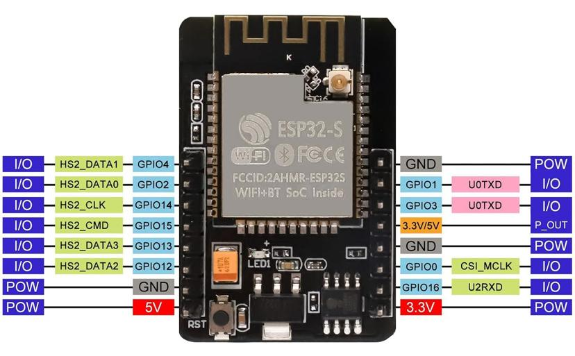

ESP32-camera module development environment
==============

# General View


# PinOut



# Helper Board for Flashing


# Starting Point

[Follow the steps in github actions](./.github/workflows/build-and-tests.yml)


# How To Build

* go into any project and type

```
idf.py build
```

# How To Flash

Use the following command

```
idf.py -p /dev/ttyUSB0 flash
```

# How to See Output

```
root:/workspace/ip_camera# idf.py -p /dev/ttyUSB0 flash monitor
````
<details><summary>Logs</summary>root:/workspace/ip_camera# idf.py -p /dev/ttyUSB0 flash monitor

I (30) boot: ESP-IDF v5.3.2 2nd stage bootloader

I (30) boot: compile time Jan  3 2025 16:54:33

I (30) boot: Multicore bootloader

I (34) boot: chip revision: v1.1

I (38) boot.esp32: SPI Speed      : 40MHz

I (43) boot.esp32: SPI Mode       : DIO

I (47) boot.esp32: SPI Flash Size : 2MB

I (52) boot: Enabling RNG early entropy source...

I (57) boot: Partition Table:

I (61) boot: ## Label            Usage          Type ST Offset   Length

I (68) boot:  0 nvs              WiFi data        01 02 00009000 00006000

I (75) boot:  1 phy_init         RF data          01 01 0000f000 00001000

I (83) boot:  2 factory          factory app      00 00 00010000 00100000

I (90) boot: End of partition table

I (95) esp_image: segment 0: paddr=00010020 vaddr=3f400020 size=25b80h (154496) map

I (156) esp_image: segment 1: paddr=00035ba8 vaddr=3ffb0000 size=051e0h ( 20960) load

I (164) esp_image: segment 2: paddr=0003ad90 vaddr=40080000 size=05288h ( 21128) load

I (173) esp_image: segment 3: paddr=00040020 vaddr=400d0020 size=a4600h (673280) map

I (403) esp_image: segment 4: paddr=000e4628 vaddr=40085288 size=18354h ( 99156) load

I (457) boot: Loaded app from partition at offset 0x10000

I (457) boot: Disabling RNG early entropy source...

I (470) quad_psram: This chip is ESP32-D0WD

I (472) esp_psram: Found 8MB PSRAM device

I (472) esp_psram: Speed: 40MHz

I (473) esp_psram: PSRAM initialized, cache is in low/high (2-core) mode.

W (481) esp_psram: Virtual address not enough for PSRAM, map as much as we can. 4MB is mapped

I (490) cpu_start: Multicore app

I (1397) esp_psram: SPI SRAM memory test OK

I (1405) cpu_start: Pro cpu start user code

I (1405) cpu_start: cpu freq: 160000000 Hz

I (1405) app_init: Application information:

I (1408) app_init: Project name:     softap_sta

I (1413) app_init: App version:      4f40319-dirty

I (1419) app_init: Compile time:     Jan  4 2025 14:03:18

I (1425) app_init: ELF file SHA256:  6469049c4...

I (1430) app_init: ESP-IDF:          v5.3.2

I (1435) efuse_init: Min chip rev:     v0.0

I (1440) efuse_init: Max chip rev:     v3.99 

I (1445) efuse_init: Chip rev:         v1.1

I (1450) heap_init: Initializing. RAM available for dynamic allocation:

I (1457) heap_init: At 3FFAE6E0 len 00001920 (6 KiB): DRAM

I (1463) heap_init: At 3FFBB4B0 len 00024B50 (146 KiB): DRAM

I (1469) heap_init: At 3FFE0440 len 00003AE0 (14 KiB): D/IRAM

I (1476) heap_init: At 3FFE4350 len 0001BCB0 (111 KiB): D/IRAM

I (1482) heap_init: At 4009D5DC len 00002A24 (10 KiB): IRAM

I (1489) esp_psram: Adding pool of 4096K of PSRAM memory to heap allocator

I (1498) spi_flash: detected chip: generic

I (1501) spi_flash: flash io: dio

W (1505) spi_flash: Detected size(4096k) larger than the size in the binary image header(2048k). Using the size in the binary image header.

W (1518) i2c: This driver is an old driver, please migrate your application code to adapt `driver/i2c_master.h`

I (1530) main_task: Started on CPU0

I (1540) esp_psram: Reserving pool of 32K of internal memory for DMA/internal allocations

I (1540) main_task: Calling app_main()

I (1540) gpio: GPIO[25]| InputEn: 1| OutputEn: 0| OpenDrain: 0| Pullup: 1| Pulldown: 0| Intr:2 

I (1550) cam_hal: cam init ok

I (1560) sccb: pin_sda 26 pin_scl 27

I (1560) sccb: sccb_i2c_port=1

I (1560) gpio: GPIO[32]| InputEn: 0| OutputEn: 1| OpenDrain: 0| Pullup: 0| Pulldown: 0| Intr:0 

I (1600) camera: Detected camera at address=0x30

I (1600) camera: Detected OV2640 camera

I (1600) camera: Camera PID=0x26 VER=0x42 MIDL=0x7f MIDH=0xa2

I (1690) cam_hal: buffer_size: 32768, half_buffer_size: 4096, node_buffer_size: 2048, node_cnt: 16, total_cnt: 15

I (1690) cam_hal: Allocating 61440 Byte frame buffer in PSRAM

I (1690) cam_hal: cam config ok

I (1700) ov2640: Set PLL: clk_2x: 0, clk_div: 0, pclk_auto: 0, pclk_div: 8

I (1830) wifi:wifi driver task: 3ffd3e68, prio:23, stack:6656, core=0

I (1840) wifi:wifi firmware version: b0fd6006b

I (1840) wifi:wifi certification version: v7.0

I (1840) wifi:config NVS flash: enabled

I (1840) wifi:config nano formating: disabled

I (1850) wifi:Init data frame dynamic rx buffer num: 32

I (1850) wifi:Init static rx mgmt buffer num: 5

I (1860) wifi:Init management short buffer num: 32

I (1860) wifi:Init static tx buffer num: 16

I (1870) wifi:Init tx cache buffer num: 32

I (1870) wifi:Init static rx buffer size: 1600

I (1870) wifi:Init static rx buffer num: 10

I (1880) wifi:Init dynamic rx buffer num: 32

I (1880) wifi_init: rx ba win: 6

I (1890) wifi_init: accept mbox: 6

I (1890) wifi_init: tcpip mbox: 32

I (1890) wifi_init: udp mbox: 6

I (1900) wifi_init: tcp mbox: 6

I (1900) wifi_init: tcp tx win: 5760

I (1910) wifi_init: tcp rx win: 5760

I (1910) wifi_init: tcp mss: 1440

I (1910) wifi_init: WiFi IRAM OP enabled

I (1920) wifi_init: WiFi RX IRAM OP enabled

I (1920) WiFi SoftAP: ESP_WIFI_MODE_AP

I (1930) WiFi SoftAP: wifi_init_softap finished. SSID:dodossid password:mypassword channel:1

I (1940) WiFi Sta: ESP_WIFI_MODE_STA

I (1990) WiFi Sta: wifi_init_sta finished.

I (1990) phy_init: phy_version 4840,02e0d70,Sep  2 2024,19:39:07

I (2060) wifi:mode : sta (fc:b4:67:01:c1:80) + softAP (fc:b4:67:01:c1:81)

I (2070) wifi:enable tsf

I (2070) wifi:Total power save buffer number: 8

I (2070) wifi:Init max length of beacon: 752/752

I (2070) wifi:Init max length of beacon: 752/752

I (2080) WiFi Sta: Station started

I (2080) esp_netif_lwip: DHCP server started on interface WIFI_AP_DEF with IP: 192.168.4.1

I (5190) wifi:ap channel adjust o:1,1 n:6,2

I (5190) wifi:new:<6,0>, old:<1,1>, ap:<6,2>, sta:<6,0>, prof:1, snd_ch_cfg:0x0

I (5200) wifi:state: init -> auth (0xb0)

I (5220) wifi:state: auth -> assoc (0x0)

I (5330) wifi:state: assoc -> run (0x10)

I (6430) wifi:connected with VM7326524, aid = 2, channel 6, BW20, bssid = 18:35:d1:a6:c1:c9

I (6430) wifi:security: WPA2-PSK, phy: bgn, rssi: -54

I (6450) wifi:pm start, type: 1


I (6450) wifi:dp: 1, bi: 102400, li: 3, scale listen interval from 307200 us to 307200 us

I (6450) wifi:AP's beacon interval = 102400 us, DTIM period = 1

I (9130) wifi:<ba-add>idx:0 (ifx:0, 18:35:d1:a6:c1:c9), tid:0, ssn:1, winSize:64

I (9960) WiFi Sta: Got IP:192.168.0.29

I (9960) camera_http_server: Starting webserver

I (9960) camera_http_server: Starting server on port: '80'

I (9960) WiFi Sta: connected to ap SSID:VM7326524 password:vz7Jdjjgshfp

I (9960) camera_http_server: Registering URI handlers

I (9970) esp_netif_handlers: sta ip: 192.168.0.29, mask: 255.255.255.0, gw: 192.168.0.1

W (9980) esp_netif_lwip: napt disabled on esp_netif:0x3ffdfc80

I (9990) main_task: Returned from app_main()

I (70880) camera_http_server: MJPG: 14KB 92ms (10.9fps)

I (70950) camera_http_server: MJPG: 13KB 78ms (12.8fps)

I (71030) camera_http_server: MJPG: 12KB 74ms (13.5fps)

I (71130) camera_http_server: MJPG: 12KB 102ms (9.8fps)

I (71350) camera_http_server: MJPG: 12KB 217ms (4.6fps)

I (71470) camera_http_server: MJPG: 12KB 127ms (7.9fps)

I (71590) camera_http_server: MJPG: 12KB 115ms (8.7fps)

I (71680) camera_http_server: MJPG: 12KB 91ms (11.0fps)

I (71810) camera_http_server: MJPG: 12KB 125ms (8.0fps)

I (71900) camera_http_server: MJPG: 12KB 91ms (11.0fps)

I (72010) camera_http_server: MJPG: 12KB 115ms (8.7fps)

I (72120) camera_http_server: MJPG: 12KB 109ms (9.2fps)

I (72270) camera_http_server: MJPG: 12KB 143ms (7.0fps)

I (72360) camera_http_server: MJPG: 12KB 97ms (10.3fps)

I (72540) camera_http_server: MJPG: 12KB 173ms (5.8fps)

I (72640) camera_http_server: MJPG: 12KB 99ms (10.1fps)

I (72760) camera_http_server: MJPG: 12KB 118ms (8.5fps)

I (72840) camera_http_server: MJPG: 12KB 80ms (12.5fps)

I (72910) camera_http_server: MJPG: 13KB 76ms (13.2fps)

I (72990) camera_http_server: MJPG: 13KB 82ms (12.2fps)

I (73090) camera_http_server: MJPG: 12KB 95ms (10.5fps)

I (73200) camera_http_server: MJPG: 12KB 110ms (9.1fps)

I (73320) camera_http_server: MJPG: 10KB 122ms (8.2fps)

I (73450) camera_http_server: MJPG: 12KB 124ms (8.1fps)

I (73550) camera_http_server: MJPG: 12KB 101ms (9.9fps)

I (73650) camera_http_server: MJPG: 13KB 98ms (10.2fps)

I (73800) camera_http_server: MJPG: 12KB 152ms (6.6fps)

I (73930) camera_http_server: MJPG: 12KB 133ms (7.5fps)

I (74040) camera_http_server: MJPG: 13KB 110ms (9.1fps)

I (74180) camera_http_server: MJPG: 13KB 132ms (7.6fps)

I (74320) camera_http_server: MJPG: 13KB 141ms (7.1fps)

I (74420) camera_http_server: MJPG: 12KB 104ms (9.6fps)

I (74540) camera_http_server: MJPG: 13KB 119ms (8.4fps)

I (74630) camera_http_server: MJPG: 13KB 92ms (10.9fps)

I (74710) camera_http_server: MJPG: 13KB 78ms (12.8fps)

I (74850) camera_http_server: MJPG: 13KB 138ms (7.2fps)

I (75010) camera_http_server: MJPG: 12KB 159ms (6.3fps)

I (75160) camera_http_server: MJPG: 12KB 147ms (6.8fps)

I (75280) camera_http_server: MJPG: 12KB 125ms (8.0fps)

I (75440) camera_http_server: MJPG: 13KB 158ms (6.3fps)

I (75540) camera_http_server: MJPG: 12KB 100ms (10.0fps)

I (75630) camera_http_server: MJPG: 12KB 89ms (11.2fps)

I (75750) camera_http_server: MJPG: 12KB 114ms (8.8fps)

I (75830) camera_http_server: MJPG: 13KB 83ms (12.0fps)

I (75910) camera_http_server: MJPG: 13KB 80ms (12.5fps)

I (76050) camera_http_server: MJPG: 13KB 136ms (7.4fps)

I (76150) camera_http_server: MJPG: 11KB 103ms (9.7fps)

I (76280) camera_http_server: MJPG: 11KB 133ms (7.5fps)

I (76400) camera_http_server: MJPG: 12KB 117ms (8.5fps)

I (76540) camera_http_server: MJPG: 12KB 138ms (7.2fps)

I (76670) camera_http_server: MJPG: 12KB 128ms (7.8fps)

I (76740) camera_http_server: MJPG: 13KB 75ms (13.3fps)

I (76830) camera_http_server: MJPG: 12KB 84ms (11.9fps)

I (76910) camera_http_server: MJPG: 12KB 79ms (12.7fps)

I (76990) camera_http_server: MJPG: 11KB 82ms (12.2fps)

I (77060) camera_http_server: MJPG: 11KB 76ms (13.2fps)

I (77160) camera_http_server: MJPG: 11KB 99ms (10.1fps)

I (77280) camera_http_server: MJPG: 12KB 111ms (9.0fps)

I (77480) camera_http_server: MJPG: 12KB 200ms (5.0fps)

I (77600) camera_http_server: MJPG: 13KB 127ms (7.9fps)

I (77720) camera_http_server: MJPG: 13KB 117ms (8.5fps)

I (77840) camera_http_server: MJPG: 13KB 120ms (8.3fps)

I (77980) camera_http_server: MJPG: 13KB 135ms (7.4fps)

I (78090) camera_http_server: MJPG: 11KB 107ms (9.3fps)

I (78220) camera_http_server: MJPG: 12KB 134ms (7.5fps)

I (78410) camera_http_server: MJPG: 13KB 192ms (5.2fps)

I (78560) camera_http_server: MJPG: 13KB 144ms (6.9fps)

I (78660) camera_http_server: MJPG: 12KB 105ms (9.5fps)

I (78800) camera_http_server: MJPG: 12KB 136ms (7.4fps)

I (78910) camera_http_server: MJPG: 11KB 107ms (9.3fps)

I (79000) camera_http_server: MJPG: 12KB 98ms (10.2fps)

I (79120) camera_http_server: MJPG: 12KB 121ms (8.3fps)

I (79230) camera_http_server: MJPG: 11KB 107ms (9.3fps)

I (79320) camera_http_server: MJPG: 11KB 86ms (11.6fps)

I (79530) camera_http_server: MJPG: 12KB 207ms (4.8fps)

I (79670) camera_http_server: MJPG: 12KB 143ms (7.0fps)

I (79790) camera_http_server: MJPG: 13KB 123ms (8.1fps)

I (79940) camera_http_server: MJPG: 14KB 146ms (6.8fps)

I (80080) camera_http_server: MJPG: 14KB 141ms (7.1fps)

I (80210) camera_http_server: MJPG: 13KB 130ms (7.7fps)

I (80360) camera_http_server: MJPG: 13KB 147ms (6.8fps)

I (80520) camera_http_server: MJPG: 13KB 162ms (6.2fps)

I (80670) camera_http_server: MJPG: 14KB 144ms (6.9fps)

I (80770) camera_http_server: MJPG: 14KB 100ms (10.0fps)

I (80880) camera_http_server: MJPG: 13KB 115ms (8.7fps)

I (80990) camera_http_server: MJPG: 13KB 112ms (8.9fps)

I (81130) camera_http_server: MJPG: 13KB 135ms (7.4fps)

I (81230) camera_http_server: MJPG: 13KB 102ms (9.8fps)

I (81330) camera_http_server: MJPG: 13KB 100ms (10.0fps)

I (81480) camera_http_server: MJPG: 13KB 148ms (6.8fps)

I (81620) camera_http_server: MJPG: 13KB 136ms (7.4fps)

I (81730) camera_http_server: MJPG: 13KB 109ms (9.2fps)

I (82030) camera_http_server: MJPG: 13KB 303ms (3.3fps)

I (82150) camera_http_server: MJPG: 13KB 114ms (8.8fps)

I (82250) camera_http_server: MJPG: 13KB 104ms (9.6fps)

I (82360) camera_http_server: MJPG: 13KB 113ms (8.8fps)

I (82460) camera_http_server: MJPG: 13KB 92ms (10.9fps)

I (82560) camera_http_server: MJPG: 13KB 101ms (9.9fps)

I (82720) camera_http_server: MJPG: 13KB 165ms (6.1fps)

I (82860) camera_http_server: MJPG: 13KB 137ms (7.3fps)

I (82960) camera_http_server: MJPG: 13KB 99ms (10.1fps)

I (83090) camera_http_server: MJPG: 13KB 125ms (8.0fps)

I (83200) camera_http_server: MJPG: 13KB 115ms (8.7fps)

I (83340) camera_http_server: MJPG: 12KB 138ms (7.2fps)

I (83440) camera_http_server: MJPG: 12KB 103ms (9.7fps)

I (83640) camera_http_server: MJPG: 12KB 196ms (5.1fps)

I (83820) camera_http_server: MJPG: 12KB 185ms (5.4fps)

I (83920) camera_http_server: MJPG: 12KB 98ms (10.2fps)

I (84080) camera_http_server: MJPG: 12KB 160ms (6.2fps)

I (84200) camera_http_server: MJPG: 12KB 118ms (8.5fps)

I (84310) camera_http_server: MJPG: 12KB 110ms (9.1fps)

I (84440) camera_http_server: MJPG: 12KB 130ms (7.7fps)

I (84560) camera_http_server: MJPG: 12KB 115ms (8.7fps)

I (84680) camera_http_server: MJPG: 12KB 121ms (8.3fps)

I (84830) camera_http_server: MJPG: 12KB 152ms (6.6fps)

I (84910) camera_http_server: MJPG: 12KB 77ms (13.0fps)

I (85010) camera_http_server: MJPG: 12KB 105ms (9.5fps)

I (85120) camera_http_server: MJPG: 12KB 102ms (9.8fps)

I (85230) camera_http_server: MJPG: 12KB 109ms (9.2fps)

I (85310) camera_http_server: MJPG: 12KB 86ms (11.6fps)

I (85450) camera_http_server: MJPG: 12KB 140ms (7.1fps)

I (85600) camera_http_server: MJPG: 12KB 149ms (6.7fps)

I (85740) camera_http_server: MJPG: 12KB 134ms (7.5fps)

I (85840) camera_http_server: MJPG: 12KB 105ms (9.5fps)

I (85950) camera_http_server: MJPG: 12KB 104ms (9.6fps)

I (86030) camera_http_server: MJPG: 12KB 86ms (11.6fps)

I (86150) camera_http_server: MJPG: 12KB 115ms (8.7fps)

I (86290) camera_http_server: MJPG: 12KB 138ms (7.2fps)

I (86430) camera_http_server: MJPG: 12KB 144ms (6.9fps)

I (86560) camera_http_server: MJPG: 12KB 123ms (8.1fps)

I (86690) camera_http_server: MJPG: 12KB 135ms (7.4fps)

I (86810) camera_http_server: MJPG: 12KB 123ms (8.1fps)

I (86910) camera_http_server: MJPG: 12KB 95ms (10.5fps)

I (86980) camera_http_server: MJPG: 12KB 72ms (13.9fps)

I (87060) camera_http_server: MJPG: 12KB 77ms (13.0fps)

I (87150) camera_http_server: MJPG: 12KB 93ms (10.8fps)

I (87320) camera_http_server: MJPG: 12KB 165ms (6.1fps)

I (87460) camera_http_server: MJPG: 12KB 144ms (6.9fps)

I (87550) camera_http_server: MJPG: 12KB 83ms (12.0fps)

I (87620) camera_http_server: MJPG: 12KB 71ms (14.1fps)

I (87710) camera_http_server: MJPG: 12KB 92ms (10.9fps)

I (87830) camera_http_server: MJPG: 12KB 122ms (8.2fps)

I (87960) camera_http_server: MJPG: 11KB 121ms (8.3fps)

I (88040) camera_http_server: MJPG: 10KB 87ms (11.5fps)

I (88130) camera_http_server: MJPG: 12KB 90ms (11.1fps)

I (88240) camera_http_server: MJPG: 13KB 107ms (9.3fps)

I (88360) camera_http_server: MJPG: 12KB 115ms (8.7fps)

I (88490) camera_http_server: MJPG: 13KB 135ms (7.4fps)

I (88610) camera_http_server: MJPG: 13KB 116ms (8.6fps)

I (88760) camera_http_server: MJPG: 12KB 149ms (6.7fps)

I (88860) camera_http_server: MJPG: 13KB 104ms (9.6fps)

I (88950) camera_http_server: MJPG: 14KB 91ms (11.0fps)

I (89120) camera_http_server: MJPG: 13KB 164ms (6.1fps)

I (89260) camera_http_server: MJPG: 13KB 138ms (7.2fps)

I (89360) camera_http_server: MJPG: 13KB 102ms (9.8fps)

I (89560) camera_http_server: MJPG: 13KB 204ms (4.9fps)

I (89680) camera_http_server: MJPG: 12KB 113ms (8.8fps)

I (89830) camera_http_server: MJPG: 12KB 150ms (6.7fps)

I (90030) camera_http_server: MJPG: 13KB 204ms (4.9fps)

I (90180) camera_http_server: MJPG: 13KB 145ms (6.9fps)

I (90290) camera_http_server: MJPG: 13KB 112ms (8.9fps)

I (90390) camera_http_server: MJPG: 13KB 101ms (9.9fps)

I (90530) camera_http_server: MJPG: 13KB 137ms (7.3fps)

I (90650) camera_http_server: MJPG: 13KB 118ms (8.5fps)

I (90780) camera_http_server: MJPG: 13KB 132ms (7.6fps)

I (90950) camera_http_server: MJPG: 13KB 173ms (5.8fps)

I (91120) camera_http_server: MJPG: 13KB 169ms (5.9fps)

I (91260) camera_http_server: MJPG: 12KB 140ms (7.1fps)

I (91440) camera_http_server: MJPG: 12KB 178ms (5.6fps)

I (91570) camera_http_server: MJPG: 12KB 131ms (7.6fps)

I (91720) camera_http_server: MJPG: 13KB 145ms (6.9fps)

I (91830) camera_http_server: MJPG: 13KB 111ms (9.0fps)

I (91960) camera_http_server: MJPG: 13KB 133ms (7.5fps)

I (92100) camera_http_server: MJPG: 13KB 136ms (7.4fps)

I (92240) camera_http_server: MJPG: 13KB 136ms (7.4fps)

I (92350) camera_http_server: MJPG: 12KB 115ms (8.7fps)

I (92470) camera_http_server: MJPG: 13KB 121ms (8.3fps)

I (92600) camera_http_server: MJPG: 13KB 124ms (8.1fps)

I (92780) camera_http_server: MJPG: 13KB 185ms (5.4fps)

I (93000) camera_http_server: MJPG: 13KB 216ms (4.6fps)

I (93120) camera_http_server: MJPG: 10KB 116ms (8.6fps)

I (93270) camera_http_server: MJPG: 12KB 155ms (6.5fps)

I (93370) camera_http_server: MJPG: 12KB 101ms (9.9fps)

I (93560) camera_http_server: MJPG: 13KB 184ms (5.4fps)

I (93670) camera_http_server: MJPG: 14KB 117ms (8.5fps)

I (93780) camera_http_server: MJPG: 14KB 109ms (9.2fps)

I (93920) camera_http_server: MJPG: 14KB 138ms (7.2fps)

I (94030) camera_http_server: MJPG: 14KB 111ms (9.0fps)

I (94170) camera_http_server: MJPG: 14KB 136ms (7.4fps)

I (94300) camera_http_server: MJPG: 14KB 125ms (8.0fps)

I (94510) camera_http_server: MJPG: 14KB 215ms (4.7fps)

I (94670) camera_http_server: MJPG: 14KB 162ms (6.2fps)

I (94790) camera_http_server: MJPG: 14KB 111ms (9.0fps)

I (94920) camera_http_server: MJPG: 14KB 129ms (7.8fps)

I (95100) camera_http_server: MJPG: 12KB 189ms (5.3fps)

I (95200) camera_http_server: MJPG: 12KB 90ms (11.1fps)

I (95360) camera_http_server: MJPG: 12KB 162ms (6.2fps)

I (95500) camera_http_server: MJPG: 12KB 140ms (7.1fps)

I (95600) camera_http_server: MJPG: 13KB 100ms (10.0fps)

I (95730) camera_http_server: MJPG: 14KB 132ms (7.6fps)

I (95830) camera_http_server: MJPG: 14KB 102ms (9.8fps)

I (95960) camera_http_server: MJPG: 14KB 123ms (8.1fps)

I (96170) camera_http_server: MJPG: 13KB 210ms (4.8fps)

I (96280) camera_http_server: MJPG: 13KB 108ms (9.3fps)

I (96370) camera_http_server: MJPG: 13KB 97ms (10.3fps)

I (96720) camera_http_server: MJPG: 14KB 344ms (2.9fps)

I (96920) camera_http_server: MJPG: 13KB 198ms (5.1fps)

I (97080) camera_http_server: MJPG: 13KB 160ms (6.2fps)

I (97210) camera_http_server: MJPG: 12KB 132ms (7.6fps)

I (97330) camera_http_server: MJPG: 12KB 117ms (8.5fps)

I (97440) camera_http_server: MJPG: 12KB 112ms (8.9fps)

I (97570) camera_http_server: MJPG: 12KB 127ms (7.9fps)

I (98090) camera_http_server: MJPG: 12KB 522ms (1.9fps)

I (98210) camera_http_server: MJPG: 12KB 120ms (8.3fps)

I (98320) camera_http_server: MJPG: 12KB 110ms (9.1fps)

I (98470) camera_http_server: MJPG: 12KB 153ms (6.5fps)

I (98620) camera_http_server: MJPG: 12KB 152ms (6.6fps)

I (98690) camera_http_server: MJPG: 12KB 65ms (15.4fps)

I (98810) camera_http_server: MJPG: 12KB 116ms (8.6fps)

I (98920) camera_http_server: MJPG: 12KB 109ms (9.2fps)

I (99040) camera_http_server: MJPG: 12KB 121ms (8.3fps)

I (99200) camera_http_server: MJPG: 12KB 158ms (6.3fps)

I (99300) camera_http_server: MJPG: 12KB 106ms (9.4fps)

I (99380) camera_http_server: MJPG: 12KB 79ms (12.7fps)

I (99450) camera_http_server: MJPG: 12KB 69ms (14.5fps)

I (99590) camera_http_server: MJPG: 12KB 138ms (7.2fps)

I (99720) camera_http_server: MJPG: 12KB 130ms (7.7fps)

I (99840) camera_http_server: MJPG: 12KB 117ms (8.5fps)

I (99950) camera_http_server: MJPG: 12KB 115ms (8.7fps)

I (100070) camera_http_server: MJPG: 12KB 114ms (8.8fps)

I (100210) camera_http_server: MJPG: 12KB 143ms (7.0fps)

I (100330) camera_http_server: MJPG: 12KB 120ms (8.3fps)

I (100440) camera_http_server: MJPG: 12KB 108ms (9.3fps)

I (100540) camera_http_server: MJPG: 12KB 99ms (10.1fps)

I (100670) camera_http_server: MJPG: 12KB 132ms (7.6fps)

I (100790) camera_http_server: MJPG: 12KB 113ms (8.8fps)

I (100890) camera_http_server: MJPG: 12KB 102ms (9.8fps)

I (100990) camera_http_server: MJPG: 12KB 101ms (9.9fps)

I (101100) camera_http_server: MJPG: 11KB 104ms (9.6fps)

I (101170) camera_http_server: MJPG: 10KB 71ms (14.1fps)

I (101340) camera_http_server: MJPG: 10KB 170ms (5.9fps)

I (101490) camera_http_server: MJPG: 11KB 152ms (6.6fps)

I (101640) camera_http_server: MJPG: 13KB 153ms (6.5fps)

I (101830) camera_http_server: MJPG: 13KB 181ms (5.5fps)

I (102330) camera_http_server: MJPG: 14KB 503ms (2.0fps)

I (102510) camera_http_server: MJPG: 14KB 182ms (5.5fps)

I (102880) camera_http_server: MJPG: 14KB 365ms (2.7fps)

I (103050) camera_http_server: MJPG: 14KB 169ms (5.9fps)

I (103250) camera_http_server: MJPG: 14KB 198ms (5.1fps)

I (103530) camera_http_server: MJPG: 14KB 284ms (3.5fps)

I (103650) camera_http_server: MJPG: 14KB 124ms (8.1fps)

I (103810) camera_http_server: MJPG: 14KB 154ms (6.5fps)

I (104020) camera_http_server: MJPG: 13KB 207ms (4.8fps)

I (104290) camera_http_server: MJPG: 14KB 274ms (3.6fps)

I (104550) camera_http_server: MJPG: 13KB 257ms (3.9fps)

I (104880) camera_http_server: MJPG: 12KB 334ms (3.0fps)

I (105080) camera_http_server: MJPG: 12KB 194ms (5.2fps)

I (105190) camera_http_server: MJPG: 12KB 111ms (9.0fps)

I (105400) camera_http_server: MJPG: 13KB 209ms (4.8fps)

I (105640) camera_http_server: MJPG: 13KB 238ms (4.2fps)

I (106060) camera_http_server: MJPG: 13KB 423ms (2.4fps)

I (106190) camera_http_server: MJPG: 13KB 131ms (7.6fps)

I (106320) camera_http_server: MJPG: 13KB 127ms (7.9fps)

I (106570) camera_http_server: MJPG: 13KB 249ms (4.0fps)

I (106760) camera_http_server: MJPG: 13KB 190ms (5.3fps)

I (107210) camera_http_server: MJPG: 12KB 449ms (2.2fps)

I (107380) camera_http_server: MJPG: 13KB 172ms (5.8fps)

I (107530) camera_http_server: MJPG: 13KB 151ms (6.6fps)

I (107720) camera_http_server: MJPG: 13KB 184ms (5.4fps)

I (107900) camera_http_server: MJPG: 12KB 181ms (5.5fps)

I (108150) camera_http_server: MJPG: 13KB 252ms (4.0fps)

I (108570) camera_http_server: MJPG: 11KB 420ms (2.4fps)

I (108670) camera_http_server: MJPG: 13KB 99ms (10.1fps)

I (109050) camera_http_server: MJPG: 13KB 374ms (2.7fps)

I (109270) camera_http_server: MJPG: 13KB 226ms (4.4fps)

I (109510) camera_http_server: MJPG: 13KB 237ms (4.2fps)

I (109670) camera_http_server: MJPG: 12KB 157ms (6.4fps)

I (109810) camera_http_server: MJPG: 12KB 143ms (7.0fps)

I (110130) camera_http_server: MJPG: 13KB 314ms (3.2fps)

I (110350) camera_http_server: MJPG: 12KB 219ms (4.6fps)

I (110500) camera_http_server: MJPG: 12KB 156ms (6.4fps)

I (110690) camera_http_server: MJPG: 12KB 191ms (5.2fps)

I (110820) camera_http_server: MJPG: 12KB 124ms (8.1fps)

I (111190) camera_http_server: MJPG: 12KB 373ms (2.7fps)

I (111350) camera_http_server: MJPG: 12KB 163ms (6.1fps)

I (111540) camera_http_server: MJPG: 12KB 190ms (5.3fps)

I (111720) camera_http_server: MJPG: 12KB 179ms (5.6fps)

I (111890) camera_http_server: MJPG: 12KB 170ms (5.9fps)

I (112130) camera_http_server: MJPG: 12KB 238ms (4.2fps)

I (112310) camera_http_server: MJPG: 12KB 174ms (5.7fps)

I (112490) camera_http_server: MJPG: 11KB 178ms (5.6fps)

I (112670) camera_http_server: MJPG: 11KB 182ms (5.5fps)

I (112860) camera_http_server: MJPG: 11KB 188ms (5.3fps)

I (113070) camera_http_server: MJPG: 11KB 215ms (4.7fps)

I (113310) camera_http_server: MJPG: 11KB 240ms (4.2fps)

I (113470) camera_http_server: MJPG: 11KB 157ms (6.4fps)

I (113740) camera_http_server: MJPG: 12KB 271ms (3.7fps)

I (113950) camera_http_server: MJPG: 12KB 206ms (4.9fps)

I (114150) camera_http_server: MJPG: 12KB 199ms (5.0fps)

I (114320) camera_http_server: MJPG: 12KB 172ms (5.8fps)

I (114510) camera_http_server: MJPG: 12KB 187ms (5.3fps)

I (114770) camera_http_server: MJPG: 12KB 256ms (3.9fps)

I (114980) camera_http_server: MJPG: 12KB 212ms (4.7fps)

I (115260) camera_http_server: MJPG: 12KB 282ms (3.5fps)

I (115390) camera_http_server: MJPG: 12KB 128ms (7.8fps)

I (115530) camera_http_server: MJPG: 12KB 139ms (7.2fps)

I (115670) camera_http_server: MJPG: 12KB 140ms (7.1fps)

I (115860) camera_http_server: MJPG: 12KB 185ms (5.4fps)

I (116200) camera_http_server: MJPG: 12KB 342ms (2.9fps)

I (116420) camera_http_server: MJPG: 12KB 225ms (4.4fps)

I (116630) camera_http_server: MJPG: 12KB 202ms (5.0fps)

I (116880) camera_http_server: MJPG: 12KB 252ms (4.0fps)

I (117030) camera_http_server: MJPG: 12KB 151ms (6.6fps)

I (117310) camera_http_server: MJPG: 12KB 283ms (3.5fps)

I (117510) camera_http_server: MJPG: 12KB 196ms (5.1fps)

I (117730) camera_http_server: MJPG: 12KB 216ms (4.6fps)

I (118110) camera_http_server: MJPG: 12KB 385ms (2.6fps)

I (118340) camera_http_server: MJPG: 12KB 233ms (4.3fps)

I (118730) camera_http_server: MJPG: 12KB 383ms (2.6fps)

I (118950) camera_http_server: MJPG: 12KB 218ms (4.6fps)

I (119170) camera_http_server: MJPG: 12KB 226ms (4.4fps)

I (119310) camera_http_server: MJPG: 12KB 135ms (7.4fps)

I (119470) camera_http_server: MJPG: 12KB 165ms (6.1fps)

I (119710) camera_http_server: MJPG: 12KB 232ms (4.3fps)

I (119990) camera_http_server: MJPG: 12KB 284ms (3.5fps)

I (120190) camera_http_server: MJPG: 12KB 203ms (4.9fps)

I (120390) camera_http_server: MJPG: 12KB 194ms (5.2fps)

I (120560) camera_http_server: MJPG: 12KB 168ms (6.0fps)

I (120900) camera_http_server: MJPG: 12KB 346ms (2.9fps)

I (121090) camera_http_server: MJPG: 12KB 182ms (5.5fps)

I (121380) camera_http_server: MJPG: 12KB 292ms (3.4fps)

I (121710) camera_http_server: MJPG: 12KB 328ms (3.0fps)

I (121940) camera_http_server: MJPG: 12KB 236ms (4.2fps)

I (122090) camera_http_server: MJPG: 12KB 143ms (7.0fps)

I (122450) camera_http_server: MJPG: 12KB 367ms (2.7fps)

I (122700) camera_http_server: MJPG: 12KB 247ms (4.0fps)

I (122840) camera_http_server: MJPG: 12KB 141ms (7.1fps)

I (123030) camera_http_server: MJPG: 12KB 184ms (5.4fps)

I (123300) camera_http_server: MJPG: 12KB 270ms (3.7fps)

I (123420) camera_http_server: MJPG: 12KB 127ms (7.9fps)

I (123680) camera_http_server: MJPG: 12KB 258ms (3.9fps)

I (123910) camera_http_server: MJPG: 12KB 225ms (4.4fps)

I (124340) camera_http_server: MJPG: 12KB 435ms (2.3fps)

I (124540) camera_http_server: MJPG: 12KB 196ms (5.1fps)

I (124730) camera_http_server: MJPG: 12KB 187ms (5.3fps)

I (125060) camera_http_server: MJPG: 12KB 330ms (3.0fps)

I (125240) camera_http_server: MJPG: 12KB 183ms (5.5fps)

I (125530) camera_http_server: MJPG: 12KB 285ms (3.5fps)

I (125830) camera_http_server: MJPG: 12KB 301ms (3.3fps)

I (126380) camera_http_server: MJPG: 12KB 553ms (1.8fps)

I (126590) camera_http_server: MJPG: 12KB 204ms (4.9fps)

I (126740) camera_http_server: MJPG: 12KB 158ms (6.3fps)

I (126940) camera_http_server: MJPG: 12KB 199ms (5.0fps)

I (127100) camera_http_server: MJPG: 12KB 161ms (6.2fps)

I (127330) camera_http_server: MJPG: 12KB 220ms (4.5fps)

I (127500) camera_http_server: MJPG: 12KB 176ms (5.7fps)

I (127670) camera_http_server: MJPG: 12KB 170ms (5.9fps)

I (128090) camera_http_server: MJPG: 12KB 420ms (2.4fps)

I (128240) camera_http_server: MJPG: 12KB 145ms (6.9fps)

I (128540) camera_http_server: MJPG: 12KB 303ms (3.3fps)

I (128710) camera_http_server: MJPG: 12KB 165ms (6.1fps)

I (128910) camera_http_server: MJPG: 12KB 199ms (5.0fps)

I (129410) camera_http_server: MJPG: 12KB 507ms (2.0fps)

I (129740) camera_http_server: MJPG: 12KB 331ms (3.0fps)

I (129900) camera_http_server: MJPG: 12KB 155ms (6.5fps)

I (130080) camera_http_server: MJPG: 12KB 175ms (5.7fps)

I (130200) camera_http_server: MJPG: 12KB 124ms (8.1fps)

I (130640) camera_http_server: MJPG: 12KB 434ms (2.3fps)

I (130780) camera_http_server: MJPG: 12KB 148ms (6.8fps)

I (130940) camera_http_server: MJPG: 12KB 152ms (6.6fps)

I (131090) camera_http_server: MJPG: 12KB 148ms (6.8fps)

I (131300) camera_http_server: MJPG: 12KB 216ms (4.6fps)

I (131550) camera_http_server: MJPG: 12KB 245ms (4.1fps)

I (131820) camera_http_server: MJPG: 12KB 271ms (3.7fps)

I (132020) camera_http_server: MJPG: 12KB 205ms (4.9fps)

I (132460) camera_http_server: MJPG: 12KB 435ms (2.3fps)

I (132740) camera_http_server: MJPG: 12KB 283ms (3.5fps)

I (132990) camera_http_server: MJPG: 12KB 250ms (4.0fps)

I (133200) camera_http_server: MJPG: 12KB 203ms (4.9fps)

I (133320) camera_http_server: MJPG: 12KB 120ms (8.3fps)

I (133700) camera_http_server: MJPG: 12KB 383ms (2.6fps)

I (133860) camera_http_server: MJPG: 12KB 158ms (6.3fps)

I (134140) camera_http_server: MJPG: 12KB 280ms (3.6fps)

I (134520) camera_http_server: MJPG: 12KB 382ms (2.6fps)

I (134880) camera_http_server: MJPG: 12KB 354ms (2.8fps)

I (135130) camera_http_server: MJPG: 12KB 257ms (3.9fps)

I (135340) camera_http_server: MJPG: 12KB 207ms (4.8fps)

I (135540) camera_http_server: MJPG: 12KB 201ms (5.0fps)

I (135700) camera_http_server: MJPG: 12KB 154ms (6.5fps)

I (135850) camera_http_server: MJPG: 12KB 148ms (6.8fps)

I (136380) camera_http_server: MJPG: 12KB 534ms (1.9fps)

I (136680) camera_http_server: MJPG: 12KB 297ms (3.4fps)

I (136960) camera_http_server: MJPG: 12KB 279ms (3.6fps)

I (137140) camera_http_server: MJPG: 12KB 183ms (5.5fps)

I (137300) camera_http_server: MJPG: 12KB 159ms (6.3fps)

I (137430) camera_http_server: MJPG: 12KB 131ms (7.6fps)

I (137550) camera_http_server: MJPG: 12KB 113ms (8.8fps)

I (137770) camera_http_server: MJPG: 12KB 224ms (4.5fps)

I (137960) camera_http_server: MJPG: 12KB 185ms (5.4fps)

I (138060) camera_http_server: MJPG: 12KB 102ms (9.8fps)

I (138270) camera_http_server: MJPG: 12KB 206ms (4.9fps)

I (138780) camera_http_server: MJPG: 12KB 517ms (1.9fps)

I (139020) camera_http_server: MJPG: 12KB 232ms (4.3fps)

I (139430) camera_http_server: MJPG: 12KB 413ms (2.4fps)

I (139640) camera_http_server: MJPG: 12KB 204ms (4.9fps)

I (140260) camera_http_server: MJPG: 12KB 626ms (1.6fps)

I (140420) camera_http_server: MJPG: 12KB 156ms (6.4fps)

I (140570) camera_http_server: MJPG: 12KB 155ms (6.5fps)

I (140880) camera_http_server: MJPG: 12KB 307ms (3.3fps)

I (141010) camera_http_server: MJPG: 12KB 132ms (7.6fps)

I (141150) camera_http_server: MJPG: 12KB 137ms (7.3fps)

I (141460) camera_http_server: MJPG: 12KB 311ms (3.2fps)

I (141660) camera_http_server: MJPG: 12KB 199ms (5.0fps)

I (142050) camera_http_server: MJPG: 12KB 383ms (2.6fps)

I (142190) camera_http_server: MJPG: 12KB 144ms (6.9fps)

I (142500) camera_http_server: MJPG: 12KB 309ms (3.2fps)

I (142720) camera_http_server: MJPG: 12KB 213ms (4.7fps)

I (142950) camera_http_server: MJPG: 12KB 233ms (4.3fps)

I (143250) camera_http_server: MJPG: 11KB 302ms (3.3fps)

I (143530) camera_http_server: MJPG: 11KB 283ms (3.5fps)

I (143670) camera_http_server: MJPG: 12KB 139ms (7.2fps)

I (143990) camera_http_server: MJPG: 12KB 312ms (3.2fps)

I (144150) camera_http_server: MJPG: 10KB 161ms (6.2fps)

I (144340) camera_http_server: MJPG: 12KB 188ms (5.3fps)

I (144710) camera_http_server: MJPG: 11KB 372ms (2.7fps)

I (145740) camera_http_server: MJPG: 11KB 1029ms (1.0fps)

I (146240) camera_http_server: MJPG: 7KB 500ms (2.0fps)

I (146610) camera_http_server: MJPG: 8KB 371ms (2.7fps)

I (146760) camera_http_server: MJPG: 10KB 151ms (6.6fps)

I (146970) camera_http_server: MJPG: 13KB 201ms (5.0fps)

I (147060) camera_http_server: MJPG: 14KB 93ms (10.8fps)

I (147180) camera_http_server: MJPG: 13KB 123ms (8.1fps)

I (147300) camera_http_server: MJPG: 14KB 112ms (8.9fps)

I (147440) camera_http_server: MJPG: 15KB 139ms (7.2fps)

I (147560) camera_http_server: MJPG: 16KB 127ms (7.9fps)

I (147690) camera_http_server: MJPG: 16KB 129ms (7.8fps)

I (147840) camera_http_server: MJPG: 17KB 145ms (6.9fps)

I (147940) camera_http_server: MJPG: 17KB 104ms (9.6fps)

I (148060) camera_http_server: MJPG: 17KB 113ms (8.8fps)

I (148180) camera_http_server: MJPG: 17KB 120ms (8.3fps)

I (148270) camera_http_server: MJPG: 15KB 95ms (10.5fps)

I (148350) camera_http_server: MJPG: 16KB 80ms (12.5fps)

I (148490) camera_http_server: MJPG: 15KB 134ms (7.5fps)

I (148640) camera_http_server: MJPG: 15KB 153ms (6.5fps)

I (148740) camera_http_server: MJPG: 14KB 98ms (10.2fps)

I (148920) camera_http_server: MJPG: 14KB 179ms (5.6fps)

I (149010) camera_http_server: MJPG: 17KB 86ms (11.6fps)

I (149160) camera_http_server: MJPG: 17KB 158ms (6.3fps)

I (149290) camera_http_server: MJPG: 18KB 131ms (7.6fps)

I (149450) camera_http_server: MJPG: 18KB 156ms (6.4fps)

I (149580) camera_http_server: MJPG: 16KB 124ms (8.1fps)

I (149690) camera_http_server: MJPG: 18KB 110ms (9.1fps)

I (149810) camera_http_server: MJPG: 18KB 124ms (8.1fps)

I (149920) camera_http_server: MJPG: 18KB 111ms (9.0fps)

I (150000) camera_http_server: MJPG: 16KB 78ms (12.8fps)

I (150080) camera_http_server: MJPG: 16KB 80ms (12.5fps)

I (150150) camera_http_server: MJPG: 15KB 68ms (14.7fps)

I (150250) camera_http_server: MJPG: 14KB 102ms (9.8fps)

I (150350) camera_http_server: MJPG: 12KB 96ms (10.4fps)

I (150440) camera_http_server: MJPG: 12KB 88ms (11.4fps)

I (150500) camera_http_server: MJPG: 13KB 65ms (15.4fps)

I (150600) camera_http_server: MJPG: 12KB 97ms (10.3fps)

I (150690) camera_http_server: MJPG: 13KB 85ms (11.8fps)

I (150770) camera_http_server: MJPG: 12KB 84ms (11.9fps)

I (150880) camera_http_server: MJPG: 12KB 111ms (9.0fps)

I (150970) camera_http_server: MJPG: 13KB 85ms (11.8fps)

I (151100) camera_http_server: MJPG: 13KB 137ms (7.3fps)

I (151270) camera_http_server: MJPG: 14KB 164ms (6.1fps)

I (151350) camera_http_server: MJPG: 14KB 83ms (12.0fps)

I (151440) camera_http_server: MJPG: 14KB 91ms (11.0fps)

I (151530) camera_http_server: MJPG: 14KB 82ms (12.2fps)

I (151650) camera_http_server: MJPG: 14KB 122ms (8.2fps)

I (151780) camera_http_server: MJPG: 14KB 131ms (7.6fps)

I (151880) camera_http_server: MJPG: 14KB 100ms (10.0fps)

I (151960) camera_http_server: MJPG: 15KB 74ms (13.5fps)

I (152090) camera_http_server: MJPG: 14KB 134ms (7.5fps)

I (152190) camera_http_server: MJPG: 16KB 99ms (10.1fps)

I (152310) camera_http_server: MJPG: 16KB 117ms (8.5fps)

I (152400) camera_http_server: MJPG: 16KB 97ms (10.3fps)

I (152490) camera_http_server: MJPG: 17KB 90ms (11.1fps)

I (152600) camera_http_server: MJPG: 15KB 101ms (9.9fps)

I (152690) camera_http_server: MJPG: 16KB 95ms (10.5fps)

I (152790) camera_http_server: MJPG: 14KB 102ms (9.8fps)

I (152890) camera_http_server: MJPG: 14KB 99ms (10.1fps)

I (153000) camera_http_server: MJPG: 12KB 105ms (9.5fps)

I (153130) camera_http_server: MJPG: 16KB 131ms (7.6fps)

I (153250) camera_http_server: MJPG: 13KB 124ms (8.1fps)

I (153360) camera_http_server: MJPG: 14KB 103ms (9.7fps)

I (153440) camera_http_server: MJPG: 12KB 78ms (12.8fps)

I (154210) camera_http_server: MJPG: 12KB 777ms (1.3fps)

I (154340) camera_http_server: MJPG: 14KB 122ms (8.2fps)

I (154430) camera_http_server: MJPG: 11KB 96ms (10.4fps)

I (154530) camera_http_server: MJPG: 10KB 102ms (9.8fps)

I (154690) camera_http_server: MJPG: 8KB 153ms (6.5fps)

I (154880) camera_http_server: MJPG: 10KB 192ms (5.2fps)

I (154990) camera_http_server: MJPG: 10KB 112ms (8.9fps)

I (155100) camera_http_server: MJPG: 13KB 105ms (9.5fps)

I (155240) camera_http_server: MJPG: 9KB 145ms (6.9fps)

I (155340) camera_http_server: MJPG: 10KB 98ms (10.2fps)

I (155430) camera_http_server: MJPG: 11KB 91ms (11.0fps)

I (155530) camera_http_server: MJPG: 10KB 98ms (10.2fps)

I (155650) camera_http_server: MJPG: 11KB 115ms (8.7fps)

I (155810) camera_http_server: MJPG: 11KB 158ms (6.3fps)

I (155910) camera_http_server: MJPG: 10KB 108ms (9.3fps)

I (155990) camera_http_server: MJPG: 11KB 73ms (13.7fps)

I (156140) camera_http_server: MJPG: 10KB 149ms (6.7fps)

I (157180) camera_http_server: MJPG: 13KB 1040ms (1.0fps)

I (157330) camera_http_server: MJPG: 11KB 154ms (6.5fps)

I (157460) camera_http_server: MJPG: 11KB 127ms (7.9fps)

I (157620) camera_http_server: MJPG: 12KB 164ms (6.1fps)

I (157730) camera_http_server: MJPG: 13KB 105ms (9.5fps)

I (157830) camera_http_server: MJPG: 12KB 97ms (10.3fps)

I (158020) camera_http_server: MJPG: 14KB 188ms (5.3fps)

I (158140) camera_http_server: MJPG: 15KB 121ms (8.3fps)

I (158310) camera_http_server: MJPG: 15KB 172ms (5.8fps)

I (158460) camera_http_server: MJPG: 14KB 154ms (6.5fps)

I (158850) camera_http_server: MJPG: 15KB 382ms (2.6fps)

I (159160) camera_http_server: MJPG: 13KB 314ms (3.2fps)

I (159330) camera_http_server: MJPG: 13KB 167ms (6.0fps)

I (159480) camera_http_server: MJPG: 12KB 154ms (6.5fps)

I (159650) camera_http_server: MJPG: 14KB 168ms (6.0fps)

I (159800) camera_http_server: MJPG: 13KB 152ms (6.6fps)

I (160090) camera_http_server: MJPG: 13KB 283ms (3.5fps)

I (160420) camera_http_server: MJPG: 13KB 329ms (3.0fps)

I (160560) camera_http_server: MJPG: 13KB 141ms (7.1fps)

I (160640) camera_http_server: MJPG: 13KB 85ms (11.8fps)

I (160760) camera_http_server: MJPG: 13KB 119ms (8.4fps)

I (160970) camera_http_server: MJPG: 13KB 209ms (4.8fps)

I (161120) camera_http_server: MJPG: 13KB 146ms (6.8fps)

I (161220) camera_http_server: MJPG: 14KB 97ms (10.3fps)

I (161440) camera_http_server: MJPG: 14KB 221ms (4.5fps)

I (161530) camera_http_server: MJPG: 13KB 91ms (11.0fps)

I (161650) camera_http_server: MJPG: 12KB 118ms (8.5fps)

I (161800) camera_http_server: MJPG: 11KB 148ms (6.8fps)

I (161900) camera_http_server: MJPG: 12KB 102ms (9.8fps)

I (161990) camera_http_server: MJPG: 10KB 90ms (11.1fps)

I (162080) camera_http_server: MJPG: 11KB 94ms (10.6fps)

I (162170) camera_http_server: MJPG: 10KB 89ms (11.2fps)

I (162320) camera_http_server: MJPG: 10KB 147ms (6.8fps)

I (162440) camera_http_server: MJPG: 10KB 122ms (8.2fps)

I (162580) camera_http_server: MJPG: 11KB 137ms (7.3fps)

I (162720) camera_http_server: MJPG: 10KB 135ms (7.4fps)

I (162850) camera_http_server: MJPG: 10KB 127ms (7.9fps)

I (162980) camera_http_server: MJPG: 12KB 136ms (7.4fps)

I (163130) camera_http_server: MJPG: 13KB 145ms (6.9fps)

I (163310) camera_http_server: MJPG: 13KB 184ms (5.4fps)

I (163460) camera_http_server: MJPG: 14KB 147ms (6.8fps)

I (163580) camera_http_server: MJPG: 13KB 121ms (8.3fps)

I (163760) camera_http_server: MJPG: 13KB 177ms (5.6fps)

I (163930) camera_http_server: MJPG: 13KB 173ms (5.8fps)

I (164090) camera_http_server: MJPG: 14KB 156ms (6.4fps)

I (164340) camera_http_server: MJPG: 13KB 248ms (4.0fps)

I (164440) camera_http_server: MJPG: 13KB 101ms (9.9fps)

I (164740) camera_http_server: MJPG: 13KB 297ms (3.4fps)

I (164900) camera_http_server: MJPG: 12KB 165ms (6.1fps)

I (165050) camera_http_server: MJPG: 12KB 144ms (6.9fps)

I (165220) camera_http_server: MJPG: 11KB 169ms (5.9fps)

I (165370) camera_http_server: MJPG: 12KB 153ms (6.5fps)

I (166140) camera_http_server: MJPG: 12KB 769ms (1.3fps)

I (166250) camera_http_server: MJPG: 12KB 111ms (9.0fps)

I (166410) camera_http_server: MJPG: 12KB 156ms (6.4fps)

I (166520) camera_http_server: MJPG: 12KB 113ms (8.8fps)

I (166680) camera_http_server: MJPG: 12KB 160ms (6.2fps)

I (166920) camera_http_server: MJPG: 12KB 236ms (4.2fps)

I (167010) camera_http_server: MJPG: 12KB 97ms (10.3fps)

I (167130) camera_http_server: MJPG: 11KB 114ms (8.8fps)

I (167300) camera_http_server: MJPG: 11KB 167ms (6.0fps)

I (167450) camera_http_server: MJPG: 12KB 149ms (6.7fps)

I (167610) camera_http_server: MJPG: 12KB 161ms (6.2fps)

I (167760) camera_http_server: MJPG: 13KB 157ms (6.4fps)

I (167910) camera_http_server: MJPG: 11KB 141ms (7.1fps)

I (168010) camera_http_server: MJPG: 11KB 99ms (10.1fps)

I (168170) camera_http_server: MJPG: 12KB 161ms (6.2fps)

I (168270) camera_http_server: MJPG: 12KB 98ms (10.2fps)

I (168410) camera_http_server: MJPG: 12KB 140ms (7.1fps)

I (168560) camera_http_server: MJPG: 12KB 153ms (6.5fps)

I (168670) camera_http_server: MJPG: 12KB 112ms (8.9fps)

I (168790) camera_http_server: MJPG: 12KB 114ms (8.8fps)

I (168920) camera_http_server: MJPG: 12KB 138ms (7.2fps)

I (169070) camera_http_server: MJPG: 13KB 142ms (7.0fps)

I (169210) camera_http_server: MJPG: 13KB 139ms (7.2fps)

I (169340) camera_http_server: MJPG: 13KB 128ms (7.8fps)

I (169480) camera_http_server: MJPG: 13KB 145ms (6.9fps)

I (169580) camera_http_server: MJPG: 13KB 101ms (9.9fps)

I (169690) camera_http_server: MJPG: 13KB 105ms (9.5fps)

I (169840) camera_http_server: MJPG: 13KB 157ms (6.4fps)

I (170010) camera_http_server: MJPG: 13KB 162ms (6.2fps)

I (170110) camera_http_server: MJPG: 13KB 107ms (9.3fps)

I (170190) camera_http_server: MJPG: 13KB 73ms (13.7fps)

I (170410) camera_http_server: MJPG: 13KB 217ms (4.6fps)

I (170510) camera_http_server: MJPG: 13KB 105ms (9.5fps)

I (170650) camera_http_server: MJPG: 13KB 139ms (7.2fps)

I (170890) camera_http_server: MJPG: 13KB 235ms (4.3fps)

I (171040) camera_http_server: MJPG: 12KB 150ms (6.7fps)

I (171140) camera_http_server: MJPG: 12KB 107ms (9.3fps)

I (171290) camera_http_server: MJPG: 13KB 147ms (6.8fps)

I (171450) camera_http_server: MJPG: 13KB 153ms (6.5fps)

I (171570) camera_http_server: MJPG: 13KB 124ms (8.1fps)

I (171700) camera_http_server: MJPG: 13KB 134ms (7.5fps)

I (171790) camera_http_server: MJPG: 13KB 86ms (11.6fps)

I (171880) camera_http_server: MJPG: 13KB 92ms (10.9fps)

I (172010) camera_http_server: MJPG: 13KB 121ms (8.3fps)

I (172160) camera_http_server: MJPG: 13KB 152ms (6.6fps)

I (172290) camera_http_server: MJPG: 14KB 135ms (7.4fps)

I (172470) camera_http_server: MJPG: 13KB 179ms (5.6fps)

I (172670) camera_http_server: MJPG: 14KB 200ms (5.0fps)

I (172780) camera_http_server: MJPG: 13KB 108ms (9.3fps)

I (172970) camera_http_server: MJPG: 13KB 183ms (5.5fps)

I (173130) camera_http_server: MJPG: 14KB 161ms (6.2fps)

I (173390) camera_http_server: MJPG: 13KB 260ms (3.8fps)

I (173640) camera_http_server: MJPG: 13KB 255ms (3.9fps)

I (173880) camera_http_server: MJPG: 13KB 239ms (4.2fps)

I (175470) camera_http_server: MJPG: 14KB 1582ms (0.6fps)

I (175590) camera_http_server: MJPG: 14KB 122ms (8.2fps)

I (176410) camera_http_server: MJPG: 15KB 823ms (1.2fps)

I (176660) camera_http_server: MJPG: 18KB 252ms (4.0fps)

I (176820) camera_http_server: MJPG: 17KB 157ms (6.4fps)

I (177000) camera_http_server: MJPG: 15KB 179ms (5.6fps)

I (177170) camera_http_server: MJPG: 15KB 163ms (6.1fps)

I (177390) camera_http_server: MJPG: 15KB 226ms (4.4fps)

I (177530) camera_http_server: MJPG: 16KB 140ms (7.1fps)

I (177720) camera_http_server: MJPG: 17KB 190ms (5.3fps)

I (177960) camera_http_server: MJPG: 17KB 240ms (4.2fps)

I (178220) camera_http_server: MJPG: 17KB 253ms (4.0fps)

I (178510) camera_http_server: MJPG: 17KB 291ms (3.4fps)

I (178680) camera_http_server: MJPG: 16KB 171ms (5.8fps)

I (178920) camera_http_server: MJPG: 18KB 237ms (4.2fps)

I (179110) camera_http_server: MJPG: 17KB 192ms (5.2fps)

I (179430) camera_http_server: MJPG: 18KB 321ms (3.1fps)

I (179640) camera_http_server: MJPG: 17KB 203ms (4.9fps)

I (180330) camera_http_server: MJPG: 17KB 694ms (1.4fps)

I (180510) camera_http_server: MJPG: 17KB 175ms (5.7fps)

I (180650) camera_http_server: MJPG: 17KB 147ms (6.8fps)

I (181370) camera_http_server: MJPG: 17KB 720ms (1.4fps)

I (181670) camera_http_server: MJPG: 17KB 298ms (3.4fps)

I (181840) camera_http_server: MJPG: 16KB 170ms (5.9fps)

I (182000) camera_http_server: MJPG: 17KB 158ms (6.3fps)

I (182400) camera_http_server: MJPG: 16KB 400ms (2.5fps)

I (182530) camera_http_server: MJPG: 18KB 131ms (7.6fps)

I (182780) camera_http_server: MJPG: 18KB 243ms (4.1fps)

I (183040) camera_http_server: MJPG: 18KB 263ms (3.8fps)

I (183300) camera_http_server: MJPG: 18KB 255ms (3.9fps)

I (183710) camera_http_server: MJPG: 17KB 414ms (2.4fps)

I (183870) camera_http_server: MJPG: 16KB 159ms (6.3fps)

I (183980) camera_http_server: MJPG: 14KB 112ms (8.9fps)

I (184100) camera_http_server: MJPG: 13KB 119ms (8.4fps)

I (184220) camera_http_server: MJPG: 13KB 114ms (8.8fps)

I (184370) camera_http_server: MJPG: 14KB 154ms (6.5fps)

I (184550) camera_http_server: MJPG: 14KB 178ms (5.6fps)

I (184630) camera_http_server: MJPG: 14KB 83ms (12.0fps)

I (184700) camera_http_server: MJPG: 12KB 65ms (15.4fps)

I (184860) camera_http_server: MJPG: 15KB 165ms (6.1fps)

I (185090) camera_http_server: MJPG: 15KB 224ms (4.5fps)

I (185250) camera_http_server: MJPG: 15KB 164ms (6.1fps)

I (185530) camera_http_server: MJPG: 16KB 277ms (3.6fps)

I (186040) camera_http_server: MJPG: 17KB 509ms (2.0fps)

I (186180) camera_http_server: MJPG: 17KB 136ms (7.4fps)

I (186570) camera_http_server: MJPG: 17KB 396ms (2.5fps)

I (188030) camera_http_server: MJPG: 18KB 1461ms (0.7fps)

I (188260) camera_http_server: MJPG: 10KB 230ms (4.3fps)

I (188500) camera_http_server: MJPG: 8KB 241ms (4.1fps)

I (188590) camera_http_server: MJPG: 9KB 85ms (11.8fps)

I (188700) camera_http_server: MJPG: 7KB 112ms (8.9fps)

I (188780) camera_http_server: MJPG: 8KB 79ms (12.7fps)

I (188850) camera_http_server: MJPG: 9KB 70ms (14.3fps)

I (188940) camera_http_server: MJPG: 8KB 88ms (11.4fps)

I (189120) camera_http_server: MJPG: 7KB 181ms (5.5fps)

I (189230) camera_http_server: MJPG: 8KB 105ms (9.5fps)

I (189310) camera_http_server: MJPG: 8KB 83ms (12.0fps)

I (189440) camera_http_server: MJPG: 8KB 132ms (7.6fps)

I (189550) camera_http_server: MJPG: 7KB 105ms (9.5fps)

I (189650) camera_http_server: MJPG: 7KB 98ms (10.2fps)

I (189750) camera_http_server: MJPG: 7KB 98ms (10.2fps)

I (189810) camera_http_server: MJPG: 7KB 59ms (16.9fps)

I (189890) camera_http_server: MJPG: 7KB 84ms (11.9fps)

I (189980) camera_http_server: MJPG: 7KB 84ms (11.9fps)

I (190040) camera_http_server: MJPG: 8KB 68ms (14.7fps)

I (190150) camera_http_server: MJPG: 8KB 106ms (9.4fps)

I (190250) camera_http_server: MJPG: 8KB 102ms (9.8fps)

I (190330) camera_http_server: MJPG: 9KB 73ms (13.7fps)

I (190400) camera_http_server: MJPG: 8KB 75ms (13.3fps)

I (190480) camera_http_server: MJPG: 8KB 82ms (12.2fps)

I (190570) camera_http_server: MJPG: 7KB 82ms (12.2fps)

I (190640) camera_http_server: MJPG: 7KB 75ms (13.3fps)

I (190740) camera_http_server: MJPG: 7KB 93ms (10.8fps)

I (190800) camera_http_server: MJPG: 7KB 63ms (15.9fps)

I (190880) camera_http_server: MJPG: 7KB 82ms (12.2fps)

I (190970) camera_http_server: MJPG: 7KB 81ms (12.3fps)

I (191130) camera_http_server: MJPG: 7KB 169ms (5.9fps)

I (191210) camera_http_server: MJPG: 7KB 73ms (13.7fps)

I (191280) camera_http_server: MJPG: 7KB 73ms (13.7fps)

I (191360) camera_http_server: MJPG: 7KB 75ms (13.3fps)

I (191440) camera_http_server: MJPG: 7KB 83ms (12.0fps)

I (191520) camera_http_server: MJPG: 7KB 80ms (12.5fps)

I (191600) camera_http_server: MJPG: 7KB 78ms (12.8fps)

I (191690) camera_http_server: MJPG: 7KB 87ms (11.5fps)

I (191760) camera_http_server: MJPG: 7KB 72ms (13.9fps)

I (191850) camera_http_server: MJPG: 7KB 89ms (11.2fps)

I (191920) camera_http_server: MJPG: 7KB 67ms (14.9fps)

I (192010) camera_http_server: MJPG: 7KB 92ms (10.9fps)

I (192120) camera_http_server: MJPG: 7KB 104ms (9.6fps)

I (192200) camera_http_server: MJPG: 7KB 87ms (11.5fps)

I (192280) camera_http_server: MJPG: 7KB 82ms (12.2fps)

I (192360) camera_http_server: MJPG: 7KB 78ms (12.8fps)

I (192450) camera_http_server: MJPG: 7KB 87ms (11.5fps)

I (192530) camera_http_server: MJPG: 7KB 77ms (13.0fps)

I (192610) camera_http_server: MJPG: 7KB 77ms (13.0fps)

I (192690) camera_http_server: MJPG: 7KB 79ms (12.7fps)

I (192770) camera_http_server: MJPG: 8KB 83ms (12.0fps)

I (192850) camera_http_server: MJPG: 7KB 83ms (12.0fps)

I (192920) camera_http_server: MJPG: 7KB 71ms (14.1fps)

I (193010) camera_http_server: MJPG: 7KB 88ms (11.4fps)

I (193080) camera_http_server: MJPG: 7KB 68ms (14.7fps)

I (193180) camera_http_server: MJPG: 7KB 94ms (10.6fps)

I (193250) camera_http_server: MJPG: 7KB 73ms (13.7fps)

I (193320) camera_http_server: MJPG: 7KB 72ms (13.9fps)

I (193410) camera_http_server: MJPG: 7KB 90ms (11.1fps)

I (193490) camera_http_server: MJPG: 7KB 73ms (13.7fps)

I (193560) camera_http_server: MJPG: 7KB 74ms (13.5fps)

I (193650) camera_http_server: MJPG: 7KB 87ms (11.5fps)

I (193750) camera_http_server: MJPG: 7KB 105ms (9.5fps)

I (193840) camera_http_server: MJPG: 7KB 89ms (11.2fps)

I (193920) camera_http_server: MJPG: 7KB 72ms (13.9fps)

I (194000) camera_http_server: MJPG: 7KB 85ms (11.8fps)

I (194090) camera_http_server: MJPG: 7KB 88ms (11.4fps)

I (194160) camera_http_server: MJPG: 7KB 71ms (14.1fps)

I (194260) camera_http_server: MJPG: 7KB 96ms (10.4fps)

I (194320) camera_http_server: MJPG: 8KB 66ms (15.2fps)

I (194420) camera_http_server: MJPG: 7KB 92ms (10.9fps)

I (194480) camera_http_server: MJPG: 7KB 66ms (15.2fps)

I (194560) camera_http_server: MJPG: 7KB 81ms (12.3fps)

I (194650) camera_http_server: MJPG: 7KB 82ms (12.2fps)

I (194720) camera_http_server: MJPG: 7KB 74ms (13.5fps)

I (194820) camera_http_server: MJPG: 7KB 94ms (10.6fps)

I (194880) camera_http_server: MJPG: 7KB 66ms (15.2fps)

I (194970) camera_http_server: MJPG: 7KB 90ms (11.1fps)

I (195040) camera_http_server: MJPG: 7KB 67ms (14.9fps)

I (195140) camera_http_server: MJPG: 7KB 95ms (10.5fps)

I (195210) camera_http_server: MJPG: 7KB 69ms (14.5fps)

I (195280) camera_http_server: MJPG: 7KB 78ms (12.8fps)

I (195370) camera_http_server: MJPG: 7KB 83ms (12.0fps)

I (195440) camera_http_server: MJPG: 7KB 70ms (14.3fps)

I (195540) camera_http_server: MJPG: 7KB 97ms (10.3fps)

I (195610) camera_http_server: MJPG: 7KB 68ms (14.7fps)

I (195680) camera_http_server: MJPG: 7KB 74ms (13.5fps)

I (195760) camera_http_server: MJPG: 7KB 78ms (12.8fps)

I (195850) camera_http_server: MJPG: 7KB 95ms (10.5fps)

I (195940) camera_http_server: MJPG: 7KB 89ms (11.2fps)

W (195990) httpd_txrx: httpd_sock_err: error in send : 104

W (195990) httpd_uri: httpd_uri: uri handler execution failed


Done

root:/workspace/ip_camera# </details>

## How to Test

Type "http://<IP_of_ESP>/jpegstream" to your browser

```
http://172.20.10.14/jpegstream
```

And then see the streamed result


or execute the tools/http_client.py with sdp ip arg.

```
python3 tools/http_client.py <ESP_IP>
```

### Supported Soc

- ESP32
- ESP32-S2
- ESP32-S3

### Supported Sensor

| model   | max resolution | color type | output format                                                | Len Size |
| ------- | -------------- | ---------- | ------------------------------------------------------------ | -------- |
| OV2640  | 1600 x 1200    | color      | YUV(422/420)/YCbCr422<br>RGB565/555<br>8-bit compressed data<br>8/10-bit Raw RGB data | 1/4"     |
| OV3660  | 2048 x 1536    | color      | raw RGB data<br/>RGB565/555/444<br/>CCIR656<br/>YCbCr422<br/>compression | 1/5"     |
| OV5640  | 2592 x 1944    | color      | RAW RGB<br/>RGB565/555/444<br/>CCIR656<br/>YUV422/420<br/>YCbCr422<br/>compression | 1/4"     |
| OV7670  | 640 x 480      | color      | Raw Bayer RGB<br/>Processed Bayer RGB<br>YUV/YCbCr422<br>GRB422<br>RGB565/555 | 1/6"     |
| OV7725  | 640 x 480      | color      | Raw RGB<br/>GRB 422<br/>RGB565/555/444<br/>YCbCr 422         | 1/4"     |
| NT99141 | 1280 x 720     | color      | YCbCr 422<br/>RGB565/555/444<br/>Raw<br/>CCIR656<br/>JPEG compression | 1/4"     |
| GC032A  | 640 x 480      | color      | YUV/YCbCr422<br/>RAW Bayer<br/>RGB565                        | 1/10"    |
| GC0308  | 640 x 480      | color      | YUV/YCbCr422<br/>RAW Bayer<br/>RGB565<br/>Grayscale                         | 1/6.5"   |
| GC2145  | 1600 x 1200    | color      | YUV/YCbCr422<br/>RAW Bayer<br/>RGB565                        | 1/5"     |
| BF3005  | 640 x 480      | color      | YUV/YCbCr422<br/>RAW Bayer<br/>RGB565                        | 1/4"     |
| BF20A6  | 640 x 480      | color      | YUV/YCbCr422<br/>RAW Bayer<br/>Only Y                        | 1/10"    |
| SC101IOT| 1280 x 720     | color      | YUV/YCbCr422<br/>Raw RGB                                     | 1/4.2"   |
| SC030IOT| 640 x 480      | color      | YUV/YCbCr422<br/>RAW Bayer                                   | 1/6.5"   |
| SC031GS | 640 x 480      | monochrome | RAW MONO<br/>Grayscale                                       | 1/6"     |

## Important to Remember

- Except when using CIF or lower resolution with JPEG, the driver requires PSRAM to be installed and activated.
- Using YUV or RGB puts a lot of strain on the chip because writing to PSRAM is not particularly fast. The result is that image data might be missing. This is particularly true if WiFi is enabled. If you need RGB data, it is recommended that JPEG is captured and then turned into RGB using `fmt2rgb888` or `fmt2bmp`/`frame2bmp`.
- When 1 frame buffer is used, the driver will wait for the current frame to finish (VSYNC) and start I2S DMA. After the frame is acquired, I2S will be stopped and the frame buffer returned to the application. This approach gives more control over the system, but results in longer time to get the frame.
- When 2 or more frame bufers are used, I2S is running in continuous mode and each frame is pushed to a queue that the application can access. This approach puts more strain on the CPU/Memory, but allows for double the frame rate. Please use only with JPEG.

## Installation Instructions


### Using with ESP-IDF

- Add a dependency on `espressif/esp32-camera` component:
  ```bash
  idf.py add-dependency "espressif/esp32-camera"
  ```
  (or add it manually in idf_component.yml of your project)
- Enable PSRAM in `menuconfig` (also set Flash and PSRAM frequiencies to 80MHz)
- Include `esp_camera.h` in your code

These instructions also work for PlatformIO, if you are using `framework=espidf`.


## Examples

This component comes with a basic example illustrating how to get frames from the camera. You can try out the example using the following command:

```
idf.py create-project-from-example "espressif/esp32-camera:camera_example"
```

This command will download the example into `camera_example` directory. It comes already pre-configured with the correct settings in menuconfig.

### Initialization

```c
#include "esp_camera.h"

//WROVER-KIT PIN Map
#define CAM_PIN_PWDN    -1 //power down is not used
#define CAM_PIN_RESET   -1 //software reset will be performed
#define CAM_PIN_XCLK    21
#define CAM_PIN_SIOD    26
#define CAM_PIN_SIOC    27

#define CAM_PIN_D7      35
#define CAM_PIN_D6      34
#define CAM_PIN_D5      39
#define CAM_PIN_D4      36
#define CAM_PIN_D3      19
#define CAM_PIN_D2      18
#define CAM_PIN_D1       5
#define CAM_PIN_D0       4
#define CAM_PIN_VSYNC   25
#define CAM_PIN_HREF    23
#define CAM_PIN_PCLK    22

static camera_config_t camera_config = {
    .pin_pwdn  = CAM_PIN_PWDN,
    .pin_reset = CAM_PIN_RESET,
    .pin_xclk = CAM_PIN_XCLK,
    .pin_sccb_sda = CAM_PIN_SIOD,
    .pin_sccb_scl = CAM_PIN_SIOC,

    .pin_d7 = CAM_PIN_D7,
    .pin_d6 = CAM_PIN_D6,
    .pin_d5 = CAM_PIN_D5,
    .pin_d4 = CAM_PIN_D4,
    .pin_d3 = CAM_PIN_D3,
    .pin_d2 = CAM_PIN_D2,
    .pin_d1 = CAM_PIN_D1,
    .pin_d0 = CAM_PIN_D0,
    .pin_vsync = CAM_PIN_VSYNC,
    .pin_href = CAM_PIN_HREF,
    .pin_pclk = CAM_PIN_PCLK,

    .xclk_freq_hz = 20000000,//EXPERIMENTAL: Set to 16MHz on ESP32-S2 or ESP32-S3 to enable EDMA mode
    .ledc_timer = LEDC_TIMER_0,
    .ledc_channel = LEDC_CHANNEL_0,

    .pixel_format = PIXFORMAT_JPEG,//YUV422,GRAYSCALE,RGB565,JPEG
    .frame_size = FRAMESIZE_UXGA,//QQVGA-UXGA, For ESP32, do not use sizes above QVGA when not JPEG. The performance of the ESP32-S series has improved a lot, but JPEG mode always gives better frame rates.

    .jpeg_quality = 12, //0-63, for OV series camera sensors, lower number means higher quality
    .fb_count = 1, //When jpeg mode is used, if fb_count more than one, the driver will work in continuous mode.
    .grab_mode = CAMERA_GRAB_WHEN_EMPTY//CAMERA_GRAB_LATEST. Sets when buffers should be filled
};

esp_err_t camera_init(){
    //power up the camera if PWDN pin is defined
    if(CAM_PIN_PWDN != -1){
        pinMode(CAM_PIN_PWDN, OUTPUT);
        digitalWrite(CAM_PIN_PWDN, LOW);
    }

    //initialize the camera
    esp_err_t err = esp_camera_init(&camera_config);
    if (err != ESP_OK) {
        ESP_LOGE(TAG, "Camera Init Failed");
        return err;
    }

    return ESP_OK;
}

esp_err_t camera_capture(){
    //acquire a frame
    camera_fb_t * fb = esp_camera_fb_get();
    if (!fb) {
        ESP_LOGE(TAG, "Camera Capture Failed");
        return ESP_FAIL;
    }
    //replace this with your own function
    process_image(fb->width, fb->height, fb->format, fb->buf, fb->len);
  
    //return the frame buffer back to the driver for reuse
    esp_camera_fb_return(fb);
    return ESP_OK;
}
```

### JPEG HTTP Capture

```c
#include "esp_camera.h"
#include "esp_http_server.h"
#include "esp_timer.h"

typedef struct {
        httpd_req_t *req;
        size_t len;
} jpg_chunking_t;

static size_t jpg_encode_stream(void * arg, size_t index, const void* data, size_t len){
    jpg_chunking_t *j = (jpg_chunking_t *)arg;
    if(!index){
        j->len = 0;
    }
    if(httpd_resp_send_chunk(j->req, (const char *)data, len) != ESP_OK){
        return 0;
    }
    j->len += len;
    return len;
}

esp_err_t jpg_httpd_handler(httpd_req_t *req){
    camera_fb_t * fb = NULL;
    esp_err_t res = ESP_OK;
    size_t fb_len = 0;
    int64_t fr_start = esp_timer_get_time();

    fb = esp_camera_fb_get();
    if (!fb) {
        ESP_LOGE(TAG, "Camera capture failed");
        httpd_resp_send_500(req);
        return ESP_FAIL;
    }
    res = httpd_resp_set_type(req, "image/jpeg");
    if(res == ESP_OK){
        res = httpd_resp_set_hdr(req, "Content-Disposition", "inline; filename=capture.jpg");
    }

    if(res == ESP_OK){
        if(fb->format == PIXFORMAT_JPEG){
            fb_len = fb->len;
            res = httpd_resp_send(req, (const char *)fb->buf, fb->len);
        } else {
            jpg_chunking_t jchunk = {req, 0};
            res = frame2jpg_cb(fb, 80, jpg_encode_stream, &jchunk)?ESP_OK:ESP_FAIL;
            httpd_resp_send_chunk(req, NULL, 0);
            fb_len = jchunk.len;
        }
    }
    esp_camera_fb_return(fb);
    int64_t fr_end = esp_timer_get_time();
    ESP_LOGI(TAG, "JPG: %uKB %ums", (uint32_t)(fb_len/1024), (uint32_t)((fr_end - fr_start)/1000));
    return res;
}
```

### JPEG HTTP Stream

```c
#include "esp_camera.h"
#include "esp_http_server.h"
#include "esp_timer.h"

#define PART_BOUNDARY "123456789000000000000987654321"
static const char* _STREAM_CONTENT_TYPE = "multipart/x-mixed-replace;boundary=" PART_BOUNDARY;
static const char* _STREAM_BOUNDARY = "\r\n--" PART_BOUNDARY "\r\n";
static const char* _STREAM_PART = "Content-Type: image/jpeg\r\nContent-Length: %u\r\n\r\n";

esp_err_t jpg_stream_httpd_handler(httpd_req_t *req){
    camera_fb_t * fb = NULL;
    esp_err_t res = ESP_OK;
    size_t _jpg_buf_len;
    uint8_t * _jpg_buf;
    char * part_buf[64];
    static int64_t last_frame = 0;
    if(!last_frame) {
        last_frame = esp_timer_get_time();
    }

    res = httpd_resp_set_type(req, _STREAM_CONTENT_TYPE);
    if(res != ESP_OK){
        return res;
    }

    while(true){
        fb = esp_camera_fb_get();
        if (!fb) {
            ESP_LOGE(TAG, "Camera capture failed");
            res = ESP_FAIL;
            break;
        }
        if(fb->format != PIXFORMAT_JPEG){
            bool jpeg_converted = frame2jpg(fb, 80, &_jpg_buf, &_jpg_buf_len);
            if(!jpeg_converted){
                ESP_LOGE(TAG, "JPEG compression failed");
                esp_camera_fb_return(fb);
                res = ESP_FAIL;
            }
        } else {
            _jpg_buf_len = fb->len;
            _jpg_buf = fb->buf;
        }

        if(res == ESP_OK){
            res = httpd_resp_send_chunk(req, _STREAM_BOUNDARY, strlen(_STREAM_BOUNDARY));
        }
        if(res == ESP_OK){
            size_t hlen = snprintf((char *)part_buf, 64, _STREAM_PART, _jpg_buf_len);

            res = httpd_resp_send_chunk(req, (const char *)part_buf, hlen);
        }
        if(res == ESP_OK){
            res = httpd_resp_send_chunk(req, (const char *)_jpg_buf, _jpg_buf_len);
        }
        if(fb->format != PIXFORMAT_JPEG){
            free(_jpg_buf);
        }
        esp_camera_fb_return(fb);
        if(res != ESP_OK){
            break;
        }
        int64_t fr_end = esp_timer_get_time();
        int64_t frame_time = fr_end - last_frame;
        last_frame = fr_end;
        frame_time /= 1000;
        ESP_LOGI(TAG, "MJPG: %uKB %ums (%.1ffps)",
            (uint32_t)(_jpg_buf_len/1024),
            (uint32_t)frame_time, 1000.0 / (uint32_t)frame_time);
    }

    last_frame = 0;
    return res;
}
```

### BMP HTTP Capture

```c
#include "esp_camera.h"
#include "esp_http_server.h"
#include "esp_timer.h"

esp_err_t bmp_httpd_handler(httpd_req_t *req){
    camera_fb_t * fb = NULL;
    esp_err_t res = ESP_OK;
    int64_t fr_start = esp_timer_get_time();

    fb = esp_camera_fb_get();
    if (!fb) {
        ESP_LOGE(TAG, "Camera capture failed");
        httpd_resp_send_500(req);
        return ESP_FAIL;
    }

    uint8_t * buf = NULL;
    size_t buf_len = 0;
    bool converted = frame2bmp(fb, &buf, &buf_len);
    esp_camera_fb_return(fb);
    if(!converted){
        ESP_LOGE(TAG, "BMP conversion failed");
        httpd_resp_send_500(req);
        return ESP_FAIL;
    }

    res = httpd_resp_set_type(req, "image/x-windows-bmp")
       || httpd_resp_set_hdr(req, "Content-Disposition", "inline; filename=capture.bmp")
       || httpd_resp_send(req, (const char *)buf, buf_len);
    free(buf);
    int64_t fr_end = esp_timer_get_time();
    ESP_LOGI(TAG, "BMP: %uKB %ums", (uint32_t)(buf_len/1024), (uint32_t)((fr_end - fr_start)/1000));
    return res;
}
```

# Important Links

[ESP-IDF Programming Guide](https://docs.espressif.com/projects/esp-idf/en/stable/esp32/get-started/index.html)

[CESP Standard Toolchain Setup for Linux ](https://docs.espressif.com/projects/esp-idf/en/stable/esp32/get-started/linux-macos-setup.html)

[esp-idf github](https://github.com/espressif/esp-idf)

[esp32-camera github](https://github.com/espressif/esp32-camera)

[How to Program / Upload Code to ESP32-CAM AI-Thinker (Arduino IDE)](https://randomnerdtutorials.com/program-upload-code-esp32-cam/)

[ESP32 Cam Project Development Example on Ubuntu](https://reversepcb.com/esp32-cam-project-development-example-on-ubuntu/)

[ESP32-CAM-Linux-Motion](https://github.com/xenpac/ESP32-CAM-Linux-Motion)

[AI_Thinker-ESP32-cam](https://github.com/prusa3d/Prusa-Firmware-ESP32-Cam/blob/master/doc/AI_Thinker-ESP32-cam/README.md)

[camera datasheet](./docs/ov2640_ds_1.8_.pdf)

[schematic](./docs/esp32_cam_sch.pdf)
